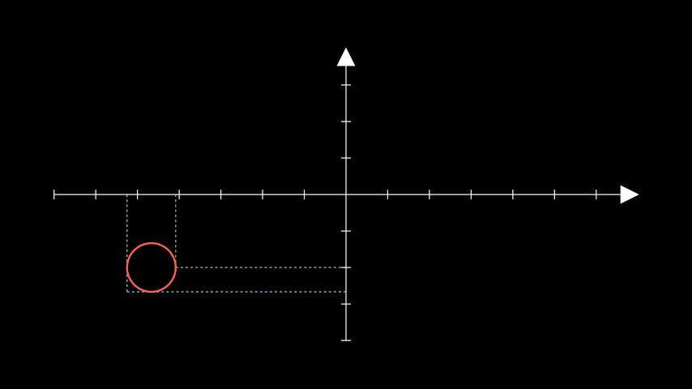

# Axes

`Axes`继承了`CoordinateSystem`所以在查API时要结合二者来看.


## 简单绘制
```python
from manim import *

class CoorExample(Scene):
    def construct(self):
        # defines the axes and linear function
        axes = Axes(
            x_range=[-1, 10], 
            y_range=[-1, 10], 
            x_length=6, 
            y_length=6
            )
        line = axes.plot(lambda x: x, color=BLUE)
        # creates the T_label
        self.add(axes, line )
```


## 坐标轴相关


### 添加坐标刻度
`add_coordinates()`可以给坐标轴添加刻度label
```python
from manim import *

class CoorExample(Scene):
    def construct(self):
        # defines the axes and linear function
        axes = Axes(
            x_range=[-1, 10], 
            y_range=[-1, 10], 
            x_length=6, 
            y_length=6
            ).add_coordinates()
        line = axes.plot(lambda x: x, color=BLUE)
        # creates the T_label
        self.add(axes, line )
```


### 给坐标轴添加标签
`get_axis_labels()`获得x,y轴
`get_x_axis_label()`仅获得x轴
`get_y_axis_label()`仅获得y轴

```python
from manim import *

class TLabelExample(Scene):
    def construct(self):
        # defines the axes and linear linetion
        axes = Axes(
            x_range=[-1, 10], 
            y_range=[-1, 10], 
            x_length=6, 
            y_length=6
            )
        labels = axes.get_axis_labels(
            Tex("x-axis").scale(0.7), Text("y-axis").scale(0.45)
        )
        self.add(axes, labels)
```


### 改变坐标标度


```python
from manim import *

class LogScalingExample(Scene):
    def construct(self):
        ax = Axes(
            x_range=[0, 10, 1],
            y_range=[-2, 6, 1],
            tips=False,
            axis_config={"include_numbers": True},
            y_axis_config={"scaling": LogBase(custom_labels=True)},
        )  # 创建坐标系

        # x_min must be > 0 because log is undefined at 0.
        graph = ax.plot(lambda x: x ** 2, x_range=[0.001, 10], use_smoothing=False)
        self.add(ax, graph)
```


`axis_config`和`y_axis_config`配置项可以参考[NumberLine](https://docs.manim.community/en/stable/reference/manim.mobject.graphing.number_line.NumberLine.html#manim.mobject.graphing.number_line.NumberLine)


## 曲线相关


### 绘制点的垂直线
`get_T_label()`可以方便绘制点的垂直线
```python
from manim import *

class TLabelExample(Scene):
    def construct(self):
        # defines the axes and linear linetion
        axes = Axes(
            x_range=[-1, 10], 
            y_range=[-1, 10], 
            x_length=6, 
            y_length=6
            )
        line = axes.plot(lambda x: x, color=BLUE)
        # creates the T_label
        t_label = axes.get_T_label(x_val=4, graph=line, label=Tex("x-value"))
        self.add(axes, line, t_label)
```


### 绘制曲线面积
`get_area`可以获得曲线和坐标轴之间的面积
```python
from manim import *

class TLabelExample(Scene):
    def construct(self):
        # defines the axes and linear linetion
        axes = Axes(
            x_range=[-1, 10], 
            y_range=[-1, 10], 
            x_length=6, 
            y_length=6
            )
        line = axes.plot(lambda x: x, color=BLUE)
        # creates the T_label
        area = axes.get_area(
            line,
            x_range=(2, 4),
            color=(GREEN_B, GREEN_D),
            opacity=1,
        )
        self.add(axes, line, area)
```


### 给曲线添加标签
`get_graph_label()`可以获得曲线的标签
```python
from manim import *

class TLabelExample(Scene):
    def construct(self):
        # defines the axes and linear linetion
        axes = Axes(
            x_range=[-1, 10], 
            y_range=[-1, 10], 
            x_length=6, 
            y_length=6
            )

        line = axes.plot(lambda x: x, color=BLUE)
        label = axes.get_graph_label(
            graph=line,
            label= MathTex(r"3"),
            x_val=3,
            dot=True,
            direction=UR,
        )
        self.add(axes,line, label)
```


### 获得水平或垂直线
`get_horizontal_line()`水平线
`get_vertical_line()`垂直线

```python
from manim import *

class GetHorizontalLineExample(Scene):
    def construct(self):
        ax = Axes().add_coordinates()
        point = ax.c2p(-4, 1.5)

        dot = Dot(point)
        line = ax.get_horizontal_line(point, line_func=Line)

        self.add(ax, line, dot)
```


### 同时获得水平线和垂直线

```python
from manim import *

class GetLinesToPointExample(Scene):
    def construct(self):
        ax = Axes()
        circ = Circle(radius=0.5).move_to([-4, -1.5, 0])

        lines_1 = ax.get_lines_to_point(circ.get_right(), color=GREEN_B)
        lines_2 = ax.get_lines_to_point(circ.get_corner(DL), color=BLUE_B)
        self.add(ax, lines_1, lines_2, circ)
```



## 坐标计算
`input_to_graph_coords(x, graph)` 简写为`i2gc(x, graph)` 输入x获得y的coor坐标
```python
from manim import Axes
ax = Axes()
parabola = ax.plot(lambda x: x**2)
ax.input_to_graph_coords(x=3, graph=parabola)
```
`input_to_graph_point(x, graph)` 简写为`i2gp` 输入x获得y的scene坐标

`point_to_coords()` 简写为 `p2c(point)`, 将scene坐标转换为coor坐标
`coords_to_point(*coords)` 简写为 `c2p()`, 将coor坐标转换为point坐标

```python
from manim import *

class CoordsToPointExample(Scene):
    def construct(self):
        ax = Axes().add_coordinates()
        # a dot with respect to the axes
        dot_axes = Dot(ax.coords_to_point(2, 2), color=GREEN)  # 将坐标系的(2,2)点转换为scene中点
        lines = ax.get_lines_to_point(ax.c2p(2,2))
        plane = NumberPlane()  # the default plane corresponds to the coordinates of the scene.
        dot_scene = Dot((2,2,0), color=RED)

        self.add(plane, dot_scene, ax, dot_axes, lines)
```


## plot
[plot](https://docs.manim.community/en/stable/reference/manim.mobject.graphing.coordinate_systems.CoordinateSystem.html#manim.mobject.graphing.coordinate_systems.CoordinateSystem.plot)


参考:
https://docs.manim.community/en/stable/reference/manim.mobject.graphing.coordinate_systems.Axes.html
参考:
https://docs.manim.community/en/stable/reference/manim.mobject.graphing.coordinate_systems.CoordinateSystem.html