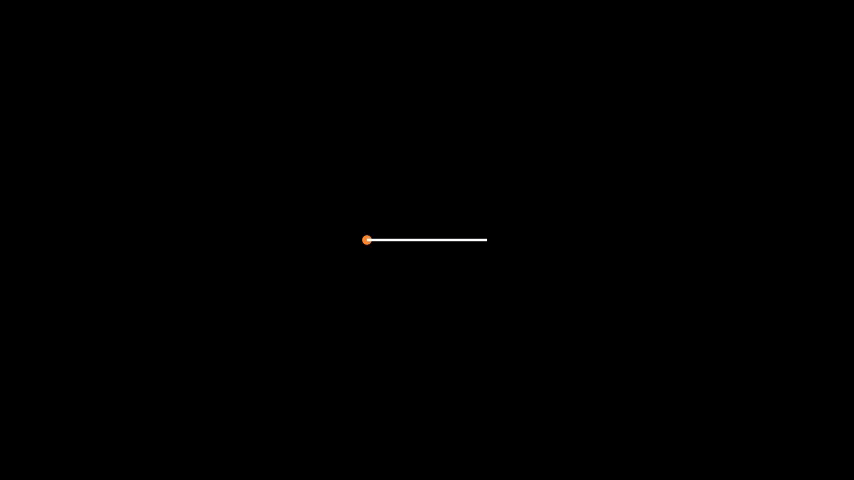

# MoveAlongPath

manim_animations_MoveAlongPath

```python
from manim import *

class MoveAlongPathExample(Scene):
    def construct(self):
        d1 = Dot().set_color(ORANGE)
        l1 = Line(LEFT, RIGHT)
        l2 = VMobject()
        self.add(d1, l1, l2)
        l2.add_updater(lambda x: x.become(Line(LEFT, d1.get_center()).set_color(ORANGE)))
        self.play(MoveAlongPath(d1, l1), rate_func=linear)
```





`l2.add_updater()`是每一帧都更新该对象
`lambda x: x.become(Line(LEFT, d1.get_center())`每一帧都变成一个直线, 直线的一段是`LEFT`, 另外一端是`Dot`对象的中心, 在不断的变换, 就有了线在不断变长的效果.


参考:
https://docs.manim.community/en/stable/reference/manim.animation.movement.MoveAlongPath.html