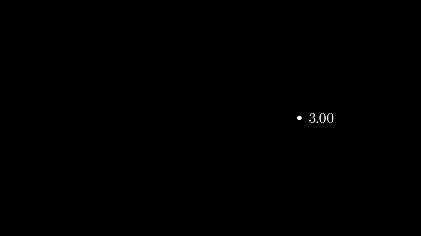
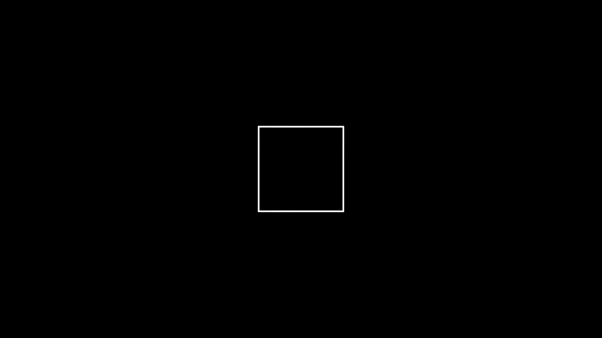

# addUpdater

`add_updater`每一帧来更新对象, 结合`become`方法可以做出多种动画效果, 比如[manim_animations_MoveAlongPath](/manim_animations_MoveAlongPath/)

```python
from manim import *

class NextToUpdater(Scene):
    def construct(self):
        dot = Dot(RIGHT*3)  # 点(3,0)位置
        label = DecimalNumber()  # 小数对象
        label.add_updater(lambda x: x.set_value(dot.get_center()[0]).next_to(dot))  # 每一帧获得点的位置, 赋予小数对象

        self.add(dot, label)
        self.play(Rotating(dot, about_point=ORIGIN, angle=TAU, run_time=TAU, rate_func=linear))
```





 


```python
from manim import *

class DtUpdater(Scene):
    def construct(self):
        line = Square()
        #Let the line rotate 90° per second
        line.add_updater(lambda mobject, dt: mobject.rotate(dt*90*DEGREES))
        self.add(line)
        self.wait(2)
```
`lambda mobject, dt: mobject.rotate(dt*90*DEGREES)`
`lambda`的参数有两个`mobject`和`dt`, `dt`是指`Delta time`, 即时间的微分. `dt*90*DEGREES`即表示将 要旋转的总度数`90*DEGREES`除以动画的总时间. 即单位时间旋转多少度.





参考:
https://docs.manim.community/en/stable/reference/manim.mobject.mobject.Mobject.html?highlight=add_updater#manim.mobject.mobject.Mobject.add_updater