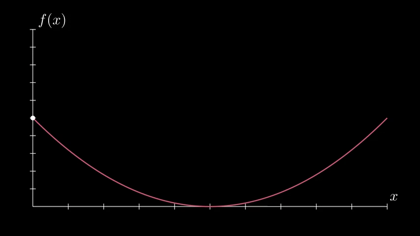

# dotWithCurve


```python
from manim import *
import numpy as np

class ArgMinExample(Scene):
    def construct(self):

        # 绘制曲线, ax只负责曲线的绘制, 点之类的用scene中的mobject对象
        ax = Axes(
            x_range=[0, 10], y_range=[0, 100, 10], axis_config={"include_tip": False}
        )
    '\
        labels = ax.get_axis_labels(x_label="x", y_label="f(x)")
        def func(x):
            return 2 * (x - 5) ** 2
        graph = ax.plot(func, color=MAROON)


        # 配置Dot的初始点以及移动轨迹, 移动轨迹匹配的是ValueTracker
        t = ValueTracker(0)
        initial_point = [ax.coords_to_point(t.get_value(), func(t.get_value()))]
        dot = Dot(point=initial_point)
        dot.add_updater(lambda x: x.move_to(ax.c2p(t.get_value(), func(t.get_value()))))

        # 开始动画, 主要是根据ValueTracker的移动而移动
        self.add(ax, labels, graph, dot)
        x_space = np.linspace(*ax.x_range[:2],200)  # 将X轴切分成200个点
        minimum_index = func(x_space).argmin()  # 获得最小点的下标
        self.play(t.animate.set_value(x_space[minimum_index]))  # 将ValueTracker移动到最小点的x坐标
        self.wait()
```




```python
from manim import *
import numpy as np

class ArgMinExample(Scene):
    def construct(self):

        # 绘制曲线, ax只负责曲线的绘制, 点之类的用scene中的mobject对象
        ax = Axes(
            x_range=[0, 10], y_range=[0, 100, 10], axis_config={"include_tip": False}
        ).add_coordinates()
        labels = ax.get_axis_labels(x_label="x", y_label="f(x)")
        def func(x):
            return 2 * (x - 5) ** 2
        graph = ax.plot(func, color=MAROON)


        # 配置Dot的初始点以及移动轨迹, 移动轨迹匹配的是ValueTracker
        t = ValueTracker(0)
        initial_point = ax.coords_to_point(t.get_value(), func(t.get_value()))
        dot = Dot(point=initial_point)
        dot.add_updater(lambda x: x.move_to(ax.c2p(t.get_value(), func(t.get_value()))))

        # 配置水平线
        line = ax.get_horizontal_line(initial_point, line_func=Line)
        line.add_updater(lambda x: x.become(ax.get_horizontal_line(ax.c2p(t.get_value(), func(t.get_value())), line_func=Line)))

        # 开始动画, 主要是根据ValueTracker的移动而移动
        self.add(ax, labels, graph, dot, line)
        x_space = np.linspace(*ax.x_range[:2],200)  # 将X轴切分成200个点
        minimum_index = func(x_space).argmin()  # 获得最小点的下标
        self.play(t.animate.set_value(x_space[minimum_index]))  # 将ValueTracker移动到最小点的x坐标
        self.wait()
```