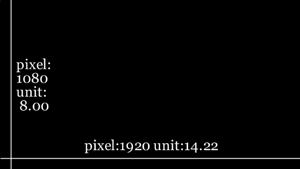
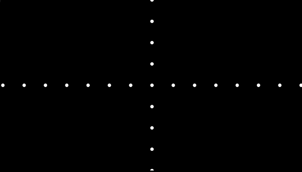

# coordinate


## manim坐标系
在manim中需要理解三种坐标系:
1. 像素坐标系: pixel_width和pixel_height, 就是视频的分辨率
2. 画板坐标系: frame_width和frame_height, 是为了方便操作定义的, 最小单元格(unit), 一般设置逗比像素坐标系小, 如果相等, 则一个像素就是一个单元
3. 数学坐标系: 


```python
from manim import *

class ShowScreenResolution(Scene):
    def construct(self):
        pixel_height = config["pixel_height"]  #  1080 is default
        pixel_width = config["pixel_width"]  # 1920 is default
        unit_width = config["frame_width"]  # 14.22 坐标系的宽度
        unit_height = config["frame_height"]  # 8.0 坐标系的高度 

        with_line = Line(unit_width * LEFT / 2, unit_width * RIGHT / 2)  #第一个参数:frame_width * LEFT / 2 = 14.22 * [-1,0,0] 表示X轴的最左端, 第二个参数是最右端
        with_line.to_edge(DOWN)  # to_edge表示移动到指定边缘, 这里是移动到最下方
        self.add(with_line)
        text_width = Text(f'pixel:{pixel_width} unit:{unit_width:.2f}').next_to(with_line, UP)
        self.add(text_width)
        height_line = Line(unit_height * UP / 2, unit_height * DOWN / 2)
        height_line.to_edge(LEFT)
        self.add(height_line)
        text_height = Text(f'pixel:\n{pixel_height}\nunit:\n{unit_height: .2f}').next_to(height_line, RIGHT)
        self.add(text_height)
```




在X轴和Y轴上每一个单元上画点
```python
from manim import *

class ShowScreenResolution(Scene):
    def construct(self):
        self.add(Dot(ORIGIN))
        for i in range(int(config.frame_y_radius)):
            self.add(Dot(ORIGIN + UP*(i+1)))
            self.add(Dot(ORIGIN + DOWN*(i+1)))
        for i in range(int(config.frame_x_radius)):
            self.add(Dot(ORIGIN + LEFT*(i+1)))
            self.add(Dot(ORIGIN + RIGHT*(i+1)))
```




参考:
https://docs.manim.community/en/stable/guides/configuration.html#the-manimconfig-class