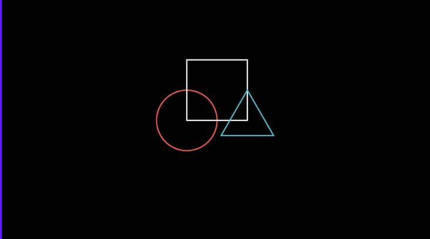
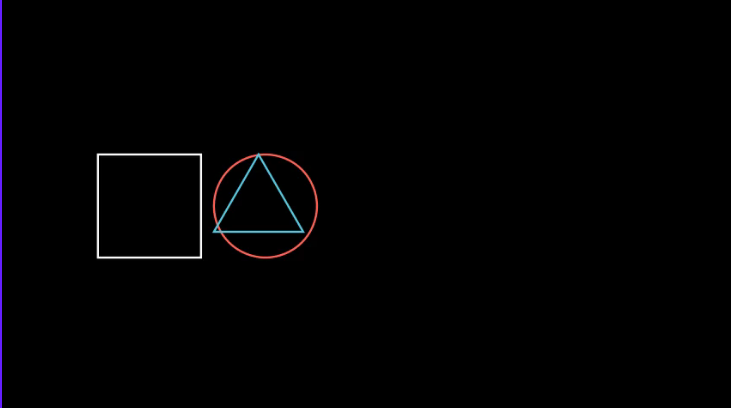
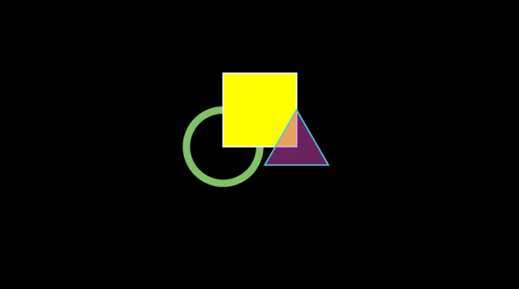
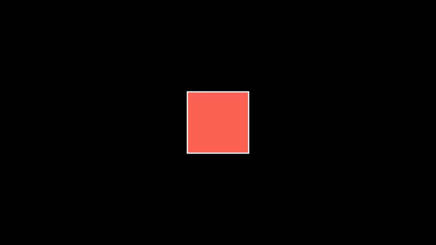

# singlabelClassification


## 基本使用

在`manim`中主要的概念有三个:
1. scene场景, 所有的数学对象都在场景中展示
2. mobject数学对象, 比如circle圆圈, line线等
3. animation动画, 下面的代码演示了了`Create`动画

```python
from manim import *
class CreateCircle(Scene):  # 创建的对象要继承`Scene`
    def construct(self):  # 在`construct(self)`方法中创建动画.
        circle = Circle()  # 创建一个圆
        circle.set_fill(PINK, opacity=0.5)  # 设置圆的属性
        self.add(circle)  # 将circle添加到scene中
        # self.play(Create(circle))  # 渲染创建圆的动画
```

方法|描述
--|--
`play()`|创建一段动画, 需配合动画方法, 这里是`create`
`add()`|将mobject添加到scene中


在命令行中输入以下代码, 就可以生成相应的动画了.
```shell
manim -pql scene.py CreateCircle
```

`-ql` specifies low render quality, `-qm`, `-qh`, and `-qk` for medium, high, and 4k quality
The `-p` flag plays the animation once it is rendered

详细参考[manim_command](/manim_command/)


## mobject

### 基本概念
`mathematical object`表示可以在`scene`中展示的对象, 比如`Circle`,`Arrow`,`Rectangle`.

1. 需要调用`scene.add()`方法, 才能在`scene`中展示, 当不需要的时候可以调用`remove()`方法.
2. 默认`mobject`会放在坐标系的中央

下面的代码展示了向`scene`中添加一个`circle`
```python
from manim import *

class CreatingMobjects(Scene):
    def construct(self):
        circle = Circle()
        self.add(circle)
        self.wait(1)
        self.remove(circle)
        self.wait(1)
```

### mobject常用方法

1. 位置相关的方法

    方法|描述
    --|--
    `shift()`|相对之前的位置移动
    `move_to()`|相对于ORIGIN(0,0)点, 绝对位置移动
    `next_to()`|放在其他mobject的旁边, 第一个参数对象, 第二个参数是方位(UP,DOWN,LEFT,RIGHT)
    `align_to()`|和其他的mobject对齐
    `set_xyz()`|设置坐标
    `to_edge()`|到屏幕边缘
    `set_z_index()`|设置上下关系

    
    ```python
    # 使用shift进行相对位置变换, 默认所有图像都在scene中心, 使用shift进行相对的位置的移动
    from manim import *

    class Shapes(Scene):
        def construct(self):
            circle = Circle()
            square = Square()
            triangle = Triangle()

            circle.shift(LEFT)
            square.shift(UP)
            triangle.shift(RIGHT)

            self.add(circle, square, triangle)
            self.wait(1)
    ```
    

    ```python
    # 使用`**_to`方法改变两个对象的相对位置
    from manim import *
    class MobjectPlacement(Scene):
        def construct(self):
            circle = Circle()
            square = Square()
            triangle = Triangle()

            # place the circle two units left from the origin
            circle.move_to(LEFT * 2)
            # place the square to the left of the circle
            square.next_to(circle, LEFT)
            # align the left border of the triangle to the left border of the circle
            triangle.align_to(circle, LEFT)

            self.add(circle, square, triangle)
            self.wait(1)
    ```
    

2. 风格相关方法

    方法|描述
    --|--
    `set_stroke()`|设置边 适用于vmobject
    `set_fill()`|静态填充 适用于vmobject
    `set_color()`| 适用于mobject
    `rotate()`|静态旋转
    `scale()`|方法和缩小倍数


    ```python
    from manim import *

    class MobjectStyling(Scene):
        def construct(self):
            circle = Circle().shift(LEFT)
            square = Square().shift(UP)
            triangle = Triangle().shift(RIGHT)

            circle.set_stroke(color=GREEN, width=20)
            square.set_fill(YELLOW, opacity=1.0)
            triangle.set_fill(PINK, opacity=0.5)

            self.add(circle, square, triangle)
            self.wait(1)
    ```
    


3. 其他方法

    方法|描述
    --|--
    `copy()`|复制
    `flip()`|转换和复制
    `get_bottom()`|返回mobject的bottom坐标
    `get_center()`|获得中心点
    `get_color()`|获得颜色
    `get_coord()`|get_x, get_y and get_z的组合
    `get_corner()`| corner coordinates
    `get_end()`|
    `get_left()`|
    `get_midpoint()`|
    `get_right()`|
    `get_start()`|
    `get_top()`|
    `match_*()`|复制另一个mobject的相关属性
    `restore()`|获得之前通过`save_state()`保存的状态
    `save_state()`|
    `save_image()`|保存mobject的图片
    

## animation
要将animation对象放入`self.play()`中使用


### 全局的动画
方法|描述
--|--
`Create()`|创建一个mobject
`Transform()`|将两个mobject进行转换
`ReplacementTransform`(square, circle)|
`FadeOut()`|淡出
`FadeIn()`|淡入

```python
from manim import *

class SomeAnimations(Scene):
    def construct(self):
        square = Square()
        # some animations display mobjects, ...
        self.play(FadeIn(square))
        # some animations remove mobjects from the screen
        self.play(FadeOut(square))
```


### mobject本身的animate
`square.set_fill(WHITE)`直接设置`square`的颜色, `square.animate.set_fill(WHITE)`则会将设置颜色的过程形成动画.

`mobject.animate`可以放入`scene.play()`方法中, 来形成动画

```python
from manim import *

class AnimateExample(Scene):
    def construct(self):
        square = Square().set_fill(RED, opacity=1.0)
        self.add(square)
        # animate the change of color
        self.play(square.animate.set_fill(WHITE))
        # animate the change of position and the rotation at the same time
        self.play(square.animate.shift(UP).rotate(PI / 3))

```



参考:
https://docs.manim.community/en/stable/tutorials/quickstart.html
https://www.zhihu.com/column/c_1385733360715632640