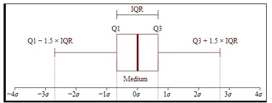

# 第三章指标体系与数据可视化

## python可视化
1. matplotlib
2. seaborn

## 描述性统计分析与绘图
描述性统计也称为探索性数据分析, 占整个模型开发工作量的40%.

变量度量类型与分布类型
1. 分类变量
    1. 名义变量(无序分类变量)
    2. 等级变量(有序分类变量)
2. 连续变量

分类变量的水平(类别)数量过多, 需要`概化`. 其中等级变量可以选择`概化`也可以当成`连续变量`. 从统计学的角度讲, 等级变量是不能当做连续变量处理的, 但是在实际工作中我们会不由自主的这样做. 一般等级变量的水平数量超过20时, 就可以当成连续变量处理.(Python会把所有的数值变量当成连续变量处理)

### 分类变量的统计量
1. 名义变量: 变量值不能比较大小, 如职业
    1. 频次
    2. 百分比
2. 等级变量: 变量值可以比较大小, 如年龄
    1. 频次
    2. 百分比
    3. 累计频次
    4. 累计百分比

### 连续变量的分布与集中趋势
1. 集中趋势
    1. 平均值
    2. 中位数
    3. 众数

    均值在众数左边是左偏, 均值在众数右边是右偏, 众数对应最高点. 例, 收入是典型的右偏分布变量, 高收入的极少, 但收入极高, 平均值会被高收入的拉高, 而中位数更能反映集中趋势.

2. 离散趋势
    1. 极差
    2. 方差(Variance)
    3. 标准差(Standard Deviation)
    4. 变异系数
    5. 平均绝对偏差(Mean Absolute Deviation)

3. 偏度

    偏度小于0, 左偏(均值小于众数), 偏度大于0, 右偏(均值大于众数). 正态分布的偏度为0

4. 峰度

    峰度大于0, 更集中(尖峰), 峰度小于0, 更分散(平峰). 正态分布的峰度为0

### 制作报表与统计制图
报表分为维度(分类型变量)和度量(连续型变量).
仅含有维度的报表(度量为频次)被称为频次表(单个分类变量)和交叉表(两个以上分类变量)
含有维度和度量的报表被称为汇总表, 其中度量以统计量的形式出现.

报表分类:
1. 单因子频数: 仅分析单个分类变量的分布情况
2. 表分析: 分析两个分类变量的联合分布情况
3. 汇总统计量: 按照分类变量分组, 对连续变量进行描述性统计

### 图示
1. 盒须图
四分位距, IQR(Interquartile Range), 上下四分位数之间的距离, 或者说中间50%的数据

1. 条形图: 变量值有顺序
2. 柱状图: 变量本身有顺序
3. 2Y轴图, 只在特殊情况使用: X轴为时间, 左Y轴表示绝对量, 如GDP. 右Y轴为变化率, 如GDP增长率. 用柱形图表示绝对量, 用线性表示增长率指标.
4. 双变量关系图像:
    1. 两个连续变量关系的散点图
    2. 连续变量对二分类变量影响的Logit图. 折线表示两个变量之间的关系, 柱形表示司机驾龄分布的情况.

复杂叙述目的的实现需要综合运用每类统计图, 而不是创造出复杂的图形.
统计图分为描述性统计图和检验性统计图. 描述性统计图常出现在工作报告中, 如饼图, 检验性统计图常出现在技术报告中, 如ROC曲线

## 指标体系

### 建立指标标准
1, 2感觉是一句话就是口径同一, 标准统一

1. 指标标准, 由一个归口部门做最终解释
2. 同一规范, 避免出现同名不同义, 同义不同名
3. 用数服务, **这个概念不好**
4. 决策支持, 从企业战略高度梳理

### 三个层级需求
1. 决策层
2. 管理层, 如,部门负责人
3. 执行层, 如,部门内部员工

### 指标分类
1. 根指标, 最关心的指标, 如, 营业额
2. 组合指标, 根指标按维度细分, 如来自女性的营业额
3. 派生指标, 根指标和组合指标运算得到的, 如, 女性营业额占总营业额的比率.