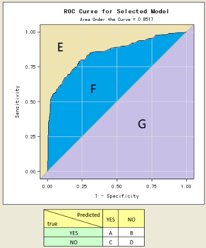

# 数据分析模型_分类分析

考点:
- 领会
    - 卡方检验计算原理与公式
    - 二分类逻辑回归的计算公式
- 熟知
    - 分类变量是否存在相关关系的描述方法和检验方法，涉及列联表分析、卡方检验与 Logit 转换
    - 二分类逻辑回归模型构建与变量筛选
    - 模型评估的方法，涉及混淆矩阵、ROC 曲线、由混淆矩阵衍生出来的评估指标
- 应用
    - 结合业务构建分类模型并且解释回归系数
    - 根据模型结果进行新样本预测
    - 进行客户流失预测、信用评级、精准营销等模型的基本步骤与注意事项

分值:

- 逻辑回归（占比 10%）

## 考点: 逻辑回归基本概念

- 🔴(单选题)以下关于逻辑回归的说法正确的是()。
    A、逻辑回归的自变量必须是分类型变量，因此要对连续型变量进行离散化处理
    B、逻辑回归属于线性模型类算法
    C、逻辑回归无法解决多重共线性问题
    D、逻辑回归是无监督学习算法

    答案:B, 逻辑回归是一种广义的线性模型

- 🟢(单选题)线性回归和逻辑回归的主要区别是()。  
    A、被解释变量类型不同  
    B、解释变量类型不同  
    C、两者都不同  
    D、以上都不是

    答案:A 

- 🟢(多选题)以下() 场景可以使用逻辑回归算法。  
    A、用户等级分类  
    B、疾病预测  
    C、用户违约信息预测  
    D、挖掘出用户群中可以划分成哪些可能的群体

    答案:ABC 

- 🔴(单选题)在进行逻辑回归模型的系数解释时，参考值（即某一变量的变化引起的概率变化）为（）  
    A.0  
    B.1  
    C.-1  
    D.以上均可

    正确答案：B,在进行逻辑回归模型的系数解释时，使用的是优势比的概念，故会以1作为参考进行解释

- 🟢(单选题)在进行逻辑回归模型的系数解释时，使用的方法是（）  
    A、同线性回归模型的系数解释方法一致  
    B、使用发生比的概念进行解释  
    C、使用优势比的概念进行解释  
    D、使用logit变换的概念进行解释

    正确答室：C

- 🟢(单选题)以下关于逻辑回归的说法正确的是（）  
    A、逻辑回归的自变量必须是分类变量，因此要对连续型变量进行离散化处理  
    B、逻辑回归属于经典线性回归类算法  
    C、逻辑回归的因变量必须是分类变量  
    D、逻辑回归是无监督学习算法

    正确答案：C,解析：逻辑回归是有监督学习算法，属于广义线性回归

- 🟢(单选题)以下关于逻辑回归的说法正确的是（）
    A逻辑回归的估计方法是最大似然估计
    B.逻辑回归要求自变量和目标变量是线性关系
    C.逻辑回归比神经网络，更容易过度似合
    D.逻辑回归只能做2值分类，不能做多值分类

    正确答案：A, 答案D是多值的分类, 不是直接回归

- 🔴(单选题)关于回归与分类问题的讨论不正确的是()。  
    A、🔴回归问题远比分类问题复杂  
    B、回归问题和分类问题同属于有监督学习范畴  
    C、回归问题最常用的评价指标体系有混淆矩阵和ROC曲线  
    D、🔴回归问题的模型更加全面、完善地描绘了事物的客观规律

    答案: C
## 考点: logistic函数

- 参考

    [logistic函数](../../5_1统计学/统计学/14逻辑回归/逻辑回归.md#logistic函数)

- 内容

    $$
    logit(P_i) = ln(\frac{P_i}{1-P_i}) = \beta_0 + \beta_1 X_{i1} + \beta_2 X_{i2} + ... + \beta_k X_{ik}, i=(1,2,...,n)
    $$

- 题目:  

    - 🔴(单选题)在逻辑回归中，若选0.5作为阈值区分正负样本，那么其决策平面是()。  
        A、wx+b=0   
        B、wx+b=1  
        C、wx+b=-1  
        D、wx+b=2 

        答案:A. y = $\frac{1}{1+e^{-(wx+b)}}$, 当y=0.5时, $e^{-(wx+b)}=1$, 所以$wx+b=0$

    - (单选题)为了判断用户是否会逾期(0表示不逾期，1表示逾期)，业务分析师构造了一个逻辑回归模型，输出结果公式为$Y=-3+0.06X_1+0.05X_2-0.2X_3$。$X_1$为用户上月的消费次数，$X_2$为年龄，$X_3$为性别(1表示男，2表示女)。目前已知用户上月消费次数为10，年龄20岁，女性，则用户逾期的概率为( )。  
        A、14%  
        B、16%  
        C、18%  
        D、22% 

        答案:A, $Y = -3 + 0.06 * 10 + 0.05*20 - 0.2*2 = -1.8$, $p = \frac{1}{1+e^{1.8}}=0.14$

## 考点: 极大似然法

- 🔴(多选题)以下哪些描述准确地解释了极大似然估计方法和其在参数估计中的应用？  
    A、极大似然估计是一种基于已知结果推测模型参数的最可能值的方法。  
    B、在极大似然估计中，我们通常对似然函数取自然对数，以简化乘法运算为加法。  
    C、极大似然估计只适用于二项分布的参数估计，不能用于连续变量。  
    D、极大以然估计方法可以通过寻找参数值来最大化样本数据集的似然函数。

    正确答案：ABD

## 考点: 模型评估

- 🟢(单选题)为数据提供一个逻辑回归模型，得到训练精度和测试精度。在数据中加入新的特征值，下列正确的选项是( )。
    A、训练精度总是下降
    B、训练精度总是上升或不变
    C、测试精度总是下降
    D、测试精度总是上升或不变

    答案:B 向模型中加入更多特征值会提高训练精度或保持不变，保持低偏差，所以不存在训练精度降低的可能性。测试精度效果不确定，如果特征值是显著的，那么测试精度会上升:如果特征值完全没有意义，那么对于测试精度不会有影响: 如果特征值过多，则容易导致过拟合现象，使测试精度下降。

- 🟢(多选题)在分类模型评估中，哪些描述准确地涉及到ROC曲线和混淆矩阵的概念？  
    A、ROC曲线是根据模型预测的概率值而非预测的类别来绘制的。  
    B、ROC曲线下面积(AUC)的值越大，表示模型的区分能力越强  
    C、混清矩阵中的真正(TP)和真负(TN)反映了模型预测正确的情况。  
    D、ROC曲线横坐标是真正率(TPR)，纵坐标是假正率(FPR).

    正确答案：ABC

- 🟢(单选题)假设以tpr表示真阳性率，fpr表示假阳性率，recall表示召回率，precision表示精确率，则以下绘制ROC曲线的方法正确的是（）  
    A、`plt.plot(tpr,fpr)`  
    B、`plt.plot(fpr,tpr)`  
    C、`plt.plot(recall,precision)`  
    D、`plt.plot(precision,recall)`

    正确答案：B

- 🟢(单选题)在使用sklearn建立逻辑回归模型时，假设以y表示真实标签，yhat表示预测标签，p表示预测概率，则输出模型的分类报告的正确方法是（）  
    A、`classification_report (y,p)`  
    B、`classification_report (y_hat,p)`  
    C、`classification_report (y,y_hat)`  
    D、`classification_report (y_hat,y)`

    正确答宾：C, 在逻辑回归中，使用classification report输出分类报告时要求输入的是真实标签和预测标签，故选C

- 🟢(单选题)在使用sklearr建立逻辑回归模型时，假设以火y表示真实标签，yhat表示预测标签，p表示预测概率，则输出真阳性率tpr和假阳性率印的正确方法是（）  
    A、`metrics.roc_curve (y_hat,y)`  
    B、`metrics.roc_curve (y_hat,p)`  
    C、`metrics.roc_curve (y,p)`  
    D、`metrics.roc_curve (p,y)`

    正确答案：C

- 🟢(单选题)在使用sklearn建立逻辑回归模型时，假设以thr表示遍历过的所有阈值，tpr和fpr分别表示真阳性率和假阳性率，则在最优模型上确定最优阈值的方法是（）  
    A、`thr[(fpr-tpr).argmax（）]`  
    B、`thr[(fpr-tpr).argmin()]`  
    C、`thr[(tpr-fpr).argmin（）]`  
    D、`thr[(tpr-fpr).argmax（）]`

    正确答案：D,在逻辑回归模型中，使用约登指数来确定最优值，具体是选择使得(r-fp)达到最大的时候的阔值作为最优阈值。

- 🟢(单选题)在使用sklearr建立逻辑回归模型时，假设thr表示遍历过的所有阈值，pr和fpr分别表示真阳性率和假阳性率，在求解roc曲线的曲线下面积时，使用的方法是（）  
    A、`metrics.auc (thr,tpr)`  
    B、`metrics.auc (thr.fpr)`  
    C、`metrics.auc (fpr,tpr)`  
    D、`metrics.auc (tpr,fpr)`

    正确答案：C, roc曲线的曲线下面积为AUC值，使用的计算方法是metrics.auc(fpr,tpr)

- 🟢(单选题)以下不适合对线性回归模型进行评估的指标是()。  
    A、残差平方和  
    B、f1-score   
    C、均方误差   
    D、判定系数  

    答案:B 

    $$
    f1score = \frac{2}{\frac{1}{precision} + \frac{1}{recall}}
    $$

- 🟢(单选题)关于模型的评估，下面说法错误的是()。  
    A、ROC曲线是基于混淆矩阵提出的，是灵敏度与1-特异度的曲线  
    B、AUC是ROC曲线下方的面积，其值越接近1，模型效果越好  
    C、f1-score是precision和recall的平均值  
    D、f1-score既强调精准，又强调覆盖

    答案:C 
    解析:f1-score指标是precision与recall的调和平均值。调和平均值相对
    算术平均值来说，对极值更加敏感，这样可以避免我们在选择阈值时受到极值的影响。

## 考点: ROC大题

- (单选题)ROC曲线的x轴，实际上可以由每个值下混淆矩阵的（）计算而来  
A.C/(B+C)  
B.D/(A+D)  
C.B/(B+C)  
D.C/(C+D)

正确答案：D

- (单选题)ROC曲线的y轴，实际上可以由每个阔值下混淆矩阵的（）计算而来  
A.B/(B+C)  
B.C/(B+C)  
C.A/(A+B)  
D.A/(A+D)

正确答案：C

- (单选题)AUC指标是怎么计算而来的
A.E+F
B.E+G
C.F/E+F
D.F+G
正确答案：D,AUC(Area Under Curve)被定义为ROC曲线下的面积。

- (单选题)精确度是怎么计算而来的  
A.A/(A+C)  
B.B/(B+D)  
C.A/(A+B)  
D.C/(C+D)

正确答案：A, 解析：精确率（也叫查准率）(Percision):预测的正样本中有多少预测正确（即是真正的正样本）。根据定义，本题选A。

- (单选题)召回率是怎么计算而来的
A.A/(A+C)
B.B/(B+D)
C.A/(A+B)
D.C/(C+D)
正确答案：C,解析：召回率（也叫查全率）(Reca):真正的正样本中有多少预测正确（即被预测为正样本）。根据定义，本题选C。

## 考点: 大题逻辑回归表

- 内容

    逻辑函数自变量$\beta x$每增加一个单位, 发生比变化为$e^{\beta}$

    $$
    \frac{e^{\beta_0 + \beta_1 (x+1)}}{e^{\beta_0 + \beta_1 x}} = e^{\beta_1}
    $$

- 题目: 

    整体描述: 

    - Dep.Variable: churn
    - Model: Logit
    - Method: MLE
    - Date: Tue,25 Jan 2022
    - Time: 10:59:00
    - converged: True
    - Covariance Type: nonrobust
    - No.Observations: 2424
    - Df Residuals: 2422
    - Df Model: 1
    - Pseudo R-squ.: 0.3657
    - Log-Likelihood: .1052.7
    - LL-Null: .1659.8
    - LLR p-value: 5.281e-266

    变量参数: 

    --|coef|std err|z| P>\|z\||[0.025|0.975]
    --|--|--|--|--|--|--
    Intercept|2.5597|0.120|21.365|0.000|2.325|2.794
    duration|-0.2487|0.011|-22.035|0.000|-0.271|-0.227

    - 🔴(单选题)根据模型结果图，下面说法正确的是？  
        A、duration的系数表明，随着duration的增加，客户流失(churn)的概率增加。  
        B、duration的P值大于0.05，这表明duration对客户流失(churn)的预测不显著。  
        C、模型的伪R平方值表明变量duration对churn的解释力非常强。  
        D、LLRp-value表明，模型中至少有一个解释变量对预测因变量是显著的。

        正确答案：D解析：duration的系数为-0.2487，这意味着随着duration的增加，客户流失的对数几率是减少的，与选项A相反。P值(P>z)远小于0.05，表示在统计上duration与客户流失显著相关，因此选项B也不正确：伪R平方值0.3657只提供了模型拟合度的一个度量，而不是变量强度的直接指标；LLRp-vlue(似然比检验的P值）非常小，远小于任何常用的显著性水平(例如0.05或0.01)，这表明模型中的解释变量（至少有一个）对预测因变量是显著的。

    - 🔴(单选题)关于该模型的自由度，说法正确的是？  
        A、该建模中一共使用了2422个样本  
        B、这里Df Model=1表示一个截距  
        C、该模型只有一个自变量，所l以Df Model = 1  
        D、Df Residuals等于观测值数量减去自变量数量

        正确答案：C,你的答案：解析："Df Mode"是指模型自由度，这里的值是1。这意味着除了截距之外，模型中有一个自变量(这里是duration)。

    - 🔴(单选题)关于逻辑回归中的发生比，下面说法错误的是  
        A、在医学中，通过比较两组的发生比，推断某因素是否是致命的病因  
        B、发生比的公式一般是(0(1-)
        C、这里的发生比的比值小于1，与实际业务和常识是一致的
        D、本次场景中，根据上图一元逻辑回归模型的结果，计算在网时长每增加一个单位后的流失发生比是原流失发生比的0.24倍

        正确答案: D

        $$
        logit(\frac{p}{1-p}) = \frac{e^{-0.2487(X+1)+2.5597}}{e^{-0.2487X+2.5597}} = e^{-0.2487} = 0.7798
        $$

    - 🔴(单选题)假设根据上述模型的预测结果，得到了如下的混淆矩阵，则该模型的精确率(Precision)是多少？

        --|预测正例|预测负例
        --|--|--
        实际正例|50|10
        实际负例|20|120

        A、0.71  
        B、0.83  
        C、0.75  
        D、0.80

        答案: 

## 考点: 逻辑回归表大题

--|coef|std|err|P>\|z\||95.0%Cont Int
--|--|--|--|--|--
Intercept|5.2267|0.833|6.272|0.000|3.593~6.860
bankruptcy ind[T.Y]|-0.5128|0.194|-2.649|0.008|-0.892~0.133
fico score|-0.0147|0.001|-11.256|0.000|-0.016~-0.024
tot derog|0.0378|0.016|2.343|0.019|0.006~0.069
age_oldest_tr|-0.0035|0.001|-5.507|0.000|-0.005~-0.002
rev_util|0.0006|0.001|1.31|0.258|0.000~0.002
ltv|0.0269|0.003|7.807|0.000|0.02~0.034
vch mileage|1.394e-06|1.44e-06|0.966|0.334|-143e-06~422e-06

- 🔴(单选题)请问信用fico score每增加一个单位后，违约发生比是原违约发生比的多少倍()  
    A.0.0147  
    B.8.5747  
    C.0.985  
    D.无法判断

    正确答案：C

- 🟢(多选题)常用的分类模型的评估指标有？  
    A.AUC  
    B.ROC  
    C.KS  
    D.Gini系数

    正确答案：A,B,C,D,回答正确

- 🟢(多选题)变量筛选的方法有？  
    A.逐步法  
    B.向前法  
    C.向后法  
    D.综合法

    正确答案：A,B,C

- 🟢(单选题)一般来说，如果名目尺度的变量被分为10组，则需要设计的虚拟变量数为？  
    A.8  
    B.9  
    C.10  
    D.无法确定

    正确答案：B

- 🟢(多选题)从回归系数表可以看出哪些变量可以删除（）  
    A.fico score  
    B.tot derog  
    C.rev util  
    D.vch _mileage

    正确答案：C,D