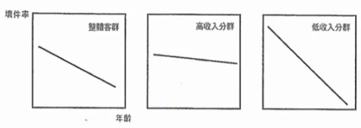
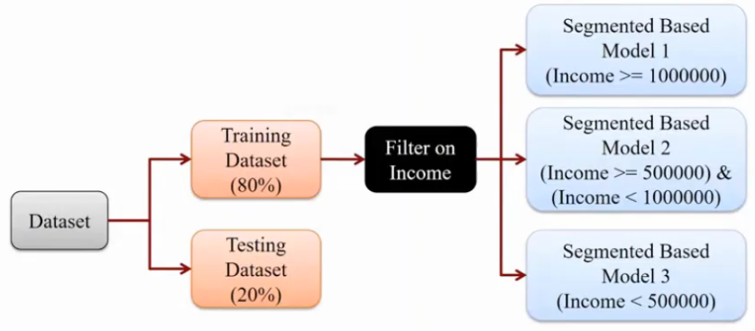
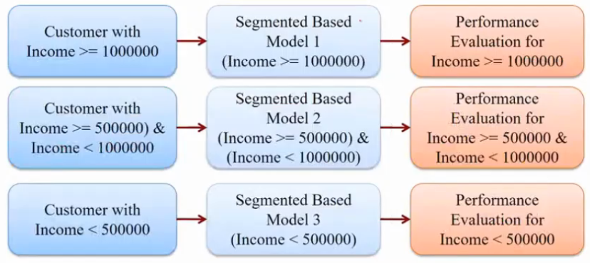
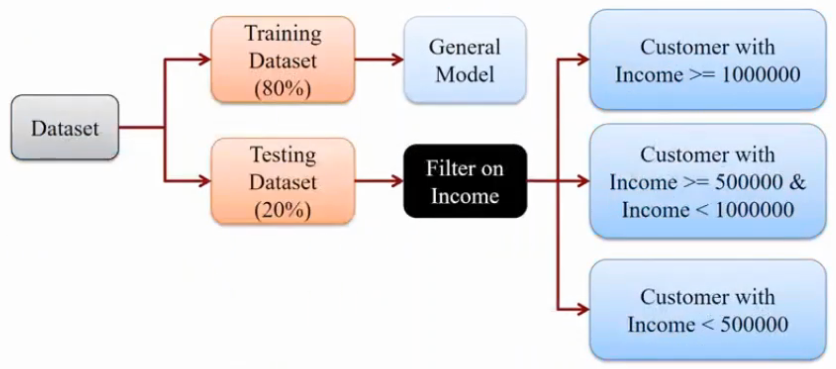
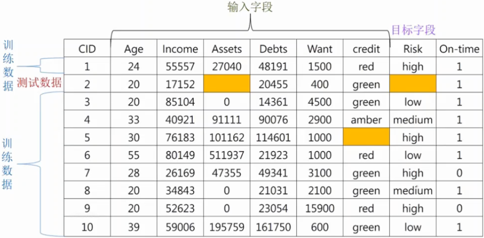
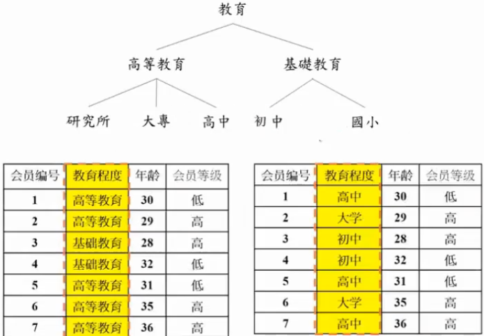
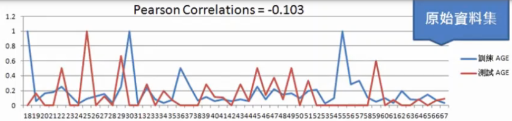
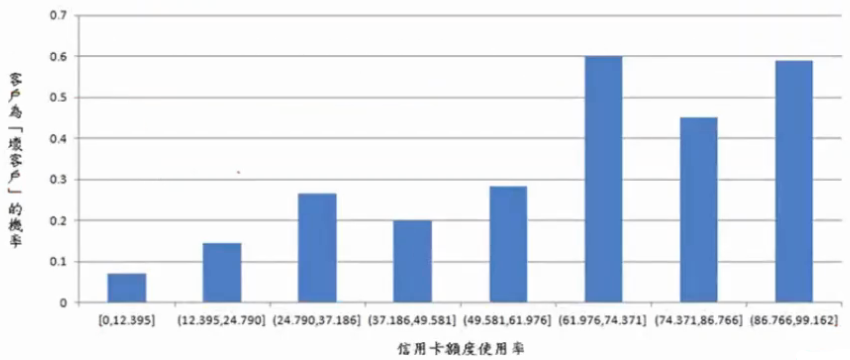
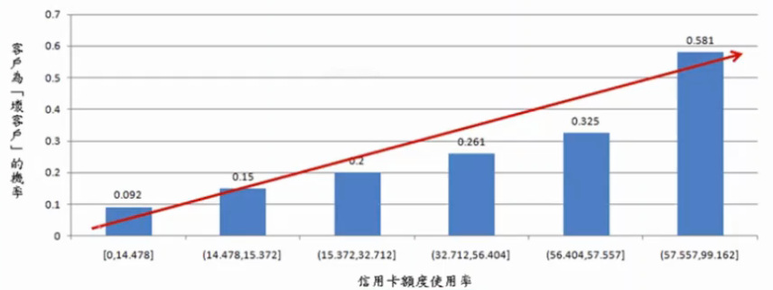
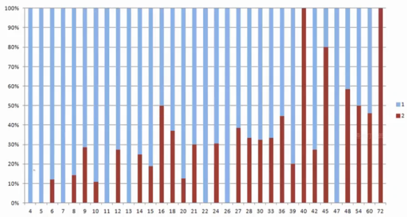

# 高级数据预处理

## 数据处理技术

1. 数据过滤(data filter)

1. 缺失值的高级填补技术
    
    1. KNN 填补、随机森林填补、XGBcost 填补

1. 初级数据转换技术
    
    1. 类别型字段的编码, 顺序型字段的编码 

1. 高级数据转换技术

    1. 类别型字段一般化(Generalization)
    2. 数值型字段趋势离散化(Trend Discretization)

## 数据过滤(data filter)

一些属性虽对整体客群有鉴别力，但不一定对特定客群亦具有鉴别力. 

比如, 对坏件率评分而言，`年龄`对整体有一定程度的鉴别力。但若将样本依收入区分成`高收入分群`与`低收入分群`, 可看出坏件率在高收入分群中，各年龄区间的差异并不显着.

因此，若能建立`区隔化模型`，替每个客群找出适合它的变量与模型可进而大幅提升整体模型的鉴别力.

以信用卡行为评分模型为例

1. 往来期间不足5个月者予以排除，因无足够期间的帐户历史数据做为自变量来源
2. 延滞客群适用催收评分模型，不予纳入
3. 目前没有延滞的客户则是我们主要的目标客群
4. 以业务与统计实证皆指出全清户(Transactor)与循环使用户(Revolver)在风险程度与风险型态上均有显着差异，故选择以客户「是否使用循环」做为主要分群方式

1. 过滤方法1

    

    

    

2. 过滤方法2

    
    

## 数据缺失处理方法

### 直接忽略法

1. 记录删除

    1. 缺失数据只占一小部分时，便可直接删除。数据缺失比例比较大时，会造成大量数据流失。
    2. 若数据的分类标记 (Class Label) 为空值，可直接删除, 因无法被正确分类

2. 字段删除或转换

    1. 缺失数据占整个字段所有数据的比例过大时 (>50%)，便可直接删除。
    2. 当字段有缺失值时，则将整个字段转换成指示变量 (Indicator Variable)，处理数据缺失的特殊方法，缺失数据占整个字段所有数据的比例过大时 (>50%)，便可使用此法. 使用此法的理论基础为空值也是行为的另一种呈现。

### 人工填补法

1. 当某会员数据的生日字段有缺失，可打电话询问该会员，以取得其生日并加以填补
2. 采用适当的值填补. 如别可用身分证字号来补

### 自动填补法

1. 类别型字段
    
    1. 填入一个通用的常数值: 如, 在婚姻状况字段, 1代表结婚, 2代表未婚, 另外还出现了0和3, 就可以将0和3融合成新类别未知, 用0或3表示.

    2. 填入该字段的众数(Mode): 可用分群的方式，分群求众数. 如credit字段和risk字段关联度高, 用green先分群, 然后用其众数low填补

        

    3. 利用模型求出较可能的值来填入: 把填补缺失值的问题当作是分类的问题, KNN、随机森林、XGBoosting是常用的选择, 因为可以接受空值作为输入, 而且同时适用分类和回归模型.

        

        ✨输入字段不包含标签字段

2. 数值型字段
    1. 填入一个通用的常数
    2. 填入该字段的整体平均值(Mean): 可用分群的方式，分群求平均值
    3. 利用模型求出较可能的值来填入, 把填补缺失值的问题当作是数字预测的问题, KNN、随机森林、XGBoosting是常用的选择, 因为可以接受空值作为输入, 而且同时适用分类和回归模型.

        

## 初级数据转换技术

### 类别字段编码

有如下数据:
水果|
--|
苹果|
香蕉|
桔子|

进行`one-hot`(或称`dummying`)编码:

苹果|香蕉|桔子
--|--|--
1|0|0
0|1|0
0|0|1

✨one-hot encoding是机器学习领域的叫法, dummying是统计学领域的叫法

✨小心虚拟变量陷阱(DummyVariableTrap): 变量间会有多重共线性或高度相关的情形发生. 例如，性别字段，若我们产生Male及Female两个虚拟变量的话，那就陷入了虚拟变量陷阱，因为我们可以直接由Female字段中Female=0就知道他是男性

### 顺序型字段编码

有如下数据:
排名|
--|
低|
中|
中偏上|
高|

进行编码

排名|编码后的排名
--|--
低|1
中|2
中偏上|3
高|4

更建议为

排名|编码后的排名
--|--
低|1
中|2
中偏上|2.5
高|3

## 高级数据转换技术

### 数据一般化转换(Data Generalization)

### 数据离散化(Data Discretization)

数值型字段常常是模型不稳定的影响因素之一. 常常我们会发现分类模型在训练数据集的预测准确度很高，但在测试数据集中的准确度却大幅度下滑. 其中一个相当大的原因就是，许多的输入字段(尤其是数值型输入字段)，在目标字段值上的分布，训练数据集与测试数据集的差异很大

下图是某数据集中，输入字段年龄(Age)，在目标字段(是否逾期)上的概率分布. 可以看出，在训练及测试数据集上，年龄(Age)在目标字段(是否逾期)上的概率分布是相当不一致的. 例如，在25岁上，训练数据集中的逾期概率只有10%，但在测试数据中却是100%.

若去计算这两个概率分布的皮尔森相关系数(Pearson Correlations)，则会得到-0.103的结果，代表这两个概率分布其实是呈现负相关的情形

若年龄是建模中的一个重要输入字段，则可想见模型在训练数据集及测试数据集中的准确度，必然大不相同. 因此，数值型字段离散化(Discretization)是有其必要性

数值型字段作离散化的优点:
1. 可使数据精简，降低数据的复杂度
2. 可支持许多无法处理数值型字段的算法, 如联规则(AssociationRules)算法
3. 可提高分类器的稳定性，进而提升分类模型的准确度
4. 可找出输入字段在目标字段上的趋势(Trend)，有助于未来的解读

离散化的方法:

离散化(Discretization)就是切割出数个区间来取代值域上众多的数据数值

人工分离法:

据对数据的认知、专家的建议、普遍存在的现象，将数据数值分离出数个区间. 如年龄可以分离出下列三个区间，`(0,30]、(30,60]、(60,120]`，并分别对应到`青年`、`中年`和`老年`三个数据数值

基本装箱法(Binning Method)
1. 等宽(Equal-Width-Interval)装箱法
2. 等频(Equal-Frequency-Interval)装箱法
    1. Equal-Size-IntervalBinningMethod
    2. HistogramEqualizationBinningMethod

若我们将前图的分布进行等宽(Egual-Width)的离散化处理，并将年龄等切成8个区间(每个区间的宽度为6.125)，则年龄在目标字段上的概率分布，如下图所示

相较于前图，在训练及测试数据集上，年龄在目标字段上的概率分布变得较为一致

这两个概率分布的皮尔森相关系数，也由原来-0.103的负相关变为0.711的正相关，同时使得分类器的稳定性及准确度可望大幅提升

易于理解与解释的离散化结果: 

一个易于理解与解释的离散化结果是，输入字段在目标字段上能够看出明显的趋势性(Trend)

下图是将信用卡额度使用率离散化后的一个结果
1. X轴代表额度使用率，计算方式为客户每月的消费金额（包含前期未缴清的金额)除以信用卡的额度
2. Y轴则为客户变成坏客户的概率

以业界的业务经验来说，信用卡的额度使用率越高，则客户变坏的概率也相对变高. 然而，离散化的结果显示，信用卡的使用率越高，客户变坏的概率却是呈现高高低低的起伏现象，明显与业务经验不合. 从业务建模来说，即使加入此字段会使得分类模型的效果更好，企业也无法使用此字段，因与业务的经验不吻合. 

一个比较好的离散化结果，如下图所示，信用卡的额度使用率与变坏的概率呈现单调递增(Monotonically Increasing)的现象，与业务的经验吻合

一个可行的做法，就是先将数值型字段的值排序后，先用等宽/等频的方式将数值型字段切割成15~25个小区间，然后再根据其在目标字段上的分布情形，适当的加以合并

下图是客户贷款期间-以月为单位(X轴)与是否违约(目标字段)的概率关系(Y轴)

1代表准时还款的客户
2代表逾期不还的客户

从下图可以看出，逾期不还的客户比例，随贷款期间的拉长，有逐渐递增的现象，但有点混乱(高高低低)

们将其切割成15个小区间后，结果如下图所示

接下来我们合并的原则是，当违约的概率由大逐渐变小至最低点时，就是我们的新的切割点

因此，我们会将这15个区间再进一步合并成4个区间, 也就是`[4-21],[22-41],[42-61],[62-72]`

但由于`[62-72]`这个区间只有一笔数据，因此最后两个区间又再度合并为一个区间`[42-72]`, 重新切割为3个区间后，`[4-21],[22-41],[42-72]`

从图中可以看出，结果相当理想. 个区间的违约概率分别为24.32%,34.33%,53.09%，有明显的区隔，且为逐步递增，符合业务上的常识

