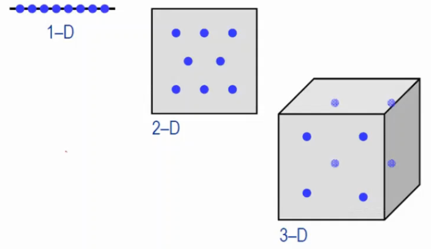
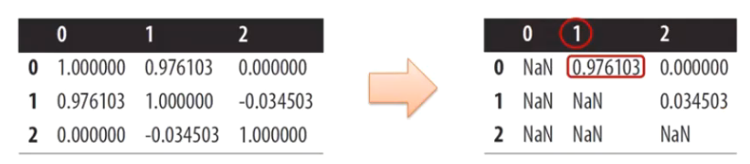

# 特征选择

1. 无效变量包括不相关变量和多余变量

    统计方式的特征选择方法: 方差阈值化、卡方检验、ANOVA 检验及 T 检验、皮尔森相关系数；

2. 高度相关特征的选择
3. 模型方式的特征选择: 决策树、逻辑回归、随机森林、XGBoost 
4. 递归式的特征选择。

## 无效变量

一维密集, 三维疏散. 字段多的时候, 数据要跟着多, 模型才会更稳定.

Redundancy: $x_1, x_2$共线, 可以删除一个
Irrelevancy: 不相关变量, $x_3$改变不影响结果, 删除

## 统计方式的特征选择

方差阈值化(Variance Thresholding(VT)), 方差越小, 包含信息越小. 非监督, 没考虑目标

数字型维度, 

✨在z-score之前做, 因为做了z-score, 均值方差相同
✨阈值自己去顶

二项式维度,
binary categorical features

$$
Var(x)=p(1-p)
$$

利用统计检验可解决输入字段与目标字段不相关(lrrelevancy)的问题, 考虑了目标

在分类中，由于目标字段是类别型字段，所以
当输入字段是类别型字段时，可用卡方检验来验证输入字段与目标字段间的关联性
当输入字段是数值型字段时，可用ANOVA检验(目标n个分类)及T检验(目标2个分类)来验证输入字段与目标字段间的关联性

市场研究员想知道背景音乐是否会影响消费者的心情和其交易行为

Northern Ireland超市研究比较音乐与酒类购买的关系(购买瓶数上是否有差异):
1. 无音乐、French手风琴乐、Italian弦乐
2. Erench、Italian和其他酒类

实际的销售, 看背景音乐和卖出去的酒是否有相关性
| 酒 | 无 | French | Italian | 总数 |
| ---- | ---- | ---- | ---- | ---- |
| French | 30 | 39 | 30 | 99 |
| Italian | 11 | 1 | 19 | 31 |
| 其他 | 43 | 35 | 35 | 113 |
| 总数 | 84 | 75 | 84 | 243 |

期望的销售, 假设背景音乐和卖出去的酒, 没有相关性
| 酒 | 无 | French | Italian | 总数 |
| ---- | ---- | ---- | ---- | ---- |
| French | 34.222 | 30.556 | 34.222 | 99.000 |
| Italian | 10.716 | 9.568 | 10.716 | 31.000 |
| 其他 | 39.062 | 34.877 | 39.062 | 113.001 |
| 总数 | 84.000 | 75.001 | 84.000 | 243.001 |

没有播放音乐卖出法国酒的期望值, $34.222 = \frac{99}{243} * \frac{84}{243} * 243$(卖出法国酒的概率 * 没有播放音乐的概率, 假设二者独立, 可以直接相乘)

$$
X^2 = \frac{(30-34.222)^2}{34.222} + \frac{(39-30.556)^2}{30.556} + \frac{(30-34.222)^2}{34.222} + ... + \frac{(35-39.062)^2}{39.062} = 18.28

$$

利用卡方检验去计算各个类别型的输入字段与目标字段间的相关程度
1. 首先必需先计算其卡方值
2. 然后根据卡方值查表算出p-value, p-value越小代表此字段与目标字段间的相关程度越大，也越重要
3. 在95%的信心水平之下，p-value<0.05则为显著(重要)的关键字段

关键字段分析-类别型字段

| 字段 | 卡方检验 卡方值 | 卡方检验 p-value | 卡方 排名 |
| ---- | ---- | ---- | ---- |
| children | 88.125 | 0.000 | 1 |
| married | 33.574 | 0.000 | 2 |
| save act | 15.389 | 0.000 | 3 |
| region | 8.489 | 0.037 | 4 |
| car | 1.485 | 0.223 | 5 |
| sex | 0.793 | 0.373 | 6 |
| current act | 0.014 | 0.904 | 7 |
| mortgage | 0.007 | 0.935 | 8 |

关键字段分析-数值型字段

由于样本变异数是否与母体相同会影响T-Value之计算，因此要利用T检验去计算各个数值型的输入字段与目标字段间的相关程度，首先，必需利用F检验去检验每个字段的样本变异数是否与母体相同

1. p-value越小代表字段的样本变异数与母体变异数越有差距
2. 由下表可以看出，在95%的信心水平下，income和age的样本变异数与母体变异数皆有差异

|字段|T-value|T 检验 p-value|T 检验排名|
|----|----|----|----|
|income|-3.456|0.001|1|
|age|2.214|0.027|2|

利用ANOVA检验去计算各个数值型的输入字段与目标字段间的相关程度

1. 首先必需先计算其F-value
2. 然后根据F-value查表算出p-value: p-value越小代表此字段与目标字段间的相关程度越大，也越重要
3. 在95%的信心水平之下，p-value<0.05则为显著(重要)的关键字段

|字段|ANOVA 检验 F-value|ANOVA 检验 p-value|ANOVA 排名|
|----|----|----|----|
|income|11.941|0.001|1|
|Age|4.9|0.027|2|

## 高度相关特征的选择

使用相关性矩阵,  把相关性大于0.95的保留一个相关维度即可.

## 模型方式的特征选择

题，可用决策树(DecisionTree)、随机森林丶XGBoost及逻辑回归(Logistic Regression)中的逐步回归(Stepwise)来协助选择并过滤出重要且较不具有共线性的变量.

可解决: 共线性(Collinearity), 不相关的.

## 递归特征选择(Recursively EliminatingFeatures)
RFECV是指使用交叉验证(cross validation), 来递归验证特征(Recursively EliminatingFeatures).

每次删除一个特征, 直到特征表现最好.

可正向, 可逆向, 也可双向.

## 测试

构造二分类模型时，在变量粗筛阶段，以下哪个方法最适合对分类变量进行粗筛
A.相关系数 B.卡方检验 C.方差分析 D.T检验

答案: B

