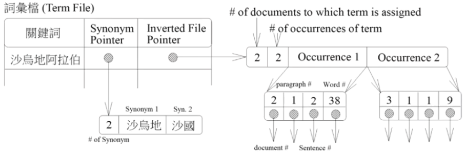
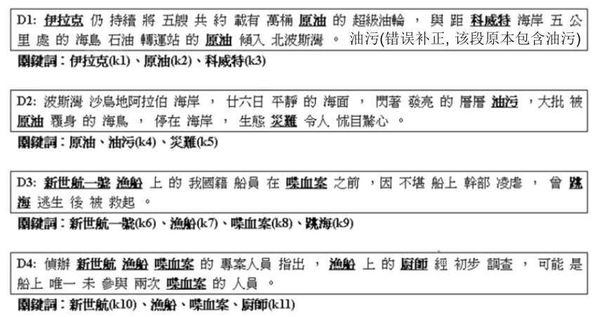
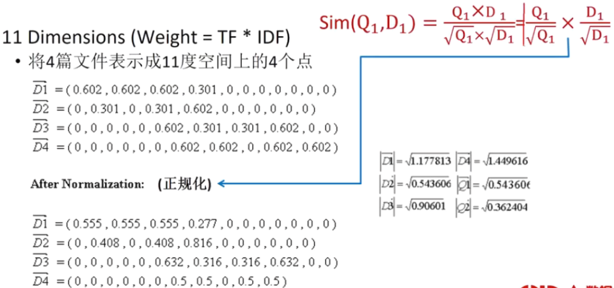

1. 文本挖掘的应用
   1. 运用文本挖掘于公司治理
   2. SocialBot互动模式设计

2. 文本挖掘的基本概念

   1. 基本信息检索技术: 全文扫描、签名文件、逐项反转、控制字汇、关键词索引
   2. 进阶信息检索技术: 向量空间模型

3. 文本挖掘的处理流程

## 信息检索(Information Retrieval)

建立传统图书信息服务的三大要素

1. 书(知识的重要化身)
1. 图书馆(知识的殿堂)
1. 图书馆员(知识的保护者与传播的代理人)

网络的世界就是一个虚拟化的电子图书馆
1. 书有了新的型式(Web Page,Net News,Image,BBS,...)
2. 图书馆有了新的建筑方法(WebServer,ImageDB,...)
3. 图书馆员有了新的竞争者(Search Engine:百度,谷歌,...)

检索的方法
1. 全文扫描苗（Full-TextScanning)
1. 逐项反转(Inversion ofTerms)
1. 签名文件 (Signature File)
1. 向量空间模型(Vector Space Model)
1. 概率式检索模型(Probabilistic Retrieval Model)
1. 神经网络模型(Neural NetworkModel)

## 全文扫描(Full-Text Scanning)

此法又称之为逐字比对法
1. 将待查的字符串直接和文件字符串进行快速字符串比对
2. 文件不多且异动频繁时有用

全文扫描不需要建索引

全文扫描之优点
1. 简化数据库中数据的增删与更新的工作
2. 不需额外的空间来储存索引

全文扫描之缺点
1. 检索反应时间缓慢

## 关键词(Keyword)

关键词(Keyword)

不会查询所有有出现“的”（FunctionWord)的文章

文件语意的抽取层次是以什么为单位: 字、词、词组、概念(SingleTerm or Phrase Term)或N-Gram

关键词的确定

1. 人工(专家)
   1. 品质很高
   2. 属于控制字汇(Controlled Vocabulary)

2. 自动
   1. 成本(人力，时间)低
   2. 属于非控制字汇(Non-Controlled Vocabulary)

## 控制字汇

控制字汇是事先由专家学者所制定的字汇集,大小约在2000个左右

自动建构关键词(非控制字汇)所得到的字汇大小约为控制字汇的100倍以上,但它提供了更弹性化及多元化的检索方式

## 非控制字汇

自动建构关键词(非控制字汇)的方法常采用Inverse DocumentFrequency(IDF)的方式行之

$DF = log_2 (N/n)$

1. N是指有多少篇文章 (N=5)
2. n 是指某个词出现在多少篇文章中 (加势大周(n=1),的(n=5))

IDF代表着信息量,由IDF的大小我们可以得知一个词的重要程度

1. IDF越大代表这个词越重要，也越是我们想要的关键词
2. IDF越小代表这个词的索引价值也越低
3. 加势大周(IDF=log25=2.32),的(IDF=log21=0->完全无检索价值)

✨每篇文章都出现的词, 不重要; 反之, 重要. (概率小的事件, 携带的信息量越大)

“说”>“蝶血案”>“因”=“和”, 此现象不甚合理，why?Howtoresolve?

✨IDF的前提是文章量足够大

在将每个词的IDF算出后,我们仅需订出一个阀值(Threshold)来过滤小于此值的词。其所剩下的即是我们所需的关键词

这些被过滤掉的词我们称之为StopWords

在英文中,因为英文词都有很复杂的词类变化,如查询一词就有一般都以原型储存“search"”，“searched”，“searching”，“searches"等变化，为检索方便，

建立关键词的程序(抽取层次:词)
1. 读取文献
2. 分词(中文)
3. 利用 Suffix String 将 Word 重整至最基本原型(Stem Word)(英文)
4. 计算每个Word 的IDF
5. 利用一个阀值(Threshold)
   1. 选出代表文献的关键词及其IDF
   2. 产生Stop Words

## 逐项反转(Inversion ofTerms)

逐项反转(Inversion ofTerms)法一般称为lnverted File

其主要精神是利用繁复的索引来提高检索的效率: 文件搜寻时仅需比对索引,无需进一步比对文件内容

利用逐项反转法,每一文件皆可利用反转其本身文件的内容,记录这些文字的位置，以表达文件的内涵

若以“字”为反转单位则称之为逐字反转(Inversion of Characters)法

若以“词”为反转单位则称之为逐词反转(Inversion of Words)法

此法所需之索引空间很大(通常较原文空间多出50%~300%),不过查询速度确实很快

关键词和关键词索引之区分

由于建立这种索引的方法并不困难,且检索的效率相当高,故此法已普遍的应用在商业化的产品上

此法相对于其它方法较易与同义词词典结合,较有利于同义词的处理

有了这样的索引结构,我们很容易的利用布尔运算来达到检索的目的,且速度相当快

1. 想查有A和 B 同时出现的文章 (A and B)
1. 想查有A或B同时出现的文章 (A or B)
1. 想查有 A出现但 B 不出现的文章(A and not B)
1. 想查有A和B同时出现在同一段的文章
1. 想查有A和B同时出现在同一句的文章

## 签名文件(Signature File)

签名文件是逐项反转法和全文扫瞄的综合体

✨签名文件比逐项反转慢, 比全文扫描快. 比逐项反转索引小.

签名檔利用重迭编码(Superimposed Coding)的技巧,将文件转换成一固定长度的签名(Signature)以加速字符串比对

基本上文件中每一出现的词会有一定长的数字编码为其词签名(Word Signature),而文件签名(Document Signature)即是所有词签名的重迭编码. 如文件出现“信息”与“检索”两词,若“信息”的词编码为“10100011",而“检索”的词编码为“10101111",则重迭编码后的文件编码为“10101111"(即是将所有对应位OR起来).

✨结果是0, 一定没有关键词. 结果是1, 可能没有关键词.

签名文件的方法基本上是一种两段式的搜寻方法。查询字符串时先将查询字符串以前述方法建立查询签名(Query Signature),再将查询签名与所有文件签名一一比对(只需比对查询签名为1的位位置),只有查询签名为1的位位置所对应的文件签名也为1时才需进一步作检测. 查询签名和文件签名做and后的结果和查询签名一样的话则此文件通过第一阶段的检测

通过第一阶段的检测并不代表一定含有查询字符串(未通过者则一定没有)故需第二阶段之检测

第二阶段之检测实际上就是利用全文扫瞄的方法,将通过(第一阶段)签名测试的文件内容一一读出,并与查询字符串做精确比对. 通过第一阶段检测的文章，一般来说需为极少数，否则需修改编码的机制

签名文件的比对流程:
1. 将查询编码成查询签名(Query Signature)
2. 第一阶段的搜寻(Filter Out Most of theUndesired Documents): 将查询签名与所有文件签名一一比对 (作 and)
3. 第二阶段的搜寻 (收尾): Full Text Scanning
4. 产生查询结果

签名文件的方法所需的索引空间一般较逐项反转法节省,但比全文扫瞄法耗费空间: 全文扫瞄法<签名文件<逐项反转法 (大)

签名文件的方法检索速度虽比逐项反转法慢,但比全文扫瞄法又快了许多: 全文扫瞄法<签名文件<逐项反转法(快)

虽然签名文件的方法有折衷的优越性,但是其扩充性较低(尤其是删及改)。虽然一度引起学界高度的兴趣,但西文实用系统很少采用签名文件的方法: 中文而言，此法恰可适用

## 向量空间模型(Vector Space Model)

由Gerard Salton所提出,并根据此模型发展出Smart System

它将每一个文件(Document)及查询(Query)表示成N 维空间坐标上的点，每一个维度代表一个关键词，在它维度上的值是根据关键词的TF*关键词的IDF 来得到

通过计算点与点之间的距离(相似度计算－SimilarityComputation)来找出和此查询相近似的文件 (距离越短越相近)并加以排序输出(Document Ranking)

 
 
 
 

 

