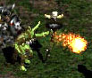
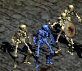
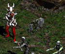
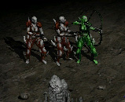
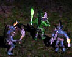
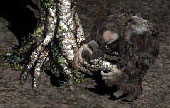
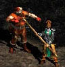
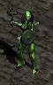
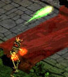
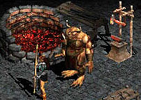

# monsters

## 类别

Monster Type (indicated by colour of the name)
1. White – Standard
1. Blue – Champion
1. Gold – Unique or Boss

## 等级

White: 等于地图等级
Blue: +2
Gold: +3

## unique

1. Bishibosh
    1. Type: Fallen Shaman
    2. Found in: The Cold Plains. Always in one of the fallen camps.
    3. Quest: Not part of any quest.

    

2. Bonebreaker
    1. Type: Skeleton, Undead
    2. Found in: The Crypt. (Dungeon below the the Burial Grounds.)
    3. Quest: Not part of any quest.

    

3. Blood Raven

    1. Type: Corrupt Rogue Archer
    2. Found in: The Burial Grounds
    3. Quest: Blood Raven must be killed to complete the Sisters’ Burial Grounds quest.

    

4. Coldcrow

    1. Type: Dark Ranger
    2. Found in: Act I, The Cave
    3. Quest: Not part of any quest.

    

5. Rakanishu

    1. Type: Carver
    2. Found in: Act I, The Stony Field
    3. Quest: Rakanishu is not a required kill, but he is always found within the Field of Stones, where players must venture on the Rescue Cain quest.

    

6. Treehead Woodfist

    1. Type: Brute
    2. Found in: Dark Wood
    3. Quest: Not a required kill, but he always spawns right beside the Tree of Inifuss, which must be clicked to obtain the Scroll of Inifuss, which is required as part of the Rescue Cain quest.

    

7. Griswold
    1. Type: Special, Undead
    2. Found in: Tristram
    3. Quest: Griswold is found in Tristram, where the player must venture to Rescue Cain, but killing him is not required to complete the quest.
    

8. Countess
    1. Type: Dark Stalker
    2. Found in: Forgotten Tower
    3. Quest: The Countess must be killed to complete the Forgotten Tower quest. She’s also an integral part of the special Pandemonium Event since she drops the Key of Terror.

    

9. Pitspawn Fouldog

    1. Type: Tainted
    2. Found in: Jail Level 2
    3. Quest: Not part of any quest.

    

10. Bone Ash

    1. Type: Burning Dead Mage, Undead
    2. Found in: The Cathedral
    3. Quest: Not part of any quest.

    

11. Smith

    1. Type: Special
    2. Found in: Barracks
    3. Quest: The Smith is found near the weapon stand that holds Charsi’s blacksmithing hammer. You must return the hammer to Charsi to complete the Tools of the Trade quest. It is not necessary to kill The Smith to complete the quest.

    

12. Andariel

    1. Type: Act Boss
    2. Found in: Catacombs Level 4
    3. Quest: Andariel must be killed to complete the Sisters to the Slaughter quest and advance to Act Two.

    

