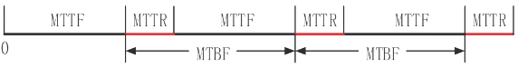
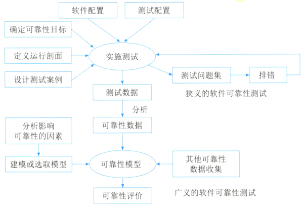

# 软件可靠性基本概念

## 最佳实践

1. 可靠性是指在规定的时间内和规定条件下能有效地实现规定功能的`()`。
2. 可靠度`()`无故障`的概率

### 考察点

1. 可靠性是指在规定的时间内和规定条件下能有效地实现规定功能的`能力`。
2. 可靠度`是系统在规定工作时间内`无故障`的概率

### 考察问

## 软件可靠性定义

软件的可靠性与可用性区别:

1. 软件可靠性（Reliability）是软件产品在规定的条件下和规定的时间区间完成规定功能的能力。
2. 软件可用性(availability)是系统能够正常运行的时间比例。

软件可靠性和硬件可靠性区别:

1. 复杂性：软件复杂性比硬件高，大部分失效来自于软件失效。
2. 物理退化：软件不存在物理退化现象，硬件失效主要是由于物理退化所致。
3. 唯一性：软件是唯一的，每个复制版本都一样，而两个硬件不可能完全一样。
4. 版本更新周期：硬件较慢，软件较快。

## 软件可靠性的定量描述

1. 规定时间：自然时间、运行时间、执行时间（占用CPU）。
2. 失效概率：软件运行初始时刻失效概率为0，随着时间增长单调递增，不断趋向于1。
3. 可靠度：软件系统在规定的条件下、规定的时间内不发生失效的概率。等于1 - 失效概率。
4. 失效强度：单位时间软件系统出现失效的概率。
5. 平均失效前时间（MTTF）：平均失效等待时间，系统从开始运行到发生第一次故障所经历的平均时间。 
6. 平均恢复前时间（MTTR）：平均修复时间，从出现故障到修复成功的时间。
7. 平均故障间隔时间（MTBF）：平均失效间隔时间，失效或维护中所需的平均时间，包括故障时间以及检测和维护设备的时间。（系统两次连续故障之间的平均时间）。MTBF = MTTF + MTTR。
8. 系统可用性 = MTTF/(MTTF + MTTR)*100%。

## 串联系统与并联系统

无论什么系统，都是由多个设备组成，并协同工作，而这多个设备的组合方式可以是串联、并联，也可以是混合模式，假设每个设备的可靠性为$R_1,R_2\cdots R_n$，则：

## 可靠性目标

可靠性目标是指客户对软件性能满意程度的期望。通常用可靠度、故障强度和平均失效时间（MTTF）等指标来描述。

## 可靠性测试的意义

- 可靠性测试的意义

    - 软件失效可能造成灾难性的后果。
    - 软件的失效在整个计算机系统失效中的比例较高。
    - 软件可靠性技术很不成熟，加剧了软件可靠性问题的重要性。
    - 软件可靠性问题是造成软件费用增长的主要原因之一。
    - 系统对于软件的依赖性越来越强，软件对生产活动和社会生活的影响越来越大，从而增加了软件可靠性问题在软件工程领域乃至整个计算机工程领域的重要性。

- 可靠性测试的目的

    - 发现软件系统在需求、设计、编码、测试和实施等方面的各种缺陷。
    - 为软件的使用和维护提供可靠性数据。
    - 确认软件是否达到可靠性的定量要求。

## 广义的可靠性测试与狭义的可靠性测试

- 广义的软件可靠性测试是指为了最终评价软件系统的可靠性而运用建模、统计、试验、分析和评价等一系列手段对软件系统实施的一种测试。

- 狭义的软件可靠性测试是指为了获取可靠性数据，按预先确定的测试用例，在软件的预期使用环境中，对软件实施的一种测试。它是面向缺陷的测试，以用户将要使用的方式来测试软件。

🔒题目

1. 💛系统______是指在规定的时间内和规定条件下能有效地实现规定功能的能力。它不仅取决于规定的使用条件等因素，还与设计技术有关。常用的度量指标主要有故障率（或失效率）、平均失效等待时间、平均失效间隔时间和可靠度等。其中，______是系统在规定工作时间内无故障的概率。

    - A. 可靠性  B. 可用性  C. 可理解性  D. 可测试性
    - A. 失效率  B. 平均失效等待时间  C. 平均失效间隔时间  D. 可靠度

    答案：A D

2. 💚某种部件用在2000台计算机系统中，运行工作1000小时后，其中有4台计算机的这种部件失效，则该部件的千小时可靠度$R$为______。

    - A. 0.990  B. 0.992  C. 0.996  D. 0.998

    答案：D
