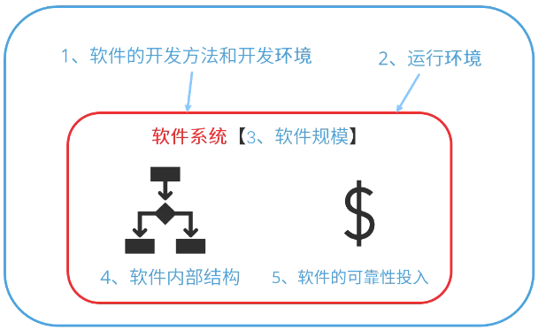

# 软件可靠性模型

## 影响软件可靠性的因素

- 软件可靠性模型是指为预计或估算软件的可靠性所建立的可靠性框图和数学模型。
- 从技术的角度来看，影响软件可靠性的主要因素包括：运行剖面（环境）、软件规模、软件内部结构、软件的开发方法和开发环境、软件的可靠性投入。

## 软件可靠性的建模方法

- 一个软件可靠性模型通常（但不是绝对）由以下几部分组成：
    1. 模型假设。模型是实际情况的简化或规范化，总要包含若干假设，例如测试的选取代表实际运行剖面（环境），不同软件失效独立发生等。
    2. 性能度量。软件可靠性模型的输出量就是性能度量，如失效强度、残留缺陷数等。在软件可靠性模型中性能度量通常以数学表达式给出。
    3. 参数估计方法。某些可靠度度量的实际值无法直接获得，例如残留缺陷数，这时需通过一定的方法估计参数的值，从而间接确定可靠度度量的值。
    4. 数据要求。一个软件可靠性模型要求一定的输入数据，即软件可靠性数据。
- 绝大多数的模型包含3个共同假设：
    1. 代表性假设。是指可以用测试产生的软件可靠性数据预测运行阶段的软件可靠性行为。 
    2. 独立性假设。此假设认为软件失效是独立发生于不同时刻，一个软件失效的发生不影响另一个软件失效的发生。 
    3. 相同性假设。此假设认为所有软件失效的后果（等级）相同，即建模过程只考虑软件失效的具体发生时刻，不区分软件的失效严重等级。

## 软件的可靠性模型分类

1. 种子法模型：利用捕获 - 再捕获抽样技术估计程序中的错误数，在程序中预先有意“播种”一些设定的错误“种子”，然后根据测试出的原始错误数和发现的诱导错误的比例，来估计程序中残留的错误数。
2. 失效率类模型：用来研究程序的失效率。 
3. 曲线拟合类模型：用回归分析的方法研究软件复杂性、程序中的缺陷数、失效率、失效间隔时间。 
4. 可靠性增长模型：这类模型预测软件在检错过程中的可靠性改进，用增长函数来描述软件的改进过程。 
5. 程序结构分析模型：是根据程序、子程序及其相互间的调用关系，形成一个可靠性分析网络。 
6. 输入域分类模型：选取软件输入域中的某些样本“点”运行程序，根据这些样本点在“实际”使用环境中的使用概率的测试运行时的成功/失效率，推断软件的使用可靠性。 
7. 执行路径分析方法模型：分析方法与上面的模型相似，先计算程序各逻辑路径的执行概率和程序中错误路径的执行概率，再综合出该软件的使用可靠性。 
8. 非齐次泊松过程模型：是以软件测试过程中单位时间的失效次数为独立泊松随机变量，来预测在今后软件的某使用时间点的累计失效数。
9. 马尔可夫过程模型
10. 贝叶斯模型：是利用失效率的试验前分布和当前的测试失效信息，来评估软件的可靠性。 

