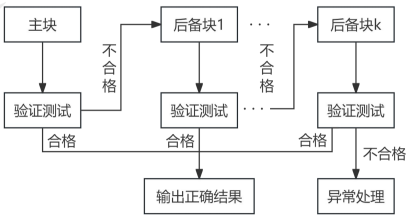
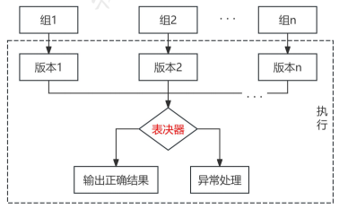
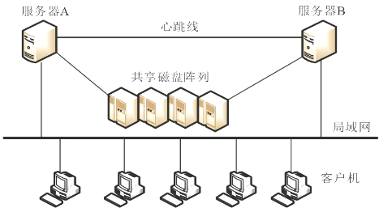

# 软件可靠性设计

## 最佳实践

### 考察问

1. 检错设计技术要着重考虑4个要素: `()`、`()`、`()`和`()`
2. `()`是一台服务器处于`()`状态，一台服务器处于`()`状态，服务器数据包括数据库数据同时往两台写入。
3. `()`不同的应用在两台机器同时运行
4. `()`相同的应用在两台机器同时运行

### 考察点

1. 检错设计技术要着重考虑4个要素: `检测对象`、`检测延时`、`实现方法`和`处理方式`
2. `双机热备`是一台服务器处于`工作`状态，一台服务器处于`准备`状态，服务器数据包括数据库数据同时往两台写入。
3. `双机互备`不同的应用在两台机器同时运行
4. `双机双工`相同的应用在两台机器同时运行

## 可靠性设计
实践证明，保障软件可靠性最有效、最经济、最重要的手段是在软件设计阶段采取措施进行可靠性控制。

可靠性设计就是在常规的软件设计中，应用各种方法和技术，使程序设计在兼顾用户的功能和性能需求的同时，全面满足软件的可靠性要求。

软件可靠性设计的原则：

1. 软件可靠性设计是软件设计的一部分，必须在软件的总体设计框架中使用，并且不能与其他设计原则相冲突。
2. 软件可靠性设计在满足提高软件质量要求的前提下，以提高和保障软件可靠性为最终目标。 
3. 软件可靠性设计应确定软件的可靠性目标，不能无限扩大化，并且排在功能度、用户需求和开发费用之后考虑。 

软件可靠性设计技术主要有容错设计、检错设计、降低复杂度设计和系统配置技术等技术。 

提高系统可靠性的技术可以分为避错（排错）技术和容错技术。

1. 避错是通过技术评审、系统测试和正确性证明等技术，在系统正式运行之前避免、发现和改正错误。
2. 容错是指系统在运行过程中发生一定的硬件故障或软件错误时，仍能保持正常工作而不影响正确结果的一种性能或措施。容错技术主要是采用冗余方法来消除故障的影响。冗余是指在正常系统运行所需的基础上加上一定数量的资源，包括信息、时间、硬件和软件。冗余是容错技术的基础，通过冗余资源的加入，可以使系统的可靠性得到较大的提高。主要的冗余技术有结构冗余（静态、动态、混合）、信息冗余、时间冗余和冗余附加4种。

## 容错设计技术

软件容错技术主要有恢复块设计、N版本程序设计和冗余设计等方法。

### 恢复块设计（动态冗余）

程序的执行过程可以看成是由一系列操作构成的，这些操作又可由更小的操作构成。恢复块设计就是选择一组操作作为容错设计单元，从而把普通的程序块变成恢复块。恢复块方法是一种动态的故障屏蔽技术，采用后向恢复策略。

设计时应保证实现主块和后备块之间的独立性，避免相关错误的产生，使主块和备份块之间的共性错误降到最低程度。必须保证验证测试程序的正确性。

### N版本程序设计

N版本程序的核心是通过设计出多个模块或不同版本，对于相同初始条件和相同输入的操作结果，实行多数表决，防止其中某一软件模块/版本的故障提供错误的服务，以实现软件容错。注意两个方面：

1. 软件需求说明具有完全性和精确性，这是保证软件设计错误不相关的前提；
2. 设计全过程的不相关性。N个版本的程序必须由不同的人独立设计，使用不同的算法、编程语言、编译程序、设计工具、实现方法和测试方法，目的是减少N个版本的程序在表决点上相关错误的概率。

N版本程序设计是一种静态的故障屏蔽技术，采用前向恢复的策略。 

|对比|恢复块方法|N版本程序设计|
| ---- | ---- | ---- |
|硬件运行环境|单机|多机|
|错误检测方法|验证测试程序|表决|
|恢复策略|后向恢复|前向恢复|
|实时性|差|好|

前向恢复：使当前的计算继续下去，把系统恢复成连贯的正确状态，弥补当前状态的不连贯情况。

后向恢复：系统恢复到前一个正确状态，继续执行。 

### 冗余设计

软件的冗余设计技术实现的原理是在一套完整的软件系统之外，设计一种不同路径、不同算法或不同实现方法的模块或系统作为备份，在出现故障时可以使用冗余的部分进行替换，从而维持软件系统的正常运行。 

## 检错技术

在软件系统中，对无须在线容错的地方或不能采用冗余设计技术的部分，如果对可靠性要求较高，故障有可能导致严重的后果，一般采用检错技术。检错技术实现的代价一般低于容错技术和冗余技术，但是不能自动解决故障，需要人工干预。

采用检错设计技术要着重考虑几个要素：检测对象、检测延时、实现方式和处理方式。 

🔒题目

1. 采用检错设计技术要着重考虑4个要素：检测对象、______、实现方法和处理方式。

    - A.检测延时
    - B.测试结果
    - C.性能测试
    - D.功能测试

    答案：A 

## 降低复杂度设计

降低复杂度设计的思想就是在保证实现软件功能的基础上，简化软件结构，缩短程序代码长度，优化软件数据流向，降低软件复杂度，从而提高软件可靠性。

## 系统配置技术

通常在系统配置中可以采用容错技术，通过系统的整体来提供相应的可靠性，主要有双机热备技术和服务器集群技术。

### 双机热备技术

双机热备技术是一种软硬件结合的较高容错应用方案。该方案是由两台服务器和一个外接共享磁盘阵列柜及相应的双机热备份软件组成。

双机热备系统采用“心跳”方法保证主系统与备用系统的联系。所谓“心跳”，是指主从系统之间相互按照一定的时间间隔发送通信信号，表明各自系统当前的运行状态。一旦“心跳”信号表明主机系统发生故障，或者备用系统无法收到主系统的“心跳”信号，则系统的高可用性管理软件认为主系统发生故障，立即将系统资源转移到备用系统上，备用系统替代主系统工作，以保证系统正常运行和网络服务不间断。

有3种工作模式：双机热备模式；双机互备模式；双机双工模式。 

1. 双机热备模式：即通常所说的Active/Standby方式，Active服务器处于工作状态；而Standby服务器处于监控准备状态，服务器数据包括数据库数据同时往两台或多台服务器写入，保证数据的即时同步。当Active服务器出现故障时，通过软件诊测或手工方式将Standby机器激活，保证应用在短时间内完全恢复正常使用。这是目前采用较多的一种模式，但由于另外一台服务器长期处于后备的状态，就存在一定的计算资源浪费。
2. 双机互备模式：是两个相对独立的应用在两台机器同时运行，但彼此均设为备机，当某一台服务器出现故障时，另一台服务器可以在短时间内将故障服务器的应用接管过来，从而保证了应用的持续性，但对服务器的性能要求比较高。 
3. 双机双工模式：是集群的一种形式，两台服务器均处于活动状态，同时运行相同的应用，以保证整体系统的性能，也实现了负载均衡和互为备份，通常使用磁盘柜存储技术。Web服务器或FTP服务器等用此种方式比较多。 

🔒题目

1. 🟡(  )是通常所说的Active/Standby方式，Active服务器处于工作状态，Standby服务器处于监控准备状态，服务器数据包括数据库数据同时往两台或多台服务器写入，保证数据的即时同步。

    - A.双机热备
    - B.双机互备
    - C.双机双工
    - D.服务器集群
    
    - 答案：A 

### 服务器集群技术

集群技术是指一组相互独立的服务器在网络中组合成为单一的系统工作，并以单一系统的模式加以管理。（将多台计算机组织起来进行协同工作）

在集群系统中，每台计算机均承担部分计算任务和容错任务，当其中一台计算机出现故障时，系统使用集群软件将这台计算机从系统中隔离出去，通过各计算机之间的负载转嫁机制完成新的负载分担，同时向系统管理人员发出警报。集群系统通过功能整合和故障过渡，实现了系统的高可用性和可靠性。

- 特点：可伸缩性、高可用性、可管理性、高性价比、高透明性。
- 分类：高性能计算集群、负载均衡集群、高可用性集群。 

负载均衡是集群系统中的一项重要技术，可以提高集群系统的整体处理能力和系统可靠性，最终目的是加快集群系统的响应速度，提高客户端访问的成功概率。集群的最大特征是多个节点的并行和共同工作，如何让所有节点承受的负荷平均，不出现局部过大负载或过轻负载的情况，是负载均衡的重要目的。比较常用的负载均衡实现技术主要有以下几种：

1. 基于特定软件的负载均衡（应用层）：很多网络协议都支持重定向功能，例如，基于HTTP重定向服务，其主要原理是服务器使用HTTP重定向指令，将一个客户端重新定位到另一个位置。服务器返回一个重定向响应，而不是返回请求的对象。客户端确认新地址然后重发请求，从而达到负载均衡的目的。
2. 基于DNS的负载均衡（传输层）：主要原理是在DNS服务器中为同一个主机名配置多个地址，在应答DNS查询时，DNS服务器对每个查询将以DNS文件中主机记录的IP地址按顺序返回不同的解析结果，将客户端的访问引导到不同的节点上去，使得不同的客户端访问不同的节点，从而达到负载均衡的目的。 
3. 基于NAT的负载均衡：将一个外部IP地址映射为多个内部IP地址，对每次连接需求，动态地转换为一个内部节点的地址，将外部连接请求引导给得到地址的那个节点上，从而达到负载均衡的目的。 
4. 反向代理负载均衡：将来自Internet上的连接请求以反向代理的方式动态地转发给内部网络上的多个节点进行处理，从而达到负载均衡的目的。
5. 混合型负载均衡 

