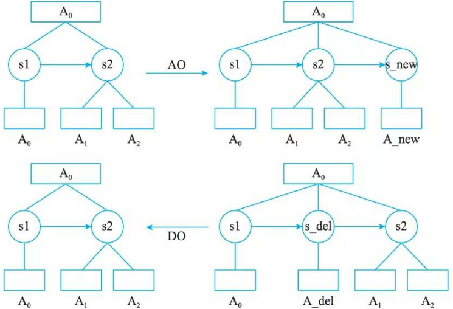
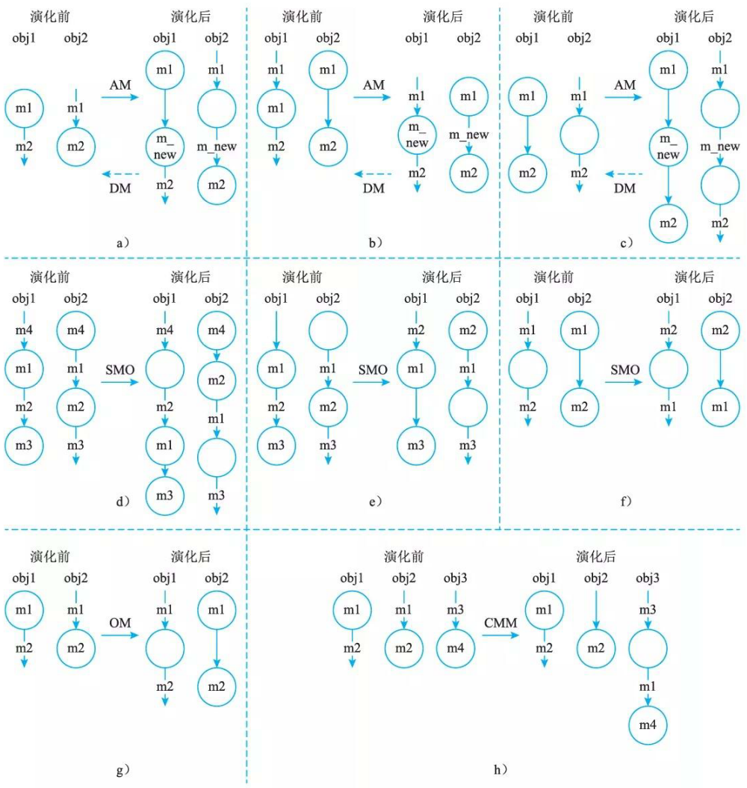

# 面向对象软件架构演化过程

## 对象演化

在顺序图中，组件的实体为对象。组件本身包含了众多的属性，如接口、类型、语义等，这些属性的演化是对象自身的演化，对于描述对象之间的交互过程并无影响。因此，会对架构设计的动态行为产生影响的演化只包括 AddObj ect (AO) 和 Dele teObj ec t (DO) 两种，如图 10-1 所示。

## 消息演化

消息是顺序图中的核心元素，包含了名称、源对象、目标对象、时序等信息。这些信息与其他对象或消息相关联，产生的变化会直接影响到对象之间的交互，从而对架构的正确性或时态属性产生影响。另外，消息自身的属性，如接口、类型等，产生的变化不会影响到对象之间交互的过程，则不考虑其发生的演化类型。因此，我们将消息演化分为 AddMessage(AM) 、 Dele t eMessag e (DM) 、 Swap Messag eOrder (SMO) 、 Overt urnMessag e (OM) 、CbangeMessageModule  (CMM)  5 种，如图 10-2 所示，其中状态里的是行为信息，即对象发出的消息；边上的是转移信息，即对象接收到的消息。由于消息是由一个对象发送给另一个对象，因此每次消息产生演化时均会涉及两个对象的自动机的变化，而 obj l 和 obj 2 分别为产生变化的两个对象。为了表示消息的发送和接收的对应关系，这里用 ml 、 m2 来表示消息的一一对应关系。

AM 增添一条新的消息，产生在对象之间需要增加新的交互行为的时候。 DM 删除当前的一条消息，产生在需要移除某个交互行为的时候，是 AM 的逆向演化。 SMO 交换两条消息的时间顺序，发生在需要改变两个交互行为之间关系的时候。 OM 反转消息的发送对象与接收对象，发生在需要修改某个交互行为本身的时候。 CMM 改变消息的发送或接收对象，发生在需要修改某个交互行为本身的时候。

消息与约束直接相关，消息的演化会直接影响到对象之间的交互行为，但不一定会违背约束。我们可以将这种演化分为 3 类。第 1 类演化与当前约束无关，如 AddMessage 在大多数情况下与当前的约束无关，这些演化不会对架构设计的正确性或时态属性产生影响。第 2 类演化与约束直接关联但不会违背约束，如 ChangeMessageModule 后的消息不会违背”在某处产生”的约束，这些演化同样不会对架构设计的正确性或时态属性产生影响。第 3 类演化与约束直接关联并会违背约束，如 DeleteMessage 删除的某条消息是某条约束的内容之一，这种演化后的架构违背了约束，其是不正确的演化。

## 复合片段演化

复合片段是对象交互关系的控制流描述，表示可能发生在不同场合的交互，与消息同属于连接件范畴。复合片段本身的信息包括类型、成立条件和内部执行序列，其中内部执行序列的演化等价千消息序列演化。通常，会产生分支的复合片段包括 ref、 loop、 break 、 alt、 opt、par,其余的复合片段类型并不会产生分支，因此主要考虑这些会产生分支的复合片段所产生的演化。复合片段的演化分为 AddFragment (AF) 、 DeleteFragment (DF) 、 FragmentTypeChange (FTC) 和 FragmentConditionChange (FCC), 如图 10-3 所示。实际上的复合片段的修改与相应的语义有关，会有非常多可能的控制流，这里仅仅列出了其中一些常见的示例。

FCC 改变复合片段内部执行的条件，发生在改变当前控制流的执行条件时。自动机中与控制流执行条件相对应的转移包括两个，一个是符合条件时的转移，另一个是不符合条件时的转移，因此每次发生 FFC 演化时会同时修改这两个转移的触发事件。

AF 在某几条消息上新增复合片段，发生在需要增添新的控制流时。复合片段所产生的分支是不同类型的，例如 re f会关联到另一个顺序图，par 会产生并行消息，其余的则为分支过程。

DF 删除某个现有的复合片段，发生在需要移除当前某段控制流时。 DF 与 AF 互为逆向演化过程，因此这里不再单独说明。

FTC 改变复合片段的类型，发生在需要改变某段控制流时。类型演化意味着交互流程的改变，一般伴随着条件、内部执行序列的同时演化，可以视为复合片段的删除与添加的组合。

复合片段的演化对应着对象之间交互流程的变化，因此会对架构设计的正确性及其他时态属性产生影响。新的复合片段的增加、条件的改变可能会直接改变消息的执行流程，从而使得违背约束的情况出现。因此需要对复合片段演化的清况进行验证，以保证演化后不会产生预料之外的错误。

## 约束演化

顺序图中的约束信息以文字描述的方式存储于对象或消息中，如通常可以用 LTL 来描述时态属性约束。约束演化对应着架构配置的演化，一般来源千系统属性的改变，而更多情况下约束会伴随着消息的改变而发生改变。由于其不存在可视化的描述，因此约束演化的信息并未存储于定义的层次自动机中，其不存在自动机描述方式。约束演化即直接对约束信息进行添加和删除。

AC  (Add  Constraint)直接添加新的约束信息，会对架构设计产生直接的影响，需要判断当前设计是否满足新添加的约束要求。
DC  (Dele te Constraint)直接移除某条约束信息，发生在去除某些不必要条件的时候，一般而言架构设计均会满足演化后的约束。
