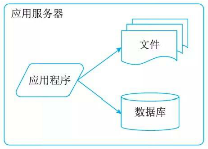
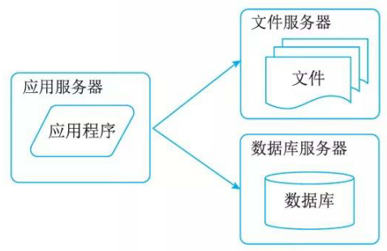
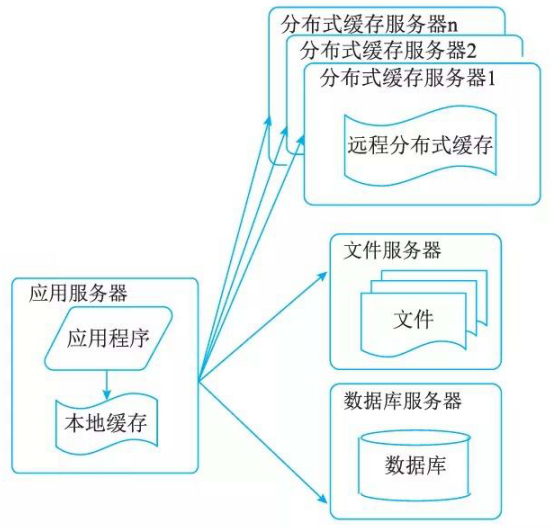
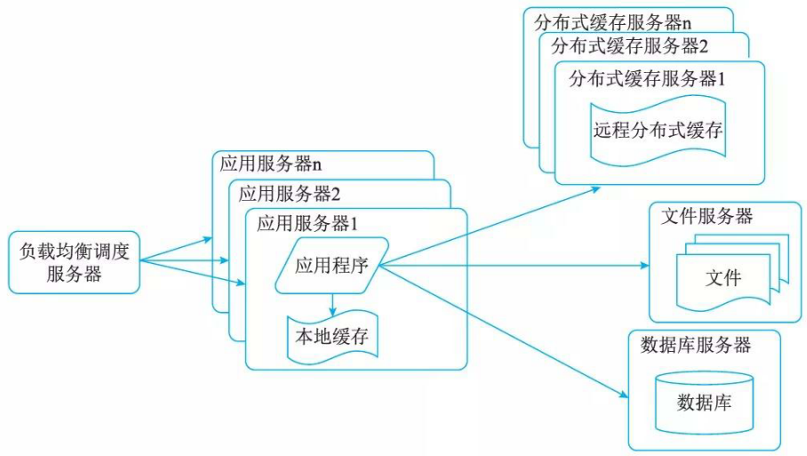
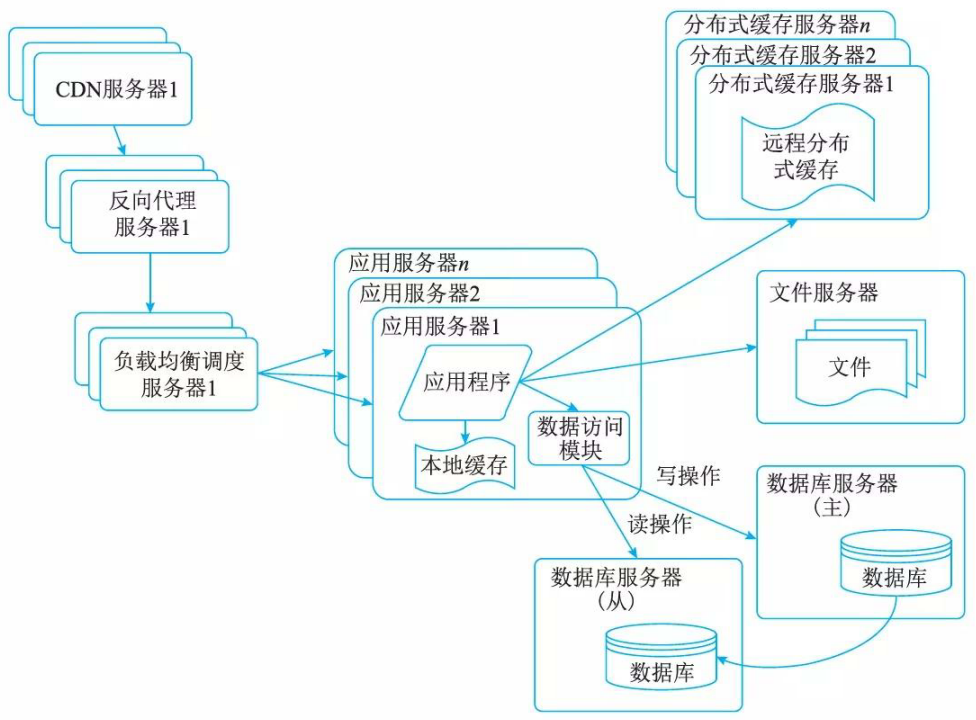
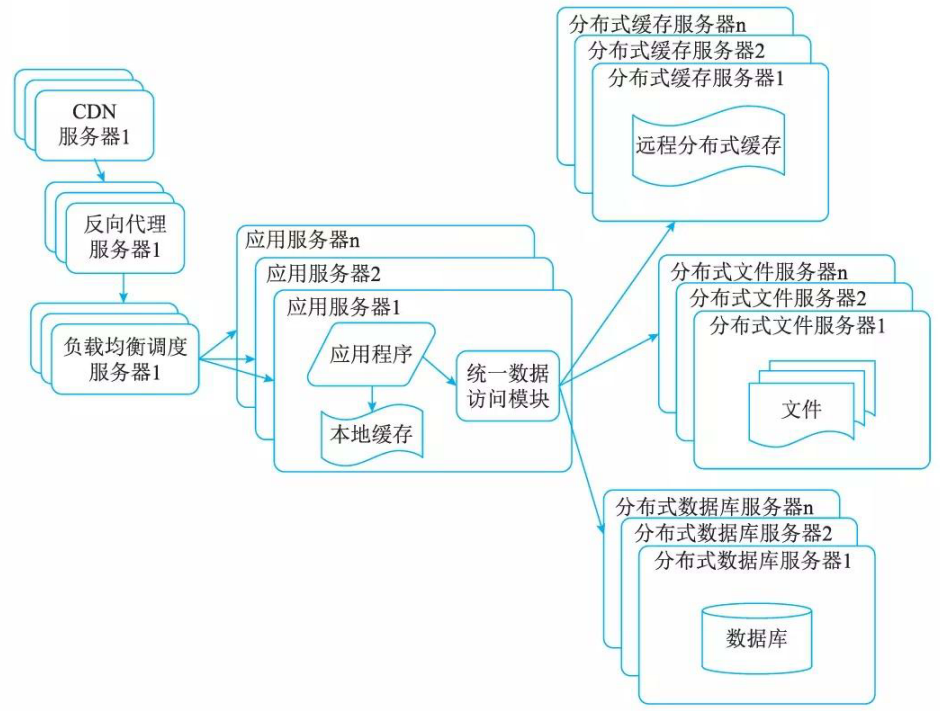
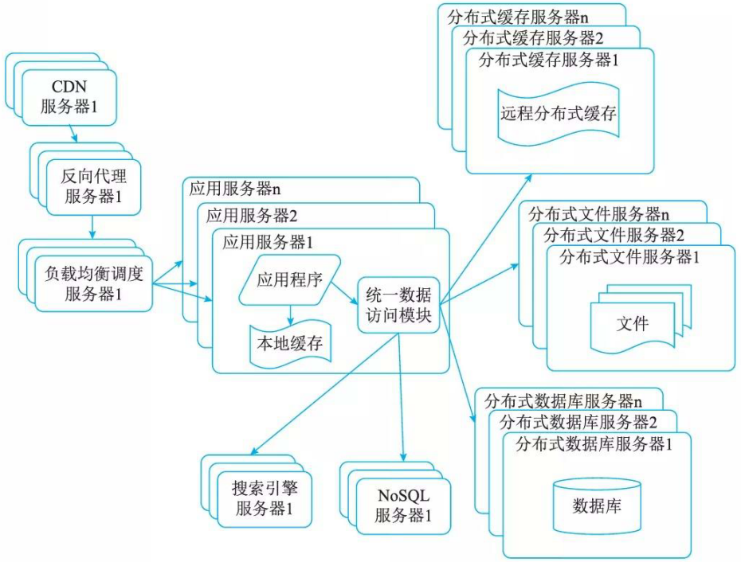
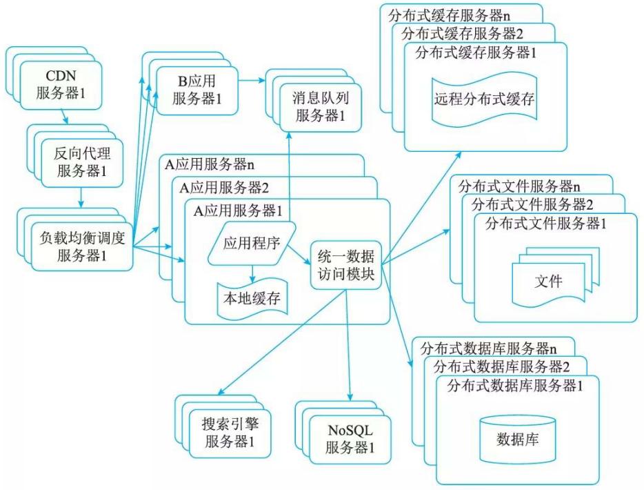
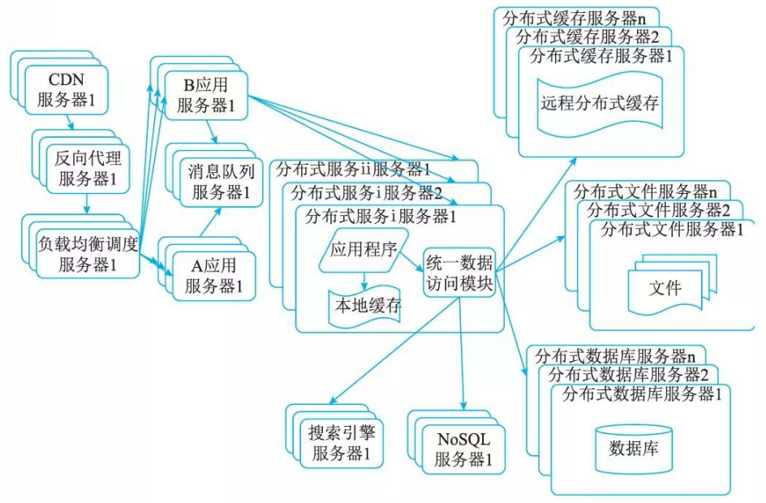

# 大型网站系统架构演化实例

大型网站的技术挑战主要来自于庞大的用户，高并发的访问和海量的数据，任何简单的业务一旦需要处理数以 P 计的数据和面对数以亿计的用户，问题就会变得很棘手。通常大型网站架构主要解决这类问题。

## 第一阶段：单体架构

大型网站都是从小型网站发展而来，网站架构也 I 应用服务器是一样，是从小型网站架构逐步演化而来。小型网站最开始没有太多人访问，只需要一台服务器就绰绰有余，这时的网站架构如图 10-10 所示，应用程序、数据库、文件等所有资源都在一台服务器上。

## 第二阶段：垂直架构

随着网站业务的发展，一台服务器逐渐不能满足需求，越来越多的用户访问导致性能越来越差，越来越多的数据导致存储空间不足，这时就需要将应用和数据分离。应用和数据分离后整个网站使用 3 台服务器：应用服务器、文件服务器和数据库服务器。这 3 台服务器对硬件资源的要求各不相同：

1. 应用服务器需要处理大量的业务逻辑，因此需要更快更强大的处理器速度。
2. 数据库服务器需要快速磁盘检索和数据缓存，因此需要更快的磁盘和更大的内存。
3. 文件服务器需要存储大量用户上传的文件，因此需要更大容量的硬盘。

但是随着用户逐渐增多，网站又一次面临挑战：数据库压力太大导致访问延迟，进而影响整个网站的性能，用户体验受到影响。这时需要对网站架构进一步优化。

## 第三阶段：使用缓存改善网站性能

网站访问的特点和现实世界的财富分配一样遵循二八定律： 80％的业务访问集中在 20％的数据上。既然大部分业务访问集中在一小部分数据上，那么如果把这一小部分数据缓存在内存中，就可以减少数据库的访问压力，提高整个网站的数据访问速度，改善数据库的写入性能了。网站使用的缓存可以分为两种：缓存在应用服务器上的本地缓存和缓存在专门的分布式缓存服务器上的远程缓存。

1. 本地缓存的访问速度更快一些，但是受应用服务器内存限制，其缓存数据量有限，而且会出现和应用程序争用内存的情况。
2. 远程分布式缓存可以使用集群的方式，部署大内存的服务器作为专门的缓存服务器，可以在理论上做到不受内存容量限制的缓存服务。

使用缓存后，数据访问压力得到有效缓解，但是单一应用服务器能够处理的请求连接有限，在网站访问高峰期，应用服务器成为整个网站的瓶颈。

## 第四阶段：使用服务集群改善网站并发处理能力

使用集群是网站解决高并发、海量数据问题的常用手段。当一台服务器的处理能力、存储空间不足时，不要企图去更换更强大的服务器，对大型网站而言，不管多么强大的服务器，都满足不了网站持续增长的业务需求。这种情况下，更恰当的做法是增加一台服务器分担原有服务器的访问及存储压力。对网站架构而言，只要能通过增加一台服务器的方式改善负载压力，就可以以同样的方式待续增加服务器不断改善系统性能，从而实现系统的可伸缩性。应用服务器实现集群是网站可伸缩架构设计中较为简单成熟的一种。

## 第五阶段：数据库读写分离

网站在使用缓存后，使对大部分数据读操作访问都可以不通过数据库就能完成，但是仍有一部分读操作(缓存访问不命中、缓存过期)和全部的写操作都需要访问数据库，在网站的用户达到一定规模后，数据库因为负载压力过高而成为网站的瓶颈。目前大部分的主流数据库都提供主从热备功能，通过配置两台数据库主从关系，可以将一台数据库服务器的数据更新同步到另一台服务器上。网站利用数据库的这一功能，实现数据库读写分离，从而改善数据库负载压力。

应用服务器在写数据的时候，访问主数据库，主数据库通过主从复制机制将数据更新同步到从数据库，这样当应用服务器读数据的时候，就可以通过从数据库获得数据。为了便千应用程序访问读写分离后的数据库，通常在应用服务器端使用专门的数据访问模块，使数据库读写分离对应用透明。

## 第六阶段：使用反向代理和 CDN 加速网站响应

网站需要加速网站访问速度。主要手段有使用 CDN 和反向代理。 CDN 和反向代理的基本原理都是缓存。

1. CDN部署在网络提供商的机房，使用户在请求网站服务时，可以从距离自己最近的网络提供商机房获取数据。
2. 反向代理则部署在网站的中心机房，当用户请求到达中心机房后，首先访问的服务器是反向代理服务器，如果反向代理服务器中缓存着用户请求的资源，就将其直接返回给用户。

使用 CDN 和反向代理的目的都是尽早返回数据给用户，一方面加快用户访问速度，另一方面也减轻后端服务器的负载压力。

## 第七阶段：使用分布式文件系统和分布式数据库系统

数据库经过读写分离后，从一台服务器拆分成两台服务器，但是随着网站业务的发展依然不能满足需求，这时需要使用分布式数据库。文件系统也一样，需要使用分布式文件系统。分布式数据库是网站数据库拆分的最后手段，只有在单表数据规模非常庞大的时候才使用。不到不得已时，网站更常用的数据库拆分手段是业务分库，将不同业务的数据部署在不同的物理服务器上。

## 第八阶段：使用NoSQL和搜索引擎

随着网站业务越来越复杂，对数据存储和检索的需求也越来越复杂，网站需要采用一些非关系数据库技术如 NoSQL 和非数据库查询技术如搜索引擎。 NoSQL 和搜索引擎都是源自互联网的技术手段，对可伸缩的分布式特性具有更好的支待。

## 第九阶段：业务拆分

大型网站为了应对日益复杂的业务场景，通过使用分而治之的手段将整个网站业务分成不同的产品线。如大型购物交易网站都会将首页、商铺、订单、买家、卖家等拆分成不同的产品线，分归不同的业务团队负责。

具体到技术上，也会根据产品线划分，将一个网站拆分成许多不同的应用，每个应用独立部署。应用之间可以通过一个超链接建立关系(在首页上的导航链接每个都指向不同的应用地址)，也可以通过消息队列进行数据分发，当然最多的还是通过访问同一个数据存储系统来构成一个关联的完整系统。

## 第十阶段：分布式服务

随着业务拆分越来越小，存储系统越来越庞大，应用系统的整体复杂度呈指数级增加，部署维护越来越困难。由于所有应用要和所有数据库系统连接，在数万台服务器规模的网站中，这些连接的数目是服务器规模的平方，导致数据库连接资源不足，拒绝服务。

既然每一个应用系统都需要执行许多相同的业务操作，比如用户管理、商品管理等，那么可以将这些共用的业务提取出来，独立部署。由这些可复用的业务连接数据库，提供共用业务服务，而应用系统只需要管理用户界面，通过分布式服务调用共用业务服务完成具体业务操作。

