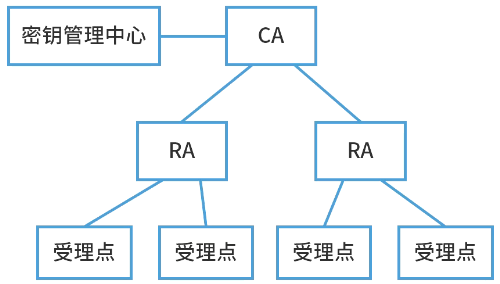

# 信息加密技术

## 最佳实践

### 考察问

1. 信息加密:
    1. 对称加密:
    2. 非对称加密: `()`加密, `()`解密

2. 数字签名
    1. 生成摘要: `()`作用信息, 目的是`()`
    2. 签名摘要: `()`签名, `()`验证, 目的是`()`

3. 公钥基础设施PKI

    1. 终端实体（用户）从认证权威机构CA申请、撤销和更新数字证书的流程: 终端 - `()` - `()`
    2. 注册机构(RA)的功能包含: `()`, `()`, `()`
    3. 认证全为机构(CA)的功能: `()`
    4. 某Web网站向CA申请了数字证书。用户登录过程中可通过验证`()`，确认该数字证书的有效性，以`()`。

4. 零碎知识
    1. 一个密码系统至少由明文、密文、加密算法、解密算法和密钥五个部分组成，而其安全性是由`()`决定的。
    2. 数字签名最常见的实现方法是建立在`()`和`()`算法的组合基础之上。

### 考察点

1. 信息加密:
    1. 对称加密:
    2. 非对称加密: `公钥`加密, `私钥`解密

2. 数字签名
    1. 生成摘要: `单向散列函数`作用信息, 目的是`防篡改`
    2. 签名摘要: `私钥`签名, `公钥`验证, 目的是`防抵赖`

3. 公钥基础设施PKI

    1. 终端实体（用户）从认证权威机构CA申请、撤销和更新数字证书的流程: 终端 - `注册机构(RA)` - `认证权威机构(CA)`
    2. 注册机构(RA)的功能包含: `认证注册信息的合法性`, `批准证书的申请`, `拒绝证书的申请`
    3. 认证全为机构(CA)的功能: `签发证书`
    4. 某Web网站向CA申请了数字证书。用户登录过程中可通过验证`CA的签名`，确认该数字证书的有效性，以`验证该网站的真伪`。

4. 零碎知识
    1. 一个密码系统至少由明文、密文、加密算法、解密算法和密钥五个部分组成，而其安全性是由`密钥`决定的。
    2. 数字签名最常见的实现方法是建立在`公钥密码体制`和`单向安全散列函数`算法的组合基础之上。

## 数据加密

一个密码系统，通常简称为密码体制（Cryptosystem），由五部分组成：

1. 明文空间P，它是全体明文的集合。
2. 密文空间C，它是全体密文的集合。
3. 密钥空间K，它是全体密钥的集合。
4. 加密算法E，它是一组由P至C的加密变换。
5. 解密算法D，它是一组由C到P的解密变换。

加密解密过程:

1. 发送端把明文P用加密算法E和密钥K加密，变换成密文C，即C = E(K,P)

2. 接收端利用解密算法D和密钥K对密文C解密得到明文P，即P = D(K,C)

## 对称加密技术

对称加密，采用对称密码编码技术，加密和解密的密钥相同，不公开加密算法。优点是加密快，加密过程简单。缺点是加密强度不高（只有一个密钥），密钥分发困难，保密性较差。
常见对称加密算法：DES、3DES、AES、RC - 5、IDEA。 

## 非对称加密技术

非对称加密算法需要两个不同的密钥：公开密钥（Public key）和私有密钥（Private key）。公开密钥与私有密钥是一对，如果用公开密钥对数据进行加密，只有用对应的私有密钥才能解密；如果用私有密钥对数据进行加密，那么只有用对应的公开密钥才能解密。公钥体系也就是公开加密算法，即非对称加密。

1. 任何人的私钥只有自己拥有
2. 任何人的公钥可以明文公开发送

非对称加密体制模型：

1. 加密模型：明文经接受方的公钥由发送方加密成密文，再经接受方的私钥解密回明文。
2. 认证模型：明文经发送方的私钥由发送方加密成密文，再经发送方的公钥由接收方解密回明文。

优点是无须交换密钥，保密性较好。缺点是仅适用少量数据加密，加密速度慢、时间长。常用来加密对称加密算法的密钥。（数字信封的原理）常见非对称加密算法：RSA、DSA、ECC。 

|对称加密算法(共享密钥)|非对称加密算法(公开密钥)|
| ---- | ---- |
|【用途】：对消息明文进行加密传送|【用途】：对密钥加密，做数字签名|
|DES：采用替换和移位的方式，使用56位密钥，处理64位数据块，速度较快，密钥容易产生|RSA：使用2048位（或1024位）密钥|
|3DES(三重DES)：  - 密钥长度112位，由两个56位的密钥K1、K2组成  - 加密过程为K1加密→K2解密→K1加密  - 解密过程为K1解密→K2加密→K1解密|Elgamal：安全性依赖于计算有限域上离散对数这一难题|
|IDEA：使用128位密钥，处理64位明文/密文，常用于PGP|ECC：椭圆曲线算法|
|其它对称加密算法：RC-5、AES|Diffie-Hellman| 

🔒题目

1. 💛一个密码系统至少由明文、密文、加密算法、解密算法和密钥五个部分组成，而其安全性是由（  ）决定的。

    - A. 加密算法
    - B. 解密算法
    - C. 加解密算法
    - D. 密钥

    答案: D

2. 💚利用公开密钥算法进行数据加密时，采用的方式是（  ）。

    - A．发送方用公开密钥加密，接收方用公开密钥解密
    - B．发送方用私有密钥加密，接收方用私有密钥解密
    - C．发送方用公开密钥加密，接收方用私有密钥解密
    - D．发送方用私有密钥加密，接收方用公开密钥解密 

    答案: C

3. ❤️公司总部与分部之间需要传输大量数据，在保障数据安全的同时又要兼顾密钥算法效率，最合适的加密算法是（  ）。

    - A．RC-5
    - B．RSA
    - C．ECC
    - D．MD5

    答案: A

4. ❤️以下wifi认证方式中，（）使用了AES加密算法，安全性更高。
    - A. 开放式 
    - B. WPA 
    - C. WPA2 
    - D. WEP

    - 答案：C 

## 数字签名

1. 数字信封运用了对称加密技术和非对称加密技术，本质是使用对称密钥加密数据，非对称密钥加密对称密钥，解决了对称密钥的传输问题。
2. 信息摘要的特点：无论数据多长，都会产生固定长度的信息摘要；任何不同的输入数据，都会产生不同的信息摘要；单向性，即只能由数据生成信息摘要，不能由信息摘要还原数据。常见的信息摘要算法：MD5（产生128位的输出）、SHA - 1（安全散列算法，产生160位的输出，安全性更高）。 
3. 数字签名，用发送方的私钥签名，用发送方的公钥验证消息的真实性，发送方不可否认。 

加密和签名对比:

1. 数字加密的主要过程

    1. 当信息发送者需要发送信息时，首先生成一个对称密钥，用该对称密钥加密要发送的报文；
    2. 信息发送者用信息接收者的公钥加密上述对称的密钥；
    3. 信息发送者将上述两个步骤的结果集合在一起传给信息接收者，称为数字信封； 
    4. 信息接收者使用自己的私钥解密被加密的对称密钥，再用此对称密钥解密被发送方加密的密文，最后得到真正的原文。

2. 数字签名的主要过程

    1. 信息发送者使用一个单项散列函数（Hash函数）对信息生成信息摘要； 
    2. 信息发送者使用自己的私钥签名信息摘要； 
    3. 信息发送者把信息本身与已签名的信息摘要一起发送出去； 
    4. 信息接受者使用与发送者相同的单项散列函数（Hash函数）对接收的信息生成新的信息摘要，再使用发送者的公钥对信息摘要进行验证，以确认信息发送者的身份和信息是否被修改过。 

请依据已学习的加密解密技术，以及信息摘要，数字签名技术解决以下问题：

请设计一个安全邮件传输系统，要求：该邮件以加密方式传输，邮件最大附件内容可达2GB，发送者不可抵赖，若邮件被第三方截获，第三方无法篡改。 

🔒问题

2. ❤️数字签名最常见的实现方法是建立在（  ）的组合基础之上。

    - A．公钥密码体制和对称密码体制
    - B．对称密码体制和MD5摘要算法
    - C．公钥密码体制和单向安全散列函数算法
    - D．公证系统和MD4摘要算法 

    答案: C

3. 🔴数字签名首先需要生成消息摘要，然后发送方用自己的私钥对报文摘要进行加密，接收方用发送方的公钥验证真伪。生成消息摘要的目的是（  ），对摘要进行加密的目的是（  ）。

    - A．防止窃听  B．防止抵赖  C．防止篡改  D．防止重放
    - A．防止窃听  B．防止抵赖  C．防止篡改  D．防止重放 

    答案: CB

4. 🟡在安全通信中，S将所发送的信息使用______进行数字签名，T收到该消息后可利用______验证该消息的真实性。

    - A. S的公钥
    - B. S的私钥 
    - C. T的公钥 
    - D. T的私钥
    
    - A. S的公钥
    - B. S的私钥 
    - C. T的公钥 
    - D. T的私钥

    答案：B A 

## 公钥基础设施PKI

公钥基础设施（Public Key Infrastructure，PKI）：是以非对称加密技术为基础，以数据机密性、完整性、身份认证和行为不可抵赖性为安全目的，来实施和提供安全服务的具有普适性的安全基础设施。

1. 数字证书

    一个数据结构，是一种由一个可信任的权威机构签署的信息集合。在不同的应用中有不同的证书。如X.509证书必须包含下列信息：(1)版本号(2)序列号(3)签名算法标识符(4)认证机构(5)有效期限(6)主题信息(7)认证机构的数字签名(8)公钥信息。

    公钥证书主要用于确保公钥及其与用户绑定关系的安全。这个公钥就是证书所标识的那个主体的合法的公钥。任何一个用户只要知道签证机构的公钥，就能检查对证书签名的合法性。如果检查正确，那么用户就可以相信那个证书所携带的公钥是真实的，而且这个公钥就是证书所标识的那个主体合法的公钥。例如驾照。

2. 签证机构CA

    负责签发证书、管理和撤销证书。是所有注册用户所信赖的权威机构，CA在给用户签发证书时要加上自己的数字签名，以保证证书信息的真实性。任何机构可以用CA的公钥来验证该证书的合法性。

    1. RA（Registration Authority）：注册审批机构
    2. 证书受理点
    3. 密钥管理中心-KMC 

🔒问题

1. 💛公钥基础设施（PublicKeyInfrastructure，PKl）引l入数字证书的概念，用来表示用户的身份。下图简要地描述了终端实体（用户）从认证权威机构CA申请、撤销和更新数字证书的流程。请为中间框空白处选择合适的选项（  ）

    终端 - () - 认证权威机构(CA)

    - A.证书库
    - B.RA
    - C.OCSP
    - D.CRL库

    答案: B

2. ❤️在PKI体系中，注册机构RA的功能不包括（  ）。

    - A. 签发证书
    - B. 认证注册信息的合法性
    - C. 批准证书的申请
    - D. 拒绝证书的申请

    答案: A

3. ❤️某Web网站向CA申请了数字证书。用户登录过程中可通过验证（  ），确认该数字证书的有效性，以（  ）。

    - A. CA的签名  B. 网站的签名  C. 会话密钥  D. DES密码
    - A. 向网站确认自己的身份  B. 获取访问网站的权限 C. 和网站进行双向认证  D. 验证该网站的真伪

    答案: AD

