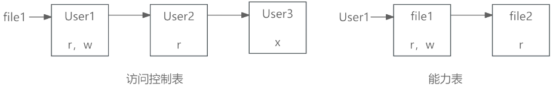

# 访问控制技术

## 访问控制的基本模型

访问控制是指主体依据某些控制策略或权限对客体本身或是其资源进行的不同授权访问。访问控制的目标有两个：

- 防止非法用户进入系统；
- 阻止合法用户对系统资源的非法使用，即禁止合法用户的越权访问。
  
访问控制包括3个要素，即主体、客体和控制策略。

- 主体：可以对其他实体施加动作的主动实体，记为S；
- 客体：是接受其他实体访问的被动实体，记为O；
- 控制策略：是主体对客体的操作行为集和约束条件集，记为KS。

访问控制包括认证、控制策略实现和审计3方面的内容。

## 访问控制的实现技术

1. 访问控制矩阵（Access Control Matrix，ACM）。是通过矩阵形式表示访问控制规则和授权用户权限的方法。主体作为行，客体作为列。

    | | file1 | file2 | file3 |
    | ---- | ---- | ---- | ---- |
    | User1 | rw |  | rw |
    | User2 | r | rwx | x |
    | User3 | x | r |  |

2. 访问控制表(ACL)。是目前最流行、使用最多的访问控制实现技术。每个客体有一个访问控制表，是系统中每一个有权访问这个客体的主体的信息。这种实现技术实际上是按列保存访问矩阵。

3. 能力表。对应于访问控制表，这种实现技术实际上是按行保存访问矩阵。每个主体有一个能力表，是该主体对系统中每一个客体的访问权限信息。使用能力表实现的访问控制系统可以很方便地查询某一个主体的所有访问权限。 

    

4. 授权关系表。每一行(或者说元组)就是访问矩阵中的一个非空元素，是某一个主体对应于某一个客体的访问权限信息。如果授权关系表按主体排序，查询时就可以得到能力表的效率；如果按客体排序，查询时就可以得到访问控制表的效率。

🔒题目

1. 🔴以下属于访问控制的目标的是（  ）。

    - A. 防止非法用户进入系统
    - B. 防止病毒进入系统
    - C. 防止内网用户访问外网
    - D. 防止外网用户访问内网

    答案: A