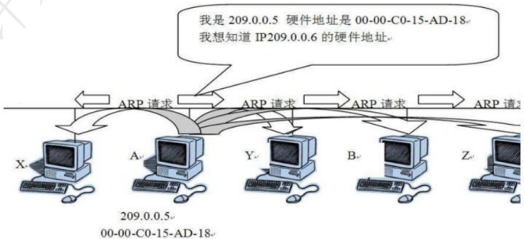

# 信息安全的抗攻击技术

## 最佳实践

## 考察问

1. 零碎知识
    1. BLP模型是`()`模型
        1. 简单安全规则: `()`
        2. 星属性安全规则: `()`
    2. Biba模型是`()`模型
    3. 区块链
        1. 矿工“挖矿”取得区块链的`()`，同时获得`()`
        2. “挖矿”本质上是在尝试计算一个`()`
        3. “挖矿”是一种`()`证明机制
    4. 门禁卡是属于`()`鉴别方式

### 考察点

1. 零碎知识
    1. BLP模型是`机密性`模型
        1. 简单安全规则: `不可上读`
        2. 星属性安全规则: `不可下写`
    2. Biba模型是`完整性`模型
    3. 区块链
        1. 矿工“挖矿”取得区块链的`记账权`，同时获得`代币奖励`
        2. “挖矿”本质上是在尝试计算一个`Hash碰撞`
        3. “挖矿”是一种`工作量`证明机制
    4. 门禁卡是属于`拥有的`鉴别方式

## 密钥的选择

为对抗攻击者的攻击，密钥生成需要考虑3个方面的因素：增大密钥空间、选择强钥(复杂密钥)、密钥的随机性(使用随机数)。

## 拒绝服务攻击与防御

- 拒绝服务攻击DoS (Denial of Service)的主要企图是借助于网络系统或网络协议的缺陷和配置漏洞进行网络攻击，使网络拥塞、系统资源耗尽或者系统应用死锁，妨碍目标主机和网络系统对正常用户服务请求的及时响应，造成服务的性能受损甚至导致服务中断。目前常见的拒绝服务攻击为分布式拒绝服务攻击DDoS (Distributed Denial of Service )。
- 1. 传统拒绝服务攻击的分类
拒绝服务攻击有许多种，网络的内外部用户都可以发动这种攻击。内部用户可以通过长时间占用系统的内存、CPU处理时间使其他用户不能及时得到这些资源，而引起拒绝服务攻击；外部黑客也可以通过占用网络连接使其他用户得不到网络服务。
外部用户针对网络连接发动拒绝服务攻击主要有以下几种模式：消耗资源、破坏或更改配置信息、物理破坏或改变网络部件、利用服务程序中的处理错误使服务失效。 

- 2. 分布式拒绝服务攻击DDoS
分布式拒绝服务DDoS攻击是传统DoS攻击的发展，攻击者首先侵入并控制一些计算机，然后控制这些计算机同时向一个特定的目标发起拒绝服务攻击。克服了传统DOS受网络资源的限制和隐蔽性两大缺点。
- 3. 拒绝服务攻击的防御方法
（1）加强对数据包的特征识别，攻击者发送的数据包中有一些特征字符串。通过搜寻这些特征字符串，就可以确定攻击服务器和攻击者的位置。
（2）设置防火墙监视本地主机端口的使用情况。如果发现端口处于监听状态，则系统很可能受到攻击。 
（3）对通信数据量进行统计也可获得有关攻击系统的位置和数量信息。在攻击时，攻击数据的来源地址会发出超出正常极限的数据量。 
（4）尽可能的修正已经发现的问题和系统漏洞。 

## 欺骗攻击与防御

### 1. ARP欺骗

- **正常ARP原理**：如图所示，主机A想知道局域网内主机B的MAC地址，那么主机A就广播发送ARP请求分组，局域网内主机都会收到，但只有B收到解析后知道是请求自己的MAC地址，所以只有B会返回单播的响应分组，告诉A自己的MAC地址。A收到响应分组后，会建立或更新B的IP地址和MAC地址映射（ARP缓存表），这个映射是动态存在的，如果一定时间A、B不再通信，那么就会清空这个地址映射，下次如果还要通信，则重复这个过程。 
- **ARP欺骗原理**：上述过程主机A不管其有没有发送过请求广播分组，而只要收到了返回的分组信息，就会刷新IP地址和MAC地址的映射关系，这样就存在安全隐患，假设有主机C，模拟返回分组格式，构造正确的IP地址和自己的MAC地址映射，A收到后也会刷新映射关系，那么当A再次向B发送信息时，实际就发送到了C的MAC地址，数据就被C监听到了。 

- **ARP欺骗的防范措施**
（1）在WinXP下输入命令：arp -s gate - way - ip gate - way - mac固化ARP表，阻止ARP欺骗。
（2）使用ARP服务器。通过该服务器查找自己的ARP转换表来响应其他机器的ARP广播。确保这台ARP服务器不被黑。 
（3）采用双向绑定的方法解决并且防止ARP欺骗。 
（4）ARP防护软件——ARP Guard。 

### 2. DNS欺骗
- **DNS欺骗原理**：DNS欺骗首先是冒充域名服务器，然后把查询的IP地址设置为攻击者的IP地址，这样的话，用户上网就只能看到攻击者的主页，而不是用户想要取得的网站主页了，这就是DNS欺骗的基本原理。即改掉了域名和IP地址的对应关系。黑客是通过冒充DNS服务器回复查询IP的。 
- **DNS欺骗过程**：如图所示，www.xxx.com的IP地址为202.109.2.2，如果www.angel.com向xxx.com的子域名DNS服务器查询www.xxx.com的IP地址时，www.heike.com冒充DNS向www.angel.com回复www.xxx.com的IP地址为200.1.1.1，这时www.angel.com就会把200.1.1.1当做www.xxx.com对应的IP地址了。当www.angel.com连接www.xxx.com时，就会转向虚假的IP地址200.1.1.1，这样对www.xxx.com来说，就算是给黑掉了。 

- **DNS欺骗的检测**：根据检测手段的不同，可分为被动监听检测、虚假报文探测和交叉检查查询3种。
（1）**被动监听检测**：通过旁路监听的方式，捕获所有DNS请求和应答数据包，并为其建立一个请求应答映射表。如果在一定的时间间隔内，一个请求对应两个或两个以上结果不同的应答包，则怀疑受到了DNS欺骗攻击。
（2）**虚假报文探测**：采用主动发送探测包的手段来检测网络内是否存在DNS欺骗攻击者。如果向一个非DNS服务器发送请求包，正常来说不会收到任何应答，如果收到了应答包，则说明受到了攻击。 
（3）**交叉检查查询**：在客户端收到DNS应答包之后，向DNS服务器反向查询应答包中返回的IP地址所对应的DNS名字，如果两者一致，说明没有受到攻击，否则说明被欺骗。 

### 3. IP欺骗
- **IP欺骗原理和过程**：
①首先使被冒充主机host b的网络暂时瘫痪，以免对攻击造成干扰；
②然后连接到目标机host a的某个端口来猜测ISN初始值和增加规律； 
③接下来把源地址伪装成被冒充主机host b，发送带有SYN标志的数据段请求连接； 
④然后等待目标机host a发送SYN+ACK包给已经瘫痪的主机，因为现在看不到这个包； 
⑤最后再次伪装成主机host b向目标主机host a发送ACK确认标志，此时发送的数据段带有预测的目标机的ISN+1； 
⑥连接建立，发送命令请求。 
- **IP欺骗的防范**：虽然IP欺骗攻击有着相当难度，但这种攻击非常广泛，入侵往往由这里开始。预防这种攻击可以删除UNIX中所有的/etc/hosts.equiv、SHOME/.rhosts文件，修改/etc/inetd.conf文件，使得RPC机制无法应用。另外，还可以通过设置防火墙过滤来自外部而信源地址却是内部IP的报文。 

## 端口扫描
 
- 端口扫描是入侵者搜集信息的几种常用手法之一，通过扫描端口可以判断目标主机上开放了哪些服务以及判断主机的操作系统。
- 1. 端口扫描原理
端口扫描就是尝试与目标主机的某些端口建立连接，如果目标主机该端口有回复(见三次握手中的第二次)，则说明该端口开放，即为“活动端口”。
- 2. 端口扫描原理分类
（1）全TCP连接。这种扫描方法使用三次握手，与目标计算机建立标准的TCP连接。
（2）半打开式扫描(SYN扫描)。扫描主机自动向目标计算机的指定端口发送SYN数据段，表示发送建立连接请求。
（3）FIN扫描。依靠发送FIN来判断目标计算机的指定端口是否是活动的。这种扫描不涉及任何TCP连接部分。因此，这种扫描比前两种都安全，可以称之为秘密扫描。 
（4）第三方扫描。第三方扫描又称“代理扫描”，这种扫描是利用第三方主机（安全防御系数极低的个人计算机）来代替入侵者进行扫描。 

## 强化TCP/IP堆栈以抵御拒绝服务攻击

针对TCP/IP堆栈的攻击方式有多种类型，下面分别介绍攻击原理及抵御方法。

1. 同步包风暴（SYN Flooding）
    利用TCP协议缺陷发送大量伪造的TCP连接请求，使得被攻击者资源耗尽。三次握手，进行了两次，不进行第三次握手，连接队列处于等待状态，大量这样的等待，会占满全部队列空间，使得系统挂起。可以通过修改注册表防御SYN Flooding攻击。
1. ICMP攻击
    ICMP协议本身的特点决定了它非常容易被用于攻击网络上的路由器和主机。比如，前面提到的“Ping of Death”攻击就是利用操作系统规定的ICMP数据包的最大尺寸不超过64KB这一规定，达到使TCP/IP堆栈崩溃、主机死机的效果。可以通过修改注册表防御ICMP攻击。 
1. SNMP攻击
    SNMP还能被用于控制这些设备和产品，重定向通信流，改变通信数据包的优先级，甚至断开通信连接。总之，入侵者如果具备相应能力，就能完全接管你的网络。可以通过修改注册表项防御。系统漏洞扫描指对重要计算机信息系统进行检查，发现其中可能被黑客利用的漏洞。包括基于网络的漏洞扫描(通过网络远程扫描主机)、基于主机的漏洞扫描(在目标系统安装了代理扫描)。 

🔒题目

1. SYN Flooding攻击的原理是______。

    - A. 利用TCP三次握手，恶意造成大量TCP半连接，耗尽服务器资源，导致系统拒绝服务
    - B. 操作系统在实现TCP／IP协议栈时，不能很好地处理TCP报文的序列号紊乱问题，导致系统崩溃 
    - C. 操作系统在实现TCP／IP协议栈时，不能很好地处理IP分片包的重叠情况，导致系统崩溃 
    - D. 操作系统协议栈在处理IP分片时，对于重组后超大的IP数据包不能很好地处理，导致缓存溢出而系统崩溃

    答案：A 

## 系统漏洞扫描

系统漏洞扫描指对重要计算机信息系统进行检查，发现其中可能被黑客利用的漏洞。包括基于网络的漏洞扫描(通过网络远程扫描主机)、基于主机的漏洞扫描(在目标系统安装了代理扫描)。 

