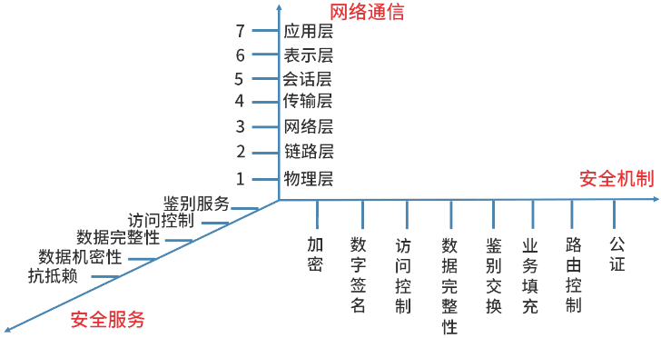
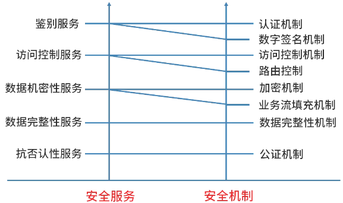
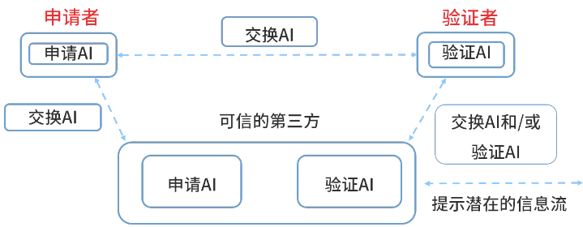
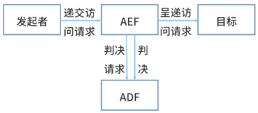
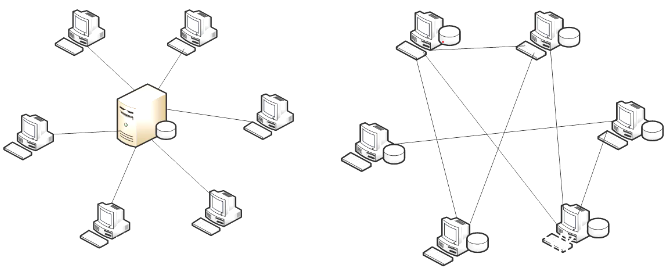
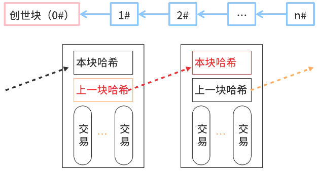
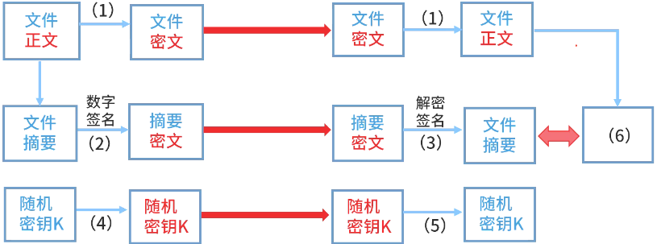

# 安全架构设计理论与实践

## 最佳实践

### 考察点

1. 主被动
    1. 被动攻击: 网络监听、非法登录、信息截取
    2. 主动攻击: ✨除了被动都是主动

### 考察问

## 安全架构概述

## 网络与信息安全风险分类

- 人为蓄意破坏
    - 被动型攻击：网络监听、非法登录、信息截取
    - 主动型攻击：数据篡改、假冒身份、拒绝服务、重放攻击、散播病毒、主观抵赖
- 灾害性攻击：水灾、火灾、地震、雷击、战争
- 系统故障：硬件故障、软件故障、链路故障、供电故障
- 人员无意识行为：编程错误、操作错误、无意泄密 

## 攻击类型

- 被动攻击：收集信息为主，破坏保密性。

    - 窃听（网络监听）：用各种可能的合法或非法的手段窃取系统中的信息资源和敏感信息。
    - 业务流分析：通过对系统进行长期监听，利用统计分析方法对诸如通信频率、通信的信息流向、通信总量的变化等参数进行研究，从而发现有价值的信息和规律。
    - 非法登录：有些资料将这种方式归为被动攻击方式。 

- 主动攻击：主动攻击的类别主要有：中断（破坏可用性），篡改（破坏完整性），伪造（破坏真实性） 。 

    - 假冒身份：非法用户冒充成为合法用户，特权小的用户冒充成为特权大的用户。
    - 抵赖：否认自己曾经发布过的某条消息、伪造一份对方来信等。
    - 旁路控制【旁路攻击】：密码学中是指绕过对加密算法的繁琐分析，利用密码算法的硬件实现的运算中泄露的信息。如执行时间、功耗、电磁辐射等，结合统计理论快速破解密码系统。
    - 重放攻击：所截获的某次合法的通信数据拷贝，出于非法的目的而被重新发送。加`时间戳`能识别并应对重放攻击。
    - 拒绝服务（DOS）：破坏服务的`可用性`，对信息或其他资源的合法访问被无条件的阻止。 
    - XSS跨站脚本攻击：通过利用网页【开发时留下的漏洞】，通过巧妙的方法注入恶意指令代码到网页。
    - CSRF跨站请求伪造攻击：攻击者通过一些技术手段欺骗用户的浏览器与访问一个自己曾经认证过的网站并执行一些操作（如转账或购买商品等）。 
    - 缓冲区溢出攻击：利用【缓冲区溢出漏洞】所进行的攻击。在各种操作系统、应用软件中广泛存在。
    - SQL注入攻击：
        - 攻击者把SQL命令插入到Web表单，欺骗服务器执行恶意的SQL命令。
        - SQL注入攻击的方式：【恶意拼接查询】、【利用注释执行非法命令】、【传入非法参数】、【添加额外条件】 。
        - 抵御SQL攻击的方式包括：【使用正则表达式】、【使用参数化的过滤性语句】、【检查用户输入的合法性】、【用户相关数据加密处理】、【存储过程来执行查询】、【使用专业的漏洞扫描工具】 。
 
🔒问题

1. 🔴以下网络攻击中，（  ）属于被动攻击。

    - A. 拒绝服务攻击
    - B. 重放
    - C. 假冒
    - D. 网络监听 

    答案: D

2. 💚信息系统面临多种类型的网络安全威胁。其中，信息泄露是指信息被泄露或透露给某个非授权的实体；（  ）是指数据被非授权地进行修改；（  ）是指对信息或其他资源的合法访问被无条件地阻止；（  ）是指通过对系统进行长期监听，利用统计分析方法对诸如通信频率、通信的信息流向、通信总量的变化等参数进行研究，从而发现有价值的信息和规律。

    - A. 非法使用 B. 破坏信息的完整性 C. 授权侵犯 D. 计算机病毒
    - A. 拒绝服务 B. 陷阱门 C. 旁路控制 D. 业务欺骗
    - A. 特洛伊木马 B. 业务欺骗 C. 物理侵入 D. 业务流分析 

    答案: BAD

## 安全模型的分类

- 基本模型：HRU
- 机密性：
    - 访问控制：
        - MAC强制：BLP、Chinese Wall
        - DAC自主
        - RBAC角色
    - 信息流
- 完整性：
    - Biba
    - Clark-Wilson

### BLP模型(机密性)

Bell - LaPadula模型是符合军事安全策略的计算机安全模型，简称BLP模型。
BLP模型的安全规则如下：

- 简单安全规则：安全级别低的主体不能`读`安全级别高的客体。不可上读
- 星属性安全规则：安全级别高的主体不能往低级别的客体`写`。不可下写
- 强星属性安全规则：不允许对另一级别进行读写。
- 自主安全规则：使用访问控制矩阵来定义说明自由存取控制。 

🔒题目

1. 💛BLP模型的设计目标是解决信息系统资源的（  ）保护。

    - A. 不可否认性
    - B. 机密性
    - C. 完整性
    - D. 匿名性 

    答案: B

2. 💛Bell - LaPadula模型（简称BLP模型）是最早的一种安全模型，也是最著名的多级安全策略模型，BLP模型的简单安全规则是指（  ）。

    - A. 不可上读
    - B. 不可上写
    - C. 不可下读
    - D. 不可下写 

    答案: A

### Biba模型(完整性)

Biba模型主要用于防止非授权修改系统信息，以保护系统的信息完整性。该模型同BLP模型类似，采用主体、客体、完整性级别描述安全策略要求。Biba模型能够防止数据从低完整性级别流向高完整性级别，其安全规则如下：

- 星完整性规则：表示完整性级别低的主体不能对完整性级别高的客体写数据。
- 简单完整性规则：表示完整性级别高的主体不能从完整性级别低的客体读取数据。
- 调用属性规则：表示一个完整性级别低的主体不能从级别高的客体调用程序或服务。

🔒问题

1. Biba模型是属于（  ）。

    - A. 状态机模型
    - B. 信息流模型
    - C. 无干扰模型
    - D. 完整性模型 

    答案: D

### Chinese Wall模型

Chinese Wall模型的安全策略的基础是客户访问的信息不会与当前他们可支配的信息产生冲突。

其访问客体控制的安全规则如下：

- 与主体曾经访问过的信息属于同一公司数据集合的信息，即墙内信息可以访问。
- 属于一个完全不同的利益冲突组的可以访问。
- 主体能够对一个客体进行写的前提是主体未对任何属于其他公司数据集进行过访问。

定理:

1. 定理1：一个主体一旦访问过一个客体，则该主体只能访问位于同一公司数据集的客体或在不同利益组的客体。
2. 定理2：在一个利益冲突组中，一个主体最多只能访问一个公司数据集 。 

## 信息安全整体架构设计

### WPDDRC模型

WPDDRC模型包括6个环节和3大要素。
6个环节包括：预警、保护、检测、响应、恢复和反击。模型蕴涵的网络安全能力主要是预警能力、保护能力、检测能力、响应能力、恢复能力和反击能力。
3大要素包括人员、策略和技术。 

|  | 预警 | 保护 | 检测 | 响应 | 恢复 | 反击 | 管理 |
| ---- | ---- | ---- | ---- | ---- | ---- | ---- | ---- |
| PDR | 无 | 有 | 有 | 有 | 无 | 无 | 无 |
| PPDR | 无 | 有 | 有 | 有 | 无 | 无 | 无 |
| PDRR | 无 | 有 | 有 | 有 | 有 | 无 | 无 |
| MPDRR | 无 | 有 | 有 | 有 | 有 | 无 | 有 |
| WPDRRC | 有 | 有 | 有 | 有 | 有 | 有 | 有 |

🔒问题

1. ❤️P2DR模型不包括（  ）。

    - A．防护
    - B．检测
    - C．响应
    - D．预警 

    答案: D

2. 💚加密机制、数据签名机制、访问控制机制、认证机制、信息隐藏、防火墙技术等是属于WPDRRC模型中（  ）环节。

    - A．保护
    - B．检测
    - C．响应
    - D．恢复 

    答案: A

## 网络安全体系架构设计

### 开放系统互联安全体系结构

GB/T9387.2-1995给出了基于0SI参考模型的7层协议之上的信息安全体系结构。

安全服务与安全机制的对应关系

### 认证框架

鉴别的基本目的是防止其他实体占用和独立操作被鉴别实体的身份。鉴别的方式如下：

1. 已知的
2. 拥有的
3. 不改变的特性
4. 相信可靠的第3方建立的鉴别
5. 环境

鉴别信息的类型包括交换鉴别信息、申请鉴别信息和验证鉴别信息。 

### 访问控制框架

访问控制决定开发系统环境中允许使用哪些资源，在什么地方适合阻止未授权访问的过程。 

### 机密性框架

机密性服务的目的是确保信息仅仅是对被授权者可用。
机密性机制：

1. 通过禁止访问提供机密性；
2. 通过加密提供机密性。

### 完整性框架

完整性框架的目的是通过阻止威胁或探测威胁，保护可能遭到不同方式危害的数据完整性和数据相关属性完整性。
完整性机制的类型：

1. 阻止对媒体访问的机制；
2. 用以探测对数据或数据项序列的非授权修改的机制。 

### 抗抵赖框架

抗抵赖服务包括证据的生成，验证和记录，以及在解决纠纷时随即进行的证据恢复和再次验证。 

- 证据生成
- 证据传输、存储及恢复
- 证据验证
- 解决纠纷 

🔒问题

1. 🔴保护信息不泄露或不暴露给那些未授权想掌握该信息的实体是（  ）安全服务。

    - A．鉴别
    - B．数据完整性
    - C．数据机密性
    - D．访问控制 

    答案: C

2. 🟡门禁卡是属于以下哪种鉴别方式？（  ）

    - A．已知的
    - B．拥有的
    - C．不改变的特性
    - D．环境 

    答案: B

## 区块链

区块链的特点:

- 去中心化：由于使用分布式核算和存储，不存在中心化的硬件或管理机构，任意节点的权利和义务都是均等的，系统中的数据块由整个系统中具有维护功能的节点来共同维护。
- 开放性：系统是开放的，如：区块链上的【交易信息是公开的】，不过【账户身份信息是高度加密的】。
- 自治性：区块链采用基于协商一致的规范和协议（比如一套公开透明的算法），使得整个系统中的所有节点能够在去信任的环境自由安全地交换数据，使得对“人”的信任改成了对机器的信任，任何人为的干预不起作用。
- 安全性（信息不可篡改）：数据在多个结点存储了多份，篡改数据得改掉51%结点的数据，这太难。同时，还有其它安全机制，如：比特币的每笔交易，都由付款人用私钥签名，证明确实是他同意向某人付款，其它人无法伪造。 
- 匿名性（去信任）：由于节点之间的交换遵循固定的算法，其数据交互是无需信任的（区块链中的程序规则会自行判断活动是否有效），因此交易对手无须通过公开身份的方式让对方自己产生信任，对信用的累积非常有帮助。 

比特币底层采用了区块链技术。

1. 链表在多个结点存储，没有中心结点，数据不一致时，以“少数服从多数”原则执行。
2. 所以要篡改成功，除非篡改51%的结点。

哈希加密/防篡改

共识算法(博弈论)/全民记账

一般有：POW（工作量证明）、PoS（权益证明）、DPoS（股份授权证明机制）。
比特币采用了POW（工作量证明）：

- 争夺记账权 = 挖矿。
- 计算出来的账单结点哈希值前13个字符为0，则符合规则，得到记账权。有一个结点计算出结果，则广播消息告知其它结点，其它结点更新数据。
- 计算困难，但验证却很容易，例如：218903 = 哪两个质数的乘积？答案是457*479 。 

🔒题目

1. 以下关于区块链应用系统中“挖矿”行为的描述中，错误的是（  ）。

    - A. 矿工“挖矿”取得区块链的记账权，同时获得代币奖励
    - B. “挖矿”本质上是在尝试计算一个Hash碰撞
    - C. “挖矿”是一种工作量证明机制
    - D. 可以防止比特币的双花攻击 

    答案: D

2. 随着科技进步、社会发展，尤其是以计算机为代表的信息技术飞速发展，各种信息呈爆炸式发展。计算机及信息技术的应用领域在不断扩展，计算机在政府、企业、民生等各个领域中都得到越来越广泛的应用，安全问题也日益突显。近来火热的区块链技术的核心便是一系列的信息安全技术。

    1. （5分）请从以下选项中选出与区块链相关的技术，最多选5个，多选不得分。BCDIK

        A. 对称加密  B. 非对称加密  C. 时间戳  D. 哈希函数  E. 数字信封  F. 数字证书  H. 二维表结构  I. 智能合约  J. CA认证  K. POS

    2. （8分）属于哈希算法，哈希算法作用包括 (2)CEGK 。

        A. 3DES  B. PGP  C. MD5  D. RSA（2048）  E. SHA  F. IDEA  G. 用于保障信息完整性 H. 用于保障信息可用性  I. 用于信息加密  J. 用于数字签名  K. 用于防篡改 

    3. （12分）某军区要架设一套内部文件安全传输系统，该文件以加密方式传输，支持最大2G的单个文件传输，为保障安全可靠性，发送者不可抵赖发送过的文件，若文件被第三方截获，第三方无法解密也无法篡改其内容。根据此需求，架构设计师王工设计了如下的安全架构： 

        

        请用以下选项补充图中缺失部分：
        (a) 发送方公钥Pa
        (b) 发送方私钥Sa
        (c) 接收方公钥Pb
        (d) 接收方私钥Sb
        (e) 随机密钥K
        (f) 文件密文
        (g) 文件摘要 

2. 阅读下列说明，回答问题1至问题3，将解答填入答题纸的对应栏内。

    【说明】访问控制是保障信息系统安全的主要策略之一，其主要任务是保证系统资源不被非法使用和非常规访问。访问控制规定了主体对客体访问的限制，并在身份认证的基础上，对用户提出的资源访问请求加以控制。

    1. (6分)针对信息系统的访问控制包含哪三个基本要素？

    2. (7分)BLP模型是一种强制访问控制模型，请问：
        1. BLP模型保证了信息的机密性还是完整性？
        2. BLP模型采用的访问控制策略是上读下写还是下读上写？ 

    3. （12分）ISO安全体系结构包含的安全服务有：①鉴别服务；②访问控制服务；③数据保密性服务；④数据完整性服务；⑤抗否认性服务。请问：

        1. 针对跨站伪造请求攻击可以采用哪种安全服务来解决或者缓解？
        2. 针对口令明文传输漏洞攻击可以采用哪种安全服务来解决或者缓解？
        3. 针对签名伪造攻击可以采用哪种安全服务来解决或者缓解？
        4. 如果下载的软件被植入木马，可以采用哪种安全服务来进行解决或者缓解？ 

