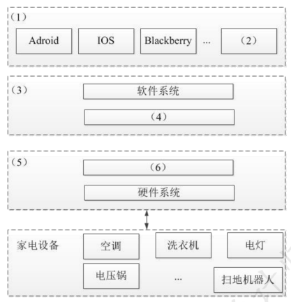

# 物联网

## 最佳实践

### 考察问

1. 物联网
    1. 包含哪3层: () () ()

### 考察点

1. 物联网
    1. 包含哪3层: `感知层`, `网络层`, `应用层`

## 物联网概念

物联网(Internet of Things)是实现`物物相连`的`互联``网络`，其内涵包含两个方面：第一，物联网的核心和基础仍是互联网，是在互联网基础上延伸和扩展的网络；第二，其用户端延伸和扩展到了任何物体与物体之间，使其进行信息交换和通信。

- 感知层：用于识别物体、采集信息，例如二维码、RFID、摄像头、温湿度传感器等。
- 网络层：负责传递和处理信息，包含通信网与互联网的融合网络、网络管理中心、信息中心和智能处理中心等。
- 应用层：主要解决信息处理和人机交互的问题 。

🔒题目

1. 在有关物体中安装信息传感设备，使其与互联网相连接，进行信息交换和通信，以实现对物体的智能化识别、定位、跟踪、监控和管理，这样的一种网络称为(  )。
    - A．移动互联网
    - B．全球定位系统
    - C．智联网
    - D．物联网

    答案: D

## 物联网关键技术(RFID)

射频识别技术(Radio Frequency Identification，RFID)，又称电子标签，是一种通信技术，可通过无线电讯号识别特定目标并读写相关数据，而无需识别系统与特定目标之间建立机械或光学接触。该技术是物联网的一项核心技术，很多物联网应用都离不开它。

RFID的基本组成部分通常包括：标签、阅读器、天线。

## 二维码

二维码是用特定几何图形按一定规律在平面(二维方向)分布的黑白相间图形，用于记录数据符号信息。在代码编制上，借助计算机内部逻辑基础的“0”“1”比特流概念，用若干与二进制对应的几何形体表示文字数值信息，可通过图像输入或光电扫描设备自动识读，实现信息自动处理。

二维条码中，常用的码制有：Data Matrix，Maxi Code，Aztec，QR Code，Vericode，PDF417，Ultracode，Code 49，Code 16K 。

🔒题目

1. 某公司拟开发一个智能家居管理系统，该系统的主要功能需求如下：1)用户可使用该系统客户端实现对家居设备的控制，且家居设备可向客户端反馈实时状态；2)支持家居设备数据的实时存储和查询；3)基于用户数据，挖掘用户生活习惯，向用户提供家居设备智能化使用建议。

    基于上述需求，该公司组建了项目组，在项目会议上，张工给出了基于家庭网关的传统智能家居管理系统的设计思路，李工给出了基于云平台的智能家居系统的设计思路。经过深入讨论，公司决定采用李工的设计思路。

    1. (8分)请用400字以内的文字简要描述基于家庭网关的传统智能家居管理系统和基于云平台的智能家居管理系统在网关管理、数据处理和系统性能等方面的特点，以说明项目组选择李工设计思路的原因。(2021下)

        1. 在网关管理方面，基于云平台的智能家居管理系统可以将分散的智能家居网关数据集中起来，实现对智能家居网关的远程高效管理。
        2. 在数据处理方面，云端服务器对智能家居网数据进行备份存储，当家庭网关由于故障等原因导致数据丢失时，可以通过云端管理系统对网关数据进行恢复，从而提高数据的容灾性。
        3. 在系统性能方面，基于云服务平台的智能家居管理系统将数据信息存储在云端，减少了数据请求时间，提高了通信效率。 

    2. (12分)请从下面给出的(a)~(j)中进行选择，补充完善图5-1中空(1)~(6)处的内容，协助李工完成该系统的架构设计方案。(2021下) 

        (a)Wi - Fi
        (b)蓝牙
        (c)驱动程序
        (d)数据库
        (e)家庭网关
        (f)云平台
        (g)微服务
        (h)用户终端
        (i)鸿蒙
        (j)TCP/IP 

        

        (1) h 
        (2) i 
        (3) f 
        (4) d 
        (5) e 
        (6) c 

    3. (5分)该系统需实现用户终端与服务端的双向可靠通信，请用300字以内的文字从数据传输可靠性的角度对比分析TCP和UDP通信协议的不同，并说明该系统应采用哪种通信协议。(2021下) 

        TCP在IP协议提供的不可靠数据服务的基础上，采用了重发技术，为应用程序提供了一个可靠的、面向连接的、全双工的数据传输服务。TCP协议一般用于传输数据量比较少，且对可靠性要求高的场合。

        UDP是一种不可靠的、无连接的协议，可以保证应用程序进程间的通信，与TCP相比，UDP是一种无连接的协议，它的错误检测功能要弱得多。

        该系统应采用TCP协议。 