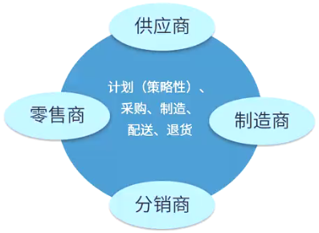

# 供应链管理SCM

## 概念

供应链管理(Supply Chain Management, SCM)是一种集成的管理思想和方法，是在满足服务水平要求的同时，为了使系统成本达到最低而采用的将供应商、制造商、仓库和商店有效地结合成一体来生产商品，有效地控制和管理各种信息流、资金流和物流，并把正确数量的商品在正确的时间配送到正确的地点的一套管理方法。
信息化三流:

- 信息流
    - 需求信息流（需方到供方）：如客户订单、生产计划、采购合同等
    - 供应信息流（供方到需方）：如入库单、完工报告单、库存记录、可供销售量、提货发运单等
- 资金流
- 物流

### 供应链管理SCM的特点

1. 以客户为中心。SCM追求的目标首先是满足客户的需求；衡量SCM绩效的最重要的指标就是客户满意度。
2. 集成化管理。SCM的本质在于集成化管理。
3. 扩展性管理。现代的SCM使传统的企业向扩展性企业发展。
4. 合作管理。SCM非常强调企业之间的合作，打破传统的封闭的经营意识，通过供应链中各个节点企业之间建立起新型的合作关系。
5. 多层次管理。包括公司战略层次、战术层次和作业层次上的活动，主要目标是通过系统的观点，对多个职能和各个层次的供应商进行整合。

## 供应链节点

供应链节点有：供应商、制造商、分销商、零售商、仓库、配送中心、客户等。

## SCM的基本内容

SCM包括计划、采购、制造、配送、退货五大基本内容。

- 计划：这是SCM的策略部分，企业需要有一个策略来管理所有的资源，以满足客户对产品的需求。好的计划是建立一系列的方法监控供应链。
- 采购：选择能为企业提供产品和服务的供应商。
- 制造：安排生产、测试、打包和准备送货所需的活动，是供应链中测量内容最多的部分。
- 配送：即物流，是调整用户的订单收据、建立仓库网络、拍递送人员提货并送货、建立产品计价系统、接收付款。
- 退货：是供应链中的问题处理部分。
