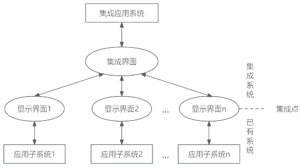
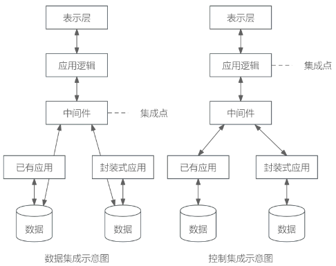

# 企业应用集成
## 最佳实践

### 考察问

1. 企业应用集成（Enterprise Application Integration，EAI）提供4个层次的服务，从下至上依次为`()`、`()`、`()`、`()`
2. 系统应用集成构建统一标准的基础平台，在各个应用系统的接口之间共享数据和功能，基本原则是保证应用程序的`()`。

### 考察点

1. 企业应用集成（Enterprise Application Integration，EAI）提供4个层次的服务，从下至上依次为`通讯服务`、`信息传递与转化服务`、`应用连接服务`、`流程控制服务`
2. 系统应用集成构建统一标准的基础平台，在各个应用系统的接口之间共享数据和功能，基本原则是保证应用程序的`独立性`。

## 概念

企业应用集成（Enterprise Application Integration，EAI）是伴随着企业信息系统的发展而产生和演变的。EAI技术是将进程、软件、标准和硬件联合起来，在两个或更多的企业信息系统之间实现无缝集成，使它们就像一个整体一样。

## EAI提供的服务层次

EAI提供4个层次的服务，从下至上依次为通讯服务、信息传递与转化服务、应用连接服务、流程控制服务，最上层是流程控制服务。EAI就是在各个应用系统的接口之间共享数据和功能。EAI的基本原则就是集成多个系统并保证系统之间互不干扰，也就是独立性。

## 企业应用集成（EAI）的适用范围

企业应用集成EAI，可以适用于大多数要实施电子商务的企业，以及企业之间的应用集成。

## 常见的企业应用集成方法

1. 表示集成：即界面集成，是最原始的集成，黑盒集成。将多个信息系统的界面集成在一起，统一入口，为用户提供一个看上去统一，但是由多个系统组成的应用系统的集成，例如桌面。

    

2. 数据集成：白盒集成，把不同来源、格式、特点性质的数据在逻辑上或者物理上有机的集中，从而为企业提供全面的数据共享。如数据仓库。
3. 控制集成（功能集成、应用集成）：黑盒集成，业务逻辑层次的集成，可以借助于远程过程调用或远程方法调用、面向消息的中间件等技术，将多个应用系统功能进行绑定，使之像一个实时运行的系统一样接受信息输入和产生数据输出，实现多个系统功能的叠加。如钉钉。

    

4. 业务流程集成：即过程集成，是最彻底的、综合的集成，这种集成超越了数据和系统，由一系列基于标准的、统一数据格式的工作流组成。当进行业务流程集成时，企业必须对各种业务信息的交换进行定义、授权和管理，以便于改进操作、减少成本、提高响应速度。如电子购物网站 - 第三方支付平台 - 银行 - 物流等流程集成。

## 应用集成数据交换方式

- 共享数据库：在应用集成时，让多个应用系统通过直接共享数据库的方式，来进行数据交换，实时性强，可以频繁交互，属于同步方式；但是安全性、并发控制、死锁等问题突出。
- 消息传递：消息是软件对象之间进行交互和通信时所使用的一种数据结构，可以独立于软件平台而存在，适用于数据量小、但要求频繁、立即、可靠、异步地数据交换场合。
- 文件传输：是指在进行数据交换时，直接将数据文件传送到相应位置，让目标系统直接读取数据，可以一次性传送大量信息，但不适合频繁进行数据传送。适用于数据量大、交换频度小、即时性要求低的情况。

## 企业集成平台

企业集成平台是一个支持复杂信息环境下信息系统开发、集成、协同运行的软件支撑环境，包括硬件、软件、软件工具和系统，基本功能包括：

1. 通信服务。它提供分布环境下透明的同步/异步通信服务功能，使用户和应用程序无需关心具体的操作系统和应用程序所处的网络物理位置，而以透明的函数调用或对象服务方式完成它们所需的通信服务要求。
2. 信息集成服务。它为应用提供透明的信息访问服务，通过实现异种数据库系统之间数据的交换、互操作、分布数据管理和共享信息模型定义，使集成平台上运行的应用、服务或用户端能够以一致的语义和接口实现对数据的访问与控制。
3. 应用集成服务。它通过高层应用编程接口来实现对相应应用程序的访问，能够为应用提供数据交换和访问操作，使各种不同的系统能够相互协作。
4. 二次开发工具。它是集成平台提供的一组帮助用户开发特定应用程序的支持工具，其目的是简化用户在企业集成平台实施过程中的开发工作。
5. 平台运行管理工具。它是企业集成平台的运行管理和控制模块，负责企业集成平台系统的静态和动态配置、集成平台应用运行管理和维护、事件管理和出错管理等。

## 企业信息集成

企业信息集成分为企业内部的信息集成和企业外部的信息集成两个方面。

1. 按集成内容，企业内部的信息集成一般可分为以下四个方面：
    - 技术平台的集成。系统底层的体系结构、软件、硬件以及异构网络的特殊需求首先必须得到集成。
    - 数据的集成。为了完成应用集成和业务流程集成，需要解决数据和数据库的集成问题。数据集成的目的是实现不同系统的数据交流与共享，是进行其他更进一步集成的基础。
    - 应用系统的集成。它是实现不同系统之间的互操作，使得不同应用系统之间能够实现数据和方法的共享。它为进一步的过程集成打下了基础。
    - 业务过程的集成。使得在不同应用系统中的流程能够无缝连接，实现流程的协调运作和流程信息的充分共享。
2. 企业外部的信息集成主要包括以下两个部分：
    - 通过门户网站和互联网实现公众、社会团体、社会和客户的互动，实现企业内外部信息资源的有效交流和集成。
    - 通过与合作伙伴信息系统的对接，建立动态的企业联盟，发展基于竞争合作机制的虚拟企业，重塑企业的战略模式和竞争优势。

## 🔒问题

1. ❤️企业应用集成EAI构建统一标准的基础平台，将进程、软件、标准和硬件联合起来，提供4个层次的服务，从下至上依次为______。
    - A. 通讯服务、信息传递与转化服务、流程控制服务、应用连接服务
    - B. 通讯服务、流程控制服务、应用连接服务、信息传递与转化服务
    - C. 通讯服务、应用连接服务、信息传递与转化服务、流程控制服务
    - D. 通讯服务、信息传递与转化服务、应用连接服务、流程控制服务

    答案：D

2. ❤️系统应用集成构建统一标准的基础平台，在各个应用系统的接口之间共享数据和功能，基本原则是保证应用程序的______。系统应用集成提供了四个不同层次的服务，最上层服务是______服务。
    - A. 独立性
    - B. 相关性
    - C. 互操作性
    - D. 排他性

    - A. 通信
    - B. 信息传递与转化
    - C. 应用连接
    - D. 流程控制

    答案：A D
