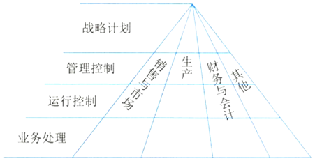
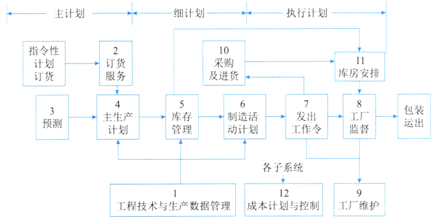
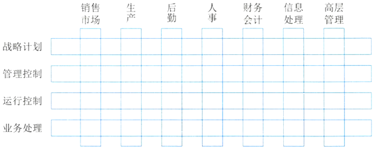

# 管理信息系统的概念

管理信息系统（Manage Information System，MIS）是由业务处理系统发展而成的，是在TPS基础上引进大量管理方法对企业整体信息进行处理，并利用信息进行预测、控制、计划、辅助企业全面管理的信息系统。

管理信息系统由四大部件组成，即信息源、信息处理器、信息用户和信息管理者。 

根据各部件之间的联系可分为开环（不收集外部信息不反馈）和闭环（不断收集信息反馈调整）。 

根据处理的内容及决策的层次来看，我们可以把管理信息系统看成一个金字塔式的结构。分为战略计划、管理控制和运行控制3层。 

## 管理信息系统的功能

职能的完成往往是通过“过程"实现，过程是逻辑上相关活动的集合，因而往往把管理信息系统的功能结构表示成功能-过程结构。

这个系统标明了企业各种功能子系统怎样互相联系并形成一个全企业的管理系统，是企业各种管理过程的一个缩影。整个流程自左至右展开。

## 管理信息系统的组成

一个管理系统可用一个功能/层次矩阵来表示，每一列代表一种管理功能，每一行表示一个管理层次:

1. 销售市场子系统。它包括销售和推销，在运行控制方面包括雇用和训练销售人员、销售和推销的日常调度，还包括按区域、产品、顾客销售数量的定期分析等。
2. 生产子系统。它包括产品设计、生产设备计划、生产设备的调度和运行、生产人员的雇用和训练、质量控制和检查等。 
3. 后勤子系统。它包括采购、收货、库存控制和分发。 
4. 人事子系统。它包括雇用、培训、考核记录、工资和解雇等。 
5. 财务和会计子系统。财务的目标是保证企业的财务要求，并使其花费尽可能的低；会计则是把财务业务分类、总结，填入标准财务报告，准备预算、成本数据的分析与分类等。 
6. 信息处理子系统。该系统的作用是保证企业的信息需要。典型的任务是处理请求、收集数据、改变数据和程序的请求、报告硬件和软件的故障及规划建议等。 
7. 高层管理子系统。为高层领导服务。业务包括查询信息和支持决策，编写文件和信件，向公司其他部门发送指令。 

