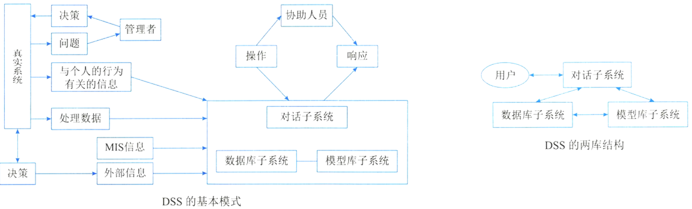

# 决策支持系统DSS

## 决策支持系统的概念

决策支持系统（Decision Support System，DSS）应当是一个交互式的、灵活的、适应性强的基于计算机的信息系统，能够为解决非结构化管理问题提供支持，以改善决策的质量。

DSS的基本模式反映DSS的形式及其与“真实系统”、人和外部环境的关系，如下图所示。其中管理者处于核心地位，运用自己的知识和经验，结合决策支持系统提供的支持，对其管理的“真实系统”进行决策。 

DSS的两种基本结构形式是两库结构和基于知识的结构，实际中的DSS由这两种基本结构通过分解或增加某些部件演变而来。两库结构由数据库子系统、模型库子系统和对话子系统形成三角形分布的结构。 

## 决策支持系统的功能

决策支持系统的总体功能是支持各种层次的人们进行决策。具体可细分为：

1. 决策支持系统用来整理和提供本系统与决策问题有关的各种数据。 
2. 决策支持系统要尽可能地收集、存储和及时提供与决策有关的外部信息。 
3. 决策支持系统能及时收集和提供有关各项活动的反馈信息。 
4. 决策支持系统对各种与决策有关的模型具有存储和管理的能力。 
5. 决策支持系统提供对常用的数学方法、统计方法和运筹方法的存储和管理。 
6. 决策支持系统能对各种数据、模型、方法进行有效管理，为用户提供查找、变更、增加、删除等操作功能。 
7. 决策支持系统运用所提供的模型和方法对数据进行加工，并得出有效支持决策的信息。 
8. 决策支持系统具有人 - 机对话接口和图形加工、输出功能，不仅用户可以对所需要的数据进行查询，而且可以输出相应的图形。 
9. 决策支持系统应能支持分布使用方式，提供有效的传输功能，以保证分散在不同地点的用户能共享系统所提供的模型、方法和可共享的数据。 

## 决策支持系统的特点

从决策支持系统的任务和功能，可以归纳出决策支持系统不同于其他计算机信息系统的特点。

1. 决策支持系统面向决策者。 
2. 决策支持系统支持对半结构化问题的决策。 
3. 决策支持系统的作用是辅助决策者、支持决策者。 
4. 决策支持系统体现决策过程的动态性。 
5. 决策支持系统提倡交互式处理。 

## 决策支持系统的组成

1. 数据的重组和确认。与决策支持系统相关的数据库的问题是，获得正确的数据并且可用理想的形式操作这些数据。这个问题可以通过数据仓库的概念解决。
2. 数据字典的建立。数据仓库是一个与作业层系统分离存在的数据库。通过对数据仓库的存取，管理者可以做出以事实为根据的决策来解决许多业务问题。 
3. 数据挖掘和智能体。一旦建成数据仓库，管理者们需要运用工具进行数据存取和查询，这个过程为数据挖掘，使用的工具称为智能体。数据挖掘的结果类型包括：
    1. 联合：把各个事件联系在一起的过程。例如，将学生们经常同时选修的两门课程联系起来，以便这两门课程不被安排在同一时间。 
    2. 定序：识别模式的过程。例如，识别学生们多个学期课程的次序。 
    3. 分类：根据模式组织数据的过程。例如，以学生完成学业的时间（4年以内，4年以上）为标准分成几个小组。 
    4. 聚类：推导特定小组与其他小组相区分的判断规则的过程。例如，通过兴趣、年龄、工作经验来划分学生。 
4. 模型建立。模型管理的目的就是帮助决策者理解与选择有关的现象。建立模型的方法有穷举法、算法、启发式和模拟法。 

