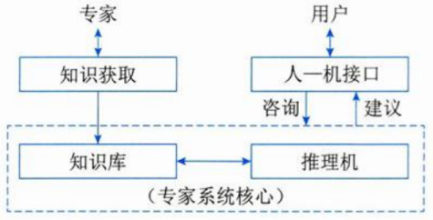

# 专家系统的概念ES

## 专家系统的概念

基于知识的专家系统简称为专家系统（Expert System，ES），它是人工智能的一个重要分支。专家系统的能力来自于它所拥有的专家知识，知识的表示及推理的方法则提供了应用的机理。

知识 + 推理 = 系统

专家系统不同于传统的应用程序和其他类型的人工智能问题求解程序。主要表现在以下5个方面。

1. 专家系统属于人工智能范畴，其求解的问题是半结构化或非结构化问题。 
2. 专家系统模拟的是人类专家在问题领域的推理，而不是模拟问题领域本身。 
3. 专家系统由3个要素组成：描述问题状态的综合数据库、存放启发式经验知识的知识库和对知识库的知识进行推理的推理机。三要素分别对应数据级、知识库级和控制级三级知识，而传统应用程序只有数据和程序两级结构。 
4. 专家系统处理的问题是实际的问题，而不是纯学术的问题。 
5. 从求解手段来看，专家系统专用性强，但通用性差。 

人工智能（Artificial Intelligence，AI）旨在利用机械、电子、光电或生物器件等制造的装置或机器模仿人类的智能。

AI研究的重点放在开发具有智能行为的计算机系统上，智能行为表现出以下5个特点。

1. 从过去的事件或情形中汲取经验，并将从经验中得到的知识应用于新的环境和场景。 
2. 具有在缺乏重要信息时解决问题的能力。 
3. 具有处理和操纵各种符号、理解形象化图片（图像）的能力。 
4. 想象力和创造力。 
5. 善于启发。 

人工智能是一个极为广泛的领域，AI的主要分支有专家系统、机器人技术、视觉系统、自然语言处理、学习系统和神经网络等。 

## 专家系统的特点

超越时间限制、操作成本低廉、易于传递与复制、处理手段一致（不会因人而异）、善于克服难题、适用特定领域。

## 专家系统的组成

各种应用领域的专家系统的核心部分基本相同，其一般结构如图所示。

1. 知识库。用来存放系统求解实际问题的领域知识。知识库中的知识可分成两类：一类为事实性知识；另一类是启发性知识。 
2. 综合数据库。是专家系统在执行与推理过程中用以存放所需要和产生的各种信息的工作存储器，因此，综合数据库又叫动态知识库，其内容在系统运行过程中是不断变化的。相应地把专家系统的知识库称为静态知识库。二者一起构成完整知识库。 
3. 推理机。推理机和知识库一起构成专家系统的核心。推理机也被称为控制结构或规则解释器，通常包括推理机制和控制策略，是一组用来控制系统的运行、执行各种任务、根据知识库进行各种搜索和推理的程序模块。 
4. 知识获取。主要有两方面功能：一是知识的编辑和求精；二是知识自学习。 
5. 解释程序。是面向用户服务的，负责解答用户提出的各种问题。 
6. 人机接口。通常包括两部分：一部分是专家系统与用户的接口；另一部分是专家系统与领域专家和知识工程师的接口。 

