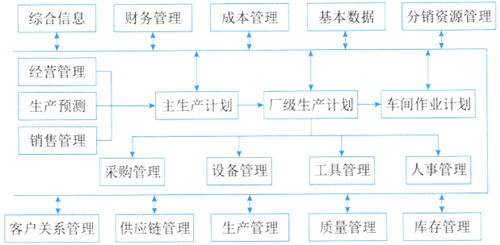

# 企业资源规划ERP

## 最佳实践

### 考察问

1. ERP管理`()`（物流管理）、`()`（财务管理）和`()`（生产控制管理）. 一般认为`()`（人力资源管理）是企业第四大资源。
2. 在ERP系统中，`()`管理模块主要是对企业物料的进、出、存进行管理。

### 考察点

1. ERP管理`物流`（物流管理）、`资金流`（财务管理）和`信息流`（生产控制管理）. 一般认为`人力资源`（人力资源管理）是企业第四大资源。
2. 在ERP系统中，`库存`管理模块主要是对企业物料的进、出、存进行管理。

## 企业资源规划的概念

企业资源规划（Enterprise Resource Planning，ERP）是指建立在信息技术基础上，利用现代企业的先进管理思想，全面地集成了企业的所有资源信息，并为企业提供决策、计划、控制与经营业绩评估的全方位和系统化的管理平台。

企业的所有资源包括三大流：物流（物流管理）、资金流（财务管理）和信息流（生产控制管理）。现在一般认为人力资源（人力资源管理）是企业第四大资源。

企业资源计划可从下面三点来理解：

- 管理思想：ERP首先是一种管理思想，将企业资源分类管理，是管理思想的变革。
- 软件产品：其次，ERP是个软件产品，为企业用户提供一体化的解决方案，不是买来直接用的，需要个性化的开发和部署。 
- 管理系统：ERP最后是一个管理系统，存在众多的子系统，这些子系统有统一的规划，是互联互通的，便于事前事中监控。 

1. 🟡ERP（Enterprise Resource Planning）是建立在信息技术的基础上，利用现代企业的先进管理思想，对企业的物流、资金流和______流进行全面集成管理的管理信息系统，为企业提供决策、计划、控制与经营业绩评估的全方位和系统化的管理平台。在ERP系统中，______管理模块主要是对企业物料的进、出、存进行管理。
    - A.产品
    - B.人力资源
    - C.信息
    - D.加工

    - A.库存
    - B.物料
    - C.采购
    - D.销售

    答案：C A 

## 发展历史:

- 物料需求计划（MRP，Material Requirement Planning）：物料单系统
- 制造资源计划（MRPII，Manufacturing Resource Planning II）：在MRP基础上，增加库存、分销等功能
- 企业资源计划（ERP，Enterprise Resource Planning）：打通了供应链，把财务、人力资源、销售管理等纳入

## 企业资源规划的结构

ERP主要包括了以下11个基本模块。

1. 生产预测。市场需求是企业生存的基础，在ERP中首先需要对市场进行较准确的预测。预测主要用于计划，在ERP的5个层次的计划中，前3个层次计划，即经营计划、生产计划大纲和主生产计划的编制都离不开预测。 
2. 销售管理（计划）。销售管理主要是针对企业的销售部门的相关业务进行管理。 

  

3. 经营计划（生产计划大纲PP）。是根据经营计划的生产目标制定的，是对企业经营计划的细化，用以描述企业在可用资源的条件下，在一定时期中的产量计划。 
4. 主生产计划（MPS）。是对企业生产计划大纲的细化，说明在一定时期内的计划：生产什么，生产多少和什么时候交货。主生产计划的编制以生产大纲为准，其汇总结果应当等同于生产计划大纲。 
5. 物料需求计划（MRP） 。物料需求计划是对主生产计划的各个项目所需的全部制造件和全部采购件的网络支持计划和时间进度计划。它根据主生产计划对最终产品的需求数量和交货期，推导出构成产品的零部件及材料的需求数量和需求时期，再导出自制零部件的制作订单下达日期和采购件的采购订单发送日期，并进行需求资源和可用能力之间的进一步平衡。物料需求计划是生产管理的核心，属于ERP管理层计划。 
6. 能力需求计划（CRP） 。是对物料需求计划所需能力进行核算的一种计划管理方法。旨在通过分析比较MRP的需求和企业现有生产能力，及早发现能力的瓶颈所在，为实现企业的生产任务而提供能力方面的保障。 
7. 车间作业计划（PAC）。是在MRP所产生的加工制造订单（即自制零部件生产计划）的基础上，按照交货期的前后和生产优先级选择原则以及车间的生产资源情况（如设备、人员、物料的可用性、加工能力的大小等），将零部件的生产计划以订单的形式下达给适当的车间。 
8. 采购与库存管理。采购与库存管理是ERP的基本模块，其中采购管理模块是对采购工作，即从采购订单产生至货物收到的全过程进行组织、实施与控制，库存管理模块则是对企业物料的进、出、存进行管理。 
9. 质量与设备管理。质量管理贯穿于企业管理的始终。设备管理是指依据企业的生产经营目标，通过一系列的技术、经济和组织措施，对设备寿命周期内的所有设备物资运动形态和价值运动形态进行的综合管理。 
10. 财务管理。会计工作是企业管理的重要组成部分，是以货币的形式反映和监督企业的日常经济活动，并对这些经济业务的数据进行分类、汇总，以便为企业管理和决策提供必要的信息支持。企业财务管理是企业会计工作和活动的统称。 
11. ERP有关扩展应用模块。如客户关系管理、分销资源管理、供应链管理和电子商务等。这几个扩展模块本身也是一个独立的系统，在市场上它们常作为独立的软件产品进行出售和实施。 

## 企业资源规划的功能

ERP为企业提供的功能是多层面的和全方位的，主要包括：支持决策的功能、为处于不同行业的企业提供有针对性的IT解决方案、从企业内部的供应链发展为全行业和跨行业的供应链。

