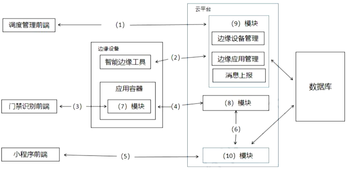

# 边缘计算

## 边缘计算的概念

边缘计算将数据的处理、应用程序的运行甚至一些功能服务的实现，由网络中心下放到网络边缘的节点上。在网络边缘侧的智能网关上就近采集并且处理数据，不需要将大量未处理的原生数据上传到远处的大数据平台。

采用边缘计算的方式，海量数据能够就近处理，大量的设备也能实现高效协同的工作，诸多问题迎刃而解。因此，边缘计算理论上可满足许多行业在敏捷性、实时性、数据优化、应用智能，以及安全与隐私保护等方面的关键需求。 

## 边缘计算的定义

- 边缘计算的业务本质是云计算在数据中心之外汇聚节点的延伸和演进，主要包括云边缘、边缘云和云化网关三类落地形态；以“边云协同”和“边缘智能”为核心能力发展方向；软件平台需要考虑导入云理念、云架构、云技术，提供端到端实时、协同式智能、可信赖、可动态重置等能力；硬件平台需要考虑异构计算能力。
    - 云边缘：是云服务在边缘侧的延伸，逻辑上仍是云服务，主要能力是提供依赖于云服务或需要与云服务紧密协同。
    - 边缘云：是在边缘侧构建中小规模云服务能力，边缘服务能力主要由边缘云提供。 
    - 云化网关：以云化技术与能力重构原有嵌入式网关系统，云化网关在边缘侧提供协议/接口转换、边缘计算等能力，部署在云侧的控制器提供边缘节点的资源调度、应用管理与业务编排等能力。 

## 边缘计算的特点

- 边缘计算具有以下特点：
    - 联接性：联接性是边缘计算的基础。所联接物理对象的多样性及应用场景的多样性，需要边缘计算具备丰富的联接功能。
    - 数据第一入口：边缘计算作为物理世界到数字世界的桥梁，是数据的第一入口，拥有大量、实时、完整的数据，可基于数据全生命周期进行管理与价值创造，将更好的支撑预测性维护、资产效率与管理等创新应用。 
    - 约束性：边缘计算产品需适配工业现场相对恶劣的工作条件与运行环境，如防电磁、防尘、防爆、抗振动、抗电流/电压波动等。在工业互联场景下，对边缘计算设备的功耗、成本、空间也有较高的要求。 
    - 分布性：边缘计算实际部署天然具备分布式特征。这要求边缘计算支持分布式计算与存储、实现分布式资源的动态调度与统一管理、支撑分布式智能、具备分布式安全等能力。 

## 边云协同

- 边云协同：边缘计算与云计算各有所长，云计算擅长全局性、非实时、长周期的大数据处理与分析，能够在长周期维护、业务决策支撑等领域发挥优势；边缘计算更适用局部性、实时、短周期数据的处理与分析，能更好地支撑本地业务的实时智能化决策与执行。
- 边缘计算既靠近执行单元，更是云端所需高价值数据的采集和初步处理单元，可以更好地支撑云端应用；反之，云计算通过大数据分析优化输出的业务规则或模型可以下发到边缘侧，边缘计算基于新的业务规则或模型运行。 
- 主要包括六种协同：
    - 资源协同：边缘节点提供计算、存储、网络、虚拟化等基础设施资源、具有本地资源调度管理能力，同时可与云端协同，接受并执行云端资源调度管理策略，包括边缘节点的设备管理、资源管理以及网络连接管理。 
    - 数据协同：边缘节点主要负责现场/终端数据的采集，按照规则或数据模型对数据进行初步处理与分析，并将处理结果以及相关数据上传给云端；云端提供海量数据的存储、分析与价值挖掘。
    - 智能协同：边缘节点按照AI模型执行推理，实现分布式智能；云端开展AI的集中式模型训练，并将模型下发边缘节点。
    - 应用管理协同：边缘节点提供应用部署与运行环境，并对本节点多个应用的生命周期进行管理调度；云端主要提供应用开发、测试环境，以及应用的生命周期管理能力。
    - 业务管理协同：边缘节点提供模块化、微服务化的应用/数字孪生/网络等应用实例；云端主要提供按照客户需求实现应用/数字孪生/网络等的业务编排能力。 
    - 服务协同：边缘节点按照云端策略实现部分ECSaaS服务，通过ECSaaS与云端SaaS的协同实现面向客户的按需SaaS服务；云端主要提供SaaS服务在云端和边缘节点的服务分布策略，以及云端承担的SaaS服务能力。
- 边缘计算的应用场合：智慧园区、安卓云与云游戏、视频监控、工业互联网、Cloud VR。  

2. 某公司拟开发一套基于边缘计算的智能门禁系统，用于如园区、新零售、工业现场等存在来访、被访业务的场景。来访者在来访前，可以通过线上提前预约的方式将自己的个人信息记录在后台，被访者在系统中通过此请求后，来访者在到访时可以直接通过“刷脸”的方式通过门禁，无需做其他验证。此外，系统的管理员可对正在运行的门禁设备进行管理。

    基于项目需求，该公司组建项目组，召开了项目讨论会。会上，张工根据业务需求并结合边缘计算的思想，提出本系统可由访客注册模块、模型训练模块、端侧识别模块与设备调度平台模块等四项功能组成，李工从技术层面提出该系统可使用Flask框架与SSM框架为基础来开发后台服务器，将开发好的系统通过Docker进行部署，并使用MQTT协议对Docker进行管理。

    1. (5分)MQTT协议在工业物联网中得到广泛的应用，请用300字以内的文字简要说明MQTT协议。(2022下)

        MQTT 是一个物联网传输协议，它被设计用于轻量级的发布 / 订阅式消息传输，旨在为低带宽和不稳定的网络环境中的物联网设备提供可靠的网络服务。MQTT 是专门针对物联网开发的轻量级传输协议。MQTT 协议针对低带宽网络，低计算能力的设备，做了特殊的优化，使得其能适应各种物联网应用场景。

    2. (14分)在会议上，张工对功能模块进行了更进一步的说明：访客注册模块用于来访者提交申请与被访者确认申请，主要处理提交来访申请、来访申请审核业务，同时保存访客数据，为训练模块准备训练数据集；模型训练模块用于使用访客数据进行模型训练，为端侧设备的识别业务提供模型基础；端侧识别模块在边缘门禁设备上运行，使用训练好的模型来识别来访人员，与云端服务协作完成访客来访的完整业务；设备调度平台模块用于对边缘门禁设备进行管理，管理人员能够使用平台对边缘设备进行调度管理与状态监控，实现云端协同。(2022下)

        图5-1给出了基于边缘计算的智能门禁系统架构图，请结合HTTP协议和MQTT协议的特点，为图5-1中(1)~(6)处选择合适的协议；并结合张工关于功能模块的描述，补充完善图5-1中(7)~(10)处的空白。 

        

        (1) HTTP (2) HTTP (3) MQTT (4) HTTP (5) HTTP (6) HTTP (7) 端侧识别模块 (8) 模型训练模块 (9) 设备调度平台模块 (10) 访客注册模块

    3. (6分)请用300字以内的文字，从数据通信、数据安全和系统性能等方面简要分析在传统云计算模型中引入边缘计算模型的优势。(2022下) 

        1. 速度：如果使用边缘计算，则物联网设备将在边缘数据中心或本地处理数据。因此，数据无需传输回中央服务器，速度优势明显；
        2. 安全：边缘计算将在不同的数据中心和设备之间分配数据处理工作。黑客无法通过攻击一台设备来影响整个网络；
        3. 可扩展性：通过购买具有足够计算能力的设备来扩展边缘网络。企业无需为其数据需求建立自己的私有或集中式数据中心；
        4. 可靠性：所有的边缘数据中心和物联网设备都位于用户附近。因此，网络中断的可能性非常小。 