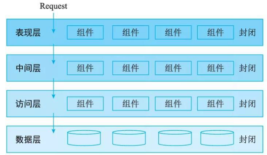

# 层次式体系结构概述

层次式体系结构设计是将系统组成一个层次结构，每一层为上层服务，并作为下层客户。在一些层次系统中，除了一些精心挑选的输出函数外，内部的层接口只对相邻的层可见。连接件通过决定层间如何交互的协议来定义，拓扑约束包括对相邻层间交互的约束。由千每一层最多只影响两层，同时只要给相邻层提供相同的接口，允许每层用不同的方法实现，同样为软件重用提供了强大的支持。

软件层次式体系结构是最通用的架构，也被叫作 N 层架构模式 (n-tier architecture pattern) 。

这也是Java EE(也称为J2EE) 应用经常采用的标准模式。这种架构模式非常适合传统的 IT 通信和组织结构，很自然地成为大部分应用的第一架构选择。在分层次体系结构中的组件被划分成几个层，每个层代表应用的一个功能，都有自己特定的角色和职能。分层架构本身没有规定要分成多少层，大部分的应用会分成表现层(或称为展示层)、中间层(或称为业务层)、数据访问层(或称为持久层)和数据层。其结构见图 13-1 所示。

分层架构的一个特性就是关注分离 (separation of concerns) 。该层中的组件只负责本层的逻辑，组件的划分很容易明确组件的角色和职责，也比较容易开发、测试、管理和维护。

层次式体系结构是一个可靠的通用的架构，对很多应用来说，如果不确定哪种架构适合，可以用它作为一个初始架构。但是，设计时要注意以下两点：

(1)要注意的是污水池反模式。

所谓污水池反模式 (archit ecture sinkhole  anti-pattern), 就是请求流简单地穿过几个层，每层里面基本没有做任何业务逻辑，或者做了很少的业务逻辑。比如一些Java EE 例子，业务逻辑层只是简单的调用了持久层的接口，本身没有什么业务逻辑。

每一层或多或少都有可能遇到这样的场景，关键是分析这样的请求的百分比是多少。二八原则可以帮助你决定是否正在遇到污水池反模式。如果请求超过 20%, 则应该考虑让一些层变成开放的。

(2) 需要考虑的是分层架构可能会让你的应用变得庞大。

即使你的表现层和中间层可以独立发布，但它的确会带来一些潜在的问题，比如：分布模式复杂、健壮性下降、可靠性和性能的不足，以及代码规模的膨胀等。

