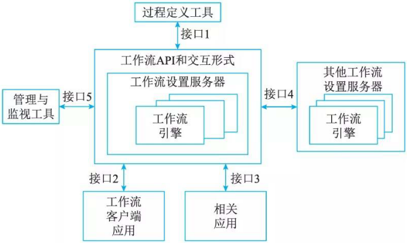
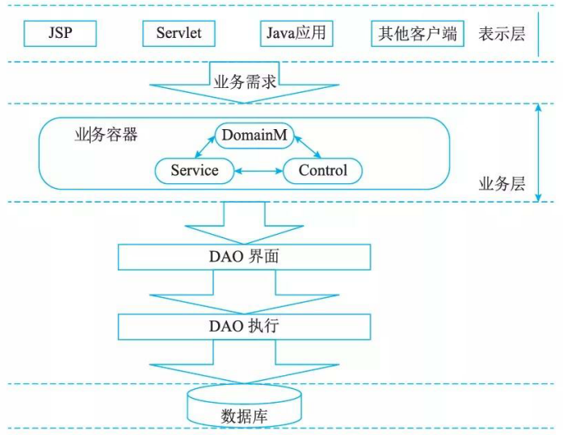

# 中间层架构设计

## 业务逻辑层组件设计

业务逻辑组件分为接口和实现类两个部分。

接口用于定义业务逻辑组件，定义业务逻辑组件必须实现的方法是整个系统运行的核心。通常按模块来设计业务逻辑组件，每个模块设计一个业务逻辑组件，并且每个业务逻辑组件以多个DAO (Data Access Object)组件作为基础，从而实现对外提供系统的业务逻辑服务。增加业务逻辑组件的接口，是为了提供更好的解耦，控制器无须与具体的业务逻辑组件耦合，而是面向接口编程。

1. 业务逻辑组件的实现类

    业务逻辑组件以DAO组件为基础，必须接收Spring容器注入的DAO组件，因此必须为业务逻辑组件的实现类提供对应的setter方法。业务逻辑组件的实现类将DAO组件接口实例作为属性(面向接口编程)，而对千复杂的业务逻辑，可能需要访问多个对象的数据，那么只需在这个方法里调用多个DAO接口，将具体实现委派给DAO完成。

2. 业务逻辑组件的配置

    由于业务逻辑组件的DAO组件从未被初始化过，那么业务方法如何完成？ DAO组件初始化是由Spring的反向控制(Inverse of Control, IoC) 或者称为依赖注入(Dependency Injection, DI) 机制完成的。为此，还需要在applicationContext.xml 里面配置 FacadeManager组件。

    定义FacadeManager组件时必须为其配置所需要的DAO组件，配置信息表示Base­Manager 继承刚才配置的事务代理模板。并且由容器给BaseManager注入DAO的组件，即 BaseDAOHibemate 。而target则是TransactionProxy FactoryBean需要指定的属性，TransactionProxyFactoryBean负责为某个bean实例生成代理，代理必须有个目标，target属性则用千指定目标。

    当然，也可以不使用事务代理模板及嵌套bean, 而是为组件指定单独的事务代理属性，让事务代理的目标引用容器中已经存在的bean 。

    applicationContext.xml 文件的源代码配置了应用的数据源和SessionFactory等 bean, 而业务逻辑组件也被部署在该文件中。

    在配置文件中，采用继承业务逻辑组件的事务代理，将原有的业务逻辑组件作为嵌套 bean配置，避免了直接调用没有事务特性的业务逻辑组件。

    系统实现了所有的后台业务逻辑，并且向外提供了统一的Facade接口，前台Web层仅仅依赖这个Facade接口。这样，Web层与后台业务层的耦合已经非常松散，系统可以在不同的Web框架中方便切换，即使将整个Web层替换掉也非常容易。

## 业务逻辑层工作流设计

工作流管理联盟(Workflow Management Coalition) 将工作流定义为：业务流程的全部或部分自动化，在此过程中，文档、信息或任务按照一定的过程规则流转，实现组织成员间的协调工作以达到业务的整体目标。工作流参考模型见图。

- interface  1 :过程定义导入／导出接口。这个接口的特点是：转换格式和 API 调用，从而支持过程定义信息间的互相转换。这个接口也支持已完成的过程定义或过程定义的一部分之间的互相转换。早期标准是 WPDL, 后来发展为 XPDL 。
- interface 2: 客户端应用程序接口。通过这个接口工作流机可以与任务表处理器交互，代表用户资源来组织任务。然后由任务表处理器负责，从任务表中选择、推进任务项。由任务表处理器或者终端用户来控制应用工具的活动。
- interface  3 :应用程序调用接口。允许工作流机直接激活一个应用工具，来执行一个活动。典型的是调用以后台服务为主的应用程序，没有用户接口。当执行活动要用到的工具，需要与终端用户交互，通常是使用客户端应用程序接口来调用那个工具，这样可以为用户安排任务时间表提供更多的灵活性。
- interface 4: 工作流机协作接口。其目标是定义相关标准，以使不同开发商的工作流系统产品相互间能够进行无缝的任务项传递。 WFMC 定义了 4 个协同工作模型，包含多种协同工作能力级别。
- interface  5 :管理和监视接口。提供的功能包括用户管理、角色管理、审查管理、资源控制、过程管理和过程状态处理器等。

用工作流的思想组织业务逻辑，优点是：将应用逻辑与过程逻辑分离，在不修改具体功能的情况下，通过修改过程模型改变系统功能，完成对生产经营部分过程或全过程的集成管理，可有效地把人、信息和应用工具合理地组织在一起，发挥系统的最大效能。

## 业务逻辑层实体设计

业务逻辑层实体具有以下特点：业务逻辑层实体提供对业务数据及相关功能(在某些设计中)的状态编程访问。业务逻辑层实体可以使用具有复杂架构的数据来构建，这种数据通常来自数据库中的多个相关表。业务逻辑层实体数据可以作为业务过程的部分I/O参数传递。业务逻辑层实体可以是可序列化的，以保持它们的当前状态。例如，应用程序可能需要在本地磁盘、桌面数据库(如果应用程序脱机工作)或消息队列消息中存储实体数据。业务逻辑层实体不直接访问数据库，全部数据库访问都是由相关联的数据访问逻辑组件提供的。业务逻辑层实体不启动任何类型的事务处理，事务处理由使用业务逻辑层实体的应用程序或业务过程来启动。

## 业务逻辑层框架

业务框架位于系统架构的中间层，是实现系统功能的核心组件。采用容器的形式，便于系统功能的开发、代码重用和管理。图便是在吸收了SOA思想之后的一个三层体系结构的简图。

从图中可以看到，业务层采用业务容器 (Business Container) 的方式存在于整个系统当中，采用此方式可以大大降低业务层和相邻各层的耦合，表示层代码只需要将业务参数传递给业务容器，而不需要业务层多余的干预。如此一来，可以有效地防止业务层代码渗透到表示层。

在业务容器中，业务逻辑是按照 Domain Model—Service—Control 思想来实现的。

- Domain Model 是领域层业务对象，它仅仅包含业务相关的属性。
- Service 是业务过程实现的组成部分，是应用程序的不同功能单元，通过在这些服务之间定义良好的接口和契约联系起来。接口是采用中立的方式进行定义的，这使得构建在各种这样的系统中的服务可以以一种统一和通用的方式进行交互。这种具有中立的接口定义(没有强制绑定到特定的实现上)的特征称为服务之间的松耦合。松耦合系统的好处有两点，一是它的灵活性，二是当组成整个应用程序的每个服务的内部结构和实现逐渐地发生改变时，它能够继续存在。
- Control 服务控制器，是服务之间的纽带，不同服务之间的切换就是通过它来实现的。通过服务控制器控制服务切换可以将服务的实现和服务的转向控制分离，提高了服务实现的灵活性和重用性。

以下是Domain Model—Service一Control 三者的互动关系。

- Service 的运行会依赖于Domain Model的状态，反之，Service也会根据业务规则改变Domain Model的状态。
- Control作为服务控制器，根据Domain Model的状态和相关参数决定Service之间的执行顺序及相互关系。

Domain Model一Servi ce一Control 的互动关系，是吸取了 Model一View-Control 的优点，在“控制和显示的分离”的基础之上演变而来的，通过将服务和服务控制隔离，使程序具备高度的可重用性和灵活性。
