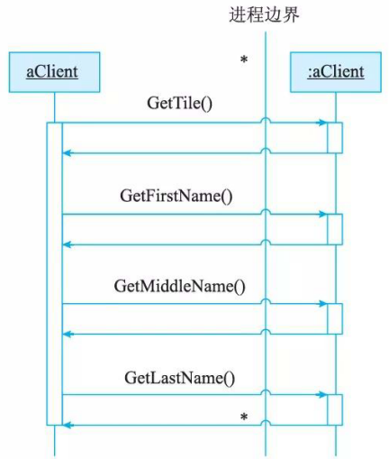
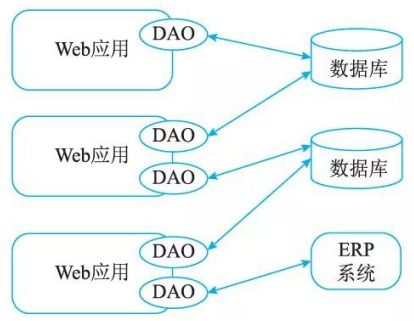
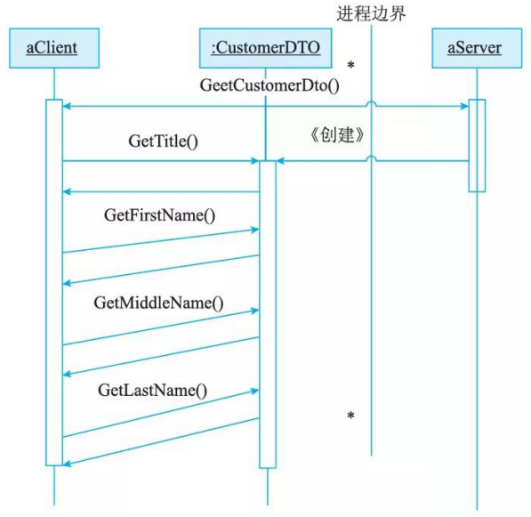
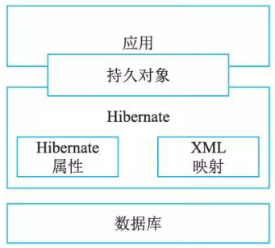

# 数据访问层设计

## 5种数据访问模式

### 在线访问

在线访问是最基本的数据访问模式，也是在实际开发过程中最常采用的。

如图 13-11 所示，这种数据访问模式会占用一个数据库连接，读取数据，每个数据库操作都会通过这个连接不断地与后台的数据源进行交互。

### DataAccess  Object 

DAO 模式是标准J2EE 设计模式之一，开发人员常常用这种模式将底层数据访问操作与高层业务逻辑分离开。

### Data Transfer Object 

如图 13-13 所示， Data Transfer Obj ect是经典 EJB设计模式之一。 DTO 本身是这样一组对象或是数据的容器，它需要跨不同的进程或是网络的边界来传输数据。这类对象本身应该不包含具体的业务逻辑，并且通常这些对象内部只能进行一些诸如内部一致性检查和基本验证之类的方法，而且这些方法最好不要再调用其他的对象行为。

### 离线数据模式

离线数据模式是以数据为中心，数据从数据源获取之后，将按照某种预定义的结构(这种结构可以是 SDO 中的 Data 图表结构，也同样可以是 ADO.NET 中的关系结构)存放在系统中，成为应用的中心。离线，对数据的各种操作独立千各种与后台数据源之间的连接或是事务；与XML 集成，数据可以方便地与 XML 格式的文档之间互相转换；独立千数据源，离线数据模式的不同实现定义了数据的各异的存放结构和规则，这些都是独立千具体的某种数据源的。

### 对象／关系映射( Obj ect/Relati on Mapping,  0/R  Mapping) 

在最近几年，采用 OR 映射的指导思想来进行数据持久层的设计似乎已经成了一种潮流。对象／关系映射的基本思想来源于这样一种现实：大多数应用中的数据都是依据关系模型存储在关系型数据库中；而很多应用程序中的数据在开发或是运行时则是以对象的形式组织起来的。那么，对象／关系映射就提供了这样一种工具或是平台，能够帮助将应用程序中的数据转换成关系型数据库中的记录；或是将关系数据库中的记录转换成应用程序中代码便于操作的对象。

## ORM 、 Hibernate与CMP2.0 设计思想

ORM  (Object-Relation Mapping)在关系型数据库和对象之间作一个映射，这样，在具体操纵数据库时，就不需要再去和复杂的 SQL 语句打交道，只要像平时操作对象一样操作即可。

当开发一个应用程序的时候(不使用 OR Mapping),可能会涉及许多数据访问层的代码，用来从数据库保存、删除和读取对象信息等，然而这些代码写起来总是重复的。

一个更好的办法就是引入 OR Mapping。实质上，一个 OR Mapping会生成 DAL 。与其自己写 DAL 代码，不如用 OR Mapping,开发者只需要关心对象就好。

通过 Cache 的实现，能够对性能进行调优，实现了 ORM 区隔离实际数据存储和业务层之间的关系，能够对每一层进行单独跟踪，增加了性能优化的可能。

Hibernate 是一个开放源代码的对象关系映射框架，它对JDBC 进行了轻量级的对象封装，使Java 程序员可以随心所欲地使用对象编程思维来操纵数据库。它不仅提供了从Java 类到数据表之间的映射，还提供了数据查询和恢复机制。相对于使用JDBC 和 S QL 来手工操作数据库， Hibernate 可以大大减少操作数据库的工作量。另外， Hi bernate 可以利用代理模式来简化载入类的过程，这将大大减少利用Hibernate QL 从数据库提取数据的代码的编写量。 Hibernat e 可以和多种 Web 服务器或者应用服务器良好集成，如今已经支持几乎所有流行的数据库服务器。

Hibernate 技术本质上是一个提供数据库服务的中间件，它的架构如图 13-14 所示。

图 13-ll 显示了 Hibernate 件(如 hibernate.properties) 的工作原理，它是利用数据库以及其他一些配置 XML Mapping等来为应用程序提供数据持久化服务的。

Hibernate 具有很大的灵活性，但同时它的体系结构比较复杂，提供了好几种不同的运行方式。在轻型体系中，应用程序提供JDBC 连接，并且自行管理事务，这种方式使用了 Hibernate的一个最小子集。在全面解决体系中，对于应用程序来说，所有底层的JDBC/JTA API 都被抽象了， Hi bernate 会照管所有的细节。

Hibernat e 是一个功能强大，可以有效地进行数据库数据到业务对象的 0/R映射方案。Hibernate 推动了基于普通Java 对象模型，用于映射底层数据结构的持久对象的开发。通过将持久层的生成自动扩展到一个更大的范围， Hibernate 使开发人员专心实现业务逻辑而不用分心于烦琐的数据库方面的逻辑，同时提供了更加合理的模块划分的方法。

## 灵活运用XML Schema

XML Schema 由诸如类型定义和元素声明的组件组成，可以用来评估一个格式良好元素和属性信息的有效性。 XML Schema 是 Schema 组件的集合，这些组件分为三组：基本组件、组件和帮助组件。其中基本组件包括简单类型定义、复杂类型定义、属性声明和元素声明；组件包括属性组、完整性约束定义、模型组和符号声明；帮助组件包括注释、模型组、小品词、通配符和属性使用。 Schema 组件详细说明了抽象数据模型的每个组件的严格语义，每个组件在XML 中的表示，一个 XML Schema 文档类型的 DTD 和 XML Schema 引用。

XML Schema 提供了创建 XML 文档必要的框架，详细说明了一个 XML 文档的不同元素和属性的有效结构、限制和数据类型。 XML Schema 规范由如下三部分组成。

(1)  XML Schema PartO: Primer 。一个非标准化的文档，提供了 XML Schema 的一个简单可读的描述，目的是快速地理解如何利用 XML Schema 语言创建一个 Schema (框架)。
(2)  XML Schema Partl:  Structures 。这一部分详细说明了 XML Schema 定义语言，这个语言为描述 XML 1.0 文档的结构和内容限制提供了便利包括开发了 XML Namespace (命名空间)的使用。
(3)  XML Schema Part2:  Datatypes 。这一部分定义了可用于 XML Schema 和其他 XML 规范中的定义数据类型的方法。这个数据类型语言，本身由 XML 1. 0 自描述，提供了说明元素和属性数据类型的 XML l. O 文档类型定义 (DTDs) 的一个超集。这部分提出了标准的数据类型内容集合，其中讲述了目的、需求、范围和术语。 XML Schema 与 DTD 相比，有其独特的特点，提供了丰富的数据类型，实现了继承和复用，与命名空间紧密联系，易千使用。

## 事务处理设计

事务是现代数据库理论中的核心概念之一。如果一组处理步骤或者全部发生或者一步也不执行，我们称该组处理步骤为一个事务。当所有的步骤像一个操作一样被完整地执行，我们称该事务被提交。由千其中的一部分或多步执行失败，导致没有步骤被提交，则事务必须回滚(回到最初的系统状态)。事务必须服从 ISO/IEC 所制定的 ACID 原则。 ACID 是原子性(Atomi city)、一致性 (Consi stency)、隔离性 (Isolation) 和持久性 C Durability)的缩写。事务的原子性表示事务执行过程中的任何失败都将导致事务所做的任何修改失效。一致性表示当事务执行失败时，所有被该事务影响的数据都应该恢复到事务执行前的状态。隔离性表示在事务执行过程中对数据的修改，在事务提交之前对其他事务不可见。持久性表示已提交的数据在事务执行失败时，数据的状态都应该正确。

## 连接对象管理设计

对于共享资源，有一个很著名的设计模式一资源池。该模式正是为了解决资源频繁分配、释放所造成的问题。把该模式应用到数据库连接管理领域，就是建立一个数据库连接池，提供一套高效的连接分配、使用策略。

建立连接池的第一步，就是要建立一个静态的连接池。所谓静态，是指池中的连接是在系统初始化时就分配好的，并且不能够随意关闭。Java 中给我们提供了很多容器类，可以方便地用来构建连接池，如 Vector 、 Stack 等。在系统初始化时，根据配置创建连接并放置在连接池中，以后所使用的连接都是从该连接池中获取的，这样就可以避免连接随意建立、关闭造成的开销(当然，我们没有办法避免Java 的 Garbage Collection 带来的开销)。

有了这个连接池，下面就可以提供一套自定义的分配、释放策略。当客户请求数据库连接时，首先看连接池中是否有未分配出去的连接。如果存在空闲连接则把连接分配给客户，并作相应处理。具体处理策略，在关键议题中会详述，主要的处理策略就是标记该连接为已分配。若连接池中没有空闲连接，就在已经分配出去的连接中，寻找一个合适的连接给客户，此时该连接在多个客户间复用。

当客户释放数据库连接时，可以根据该连接是否被复用，进行不同的处理。如果连接没有使用者，就放入到连接池中，而不是被关闭。

