# 数学与经济管理

## 图论-最小生成树

最小生成树：

1. 所有顶点接入
2. 没有回路
3. 权值之和最小

某小区有七栋楼房①~⑦（见下图），各楼房之间可修燃气管道路线的长度（单位：百米）已标记在连线旁。为修建连通各个楼房的燃气管道，该小区内部煤气管道的总长度至少为多少百米?

克鲁斯卡尔算法: 每次找最小的边

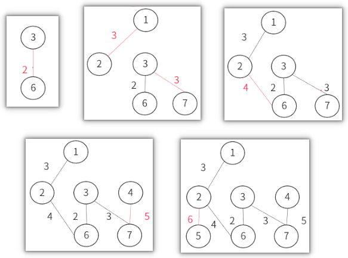

普里姆算法: 最近定点

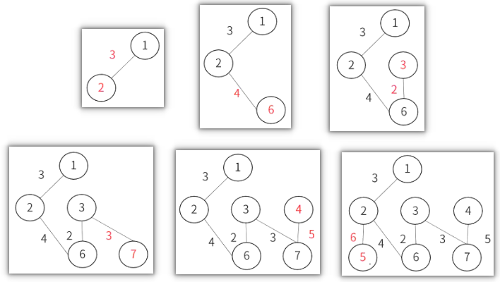

## 最短路径

有一批货物要从城市s发送到城市t，线条上的数字代表通过这条路的费用（单位为万元）。那么，运送这批货物，至少需要花费多少元？

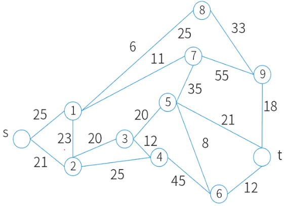

## 网络与最大流量

下图标出了某地区的运输网，各节点之间的运输能力如下表所示。那么，从节点①到节点的最大运输能力（流量）可以达到多少万吨/小时？

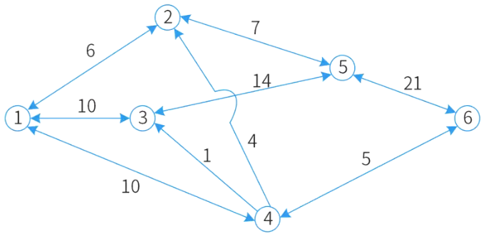

|  | ① | ② | ③ | ④ | ⑤ | ⑥ |
| --- | --- | --- | --- | --- | --- | --- |
| ① |  | 6 | 10 | 10 |  |  |
| ② | 6 |  |  |  |  | 7 |
| ③ | 10 |  |  |  |  | 14 |
| ④ | 10 | 4 | 1 |  |  | 5 |
| ⑤ |  | 7 | 14 |  |  | 21 |
| ⑥ |  |  |  | 5 | 21 |  |

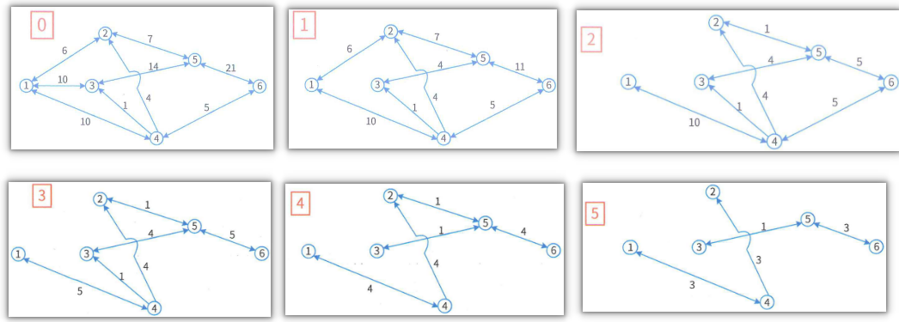

## 线性规划

线性规划是研究在有限的资源条件下，如何有效地使用这些资源达到预定目标的数学方法，即在一组约束条件下求目标函数的极值（极大值或极小值）。

线性规划问题的数学模型通常由线性目标函数、线性约束条件、变量非负条件组成（实际问题中的变量一般都是非负的）。

线性规划问题就是面向实际应用，求解一组非负变量，使其满足给定的一组线性约束条件，并使某个线性目标函数达到极值。满足这些约束条件的非负变量组的集合称为可行解域。可行解域中使目标函数达到极值的解称为最优解。

线性规划问题的最优解：无可行解、无最优解、一个最优解或无穷多个最优解。

快速解题步骤（求交点）：①根据题目条件列出不等式或不等式组；②将不等关系特殊化为等式，两两等式联立求交点；③若交点值满足所有约束条件，直接代入目标函数求得极值即可；若交点值不满足约束条件，继续计算其他两两等式。（若交点值不满足实际情况，取附近值即可，如小数个人）。

🔒问题

1. 某企业需用甲、乙、丙三种原材料生产Ⅰ、Ⅱ两种产品。生产这两种产品所需原材料数量、单位产品可获利润，以及企业现有原材料数量如下表所示。问题有两个：
    
    1. 公司可以获得的最大利润是多少万元？选项有A. 21、B. 34、C. 39、D. 48 。
    2. 取得最大利润时，哪种原材料尚有剩余？选项有A. 甲、B. 乙、C. 丙 、D. 乙和丙 。

    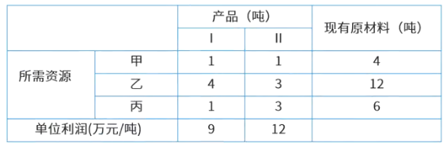

    设生产产品Ⅰ的数量为X，生产产品Ⅱ的数量为Y，由此可得：

    1. $X + Y\leq4$
    2. $4X + 3Y\leq12$  ，目标函数为 $9X + 12Y =?$
    3. $X + 3Y\leq6$

    图示法求解:

    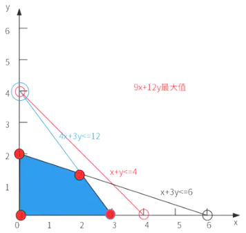

    这里是在求解线性规划问题中目标函数在不同交点处的值：

    - 交点1坐标为$(0, 2)$，此时$9X + 12Y = 24$。
    - 交点2是通过方程(2)与(3)求解得出，坐标为$X = 2$，$Y=\frac{4}{3}$ ，此时$9X + 12Y = 34$。
    - 交点3坐标为$(3, 0)$，此时$9X + 12Y = 27$。
    - 交点4坐标为$(0, 0)$，此时$9X + 12Y = 0$ 。

    算术法求解:

    这是在求解方程组的结果：

    - 由方程(1)与(2)求解可得：$X = 0$，$Y = 4$，此时$X + 3Y = 12$ 。
    - 由方程(1)与(3)求解可得：$X = 3$，$Y = 1$，此时$4X + 3Y = 15$ 。
    - 由方程(2)与(3)求解可得：$X = 2$，$Y=\frac{4}{3}$，此时$X + Y=\frac{10}{3}$ 。
    - 算式为$9\times2 + 12\times(4 / 3)$，计算结果等于$34$ 。

## 动态规划

动态规划的基本思想是将待求解问题分解成若干个子问题，先求解子问题，然后从这些子问题的解得到原问题的解，以解决最优化问题的算法策略。

暴力求解法:

🟡某公司现有400万元用于投资甲、乙、丙三个项目，投资额以百万元为单位。甲、乙、丙三项投资的可能方案及相应获得的收益如下表所示。问题是该公司能够获得的最大收益是多少百万元，选项有A. 17、B. 18、C. 20、D. 21。

|投资额\收益|1|2|3|4|
| ---- | ---- | ---- | ---- | ---- |
|甲|4|6|9|10|
|乙|3|9|10|11|
|丙|5|8|11|15|

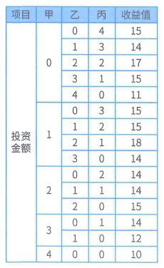

🟡某企业要把甲、乙、丙、丁四个工人分配到A、B、C、D四个岗位。因工人技术水平有差异，不同工人在各岗位每天完成任务所需工时如下表。问怎样合理安排岗位，能让四个工人以最短总工时完成每天任务，选项为A. 13 、B. 14 、C. 15 、D. 16 。

|  | A | B | C | D |
| --- | --- | --- | --- | --- |
| 甲 | 7 | 5 | 2 | 3 |
| 乙 | 9 | 4 | 3 | 7 |
| 丙 | 5 | 4 | 7 | 5 |
| 丁 | 4 | 6 | 5 | 6 |

## 排队论

🟡某博览会每天8:00开始检票让观众进场，8:00前就有很多观众排队等候，且8:00后还有观众均匀陆续到达，每个入口检票速度相同。已知开8个入口需60分钟让排队观众全部入场，开10个入口需40分钟消除排队现象。问题是为确保20分钟后消除排队现象，8:00和8:20分别应开设的入口数是多少，选项有A. 12,2  、B. 14,4  、C. 16,4  、D. 18,6 。

设8点前已排队等候人数为A，每分钟新到达人数为Z，每个入口每分钟进入人数为Y。推导过程如下：

- 列出两个等式：
    - 等式1：$8×60×Y = 60×Z + A$
    - 等式2：$10×40×Y = 40×Z + A$
- 用等式1减去等式2得到：$80Y = 20Z$ 。
- 将$80Y = 20Z$代入等式1，得出$A = 240Y$ 。
- 要在20分钟消除排队现象，列出等式$X×20×Y = 20×(4Y)+240Y$，解得$X = 16$ 。
结论：8:00应开设入口16个，8:20因已消除排队，开设入口4个即可（依据$80Y = 20Z$ ） 。

设8点前排队人数为A，每分钟新增人数为Z，每个入口每分钟入场人数为Y。推导过程如下：

1. 建立等式：
    - 等式1：$8×60×Y = 60×Z + A$ ，表示8个入口60分钟入场人数等于60分钟新增人数加上初始排队人数。
    - 等式2：$10×40×Y = 40×Z + A$ ，表示10个入口40分钟入场人数等于40分钟新增人数加上初始排队人数。
2. 等式运算：
    - 用等式1减去等式2得到：$80Y = 20Z$ ，化简得出$Z = 4Y$。
    - 把$Z = 4Y$代入等式1，得出$A = 240Y$ 。
3. 计算20分钟消除排队现象所需入口数：
设20分钟消除排队需开X个入口，可得$X×20×Y = 20×Z + A$ ，将$Z = 4Y$和$A = 240Y$代入，得到$X×20×Y = 20×(4Y)+240Y$ ，解得$X = 16$ 。

结论：8:00应开设16个入口，8:20因排队消除，依据$80Y = 20Z$ ，开设4个入口即可。

## 博弈论

囚徒困境（prisoner’s dilemma）是对非合作博弈现象的抽象概括。内容为：两个嫌疑犯被隔离审讯，面临不同后果。两人都坦白各判8年；都抵赖各判1年（或因证据不足） ；一人坦白一人抵赖，坦白者释放，不坦白者判10年（即“坦白从宽、抗拒从严”）。其中，两个囚徒是局中人，各有坦白和抵赖两种策略。表中每格一对数字表示局中人不同策略组合的收益，第一个是囚徒A的收益，第二个是囚徒B的收益。这种局中人和策略数都有限的有限对策，常用矩阵形式表示。

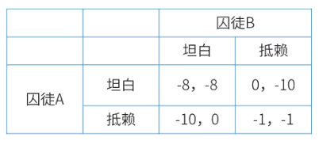

🟡甲、乙两个独立网站靠广告收入发展，当前都以较高价格销售广告。双方都想通过降价获取更多客户和利润。现有策略下，两网站各获1000万元利润。若一方单独降价，能得1500万元利润，另一方利润降至200万元。若双方同时降价，都只能得到700万元利润。问题是，两网站主管经独立理性分析后，会决定采取什么策略？

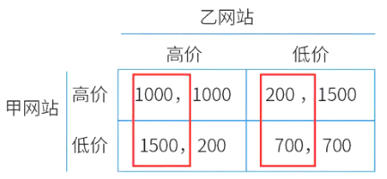

## 状态转移矩阵

🟡假设市场上一种商品有A、B两个品牌，目前市场占有率均为50%。依据历史经验，该商品当月与下月市场占有率变化可用转移矩阵P描述：
$$
P =
\begin{pmatrix}
p(A \to A) & p(A \to B) \\
p(B \to A) & p(B \to B)
\end{pmatrix}
=
\begin{pmatrix}
0.8 & 0.2 \\
0.4 & 0.6
\end{pmatrix}
$$
其中，$p(A \to B)$ 是A的市场占有份额中转移给B的概率，依此类推。问题是，2个月后这种商品的市场占有率变化情况是怎样的，选项有：
A. A的份额增加了10%，B的份额减少了10%
B. A的份额减少了10%，B的份额增加了10%
C. A的份额增加了14%，B的份额减少了14%
D. A的份额减少了14%，B的份额增加了14%

这是在计算某种商品两个品牌A和B在两个月内市场占有率的变化情况：

- 第1个月后：
品牌A的市场占有率为$50\% \times 0.8 + 50\% \times 0.4 = 60\%$；
品牌B的市场占有率为$1 - 60\% = 40\%$。
- 第2个月后：
品牌A的市场占有率为$60\% \times 0.8 + 40\% \times 0.4 = 64\%$；
品牌B的市场占有率为$1 - 64\% = 36\%$ 。

某类产品的$n$种品牌在地区的市场占有率用概率向量$u = (u_1, u_2, \cdots, u_n)$表示（各分量非负且总和为$1$），其变化常用$n\times n$转移矩阵表示。初始市场占有率向量为$u$，后续时刻分别是$uP$、$uP^2$等。若长时间内转移矩阵元素为常数，市场占有率会稳定到概率向量$z$，满足$zP = z$ ，且与初始占有率无关。

假设某地区冰箱品牌$A$与$B$，每月市场占有率变化由常数转移矩阵描述，问题是品牌$A$与$B$最终稳定的市场占有率是多少，选项有A. $(1/4, 3/4)$ 、B. $(1/3, 2/3)$ 、C. $(1/2, 1/2)$ 、D. $(2/3, 1/3)$ ，转移矩阵为：
\[
P =
\begin{pmatrix}
0.8 & 0.2 \\
0.4 & 0.6
\end{pmatrix}
\]

## 不确定型决策

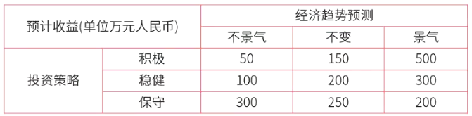

这是关于几种决策准则及其说明的内容：

- 乐观主义准则：也叫maxmax准则，秉持“大中取大”，决策时乐观冒险，不放弃获最好结果的机会。从决策表各方案在不同状态的结果中找最大的，再从中选最大者。

    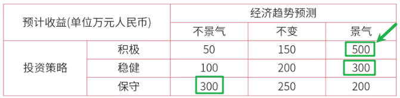

- 悲观主义准则：即maxmin准则，遵循“小中取大”，决策时悲观保守，在最坏结果中选最好的。先从各方案不同状态结果选最小的列在表最右列，再从中选最大者。

    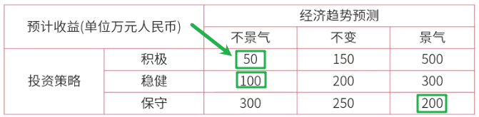

- 折中主义准则：Harwicz准则，不极端乐观或悲观，用折中系数α（$0\leqα\leq1$ ）平衡。公式为$cv_i =α\times max\{a_{ij}\}+(1 -α)\times min\{a_{ij}\}$ ，比较各$cv_i$ ，选最大值对应的方案。
- 等可能准则：Laplace准则，在无法确定各自然状态出现概率时，将其都定为$1/n$ ，按EMV（期望货币值）决策。

    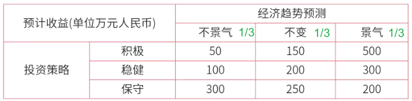

    - 第一组：$50\times\frac{1}{3} + 150\times\frac{1}{3} + 500\times\frac{1}{3}=\frac{700}{3}$
    - 第二组：$100\times\frac{1}{3} + 200\times\frac{1}{3} + 300\times\frac{1}{3}=\frac{600}{3}$
    - 第三组：$300\times\frac{1}{3} + 250\times\frac{1}{3} + 200\times\frac{1}{3}=\frac{750}{3}$

- 后悔值准则：Savage准则，把各自然状态的最大收益值（损失矩阵取最小值）当理想目标，该状态其他值与最大值的差为后悔值。决策原则是让最大后悔值最小（minmax，大中取小，最小最小后悔值） 。

    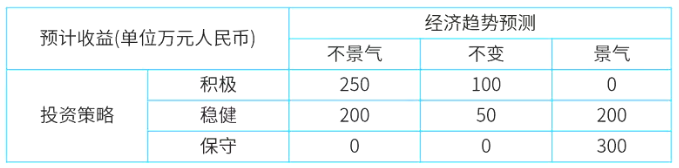

## 决策树

🟡某电子商务公司需从A地向B地用户发送一批价值90000元的货物，A地到B地有陆路和水路两条运输路线。走陆路较为安全，运输成本是10000元；走水路一般成本为7000元，但遇到暴风雨天气，会造成货物总价值10%的损失，且根据历年情况，此间出现暴风雨天气的概率为1/4。问题是该公司该怎么选择运输路线 。

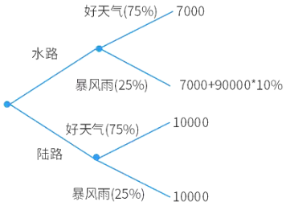

$7000×0.75+(7000 + 90000×10\%)×0.25$计算结果为9250 。

$10000×0.75 + 10000×0.25$ ，得出结果为10000 。

在评估和选择最佳系统设计方案时，甲提出用点值评估法，按价值因素重要性综合打分选最优方案。乙据此对系统A和B进行评估（未给出具体表格）。问题是乙会认为以下哪个选项正确，选项有A. 最佳方案是A ；B. 最佳方案是B ；C. 条件不足，不能得出结论 ；D. 只能用成本/效益分析方法做出判断 。

|评估因素|重要性占比|系统A评估值|系统B评估值|
| ---- | ---- | ---- | ---- |
|硬件|35%|95|75|
|软件|40%|70|95|
|供应商支持|25%|85|90|

A系统：`95*35%+70*40%+85*25%=82.5`
B系统：`75*35%+95*40%+90*25%=86.75`

某企业计划建设电子商务系统，有四种可选方式：①企业自行从头开发；②复用已有的构件来构造；③购买现成的软件产品；④承包给专业公司开发。项目经理给出了相应的决策树（未展示）。问题是管理者选择建设方式的最佳决策是什么，选项有A. 企业自行从头开发 ；B. 复用已有的构件来构造 ；C. 购买现成的软件产品 ；D. 承包给专业公司开发 。

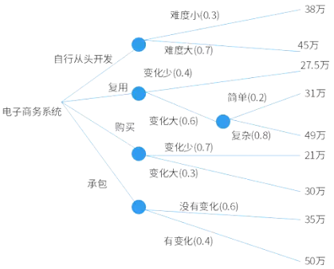

1. 自行从头开发：`0.3*38+0.7*45=11.4+31.5=42.9`
2. 复用：`0.4*27.5+(0.6*0.2*31+0.6*0.8*49)=11+(3.72+23.52)=38.24`
3. 购买：`0.7*21+0.3*30=14.7+9=23.7`
3. 承包：`0.6*35+0.4*50=21+20=41`

生产某种产品有两个建厂方案：
(1) 建大厂，初期投资500万元。产品销路好时每年获利200万元，销路不好时每年亏损20万元。
(2) 建小厂，初期投资200万元。产品销路好时每年获利100万元，销路不好时每年获利20万元。

市场调研显示，未来2年该产品销路好的概率是70%。若这2年销路好，后续5年销路好的概率升至80%；若这2年销路不好，后续5年销路好的概率仅10% 。问题是为获得7年最大总收益，决策者应如何选择，选项有：
A. 建大厂，总收益超500万元
B. 建大厂，总收益略多于300万元
C. 建小厂，总收益超500万元
D. 建小厂，总收益略多于300万元

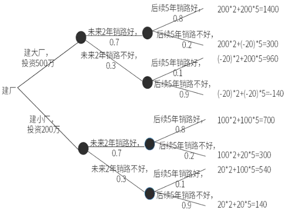

这是分别计算建大厂和建小厂7年总收益的过程及结果：

- 建大厂：
    - $1400×0.7×0.8 = 784$
    - $300×0.7×0.2 = 42$
    - $960×0.3×0.1 = 28.8$
    - $-140×0.3×0.9 = -37.8$
    - 最终总收益为$784 + 42 + 28.8 - 37.8 - 500 = 317$（500为建大厂初期投资）。
- 建小厂：
    - $700×0.56 = 392$
    - $300×0.14 = 42$
    - $540×0.03 = 16.2$（这里原答案5540可能有误，推测为540）
    - $140×0.27 = 37.8$
    - 最终总收益为$392 + 42 + 16.2 + 37.8 - 200 = 288$（200为建小厂初期投资） 。

## 蒙特卡罗方法

蒙特卡罗（Monte Carlo）方法由冯·诺依曼、乌拉姆等人发明，因赌场而得名，是一类基于概率的方法的统称。

### 工作原理

使用随机数来解决计算问题。不断抽样，逐渐逼近，采样越多，越近似最优解。例如民意调查，π的计算。

### 应用案例

扇形面积=$\frac{\pi*r^{2}}{4}$，正方形面积=$r^{2}$，扇形面积/正方形面积=$\frac{\frac{\pi*r^{2}}{4}}{r^{2}} = \frac{\pi}{4}$。

现往正方形内随机打点，在扇形内点的概率=扇形面积/正方形面积=$\frac{\pi}{4}$，即可求得$\pi$=概率*4。

🔒问题

1. 🟡为近似计算XYZ三维空间内由三个圆柱x²+y²≤1，y²+z²≤1，x²+z²≤1相交部分V的体积，以下四种方案中，______最容易理解，最容易编程实现。

    - A.在z＝0平面中的圆上x²+y²≤1，近似计算二重积分
    - B.画出V的形状，将其分解成多个简单形状，分别计算体积后，再求和
    - C.将V看作多个区域的交集，利用有关并集、差集的体积计算交集体积
    - D.V位于某正立方体M内，利用M内均匀分布的随机点落在V中的比例进行计算
    答案：D
    解析：选项D本质上是用蒙特卡罗方法计算三维体积。在计算机上利用伪随机数，很容易取得正立方体(x，y，z)在区间[-1,1]内均匀分布的随机点，也很容易判断该点是否位于V内。对大量的随机点，很容易统计在该正立方体中的随机点位于V中的比例。该比例值的8倍就近似地等于V的体积。

## 数学建模

数学建模是对现实世界的一种近似的、简化的、易于求解的抽象描述。通过抽象和简化，建立能近似刻画并解决实际问题的模型。

### 数学建模过程

1. 模型准备：了解问题的实际背景，明确其实际意义，掌握对象的各种信息。用数学语言来描述问题。
2. 模型假设：根据实际对象的特征和建模的目的，对问题进行必要的简化，并用精确的语言提出一些恰当的假设。
3. 模型建立：在假设的基础上，利用适当的数学工具来刻画各变量之间的数学关系，建立相应的数学结构。只要能够把问题描述清楚，尽量使用简单的数学工具。
4. 模型求解：利用获取的数据资料，对模型的所有参数做出计算（估计）。
5. 模型分析：对所得的结果进行数学上的分析。如敏感性分析：测试模型对参数变化的敏感性。对计算结果进行检验，分析计算结果对参数变化的反应程度。
6. 模型检验：将模型分析结果与实际情形进行比较，以此来验证模型的准确性、合理性和适用性。如果模型与实际较吻合，则要对计算结果给出其实际含义，并进行解释。如果模型与实际吻合较差，则应该修改假设，再次重复建模过程。
7. 模型应用：将模型应用于新的数据集或场景中，以进行预测或决策支持。应用方式因问题的性质和建模的目的而异。

### 数学建模方法

- 直接分析法：根据对问题直接的内在的认识，直接构造出模型。
- 类比法：根据之前类似的模型构造出一个新的模型。
- 数据分析法：通过实验获得与问题相关的大量数据，用统计分析的方法来进行建模。
- 构想法：对将来可能发生的情况给出逻辑上合理的方法和描述，而后用现有的方法来建模，不断地完善。

### 数学建模原则

- 需要在简单性和准确性之间求得平衡
- 对同一问题可以建立多种数学模型。数学模型也常带有一些可变的参数。选用哪个模型，或选择什么样的参数，这需要反复多次试验，根据求解失败的教训或用户的反馈意见逐步对模型进行修正或改进，逐步完善模型。

🔒问题

1. 🟡数学模型常带有多个参数，而参数会随环境因素而变化。根据数学模型求出最优解或满意解后，还需要进行______，对计算结果进行检验，分析计算结果对参数变化的反应程度。

    - A.一致性分析
    - B.准确性分析
    - C.灵敏性分析
    - D.似然性分析

    答案：C
