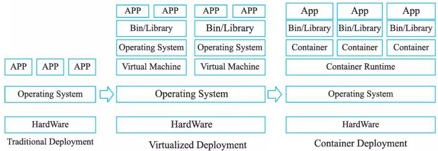
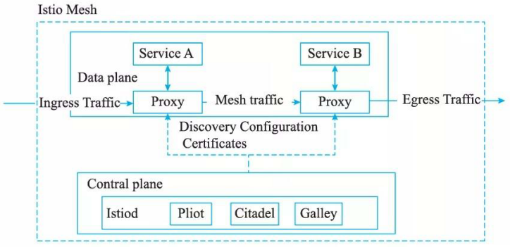

# 云原生架构相关技术
## 最佳实践

### 考察问

1. 定义: 将云应用中的`()`业务代码部分进行最大化的剥离，从而让`()`(IaaS和PaaS)接管应用中原有的大量`()`(如弹性、韧性、安全、可观测性、灰度等). 
2. 组成: 
    1. `()`模式：每个接口可以部署不同数量的实例，单独扩缩容，从而使得整体的部署更经济。
    2. `()`模式: 但并非真的没有服务器，而是将服务器的运维管理等工作交给云厂商。
    3. `()`: 一个大操作由多个分布在不同服务器、属于不同应用的小操作组成，需保证这些小操作要么全部成功，要么全部失败 ，以此保障数据库的数据一致性和原子性。比如比如用户信息和订单信息分别存于两个 MySQL 实例，删除用户信息时需同时删其订单信息，因操作涉及不同数据库实例，会产生分布式事务。

### 考察点

1. 定义: 将云应用中的`非功能`业务代码部分进行最大化的剥离，从而让`云设施`(IaaS和PaaS)接管应用中原有的大量`非功能`业务特性(如弹性、韧性、安全、可观测性、灰度等). 
2. 组成:  
    1. `微服务`模式：每个接口可以部署不同数量的实例，单独扩缩容，从而使得整体的部署更经济。
    2. `无服务`模式:但并非真的没有服务器，而是将服务器的运维管理等工作交给云厂商。
    3. `分布式事务`: 一个大操作由多个分布在不同服务器、属于不同应用的小操作组成，需保证这些小操作要么全部成功，要么全部失败 ，以此保障数据库的数据一致性和原子性。比如比如用户信息和订单信息分别存于两个 MySQL 实例，删除用户信息时需同时删其订单信息，因操作涉及不同数据库实例，会产生分布式事务。
## 容器技术

### 容器技术的背景与价值

容器作为标准化软件单元，它将应用及其所有依赖项打包，使应用不再受环境限制，在不同计算环境间快速、可靠地运行。容器部署模式与其他模式的比较如图 14-3 所示。

虽然 2008 年 Linux 提供了 Cgroups 资源管理机制、 Linux Name  Space 视图隔离方案，让应用得以运行在独立沙箱环境中，避免相互间冲突与影响；但直到 Docker 容器引擎的开源，才很大程度上降低了容器技术的使用复杂性，加速了容器技术普及。 Docker 容器基于操作系统虚拟化技术，共享操作系统内核、轻量、没有资源损耗、秒级启动，极大提升了系统的应用部署密度和弹性。更重要的是， Docker 提出了创新的应用打包规范-Docker 镜像，解耦了应用与运行环境，使应用可以在不同计算环境一致、可靠地运行。借助容器技术呈现了一个优雅的抽象场景：让开发所需要的灵活性、开放性和运维所关注的标准化、自动化达成相对平衡。容器镜像迅速成为了应用分发的工业标准。

随后开源的 Kubemetes, 凭借优秀的开放性、可扩展性以及活跃开发者社区，在容器编排之战中脱颖而出，成为分布式资源调度和自动化运维的事实标准。 Kubemetes 屏蔽了 IaaS 层基础架构的差异并凭借优良的可移植性，帮助应用一致地运行在包括数据中心、云、边缘计算在内的不同环境。企业可以通过 Kubernet es, 结合自身业务特征来设计自身云架构，从而更好地支持多云／混合云，免去被厂商锁定的顾虑。伴随着容器技术逐步标准化，进一步促进了容器生态的分工和协同。基千 Kubemetes, 生态社区开始构建上层的业务抽象，比如服务网格 Istio 、机器学习乎台 Kubeflow 、无服务器应用框架 Knative 等。

### 容器编排

Kubernetes 已经成为容器编排的事实标准，被广泛用于自动部署，扩展和管理容器化应用。Kubernetes 提供了分布式应用管理的核心能力。

1. 资源调度：根据应用请求的资源量CPU、 Memory,或者 GPU等设备资源，在集群中选择合适的节点来运行应用。
2. 应用部署与管理：支持应用的自动发布与应用的回滚，以及与应用相关的配置的管理；也可以自动化存储卷的编排，让存储卷与容器应用的生命周期相关联。
3. 自动修复： Kubernetes 能监测这个集群中所有的宿主机，当宿主机或者OS 出现故障，节点健康检查会自动进行应用迁移； K8s 也支持应用的自愈，极大简化了运维管理的复杂性。
4. 服务发现与负载均衡：通过Servi ce 资源出现各种应用服务，结合DNS和多种负载均衡机制，支持容器化应用之间的相互通信。
5. 弹性伸缩： K8s可以监测业务上所承担的负载，如果这个业务本身的CPU利用率过高，或者响应时间过长，它可以对这个业务进行自动扩容。Kubemetes 的控制平面包含四个主要的组件： APIServer 、 Controller 、 Scheduler 以及 etcd 。
6. 声明式API: 开发者可以关注于应用自身，而非系统执行细节。比如Deployment(无状态应用)、 S tatefulSet(有状态应用)、Job (任务类应用)等不同资源类型，提供了对不同类型工作负载的抽象；对Kubemetes 实现而言，基于声明式API 的 “level-triggered"实现比 “edge-triggered" 方式可以提供更加健壮的分布式系统实现。
7. 可扩展性架构：所有K8s组件都是基于一致的、开放的API实现和交互；三方开发者也可通过CRD (Cus tom Resource Definiti on)  /Op erator等方法提供领域相关的扩展实现，极大提升了 K8s 的能力。
8. 可移植性： K8s 通过一系列抽象如Load Balance  Service (负载均衡服务)、 CNI (容器网络接口)、 CSI (容器存储接口)，帮助业务应用可以屏蔽底层基础设施的实现差异，实现容器灵活迁移的设计目标。

## 云原生微服务

### 微服务发展背景

过去开发一个后端应用最为直接的方式就是通过单一后端应用提供并集成所有的服务，即单体模式。随着业务发展与需求不断增加，单体应用功能愈发复杂，参与开发的工程师规模可能由最初几个人发展到十几人，应用迭代效率由于集中式研发、测试、发布、沟通模式而显著下滑。为了解决由单体应用模型衍生的过度集中式项目迭代流程，微服务模式应运而生。

微服务模式将后端单体应用拆分为松耦合的多个子应用，每个子应用负责一组子功能。这些子应用称为“微服务”，多个“微服务”共同形成了一个物理独立但逻辑完整的分布式微服务体系。这些微服务相对独立，通过解耦研发、测试与部署流程，提高整体迭代效率。此外，微服务模式通过分布式架构将应用水平扩展和冗余部署，从根本上解决了单体应用在拓展性和稳定性上存在的先天架构缺陷。但也要注意到微服务模型也面临着分布式系统的典型挑战：如何高效调用远程方法、如何实现可靠的系统容量预估、如何建立负载均衡体系、如何面向松耦合系统进行集成测试、如何面向大规模复杂关联应用的部署与运维。

在云原生时代，云原生微服务体系将充分利用云资源的高可用和安全体系，让应用获得更有保障的弹性、可用性与安全性。应用构建在云所提供的基础设施与基础服务之上，充分利用云服务所带来的便捷性、稳定性，降低应用架构的复杂度。云原生的微服务体系也将帮助应用架构全面升级，让应用天然具有更好的可观测性、可控制性、可容错性等特性。

### 微服务设计约束

相较于单体应用，微服务架构的架构转变，在提升开发、部署等环节灵活性的同时，也提升了在运维、监控环节的复杂性。设计一个优秀的微服务系统应遵循以下设计约束：

1. 微服务个体约束

    一个设计良好的微服务应用，所完成的功能在业务域划分上应是相互独立的。与单体应用强行绑定语言和技术栈相比，这样做的好处是不同业务域有不同的技术选择权，比如推荐系统采用 Python 实现效率可能比Java 要高效得多。从组织上来说，微服务对应的团队更小，开发效率也更高。”一个微服务团队一顿能吃掉两张披萨饼”“一个微服务应用应当能至少两周完成一次迭代”，都是对如何正确划分微服务在业务域边界的隐喻和标准。总结来说，微服务的“微＂并不是为了微而微，而是按照问题域对单体应用做合理拆分。

    进一步，微服务也应具备正交分解特性，在职责划分上专注于特定业务并将之做好，即SOLID 原则中单一职责原则( S i ngle Responsibility Principle,  SRP) 。如果当一个微服务修改或者发布时，不应该影响到同一系统里另一个微服务的业务交互。

2. 微服务与微服务之间的横向关系

    在合理划分好微服务间的边界后，主要从微服务的可发现性和可交互性处理服务间的横向关系。微服务的可发现性是指当服务 A 发布和扩缩容的时候，依赖服务 A 的服务 B 如何在不重新发布的前提下，如何能够自动感知到服务 A 的变化？这里需要引入第三方服务注册中心来满足服务的可发现性；特别是对于大规模微服务集群，服务注册中心的推送和扩展能力尤为关键。微服务的可交互性是指服务 A 采用什么样的方式可以调用服务 B 。由于服务自治的约束，服务之间的调用需要采用与语言无关的远程调用协议，比如 REST 协议很好地满足了”与语言无关”和“标准化”两个重要因素，但在高性能场景下，基于 IDL 的二进制协议可能是更好的选择。另外，目前业界大部分微服务实践往往没有达到 HATEOAS 启发式的 REST 调用，服务与服务之间需要通过事先约定接口来完成调用。为了进一步实现服务与服务之间的解耦，微服务体系中需要有一个独立的元数据中心来存储服务的元数据信息，服务通过查询该中心来理解发起调用的细节。伴随着服务链路的不断变长，整个微服务系统也就变得越来越脆弱，因此面向失败设计的原则在微服务体系中就显得尤为重要。对千微服务应用个体，限流、熔断、隔仓、负载均衡等增强服务韧性的机制成为了标配。为进一步提升系统吞吐能力、充分利用好机器资源，可以通过协程、 Rx 模型、异步调用、反压等手段来实现。

3. 微服务与数据层之间的纵向约束

    在微服务领域，提倡数据存储隔离 (Data Storage  Segregation,  DSS) 原则，即数据是微服务的私有资产，对于该数据的访问都必须通过当前微服务提供的 API 来访问。如若不然，则造成数据层产生耦合，违背了高内聚低耦合的原则。同时，出于性能考虑，通常采取读写分离(CQRS) 手段。同样，由于容器调度对底层设施稳定性的不可预知影响，微服务的设计应当尽量遵循无状态设计原则，这意味着上层应用与底层基础设施的解耦，微服务可以自由在不同容器间被调度。对千有数据存取(即有状态)的微服务而言，通常使用计算与存储分离方式，将数据下沉到分布式存储，通过这个方式做到一定程度的无状态化。

4. 全局视角下的微服务分布式约束

    从微服务系统设计一开始，就需要考虑以下因素：高效运维整个系统，从技术上要准备全自动化的 CI/CD 流水线满足对开发效率的诉求，并在这个基础上支持蓝绿、金丝雀等不同发布策略，以满足对业务发布稳定性的诉求。面对复杂系统，全链路、实时和多维度的可观测能力成为标配。为了及时、有效地防范各类运维风险，需要从微服务体系多种事件源汇聚并分析相关数据，然后在中心化的监控系统中进行多维度展现。伴随着微服务拆分的持续，故障发现时效性和根因精确性始终是开发运维人员的核心诉求。

### 主要微服务技术

Apache Dubbo 作为源自阿里巴巴的一款开源高性能 RPC 框架，特性包括基千透明接口的RPC 、智能负载均衡、自动服务注册和发现、可扩展性高、运行时流量路由与可视化的服务治理。经过数年发展已是国内使用最广泛的微服务框架并构建了强大的生态体系。为了巩固 Dubbo生态的整体竞争力， 2018 年阿里巴巴陆续开源了 Spring Cloud Alibaba (分布式应用框架)、 Nacos(注册中心＆配置中心)、 Sentinel (流控防护)、 Seata(分布式事务)、 Chaosblade (故障注入)，以便让用户享受阿里巴巴十年沉淀的微服务体系，获得简单易用、高性能、高可用等核心能力。Dubbo 在 v3 中发展服务网格( ServiceMesh), 目前 Dubbo 协议已经被 Envoy支待，数据层选址、负载均衡和服务治理方面的工作还在继续，控制层目前在继续丰富 Istio/Pilot-discovery中。

Spring Cloud 作为开发者的主要微服务选择之一，为开发者提供了分布式系统需要的配置管理、服务发现、断路器、智能路由、微代理、控制总线、一次性 Token 、全局锁、决策竞选、分布式会话与集群状态管理等能力和开发工具。

## 无服务器技术

### 技术特点

随着以 Kubemetes 为代表的云原生技术成为云计算的容器界面， Kubemetes 成为云计算的新一代操作系统。面向特定领域的后端云服务 (BaaS) 则是这个操作系统上的服务 API ，存储、数据库、中间件、大数据、 AI 等领域的大量产品与技术都开始提供全托管的云形态服务，如今越来越多用户已习惯使用云服务，而不是自己搭建存储系统、部署数据库软件。

当这些 BaaS 云服务日趋完善时，无服务器技术 (Serverless) 因为屏蔽了服务器的各种运维复杂度，让开发人员可以将更多精力用于业务逻辑设计与实现，而逐渐成为云原生主流技术之一。 Serverless 计算包含以下特征：

(1)全托管的计算服务，客户只需要编写代码构建应用，无需关注同质化的、负担繁重的基千服务器等基础设施的开发、运维、安全、高可用等工作；
(2) 通用性，结合云 BaaSAPI 的能力，能够支撑云上所有重要类型的应用；
(3) 自动弹性伸缩，让用户无需为资源使用提前进行容量规划；
(4) 按量计费，让企业使用成本得有效降低，无需为闲置资源付费。

函数计算 (Function as a Service,  Faas) 是 Serverless 中最具代表性的产品形态。通过把应用逻辑拆分多个函数，每个函数都通过事件驱动的方式触发执行，例如，当对象存储( OSS)中产生的上传／删除对象等事件，能够自动、可靠地触发 FaaS 函数处理且每个环节都是弹性和高可用的，客户能够快速实现大规模数据的实时并行处理。同样，通过消息中间件和函数计算的集成，客户可以快速实现大规模消息的实时处理。

目前函数计算这种 Serverless 形态在普及方面仍存在一定困难，例如：

(1)函数编程以事件驱动方式执行，这在应用架构、开发习惯方面，以及研发交付流程上都会有比较大的改变；
(2) 函数编程的生态仍不够成熟，应用开发者和企业内部的研发流程需要重新适配；
(3) 细颗粒度的函数运行也引发了新技术挑战，比如冷启动会导致应用响应延迟，按需建立数据库连接成本高等。

针对这些情况，在 Serverless 计算中又诞生出更多其他形式的服务形态，典型的就是和容器技术进行融合创新，通过良好的可移植性，容器化的应用能够无差别地运行在开发机、自建机房以及公有云环境中；基于容器工具链能够加快解决 Serverless 的交付。云厂商如阿里云提供了弹性容器实例( ECI) 以及更上层的 Serverless 应用引擎( SAE), Google 提供了 CloudRun 服务，这都帮助用户专注于容器化应用构建，而无需关心基础设施的管理成本。此外 Google 也开源了基于 Kubemetes 的 Serverless 应用框架 Knative 。

相对函数计算的编程模式，这类 Serverless 应用服务支持容器镜像作为载体，无需修改即可部署在 Serverless 环境中，可以享受 Serverless 带来的全托管免运维、自动弹性伸缩、按量计费等优势。

### 技术关注点

1. 计算资源弹性调度

    为了实现精准、实时的实例伸缩和放置，必须把应用负载的特征作为资源调度依据，使用“白盒“调度策略，由 Serverless 平台负责管理应用所需的计算资源。平台要能够识别应用特征，在负载快速上升时，及时扩容计算资源，保证应用性能稳定；在负载下降时，及时回收计算资源，加快资源在不同租户函数间的流转，提高数据中心利用率。因此更实时、更主动、更智能的弹性伸缩能力是函数计算服务获得良好用户体验的关键。通过计算资源的弹性调度，帮助用户完成指标收集、在线决策、离线分析、决策优化的闭环。在创建新实例时，系统需要判断如何将应用实例放置在下层计算节点上。放置算法应当满足如下多方面的目标。

    (1) 容错：当有多个实例时，将其分布在不同的计算节点和可用区上，提高应用的可用性。
    (2) 资源利用率：在不损失性能的前提下，将计算密集型、I/0 密集型等应用调度到相同计算节点上，尽可能充分利用节点的计算、存储和网络资源。动态迁移不同节点上的碎片化实例，进行“碎片整理”，提高资源利用率。
    (3) 性能：例如复用启动过相同应用实例或函数的节点、利用缓存数据加速应用的启动时间。
    (4) 数据驱动：除了在线调度，系统还将天、周或者更大时间范围的数据用于离线分析。离线分析的目的是利用全量数据验证在线调度算法的效果，为参数调优提供依据，通过数据驱动的方式加快资源流转速度，提高集群整体资源利用率。

2. 负载均衡和流控

    资源调度服务是 Serverless 系统的关键链路。为了支撑每秒近百万次的资源调度请求，系统需要对资源调度服务的负载进行分片，横向扩展到多台机器上，避免单点瓶颈。分片管理器通过监控整个集群的分片和服务器负载情况，执行分片的迁移、分裂、合并操作，从而实现集群处理能力的横向扩展和负载均衡。在多租户环境下，流量隔离控制是保证服务质量的关键。由于用户是按实际使用的资源付费，因此计算资源要通过被不同用户的不同应用共享来降低系统成本。这就需要系统具备出色的隔离能力，避免应用相互干扰。

3. 安全性

    Serverless 计算平台的定位是通用计算服务，要能执行任意用户代码，因此安全是不可逾越的底线。系统应从权限管理、网络安全、数据安全、运行时安全等各个维度全面保障应用的安全性。轻量安全容器等新的虚拟化技术实现了更小的资源隔离粒度、更快的启动速度、更小的系统开销，使数据中心的资源使用变得更加细粒度和动态化，从而更充分地利用碎片化资源。

## 服务网格

### 技术特点

服务网格 (ServiceMesh) 是分布式应用在微服务软件架构之上发展起来的新技术，旨在将那些微服务间的连接、安全、流量控制和可观测等通用功能下沉为平台基础设施，实现应用与平台基础设施的解耦。这个解耦意味着开发者无需关注微服务相关治理问题而聚焦于业务逻辑本身，提升应用开发效率并加速业务探索和创新。换句话说，因为大量非功能性从业务进程剥离到另外进程中，服务网格以无侵入的方式实现了应用轻量化，图 14-4展示了服务网格的典型架构。

在这张架构图中，服务 A 调用服务 B 的所有请求，都被其下的服务代理截获，代理服务A 完成到服务 B 的服务发现、熔断、限流等策略，而这些策略的总控是在控制平面 (ControlPlane) 上配置。

从架构上，以开源的 Isti o 服务网格为例，其可以运行在虚拟机或容器中， Istio 的主要组件包括 P i lot(服务发现、流量管理)、 Mixer (访问控制、可观测性)、 Citadel (终端用户认证、流量加密)；整个服务网格关注连接和流量控制、可观测性、安全和可运维性。虽然相比较没有服务网格的场景多了 4 个 IPC 通信的成本，但整体调用的延迟随着软硬件能力的提升而并不会带来显著的影响，特别是对于百毫秒级别的业务调用而言可以控制在 2％以内。从另一方面，服务化的应用并没有做任何改造，就获得了强大的流量控制能力、服务治理能力、可观测能力、 4个 9 (99.99%) 以上高可用、容灾和安全等能力，加上业务的横向扩展能力，整体收益仍然是远大千额外 IPC 通信支出。

服务网格的技术发展上数据平面与控制平面间的协议标准化是必然趋势。大体上，服务网格的技术发展围绕着事实标准去展开－~从接口规范的角度： Isti o 采纳了 Envoy所实现的 xDS 协议，将该协议当作是数据平面和控制平面间的标准协议；Microso ft提出了 SMI (Serv ice Mesh  Interface), 致力千让数据平面和控制乎面的标准化做更高层次的抽象，以期为 Istio 、 Linkerd 等服务网格解决方案在服务观测、流量控制等方面实现最大程度的开源能力复用。 UDPA (Un iversal  Data Plane API) 是基千 xDS 协议而发展起来，以便根据不同云厂商的特定需求便捷地进行扩展并由 xDS 去承载。

此外数据平面插件的扩展性和安全性也得到了社区的广泛重视。从数据平面角度， Envoy得到了包括 Google 、 IBM 、 Ci sco 、 Mi croso ft、阿里云等大厂的参与共建以及主流云厂商的采纳而成为了事实标准。在 Envoy的软件设计为插件机制提供了良好扩展性的基础之上，目前正在探索将 Wasm 技术运用于对各种插件进行隔离，避免因为某一插件的软件缺陷而导致整个数据平面不可用。 Wasm 技术的优势除了提供沙箱功能外，还能很好地支持多语言，最大程度地让掌握不同编程语言的开发者可以使用自己所熟悉的技能去扩展 Envoy的能力。在安全方面，服务网格和零信任架构天然有很好的结合，包括 PODIdentity、基于 mTLS 的链路层加密、在 RPC 上实施 RBAC 的 ACL 、基于 Identity的微隔离环境(动态选取一组节点组成安全域)。

### 主要技术

2017 年发起的服务网格 Istio 开源项目，清晰定义了数据平面(由开源软件 Envoy承载)和管理平面 (Istio 自身的核心能力)。 Istio 为微服务架构提供了流量管理机制，同时亦为其他增值功能(包括安全性、监控、路由、连接管理与策略等)创造了基础。 Istio 利用久经考验的LyftEnvoy代理进行构建，可在无需对应用程序代码作出任何发动的前提下实现可视性与控制能力。 2019 年 Isti o 所发布的1. 12 版已达到小规模集群上线生产环境水平，但其性能仍受业界诉病。开源社区正试图通过架构层面演进改善这一问题。由于 Isti o 是建构于 Kubernetes 技术之上的，所以它当然可运行千提供 Kubernetes 容器服务的云厂商环境中，同时 Isti o 成为了大部分云厂商默认使用的服务网格方案。

除了 Istio 外，也有 Linkerd 、 Consul 这样相对小众的 Serv i ceMesh 解决方案。 Linkerd 在数据平面采用了 Rust编程语言实现了linkerd-proxy,控制平面与 Istio 一样采用 Go 语言编写。最新的性能测试数据显示， Linkerd 在时延、资源消耗方面比 Istio 更具优势。 Consul 在控制面上直接使用 ConsulServer, 在数据面上可以选择性地使用 Envoy。与 Istio 不同的是， Linkerd 和Consul 在功能上不如 Isti o 完整。

Conduit作为 Kubernetes 的超轻量级 Servi ceMesh, 其目标是成为最快、最轻、最简单且最安全的 ServiceMesh 。它使用 Rust构建了快速、安全的数据平面，用 Go 开发了简单强大的控制平面，总体设计围绕着性能、安全性和可用性进行。它能透明地管理服务之间的通信，提供可测性、可靠性、安全性和弹性的支持。虽然与 Linkerd 相仿，数据平面是在应用代码之外运行的轻量级代理，控制平面是一个高可用的控制器，然而与 Linkerd 不同的是， Conduit的设计更加倾向千 Kubemetes 中的低资源部署。

