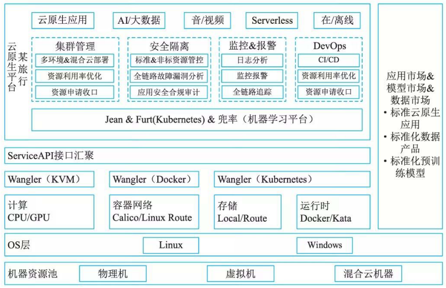
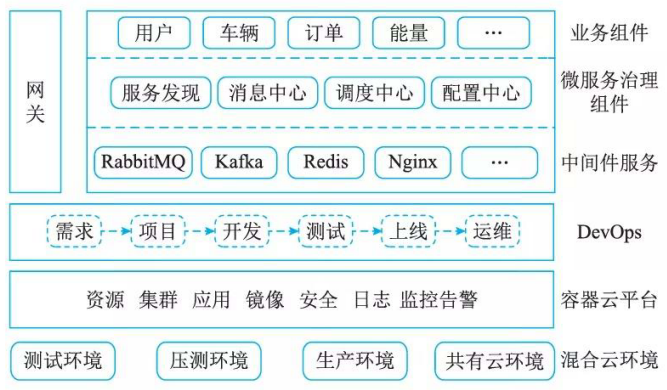
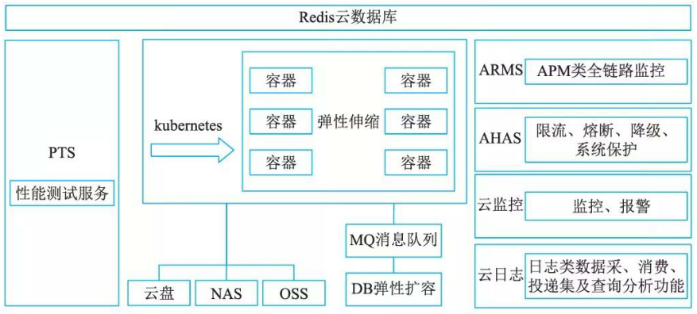
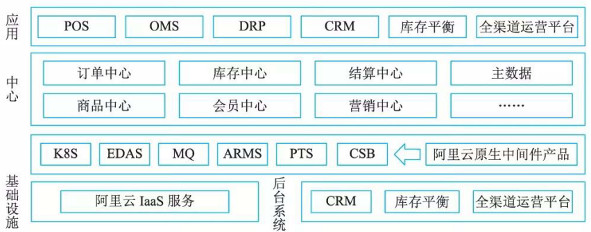

# 4云原生架构案例分析

## 某旅行公司云原生改造

### 背景和挑战

2019年，某旅行公司主要面临两个问题。首先，由于刚和某网完成公司主体合并不久，两个前身公司各自存在着不同技术体系的构建、发布等系统，这些系统随着公司业务的逐步整合，也必须在技术层面做进一步的收敛，以达到平台统一的目的。同时，在线旅行业务具有较明显的业务波动特性，在季度、节假日、每日时段上都有比较突出的波峰波谷特性。这样的业务特性对技术资源的整体利用率波动影响较大。

###  基于云原生架构的解决方案

改造第一阶段，某旅行技术团队为了提升集群资源利用率，降低资源使用成本。利用云原生思维重构部分技术体系，将多套旧有系统合并、收拢到一套以云原生应用为核心的私有云平台上，同时将IDC 、物理网络、虚拟网络、计算资源、存储资源等通过IaaS、PaaS等，实现虚拟化封装、切割、再投产的自动化流程。

基础层面，为了支持IaaS层的网络虚拟化，运维人员选择了Vxlan、大二层技术，并用KVM作为计算资源的切割。在容器网络虚拟化这部分，考虑到要降低损耗，采用了BGP、Host网络模式等技术，同时开发了绑核、 NUMA等相关技术。容器存储方面，远端存储选择了Ceph, 本地层使用块存储设备、NUMA设备等。异构资源侧则采用了GPU改CUDA library的方式来完成虚拟化的切分和分时复用。技术团队将资源调度变成了利用时序数据预测应用规模的方式，提升了资源利用率。

但是在改造完成后服务部署时，有大批量的物理机都出现负载上升的情况，原因是低版本的Java程序无法准确识别容器里的规格，导致GC时频繁发生资源争抢。由于无法确定其他语言是否会出现同样的问题，研发团队开发了垂直扩缩容，确保GC可以使用更多的计算资源。另一方面进行了JVM版本升级，并且还引入了隔离性较强的Kata Container来彻底解决该问题。

第一阶段改造完成后，平台开始服务同程旅行的大部分在线业务。随着服务器集群规模的扩大，部分机器开始频繁出现故障。此时，保障服务稳定性成了第二阶段改造的首要任务。

基于公有云、私有云和离线专属云集群等新型动态计算环境，某旅行公司的技术团队帮助业务构建和运行具有弹性的云原生应用，促进业务团队开始使用声明式API, 同时通过不可变基础设施、服务网格和容器服务，来构建容错性好、易于管理和观察的应用系统，并结合平台可靠的自动化恢复、弹性计算来完成整个服务稳定性的提升。

技术团队将公有云的镜像预热、分发，专线直连内网机房，解决了内网集群需要镜像快速分发等问题，依赖的缓存资源和待久化数据实现了常驻云上，离线资源所在的专有云集群也同步被打通。同时，依托弹性计算能力，团队将集群间资源使用成本降到最低，并将最高服务稳定性的智能化调度平台的服务动态部署在多个集群上。针对业务专有需求和特殊，平台可以输出基础设施API和基础能力API，供业务构建自己的云服务。

为了解决应用出现了明显的卡顿，影响到用户体验的问题，团队通过弹性计算改造为业务快速提供支持，之后又尝试了Scale Zero等方式，最终将该业务的资源使用量降到了之前常备资源的20%。

2021年上半年，某旅行公司进入到云原生改造的第三个阶段。通过基础组件、服务的云原生改造、服务依赖梳理和定义等方式，使应用不再需要考虑底层资源、机房、运行时间和供应商等因素。此外，某旅行公司还利用标准的云原生应用模型，实现了服务的跨地域、跨云自动化灾备、自动部署，并向云原生场景下的DevOps演进。某旅行公司云原生平台架构图如图所示。

### 应用效益

通过第一阶段改造，订单业务从原先独享机器集群切换到了共享机器集群，仅使用之前独享机器集群 40％的机器就完成了对全线服务业务的支撑，同时由于调度算法加入了自研的服务画像技术作为默认调度属性，资源调度的稳定性不降反升。并且同程旅行已实现纳入到该平台部分单机资源利用率提升了20%, 并通过云原生化的旧应用改造，下掉了当时集群内一半的服务器和相应的机房水电资源。

通过第二阶段改造，原本用来应对季节性流量高峰期而采购的机器资源开始减少。通过判断服务当前冗余度来缩容线上服务的实例数，乎台可以用最小的实例数量提供线上服务，而节省下来的资源可以提供给离线业务混合部署使用。并且在不额外新增机器的情况下额外获得的算力，成功支持了屡次创纪录的峰值流量。同时Service Balance系统可以在服务性能受损时自动尝试修复该节点性能，使得平台能够以较低的成本稳定运行。并借用弹性计算成功撑住爆款应用带来的日常流量300％的峰值流量，也顶住了2021年上半年的屡次刷新公司峰值流量，为公司同类业务场景提供了坚实的技术支撑。

## 云原生技术助力某汽车公司数字化转型实践

### 背景和挑战

目前汽车制造处于＂＋互联网”和“互联网＋＂的进程中，面临着互联网业态模式和架构挑战。对业务价值链进行识别，既要满足对产品配置、价格管理、合同管理等稳态业务的支撑，又需要实现商机管理、营销策略、营销管理、电子商务等敏捷业务的快速迭代。两种业态将长期共存。汽车制造正逐渐从传统汽车生产商和销售商，转变为移动服务、自动驾驶和娱乐、车内体验的供应服务商。新的商业模式，要求充分利用创新的技术，融入业务的每一个角落。软件定义汽车的时代即将来临。

某汽车公司自2016年开始引入移动互联网、电商等数字化营销系统，逐步布局汽车后服务市场，为更好更快迎合客户需求变化，掌握市场转换的主动权，对某云行为代表的互联网应用进行全面的推广，通过触点连接客户并提供便捷用车和增值服务。同时，积极开拓在线支付、车联网、二手车交易等新型汽车服务业务场景，积累了丰富的实践经验。充分利用容器、微服务、DevOps云原生转型方法和手段，驱动技术与汽车场景业务深度融合，建立业务与技术之间良性循环。

### 基于云原生架构的解决方案

战略性构建容器云平台。通过平台实现对某云行App、二手车、在线支付、优惠券等核心互联网应用承载。以多租户的形式提供弹性计算、数据待久化、应用发布等面向敏捷业务服务，并实现高水平资源隔离。标准化交付部署，快速实现业务扩展，满足弹性要求。利用平台健康检查、智能日志分析和监控告警等手段及时洞察风险，保障云平台和业务应用稳定运行。

数字混合云交付。采用私有云＋公有云的混合交付模式，按照服务的敏态／稳态特性和管控要求划分部署，灵活调度公有云资源来满足临时突发或短期高TPS业务支撑的需求。利用PaaS平台标准化的环境和架构能力，实现私有云和公有云一致交付体验。

深度融合微服务治理体系，实现架构的革新和能力的沉淀，逐步形成支撑数字化应用的业务中台(其云平台架构如图所示)。通过领域设计、系统设计等关键步骤，对原来庞大的某云体系应用进行微服务拆分，形成能量、社群、用户、车辆、订单等多共享业务服务，同步制定了设计与开发规范、实施路径和配套设施，形成一整套基千微服务的分布式应用架构规划、设计方法论。

DevOps理念贯穿始终。通过DevOps平台规避软件黑盒，从软件生命周期的源头开始把控，实现对核心代码资产的自主、透明管理，避免对开发商的过度依赖。利用DevOps平台的可视化界面，实现全流程自动化、透明化、标准化，实现业务功能迭代变更的核心掌控。

### 应用效益

某汽车公司采用云原生技术在多云环境部署混合云平台，推进某云行体系应用的架构革新。满足多样化的业务上云需求，满足业务高可用、高性能、高扩展性、高伸缩性和高安全性要求，为互联网场景业务开展提供有效支撑。提升不同场景下的互联网业务资源使用效率，同时建立以容器为核心的应用交付和运维管理标准，并制定微服务架构应用管理规范。

加强技术管控，提升交付速度。建立适配某汽车公司的 DevOps 实践规范，配合敏捷化开发模式，通过 DevOps 平台实现快速、持续、可靠、规模化地交付业务应用，应用交付周期从两个月缩短到一个月。

通过敏捷基础架构能力，加快业务创新步伐。持续推进车联网、共享出行等新型场景布局，为某汽车公司数字化转型发展提供有力支撑。

## 某快递公司核心业务系统云原生改造

### 背景和挑战

过往某快递公司的核心业务应用运行在 IDC 机房，原有 IDC 系统帮助某快递公司安稳度过早期业务快速发展期。但伴随着业务体量指数级增长，业务形式愈发多元化。原有系统暴露出不少问题，传统 IOE 架构、各系统架构的不规范、稳定性、研发效率都限制了业务高速发展的可能。软件交付周期过长，大促保障对资源的特殊要求难实现、系统稳定性难以保障等业务问题逐渐暴露。

在与阿里云进行多次需求沟通与技术验证后，某快递公司最终确定阿里云为唯一合作伙伴，采用云原生技术和架构实现核心业务搬迁上阿里云。 2019 年开始将业务逐步从 IDC 迁移至阿里云。目前，核心业务系统已经在阿里云上完成流量承接，为申通提供稳定而高效的计算能力。

### 基千云原生架构的解决方案

某快递公司核心业务系统原架构基千 Vmware+Oracle 数据库进行搭建。随着搬迁上阿里云，架构全面转型为基于 Kubemetes 的云原生架构体系。其中，引入云原生数据库并完成应用基于容器的微服务改造是整个应用服务架构重构的关键点。

1. 引入云原生数据库

    通过引入 OLTP 跟 OLAP 型数据库，将在线数据与离线分析逻辑拆分到两种数据库中，改变此前完全依赖 Oracle 数据库的现状。满足在处理历史数据查询场景下 Oracle 数据库所无法支待的实际业务需求。

2. 应用容器化

    伴随着容器化技术的引进，通过应用容器化有效解决了环境不一致的问题，确保应用在开发、测试、生产环境的一致性。与虚拟机相比，容器化提供了效率与速度的双重提升，让应用更适合微服务场景，有效提升产研效率。

3. 微服务改造

    由于过往很多业务是基于 Oracle 的存储过程及触发器完成的，系统间的服务依赖也需要Oracle 数据库 OGG (Oracle  Golden Gate) 同步完成。这样带来的问题就是系统维护难度高且稳定性差。通过引入 Kubernet es 的服务发现，组建微服务解决方案，将业务按业务域进行拆分，让整个系统更易于维护。

    综合考虑申通实际业务需求与技术特征，最终选择了“阿里云 ACK＋神龙＋云数据库”的云原生解决方案，从而实现核心应用迁移上阿里云。图 14-7 展示了最终的上云架构。

1. 架构阐述。

    基础设施，全部计算资源取自阿里云的神龙裸金属服务器。相较千一般云服务器 (ECS),Kubemetes 搭配神龙服务器能够获得更优性能及更合理的资源利用率。且云上资源按需取量，对千拥有促活动等短期大流量业务场景的申通而言极为重要。相较千线下自建机房、常备机器，云上资源随取随用。在促活动结束后，云上资源使用完毕后即可释放，管理与采购成本更低，相应效率。

    流量接入，阿里云提供两套流量接入，一套是面向公网请求，另外一套是服务内部调用。域名解析采用云 DNS 及 PrivateZone 。借助 Kubemetes 的 Ingress 能力实现统一的域名转发，以节省公网 SLB 的数量，提高运维管理效率。

2. 平台层。

    基于 Kubemetes 打造的云原生 PaaS 平台优势明显突出。

    - 打通DevOps 闭环，统一测试，集成，预发、生产环境；
    - 天生资源隔离，机器资源利用率高；
    - 流量接入可实现精细化管理；
    - 集成了日志、链路诊断、 Metrics平台；
    - 统一APIServer接口和扩展，支持多云及混合云部署。

3. 应用服务层。

    每个应用都在 Kubemetes 上面创建单独的一个 Namespace, 应用和应用之间实现资源隔离。通过定义各个应用的配置 Yaml 模板，当应用在部署时直接编辑其中的镜像版本即可快速完成版本升级，当需要回滚时直接在本地启动历史版本的镜像快速回滚。

4. 运维管理。

    线上 Kubemet es 集群采用阿里云托管版容器服务，免去了运维 Master 结点的工作，只需要制定 Worker 结点上线及下线流程即可。同时业务系统均通过阿里云的 PaaS 平台完成业务日志搜索，按照业务需求投交扩容任务，系统自动完成扩容操作，降低了直接操作 Kubemetes 集群带来的业务风险。

### 应用效益

成本方面：使用公有云作为计算平台，可以让企业不必因为业务突发增长需求，而一次性投入大量资金成本用于采购服务器及扩充机柜。在公共云上可以做到随用随付，对于一些创新业务想做技术调研十分便捷。用完即释放，按量付费。另外云产品都免运维自行托管在云端，有效节省人工运维成本，让企业更专注于核心业务。

稳定性方面：首先，云上产品提供至少 5 个 9 (99.999%) 以上的 SLA 服务确保系统稳定，而自建系统稳定性相去甚远。其次，部分开源软件可能存在功能 Bug,造成故障隐患。最后，在数据安全方面云上数据可以轻松实现异地备份，阿里云数据存储体系下的归档存储产品具备高可靠、低成本、安全性、存储无限等特点，让企业数据更安全。

效率方面：借助与云产品深度集成，研发人员可以完成一站式研发、运维工作。从业务需求立项到拉取分支开发，再到测试环境功能回归验证，最终部署到预发验证及上线，整个持续集成流程耗时可缩短至分钟级。排查问题方面，研发人员直接选择所负责的应用，并通过集成的 SLS 日志控制台快速检索程序的异常日志进行问题定位，免去了登录机器查日志的麻烦。

赋能业务：阿里云提供超过 300 余种的云上组件，组件涵盖计算、 AI 、大数据、 IoT 等诸多领域。研发人员开箱即用，有效节省业务创新带来的技术成本。

## 某电商业务云原生改造

### 背景和挑战

某是一家致力于线上的化妆品销售品牌。伴随着公司业务高速发展，技术运维面临着非常严峻的挑战。伴随着“双 ll“ 电商大促、“双 12” 购物节、小程序、网红直播带货呈现爆发式增长趋势，如何确保微商城系统稳定顺畅地运行成为某面对的首要难题。其中，比较突出几个挑战包含以下几点：
1. 系统开发迭代快，线上问题较多，定位问题耗时较长；
2. 频繁大促，系统稳定性保障压力很大，第三方接口和一些慢SQL存在导致严重线上故障的风险；
3. 压测与系统容量评估工作相对频繁，缺乏常态化机制支撑；
4. 系统大促所需资源与日常资源相差较大，需要频繁扩缩容。

### 云原生解决方案

某与阿里云一起针对所面临问题以及未来业务规划进行了深度沟通与研讨。通过阿里云原生应用稳定性解决方案以解决业务问题。引入阿里云容器服务 ACK、 Spring Cloud Alibaba 、PTS 、 AHAS 、链路追踪等配套产品，对应用进行容器化改造部署，优化配套的测试、容量评估、扩缩容等研发环节，提升产研效率。图 14-8 展示了某最终的核心应用架构方案。

方案的关键点是：

1. 通过容器化部署，利用阿里云容器服务的快速弹性应对大促时的资源快速扩容。
2. 提前接入链路追踪产品，用千对分布式环境下复杂的服务调用进行跟踪，对异常服务进行定位，帮助客户在测试和生产中快速定位问题并修复，降低对业务的影响。
3. 使用阿里云性能测试服务 (PTS) 进行压测，利用秒级流量拉起、真实地理位置流量等功能，以最真实的互联网流量进行压测，确保业务上线后的稳定运营。
4. 采集压测数据，解析系统强弱依赖关系、关键瓶颈点，对关键业务接口、关键第三方调用、数据库慢调用、系统整体负载等进行限流保护。
5. 配合阿里云服务团队，在大促前进行ECS/RDS/安全等产品扩容、链路梳理、缓存／连接池预热、监控大屏制作、后端资源保障演练等，帮助大促平稳进行。

### 应用效益

1. 高可用：利用应用高可用服务产品 (AHAS) 的限流降级和系统防护功能，对系统关键资源进行防护，并对整体系统水位进行兜底，确保大促平稳进行，确保顺畅的用户体验。
2. 容量评估：利用性能测试服务 (PTS) 和业务实时监控 (ARMS) 对系统单机能力及整体容量进行评估，对单机及整体所能承载的业务极限量进行提前研判，以确保未来对业务大促需求可以做出合理的资源规划和成本预测。
3. 大促保障机制：通过与阿里云服务团队的多次配合演练，建立大促保障标准流程及应急机制，达到大促保障常态化。

## 某休育用品公司基千云原生架构的业务中台构建

### 背景和挑战

某体育用品公司作为中国领先的体育用品企业之一，在 2016 年，某体育用品公司启动集团第三次战略升级，打造以消费者体验为核心的 “3+"(“ 互联网＋“、＂体育＋”和“产品＋”)的战略目标，积极拥抱云计算、大数据等新技术，实现业务引领和技术创新，支撑企业战略变革的稳步推进。在集团战略的促使下，阿里云中间件团队受邀对某体育用品公司 IT 信息化进行了深度调研，挖掘阻碍其战略落地的些许挑战：

(1) 商业套件导致无法满足某体育用品公司业务多元化发展要求，例如多品牌拆分重组所涉及的相关业务流程以及组织调整。对某体育用品公司而言，传统应用系统都是紧耦合，业务的拆分重组意味着必须重新实施部署相关系统。
(2)  IT 历史包袱严重，内部烟囡系统林立。通过调研，阿里云发现某体育用品公司烟囡系统多达 63 套，仅 IT 供应商就有三十余家。面对线上线下业务整合涉及的销售、物流、生产、采购、订货会、设计等不同环节及场景，想要实现全渠道整合，需要将几十套系统全部打通。
(3) 高库存、高缺货问题一直是服装行业的死结，某体育用品公司同样被这些问题困扰着。系统割裂导致数据无法实时在线，并受限千传统单体 SQL Server 数据库并发限制， 6000 多家门店数据只能采用 T+l 方式回传给总部，直接影响库存高效协同周转。
(4)  IT 建设成本浪费比较严重，传统商业套件带来了“烟囡式”系统的弊端，导致很多功能重复建设、重复数据模型以及不必要的重复维护工作。

### 云原生解决方案

阿里云根据某体育用品公司业务转型战略需求，为之量身打造了基于云原生架构的全渠道业务中台解决方案，将不同渠道通用功能在云端合并、标准化、共享，衍生出全局共享的商品中心、渠道中心、库存中心、订单中心、营销中心、用户中心、结算中心。无论哪个业务线、哪个渠道、哪个新产品诞生或调整， IT 组织都能根据业务需求，基于共享服务中心现有模块快速响应，打破低效的“烟肉式”应用建设方式。全渠道业务中台遵循互联网架构原则，规划线上线下松耦合云平台架构，不仅彻底摆脱传统 IT 拖业务后腿的顽疾并实现灵活支撑业务快速创新，将全渠道数据融通整合在共享服务中心平台上，为数据化决策、精准营销、统一用户体验奠定了良好的产品与数据基础，让某体育用品公司真正走上了“互联网＋＂的快车道。

图 14-10 是基于云原生中间件的技术架构示意图。

架构的关键点：

(1) 应用侧：新技术架构全面承载面向不同业务部门的相关应用，包括门店 POS 、电商OMS 、分销商管理供销存 DRP 、会员客户管理 CRM 。此外，在全渠道管理方面也会有一些智能分析应用，比如库存平衡，同时可以通过全渠道运营平台来简化全渠道的一些配置管理。所有涉及企业通用业务能力比如商品、订单等，可以直接调用共享中心的能力，让应用“更轻薄＂。

(2) 共享中心：全渠道管理涉及参与商品品类、订单寻源、共享库存、结算规则等业务场景，也涉及与全渠道相关的会员信息与营销活动等。这些通用业务能力全部沉淀到共享中心，向不同业务部门输出实时、在线、统一、复用的能力。直接将某体育用品公司所有订单、商品、会员等信息融合、沉淀到一起，从根本上消除数据孤岛。

(3) 技术层：为了满足弹性、高可用、高性能等需求，通过 Kubernetes 、 EDAS 、 MQ、ARMS 、 PTS 等云原生中间件产品，目前某体育用品公司核心交易链路并发可支撑 lOw/tps 且支持无线扩容提升并发能力。采用阿里历经多年“双 11" 考验的技术平台，稳定性和效率都得到了高规格保障，让开发人员能够更加专注在业务逻辑实现，再无后顾之忧。

(4) 基础设施：底层的计算、存储、网络等 IaaS 层资源。

(5) 后台系统：客户内部的后台系统，比如 SAP、生产系统、 HR/OA 等。

### 应用效益

全渠道业务中台为某体育用品公司核心战略升级带来了明显的变化，逐步实现了 IT 驱动业务创新。

经过中台改造后， POS 系统从离线升级为在线化。包括收银、库存、会员、营销在内的POS 系统核心业务全部由业务中台统一提供服务，从弱管控转变为集团强管控，集团与消费者之间真正建立起连接，为消费者精细化管理奠定了坚实的基础。

中台的出现，实现了前端渠道的全局库存共享，库存业务由库存中心实时处理。借助全局库存可视化，交易订单状态信息在全渠道实时流转，总部可直接根据实时经营数据对线下店铺进行销售指导，实现快速跨店商品挑拨。中台上线后，售罄率提升 8%, 缺货率降低 12%, 周转率提升 20%, 做到赋能一线业务。

