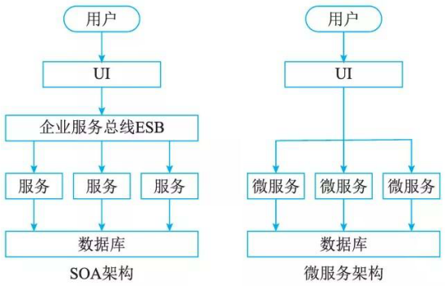

# SOA 的发展历史

## 最佳实践

### 题目总结

微服务相较于SOA去除了`ESB`企业服务总线

## SOA的发展历史

SOA 的发展最初始于国外，其经历了如下三个阶段。

### 萌芽阶段

这一阶段以XML技术为标志，时间大致从20世纪90年代末到21世纪初。虽然这段时期很少提到SOA, 但XML的出现无疑为SOA的兴起奠定了稳固的基石。

XML系W3C所创建，源自流行的标准通用标记语言(Standard Generalized Markup Language, SGML), 它在20世纪60年代后期就已存在。这种广泛使用的元语言，允许组织定义文档的元数据，实现企业内部和企业之间的电子数据交换。由于SGML比较复杂，实施成本很高，因此很长时间里只用于大公司之间，限制了它的推广和普及。

通过XML, 开发人员摆脱了HTML语言的限制，可以将任何文档转换成XML格式，然后跨越因特网协议传输。借助XML转换语言 (eXtensible Stylesheet Language Transformation, XSLT), 接受方可以很容易地解析和抽取XML的数据。这使得企业既能够将数据以一种统一的格式描述和交换，同时又不必负担SGML那样高的成本。事实上，XML实施成本几乎和HTML一样。

XML是SOA的基石。XML规定了服务之间以及服务内部数据交换的格式和结构。XSD Schemas保障了消息数据的完整性和有效性，而XSLT使得不同的数据表达能通过Schema映射而互相通信。

### 标准化阶段

2000年以后，人们普遍认识到基于公共因特网之上的电子商务具有极大的发展潜力，因此需要创建一套全新的基于因特网的开放通信框架，以满足企业对电子商务中各分立系统之间通信的要求。于是，人们提出了Web服务的概念，希望通过将企业对外服务封装为基于统一标准的Web服务，实现异构系统之间的简单交互。这一时期，出现了三个著名的Web服务标准和规范：

- 简单对象访问协议 (Simple Object Access Protocal, `SOAP`)
- Web服务描述语言(Web Services Description Language, `WSDL`)
- 通用服务发现和集成协议 (Universal Discovery Description and Integration, `UDDI`)

### 成熟应用阶段

从2005年开始，SOA推广和普及工作开始加速。不仅专家学者，几乎所有关心软件行业发展的人士都开始把目光投向SOA。一时间，SOA频频出现在各种技术媒体、新产品发布会和技术交流会上。

各大厂商也逐渐放弃成见，通过建立厂商间的协作组织共同努力制定中立的SOA标准。这一努力最重要的成果体现在三个重量级规范上：SCA/SDO/WS-Policy。 SCA和SDO构成了SOA编程模型的基础，而WS-Policy建立了SOA组件之间安全交互的规范。这三个规范的发布，标志着SOA 进入了实施阶段。

## SOA的微服务化发展

随着互联网技术的快速发展，为适应日益增长的用户访问量和产品的快速更新迭代，应用系统架构也经历了从简到繁、从`单体`架构到`SOA`架构再至`微服务`架构的演进过程。这导致SOA架构向更细粒度、更通用化程度发展，就成了所谓的微服务了。SOA与微服务的区别在于如下几个方面：

- 微服务相比于SOA更加`精细`，微服务更多地以独立的进程的方式存在，互相之间并无影响
- 微服务提供的接口方式更加`通用化`，例如HTTP RESTful方式，各种终端都可以调用，无关语言、平台限制
- 微服务更倾向于`分布式`去中心化的部署方式，在互联网业务场景下更适合

SOA架构是一个面向服务的架构，可将其视为组件模型，其将系统整体拆分为多个独立的功能模块，模块之间通过调用接口进行交互，有效整合了应用系统的各项业务功能，系统各个模块之间是松耦合的。SOA架构以企业服务总线链接各个子系统，是集中式的技术架构，应用服务间相互依赖导致部署复杂，应用间交互使用远程通信，降低了响应速度。

微服务架构是SOA架构的进一步优化，去除了ESB企业服务总线，是一个真正意义上去中心化的分布式架构。其降低了微服务之间的耦合程度，不同的微服务采用不同的数据库技术，服务独立，数据源唯一，应用极易扩展和维护，同时降低了系统复杂性。

