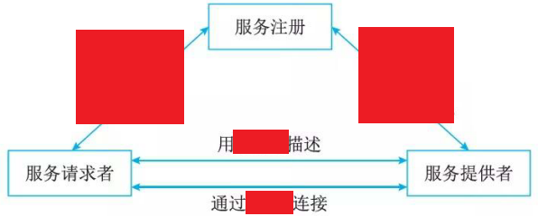
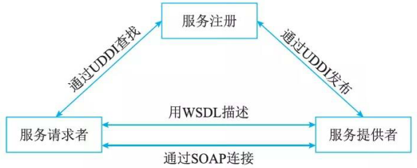

# SOA 主要协议和规范

## 最佳实践

### 考察问

- SOA主要协议和规范

    - `()`协议: 服务发现和注册
    - `()`规范: 描述服务的XML
    - `()`规范: 访问服务

    

### 题目总结

- SOA主要协议和规范

    - `UDDI`协议: 服务发现和注册
    - `WSDL`规范: 描述服务的XML
    - `SOAP`规范: 访问服务

    

## SOA 主要协议和规范
Web服务作为实现SOA中服务的最主要手段。首先来了跟踪Web Service相关的标准。它们大多以 “WS-'' 作为名字的前缀，所以统称 “WS-*” 。Web服务最基本的协议包括UDDI、WSDL和SOAP, 通过它们，可以提供直接而又简单的Web Service支待，如图所示。

## UDDI协议

UDDI(Universal Description Discovery and Integration, 统一描述、发现和集成协议)计划是一个广泛的、开放的行业计划，它使得商业实体能够彼此发现；定义它们怎样在Internet上互相作用，并在一个全球的注册体系架构中共享信息。UDDI是这样一种基础的系统构筑模块，它使商业实体能够快速、方便地使用它们自身的企业应用软件来发现合适的商业对等实体，并与其实施电子化的商业贸易。

UDDI同时也是Web服务集成的一个体系框架，包含了服务描述与发现的标准规范。UDDI规范利用了W3C和Int ernet工程任务组织的很多标准作为其实现基础，如XML、HTTP和DNS等协议。另外，在跨平台的设计特性中，UDDI主要采用了已经被提议给W3C的SOAP(Simple Object Access Protocol, 简单对象访问协议)规范的早期版本。

## WSDL规范

WSDL(Web Services Description Language, Web服务描述语言)，是一个用来描述Web服务和说明如何与Web服务通信的XML语言。它是Web服务的接口定义语言，由Ariba、Intel、IBM和MS等共同提出，通过 WSDL, 可描述Web服务的三个基本属性。

- 服务做些什么: 服务所提供的操作(方法)。
- 如何访问服务: 和服务交互的数据格式以及必要协议。
- 服务位于何处: 协议相关的地址，如URL 。

WSDL文档以端口集合的形式来描述Web服务，WSDL服务描述包含对一组操作和消息的一个抽象定义，绑定到这些操作和消息的一个具体协议，和这个绑定的一个网络端点规范。WSDL文档被分为两种类型：

- 服务接口 (Service Interface) 
- 服务实现 (Service Implementations) 

服务接口文档中主要元素的作用分别如下

1. types: 定义了Web服务使用的所有数据类型集合，可被元素的各消息部件所引用。它使用某种类型系统(一般使用XML Schema中的类型系统)。
2. message: 通信消息数据结构的抽象类型化定义。使用Types所定义的类型来定义整个消息的数据结构。
3. operation: 对服务中所支待操作的抽象描述。一般单个operation描述了一个访问入口的请求／响应消息对。
4. portType: 对于某个访问入口点类型所支待操作的抽象集合。这些操作可以由一个或多个服务访问点来支持。
5. binding:包含了如何将抽象接口的元素(portType)转变为具体表示的细节，也就是指特定的数据格式和协议的结合，以及特定端口类型的具体协议和数据格式规范的绑定。
6. port:定义为协议／数据格式绑定与具体Web访问地址组合的单个服务访问点。
7. service: 这是一个粗糙命名的元素，代表端口的集合，以及相关服务访问点的集合。

## SOAP协议

SOAP是在分散或分布式的环境中交换信息的简单的协议，是一个基于XML的协议。它包括4个部分：SOAP封装 (Envelop),定义了一个描述消息中的内容是什么，是谁发送的，谁应当接收并处理它以及如何处理它们的框架；SOAP编码规则(Encoding Rules), 用于表示应用程序需要使用的数据类型的实例；SOAP RPC表示 (RPC Representation) 是远程过程调用和应答的协定； SOAP绑定(Binding)是使用底层协议交换信息。

虽然这4个部分都作为SOAP的一部分，作为一个整体定义的，但它们在功能上是相交的、彼此独立的。特别地，信封和编码规则是被定义在不同的XML命名空间(Namespace)中，这样使得定义更加简单。

SOAP的两个主要设计目标是简单性和可扩展性，这就意味着有一些传统消息系统或分布式对象系统中的某些性质将不是SOAP规范的一部分。例如，分布式垃圾收集 (Distributed Garbage Collection) 、成批传送消息、对象引用和对象激活等。

## REST规范

REST是 RoyThomas Fielding博士在他的一篇论文中提出的一个概念，在这篇论文中设计了一种新的互联网软件架构风格，REST的设计不只是要适用于互联网环境，而是一个普遍的设计理念，目的是为了让不同的软件或者应用程序在任何网络环境下都可以进行信息的互相传递。微服务对外就是以REST API形式暴露给调用者。RESTful即REST式的，是对遵循REST设计思想同时满足设计约束的一类架构设计或应用程序的统称，这一类都可称为RESTful。REST即Representational State Transfer, 对应的翻译是表述性状态转移，可以理解为资源表述性状态转移。

### 资源 (Resource)

REST是以资源为中心构建，资源可以是一个订单，也可以是一幅图片。将互联网中一切暴露给客户端的事物都可以看作是一种资源，对资源相关数据和表述进行组合，借助URI(统一资源标识符)标识Web上的资源。但是 URI和资源又不是一一映射，一个资源可以设计多个URI，但一个URI只能对应一种资源。

### 表述(Representational)

REST中用表述描述资源在Web中某一个时间的状态。客户端和服务端借助RESTful API传递数据，实际就是在进行资源表述的交互。表述在Web中常用表现形式有HTML、JSON 、XML、纯文本等，但是资源表述返回客户端的形式只是统一格式，是开发阶段根据实际需求设计一个统一的表述格式。

### 状态转移(State Transfer) 

REST定义中状态分为两种：应用状态和资源状态。

- 应用状态是对某个时间内用户请求会话相关信息的快照，保存在客户端，由客户端自身维护，可以和缓存配合降低服务端并发请求压力。
- 资源状态在服务端保存，是对某个时间资源请求表述的快照，保证在服务端，如果一段时间内没有对资源状态进行改变，客户端对同一资源请求返回的表述一致。同时状态转移还要借助HTTP方法来实现，如GET方法、POST方法、DELETE方法等。

### 超链接

超链接是通过在页面中嵌入链接和其他资源建立联系，这里的资源可以是文本、图片、文件等。 REST定义中超链接是很重要的一部分，在资源表述中除了处理当前请求资源信息外，还会添加一些相关资源URI，将一些资源接口暴露给客户端，便于用户请求这些资源，实现资源状态转移。这些超链接是包含在应用状态中，由客户端维护保存，并不是服务端提前设定好的，是服务请求过程中添加进去，客户端对其解析提供给用户。

REST是一种设计风格而不是一个架构。 RESTful不可能摒弃REST而独立存在，是人们借助HTTP 、JSON 、 URI 、HTML等 Web 服务开发中广泛使用的标准和协议，同时使用不同的编程语言编写客户端和服务端，通过HTTP方法操作资源状态，最后遵循 REST 设计原则实现的应用程序或服务架构。

