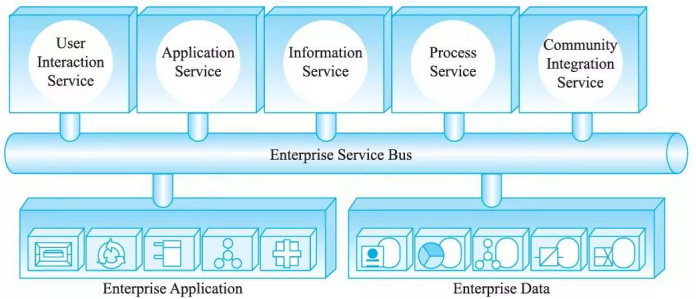

# 8SOA的设计模式

## 服务注册表模式
服务注册表 (Service Registry)主要在 SOA 设计时段使用，虽然它们常常也具有运行时段的功能。注册表支持驱动 SOA 治理的服务合同、策略和元数据的开发、发布和管理。因此，它们提供一个主控制点，或者称为策略执行点 (Poli cy Enforcement Point,  PEP) 。在这个点上，服务可以在 SOA 中注册和被发现。

注册表可以包括有关服务和相关软件组件的配置、遵从性和约束配置文件。任何帮助注册、发现和检索服务合同、元数据和策略的信息库、数据库、目录或其他节点都可以被认为是一个注册表。

(1) 服务注册：应用开发者，也叫服务提供者，向注册表公布他们的功能。他们公布服务合同，包括服务身份、位置、方法、绑定、配置、方案和策略等描述性属性。实现 SOA 治理最有效的方法之一，是限制哪类新服务可以向主注册表发布、由谁发布以及谁批准和根据什么条件批准。此外，许多注册表包含开发向注册表发布服务可能需要的说明性服务模板。

(2) 服务位置：也就是服务应用开发者，帮助他们查询注册服务，寻找符合自身要求的服务。注册表让服务的消费者检索服务合同。对谁可以访问注册表，以及什么服务属性通过注册表暴露的控制，是另一些有效的 SOA 治理手段，注册表产品一般都支待此类功能。

(3) 服务绑定：服务的消费者利用检索到的服务合同来开发代码，开发的代码将与注册的服务绑定、调用注册的服务以及与它们实现互动。开发者常常利用集成的开发环境自动将新开发的服务与不同的新协议、方案和程序间通信所需的其他接口绑在一起。工具驱动对服务绑定的控制，有效地管理服务在 ESB 上的互动。

## 企业服务总线模式

在企业基千 SOA 实施 EAi、 B2B 和 BMP 的过程中，如果采用点对点的集成方式存在着复杂度高，可管理性差，复用度差和系统脆弱等问题。企业服务总线 (Enterprise Service Bus, ESB) 技术在这种背景下产生，其思想是提供一种标准的软件底层架构，各种程序组件能够以服务单元的方式“插入”到该平台上运行，并且组件之间能够以标准的消息通信方式来进行交互。它的定义通常如下：企业服务总线是由中间件技术实现的支持面向服务架构的基础软件平台，支待异构环境中的服务以基千消息和事件驱动模式的交互，并且具有适当的服务质量和可管理性。

如图 15-6 所示， ESB 本质上是以中间件形式支待服务单元之间进行交互的软件平台。各种程序组件以标准的方式连接在该“总线”上，并且组件之间能够以格式统一的消息通信的方式来进行交互。一个典型的在 ESB 环境中组件之间的交互过程是：首先由服务请求者触发一次交互过程，产生一个服务请求消息，并将该消息按照 ESB 的要求标准化，然后标准化的消息被发送给服务总线。 ESB 根据请求消息中的服务名或者接口名进行目的组件查找，将消息转发至目的组件，并最终将处理结果逆向返回给服务请求者。这种交互过程不再是点对点的直接交互模式，而是由事件驱动的消息交互模式。通过这种方式， ESB 最大限度上解耦了组件之间的依赖关系，降低了软件系统互连的复杂性。连接在总线上的组件无需了解其他组件和应用系统的位置及交互协议，只需要向服务总线发出请求，消息即可获得所需服务。服务总线事实上实现了组件和应用系统的位置透明和协议透明。技术人员可以通过开发符合 ESB 标准的组件(适配器)将外部应用连接至服务总线，实现与其他系统的互操作。同时， ESB 以中间件的方式，提供服务容错、负载均衡、QoS 保障和可管理功能。

ESB 的核心功能如下。
1. 提供位置透明性的消息路由和寻址服务。
2. 提供服务注册和命名的管理功能。
3. 支持多种消息传递范型(如请求／响应、发布／订阅等)。
4. 支持多种可以广泛使用的传输协议。
5. 支持多种数据格式及其相互转换。
6. 提供日志和监控功能。

由于采用了基于标准的互连技术， ESB 使得企业内部以及外部系统之间可以很容易地进行异步或同步交互。它采用的面向服务的架构为系统提供了易扩展性和灵活性，在提高集成应用的开发效率的同时降低了成本。 ESB 技术克服了传统应用集成技术的缺陷，能够对各种技术和应用系统提供支待，具有很强的灵活性和可扩展性，可以说是目前理想的 EAI 、 B2B 应用系统集成支撑平台。

## 案例研究

协同企业服务总线 SynchroESB 就是基千 SOA 体系结构，以 ESB 为底层架构，包含丰富的预制程序组件，集中式管理工具和可视化应用程序开发界面的服务整合软件平台。该产品在国家高新技术产业化计划的支持下，由西安协同时光软件公司和西北工业大学计算机学院联合研究开发的。系统结构如图 15-7 所示，系统分为 4 个层次设计。

服务总线层为整个 EAI 应用环境提供底层支待。 ESB 层之上的数据转换与适配器层为各种EAi应用提供接入功能，它要解决的是应用集成服务器与被集成系统之间的连接和数据接口的问题。其上是流程整合层，它将不同的应用系统连接在一起，进行协同工作，并提供业务流程管理的相关功能，包括流程设计、监控和规划，实现业务流程的管理。最上端的用户交互层，则是为用户在界面上提供一个统一的信息服务功能入口，通过将内部和外部各种相对分散独立的信息组成一个统一的整体。

SynchroESB 支持企业构建可管理的、可扩展的和经济实用的 EAi解决方案。它提供简单经济可扩展的方法和工具，以组件化的方式灵活构建业务流程。应用独创的“粗颗粒”组件编程模型技术构建可重用的组件库，使得诸如构建、原型化、生产和管理分布式复杂应用的活动，变得和今天我们习惯使用的电子表格操作一样简单。 SynchroESB 支持企业以基千标准的、面向服务架构的方式将应用系统和流程跨越企业进行集成。通过分布式架构和集中式管理，SynchroESB 解决了集中式的集成方式中存在的问题，它使企业能够利用企业内任何地方的现有业务系统来快速组建一个有效的解决方案。 SynchroESB 采用事件驱动架构使得企业能够更快地响应业务的变化。

## 微服务橾式

SOA 的架构中，复杂的 ESB 企业服务总线依然处于非常重要的位置，整个系统的架构并没有实现完全的组件化以及面向服务，它的学习和使用门槛依然偏高。而微服务不再强调传统SOA 架构里面比较重的 ESB 企业服务总线，同时 SOA 的思想进入到单个业务系统内部实现真正的组件化。

### 微服务架构概述

微服务架构将一个大型的单个应用或服务拆分成多个微服务，可扩展单个组件而不是整个应用程序堆栈，从而满足服务等级协议。微服务架构围绕业务领域将服务进行拆分，每个服务可以独立进行开发、管理和迭代，彼此之间使用统一接口进行交流，实现了在分散组件中的部署、管理与服务功能，使产品交付变得更加简单，从而达到有效拆分应用，实现敏捷开发与部署的目的。 Amazon、 Netflix 等互联网巨头的成功案例表明微服务架构在大规模企业应用中具有明显优势。单体架构与微服务架构如图 15-8 所示。

1. 复杂应用解耦

    微服务架构将单一模块应用分解为多个微服务，同时保持总体功能不变。应用按照业务逻辑被分解为多个可管理的分支或服务，避免了复杂度的不断积累。每个服务专注千单一功能，通过良好的接口清晰表述服务边界。由于功能单一、复杂度低，小规模开发团队完全能够掌握，易于保持较高的开发效率，且易于维护。

2. 独立

    微服务在系统软件生命周期中是独立开发、测试及部署的。微服务具备独立的运行进程，每个微服务可进行独立开发与部署，因此在大型企业互联网系统中，当某个微服务发生变更时无需编译、部署整个系统应用。从测试角度来看，每个微服务具备独立的测试机制，测试过程中不需要建立大范围的回归测试，不用担心测试破坏系统其他功能。因此，微服务组成的系统应用具备一系列可并行的发布流程，使得开发、测试、部署更加高效，同时降低了因系统变更给生产环境造成的风险。

3. 技术选型灵活

    微服务架构下系统应用的技术选型是去中心化的，每个开发团队可根据自身应用的业务需求发展状况选择合适的体系架构与技术，从而更方便地根据实际业务情况获得系统应用最佳解决方案，并且每个微服务功能单一、结构简单，在架构转型或技术栈升级时面临较低风险，因此系统应用不会被长期限制在某个体系架构或技术栈上。

4. 容错

    在传统单体应用架构下，当某一模块发生故障时，该故障极有可能在整个应用内扩散，造成全局应用系统瘫痪。然而，在微服务架构下，由于各个微服务相互独立，故障会被隔离在单个服务中，并且系统其他微服务可通过重试、平稳退化等机制实现应用层的容错，从而提高系统应用的容错性。微服务架构良好的容错机制可避免出现单个服务故障导致整个系统瘫痪的情况。

5. 松耦合，易扩展

    传统单体应用架构通过将整个应用完整地复制到不同节点，从而实现横向扩展。但当系统应用的不同组件在扩展需求上存在差异时，会导致系统应用的水平扩展成本很高。微服务架构中每个服务之间都是松耦合的，可以根据实际需求实现独立扩展，体现微服务架构的灵活性。

### 微服务架构模式方案

微服务是一种软件架构演变后的新型架构风格，是系统应用开发的一种设计思想，没有固定开发模式。开发团队可根据企业实际业务场景进行架构设计，体现了微服务架构的灵活性。常见的微服务设计模式有聚合器微服务设计模式、代理微服务设计模式、链式微服务设计模式、分支微服务设计模式、数据共享微服务设计模式、异步消息传递微服务设计模式等。

1. 聚合器微服务

    在聚合器微服务中，聚合器调用多个微服务实现系统应用程序所需功能，具体有两种形式，一种是将检索到的数据信息进行处理并直接展示；另一种是对获取到的数据信息增加业务逻辑处理后，再进一步发布成一个新的微服务作为一个更高层次的组合微服务，相当于从服务消费者转换成服务提供者。与普通微服务特性相同，聚合器微服务也有自己的缓存和数据库。作为聚合器模式的一个变种，在代理微服务器中，客户端并不聚合数据，只会根据实际业务需求差别选择调用具有不同功能的微服务，代理微服务器仅进行委派请求和数据转换工作。同样地，代理微服务器也有自己独立的缓存和数据库。分支微服务器模式是聚合器微服务模式的一种扩展，在分支微服务器模式下，客户端或服务允许同时调用两个不同的微服务链。两个微服务调用链相互独立，互不影响。

2. 链式微服务

    客户端或服务在收到请求后，会返回一个经过合并处理的响应，该模式即为链式微服务设计模式。例如，服务 A 收到请求后会与服务 B 建立通信，服务 B 收到请求后会与服务 C 建立通信，依次往下游发送请求，并对结果进行合并处理后作为请求响应返回上游服务调用者。显然，该模式下的所有服务调用都采用同步消息传递方式，在一条完整的服务链调用完成之前，客户端或调用服务会一直阻塞。因此，在使用该模式过程中，服务调用链不宜过长，以避免客户端处千长时间等待状态。

3. 数据共享微服务

    运用微服务架构重构现有单体架构应用时， S QL 数据库反规范化可能会导致数据重复与不一致现象。按照微服务的自治设计原则，在单体架构应用到微服务架构的过渡阶段，可以使用数据共享微服务设计模式。在该模式下，当服务之间存在强耦合关系时，可能存在多个微服务共享缓存与数据库存储的现象。

4. 异步消息传递微服务

    目前流行开发 RESTful 风格的 API, REST 使用 HTTP 协议控制资源，并通过 URL 加以实现。 REST 提供了一系列架构系统参数作为整体使用，强调组件的独立部署、组件交互的扩展性，以及接口的通用性，并且尽量减少产生交互延迟的中间件数量。但是 REST 设计模式是同步的，容易造成阻塞，从而耗费大量时间。消息队列将消息写入一个消息队列中，实现业务逻辑以异步方式运行，从而加快系统响应速度。因此，对千一些不必要以同步方式运行的业务逻辑，可以使用消息队列代替 REST 实现请求、响应，加快服务调用的响应速度。但该模式可能会降低系统可用性，并增加系统复杂性，因而在使用过程中，要做好消息队列的选型。常用消息队列有 Acti veMQ、 RabbitMQ、 RocketMQ、 Kafka 等。

### 微服务架构面临的问题与挑战

微服务架构在规模较大的应用中具有明显优势，但其优势也是有代价的，微服务架构也会给人们带来新的问题和挑战。其中一个主要缺点是微服务架构分布式特点带来的复杂性，开发过程中，需要基于 RPC 或消息实现微服务之间的调用与通信，使服务发现与服务调用链跟踪变得困难。另一个挑战是微服务架构的分区数据库体系，不同服务拥有不同数据库。受限于 CAP原理约束以及 NoSQL 数据库的高扩展性，使人们不得不放弃传统数据库的强一致性，转而追求最终一致性，因此对开发人员出了更高要求。微服务架构给系统测试也带来了很大挑战，微服务架构可能涉及多个服务，传统的单体 Web 应用只需测试单－ API 即可，然而对千微服务架构测试，需要启动其依赖的所有服务，该复杂性不可低估。在大规模应用部署中，在监控、管理、分发及扩容等方面，微服务也存在着巨大挑战。

因此，对于微服务架构的取舍，要考虑企业开发团队规模、业务需求变化以及系统用户群体规模等诸多因素。使用微服务架构主要是为了降低应用程序开发、维护等方面的复杂性，如果系统程序架构已无法再扩展，或数据库增长速度过快，并且整个团队(包括产品、设计、研发、测试、运维)都具备微服务思维，采用微服务架构的收益会大于成本。但如果系统现有程序架构还能很好地工作，不需要有太大改动，采用微服务架构则不会有太多收益。综上所述，尽管微服务架构有很多优势，但在使用微服务架构之前要结合系统自身特点，综合评估后再决定是否采用微服务架构。

