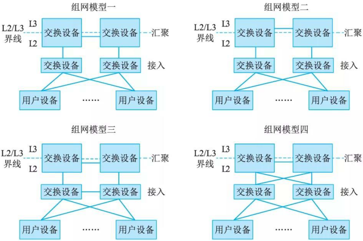
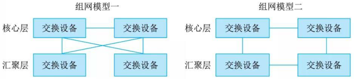
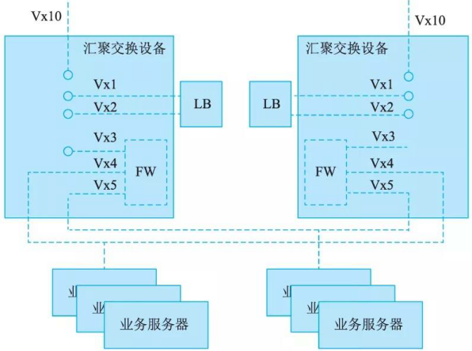
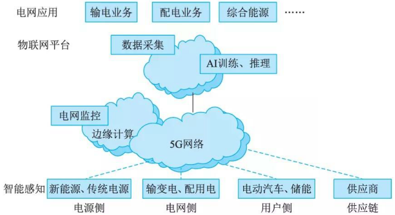

# 通信网络构建案例分析

## 高可用网络构建分析

网络可靠性通常是由组成网络的各功能部件稳定提供连续性服务保证的。只要单独提升每个部件的稳定性即可提升整个网络的可靠性；而网络可用性，通常需要构成网络的各部件相互协同冗余备份等来提供的。这需要通过复杂的网络连接来保证。以下重点从高可用性角度说明网络是如何构建的。图 17-20 给出了一种高可用的典型组网架构。

### 网络接入层高可用性设计

高可用接入层具有下述特征：
(1)使用冗余引擎和冗余电源获得系统级冗余，为关键用户群提供高可靠性；
(2) 与具备冗余系统的汇聚层采用双归属连接，获得默认网关冗余，支持在汇聚层的主备交换机间快速实现故障切换；
(3) 通过链路汇聚提供带宽利用率，同时降低复杂度；
(4) 通过配置 802.lx, 动态 ARP 检查及 IP 源地址保护等功能增加安全性，有效防止非法访问。

接入层到汇聚层有 4 种连接方式，如图 17-21 所示，分别为：倒 U 形接法(组网模型一)、U 形接法(组网模型二)、矩形接法(组网模型三)和三角形接法(组网模型四)。

不同类型的组网模型以二层链路的物理拓扑为评判依据，比如对千矩形接法(组网模型三)，接入交换机之间、接入交换机与汇聚交换机之间、汇聚交换机之间均以二层链路互联，这样使得两台接入交换机与两台汇聚交换机构成了矩形二层互联结构(形成环路)。表 17-1 给出四种组网模型的优劣对比。

|拓扑|优点|缺点|
| ---- | ---- | ---- |
|模型一(倒U形)|(1)无环路，不启用STP，网络管理简单 (2)VLAN可以跨汇聚层交换机，用户设备二层扩展灵活|汇聚交换机故障会造成其同侧接入交换机所连用户设备不可达，无法实现高可用接入|
|模型二(U形)|(1)无环路，不启用STP，网络管理简单 (2)接入交换机与汇聚交换机之间有冗余链路保护|(1)VLAN不能跨汇聚交换机，用户设备部署不灵活 (2)接入交换机间链路故障时，VRRP心跳报文无法传递，网络处于不稳定状态|
|模型三(矩形)|(1)接入交换机与汇聚交换机之间有冗余链路保护 (2)VLAN可以跨汇聚层交换机|(1)存在环路，启用STP (2)当接入交换机上行链路故障时，所有流量将从另一侧交换机上行，网络收敛比变小，网络易拥塞，降低了网络可用性|
|模型四(三角形)|(1)接入交换机与汇聚交换机之间有冗余链路、冗余路径保护 (2)VLAN可以跨汇聚层交换机，用户设备部署灵活|存在环路，启用STP，生成树计算较矩形拓扑的复杂|

由表 17-1 可以看出，模型四(三角形组网)提供了更高可用性接入能力以及更灵活的用户设备扩展能力。对千有高要求的设备接入，建议采用此模型。

由于三角形组网存在二层环路，所以需要在交换机上使能多生成树协议 MSTP (Multiple Spanning Tree Protocol) 。汇聚层交换机(或汇聚交换上的 L4/L7 层设备)部署虚拟路由器冗余协议 (Virtual Router Redundancy Protocol,  VRRP), 并将 VRRP 组的虚拟 IP 地址作为用户设备网关。

### 网络汇聚层高可用设计

汇聚层到核心层间采用 OSPF 等动态路由协议实现路由层面高可用保障。典型连接方式有两种，如图 17-22 所示，组网模型一为三角形连接方式，从汇聚层到核心层具有全冗余链路和转发路径；组网模型二维矩形连接方式，从汇聚层到核心层为非全冗余链路，当主链路发生故障时，需要通过路由协议计算获得从汇聚到核心的其他路径。可见，组网模型一(即三角形连接方式)的故障收敛时间较小，不足的是，三角形连接方式要占用更多设备端口，建网成本较高。

网络汇聚层作为网络接入层的流量会集点和用户设备网关，需要部署防火墙作为整个服务区的安全控制边界，根据需要，部署应用优化设备(服务负载分担、 SSL 卸载等)用以减轻用户设备的处理负担，提高应用响应速度。

如图 17-23 所示，给出一种汇聚层 FW 和 LB 的双机高可用组网模型。在汇聚层交换机上部署防火墙模块 (FW) 和负载均衡模块 (LB) 。 FW 模块作为用户设备(如业务服务器)网关，采用三层路由模式为访问用户设备(如业务服务器)的流量提供转发，并提供攻击防御、策略管理等功能。 LB 模块采用单臂旁挂部署方式。缺省网关指定在汇聚交换机上。外部用户访问业务服务器的流量在 LB 模块上进行负载均衡、源目的地址变换后，再通过 FW 传送到内部设备(业务服务器)。

核心与汇聚交换机间运行 OSPF 协议。当任一节点整机或链路故障时，网络依靠 OSPF 进行故障收敛。两个 LB 之间运行 VRRP ，汇聚交换机将去往服务器 IP 地址的下一跳指向 LB 的VRRP 虚 IP 地址，当 LB 主用故障，可通过 VRRP 切换到备用上继续流量转发。两个 FW 之间也运行 VRRP, FW 主用模块故障，可通过 VRRP 切换至备份上恢复流量。另外，汇聚交换机之间需要配置 Trunk 链路，放通 Vx1Nx4/Vx5 。

### 网络核心层高可用设计

核心层设备是网络的枢纽，需要能提供高速数据交换能力和极高持久性，从系统冗余性角度，应考虑部署双核心或多核心设备，以主备或负荷分担方式工作。就单台设备而言，应选用交换性能和可靠性高的设备，支持主控、电源冗余设计，具备分布式转发特征，并降低设备配置复杂度，减少出错几率。

尽量在核心层采用冗余的点到点层 3 互连，这样可提供最快速和确定的收敛结果。将核心层设计为基千硬件加速业务的层 3 交换环境，要优千层 2 的设计，因为在链路或街道故障时能提供更快的收敛速度，通过减少路由邻接关系和网络拓扑可提高可扩展性，通过等价多路径(ECMP) 可提高带宽利用率。

综上，网络高可用性是网络构建必不可少且重要的诉求，需要从不同层次对网络进行高可用设计，方可保证整个网络系统整体的高可用运转。这就要求网络在运行过程中，一旦出现故障，系统能尽可能快地从故障中恢复过来，保证所承载业务的连续性。通常，对网络高可用主要性能指标有下述要求：
(1) 核心层设备故障恢复时间： < 500ms; 
(2) 汇聚层设备故障恢复时间： < ls; 
(3) 核心、汇聚设备双主控切换时间： < 200ms; 
(4) 核心－汇聚、接入－汇聚链路故障恢复时间： < 500ms; 
(5) 链路聚合故障恢复时间： ＜ls 。

## 园区网双栈构建分析

园区网在我们身边比比皆是，诸如科研院所、政府组织、社会团体等都有自己的园区网络。在国家层面对 IPv6 网络部署及业务大力推进的大环境下，以及从园区网未来发展的需要考虑，构建基千 IPv6 的园区网势在必行。同时，需要兼顾已有 IPv4 网络投资成本的继承。为此，在构建 IPv6 园区网时可考虑采用双栈模式加以构建，并逐步演进到纯 IPv6 网络。将一个仅支待 IPv4 的园区网升级为支持 IPv4 和 IPv6 双栈网络，涉及多种技术和升级方式的选择。首先需要制定下述详细的升级流程：
(1) 制订网络设备升级计划；
(2) 评估现网中设备对 IPv6 支持情况；
(3) 评估现网中需升级至双栈的网络服务；
(4) 制定 IPv6 地址的分配方案；
(5) 制定详细 IPv6 网络升级方案。
依照上述升级流程，逐步将现网升级为双栈网络，在保证现有业务正常提供外，为园区网业务的快速发展，尤其是 IPv6 业务的部署奠定基础。下面主要从园区网构建思路、隧道选用策略，以及地址规划等方面给予说明。

### 骨干网构建思路

在双栈园区网的骨干网建设中，应采用分层建网模式。重点关注核心层和汇聚层 IPv6 部署。在核心层和汇聚层使用双栈交换机；在接入层使用现有的二层交换机或将不支待 IPv6 的三层交换机降为二层来用，以保护已有投资。

升级后的 IPv6 网络部分与原有 IPv4 网络部分融合，园区网中双栈用户可同时访问 IPv4 和IPv6 网络。 IPv4 网关和 IPv6 网关均布设在汇聚三层交换机上，在汇聚交换机上同时运行 IPv4和 IPv6 路由协议。

为了提升网络可靠性，在汇聚层和核心层之间，接入层和汇聚层之间均采用双归链路上联，实现链路冗余保护。汇聚层设备作为用户接入点网关设备，为方便用户设备联网配置简单且可靠，在汇聚层设备上运行 VRRP 协议，实现网关冗余保护。核心层设备采用双活方式工作，提供业务转发的冗余保护。

### 园区网隧道技术选用

园区网中一些用户可能因预算或技术等原因无法部署双栈，或只能将部分园区网升级为双栈网络。为此，可在园区网中采用前述的隧道技术，将纯 IPv6 用户接入 IPv6 网络。比如部署用户端到出口路由器的自动隧道技术(如 ISATAP) 来完成 IPv6 用户对网络业务的访问。需要注意的是，在自动隧道部署中，如果网络中有大量的 IPv6 用户需要接入，可通过增加隧道端节点路由器数量以解决可能出现的性能瓶颈问题。

通过使用隧道技术进行 IPv6 部署不仅能够保护原有设备投资，而且原有网络拓扑和路由几乎无需调整，这样既保证原有 IPv4 用户依旧可正常访问网络资源，又可满足升级为双栈用户或纯 IPv6 用户通过 IPv6 协议访问网络资源的诉求。

### 园区网 IP 地址规划

合理的地址划分能有效保证后续网络部署的稳定性和可维护性。 IP 地址的分配与网络组织、路由策略以及网络管理等都密切相关。 IP 地址规划应主要从网络资源利用和网络有效管理方面加以考虑。通常，地址规划遵循以下原则：
(1) 地址资源应全网统一分配；
(2) 地址应分层划分，便于网络互连，同时简化路由表；如地址尽量遵循每个物理区域分配连续地址空间的原则；
(3) 地址划分需要考虑网络演进的要求，即地址划分需要考虑一定的预留量，同时充分利用已申请的地址空间，提高地址利用率。

## 5G 网络应用

5G 网络除了为人提供高品质的通信服务外，还注重为物提供更为广泛的通信服务，如目前正快速发展的物联网应用，无人机和地面车辆等设备的远程控制，以及多人出席并在虚拟环境中相互通信或学生远程与同学和老师进行 360 度视频通信的 VR 应用，还有工厂自动化所需的闭环控制应用，移动医疗保健，远程监控，诊断和治疗，多媒体优先服务 (Multimedia Priority Service,  MPS), 如为国家安全和应急准备授权用户提供优先通信等。这些应用正体现了 5G 网络可提供的高带宽、大连接、低时延及高可靠等特点。

5G 网络在智能电网中的应用如图 17-24 所示，通过 5G 网络将种类繁多数据巨大的设备，如电网智能感知设备(传统电源、新能源电源等)，电网中的输变电网设备、配电设备等，用户电表、电动汽车等连接到物联网 (IoT) 平台中，由 IoT 平台进行电网各个环节的数据采集和智能分析，从而为电网的高级应用(输电业务、配电业务、综合能源管理等业务部门)的科学决策提供有力的支撑。

另外，在智能电网中还存在为提高能源分配效率并要求在发生不可预见事件时能迅速响应以重新配置智能电网的需求，如对千任何时刻发生的事件触发消息、任何两个通信点之间的一个跳闸事件的传输时延应小千 8ms 。为此，采用 5G 系统的边缘计算技术 (MEC) 及 uRLLC 切片技术来满足这样的苛刻要求。

