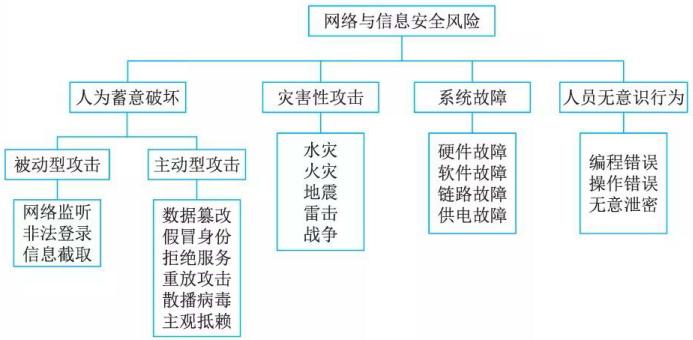

# 安全架构概述

## 信息安全面临的威胁

目前，信息系统可能遭受到的威胁可总结为以下 4 个方面，如图 18-1 所示。

对于信息系统来说，威胁可以是针对物理环境、通信链路、网络系统、操作系统、应用系统以及管理系统等方面。物理安全威胁是指对系统所用设备的威胁，如自然灾害、电源故障、操作系统引导失败或数据库信息丢失、设备被盗／被毁造成数据丢失或信息泄露；通信链路安全威胁是指在传输线路上安装窃听装置或对通信链路进行干扰；网络安全威胁是指由千互联网的开放性、国际化的特点，人们很容易通过技术手段窃取互联网信息，对网络形成严重的安全威胁；操作系统安全威胁是指对系统平台中的软件或硬件芯片中植入威胁，如“木马”和“陷阱门”、 BIOS 的万能密码；应用系统安全威胁是指对千网络服务或用户业务系统安全的威胁，也受到“木马”和“陷阱门”的威胁；管理系统安全威胁是指由于人员管理上疏忽而引发人为的安全漏洞，如人为的通过拷贝、拍照、抄录等手段盗取计算机信息。

具体来讲，常见的安全威胁有以下几种。
(1)信息泄露：信息被泄露或透露给某个非授权的实体。
(2)破坏信息的完整性：数据被非授权地进行增删、修改或破坏而受到损失。
(3)拒绝服务：对信息或其他资源的合法访问被无条件地阻止。
(4)非法使用(非授权访问)：某一资源被某个非授权的人或以非授权的方式使用。
(5)窃听：用各种可能的合法或非法的手段窃取系统中的信息资源和敏感信息。例如对通信线路中传输的信号进行搭线监听，或者利用通信设备在工作过程中产生的电磁泄漏截取有用信息等。
(6)业务流分析：通过对系统进行长期监听，利用统计分析方法对诸如通信频度、通信的信息流向、通信总量的变化等态势进行研究，从而发现有价值的信息和规律。
(7)假冒：通过欺骗通信系统(或用户)达到非法用户冒充成为合法用户，或者特权小的用户冒充成为特权大的用户的目的。黑客大多是采用假冒进行攻击。
(8)旁路控制：攻击者利用系统的安全缺陷或安全性上的脆弱之处获得非授权的权利或特权。例如，攻击者通过各种攻击手段发现原本应保密，但是却又暴露出来的一些系统“特性”。利用这些“特性”，攻击者可以绕过防线守卫者侵入系统的内部。
(9)授权侵犯：被授权以某一目的使用某一系统或资源的某个人，却将此权限用千其他非授权的目的，也称作“内部攻击“。
(10)特洛伊木马：软件中含有一个察觉不出的或者无害的程序段，当它被执行时，会破坏用户的安全。这种应用程序称为特洛伊木马( Troj an Horse) 。
(11)陷阱门：在某个系统或某个部件中设置了“机关”，使得当提供特定的输入数据时，允许违反安全策略。
(12)抵赖：这是一种来自用户的攻击，例如，否认自己曾经发布过的某条消息、伪造一份对方来信等。
(13)重放：所截获的某次合法的通信数据备份，出于非法的目的而被重新发送。
(14)计算机病毒：所谓计算机病毒，是一种在计算机系统运行过程中能够实现传染和侵害的功能程序。一种病毒通常含有两个功能：一种功能是对其他程序产生“感染”；另外一种或者是引发损坏功能或者是一种植入攻击的能力。
(15)人员渎职：一个授权的人为了钱或利益、或由于粗心，将信息泄露给一个非授权的人。
(16)媒体废弃：信息被从废弃的磁盘或打印过的存储介质中获得。
(17)物理侵入：侵入者通过绕过物理控制而获得对系统的访问。
(18)窃取：重要的安全物品，如令牌或身份卡被盗。
(19)业务欺骗：某一伪系统或系统部件欺骗合法的用户或系统自愿地放弃敏感信息。

## 安全架构的定义和范围

安全架构是架构面向安全性方向上的一种细分，比如细分领域含有运维架构、数据库架构等。如果安全性体现在产品上，那么，通常的产品安全架构、安全技术体系架构和审计架构可组成三道安全防线。
(1) 产品安全架构：构建产品安全质量属性的主要组成部分以及它们之间的关系。产品安全架构的目标是如何在不依赖外部防御系统的情况下，从源头打造自身安全的产品。
(2) 安全技术体系架构：构建安全技术体系的主要组成部分以及它们之间的关系。安全技术体系架构的任务是构建通用的安全技术基础设施，包括安全基础设施、安全工具和技术、安全组件与支持系统等，系统性地增强各产品的安全防御能力。
(3) 审计架构：独立的审计部门或其所能提供的风险发现能力，审计的范围主要包括安全风险在内的所有风险。

安全架构应具备可用性、完整性和机密性等特性。这里所说的可用性 (Avai labi l ity)是指要防止系统的数据和资源丢失；完整性 (Int egrity)是指要防止系统的数据和资源在未经授权情况下被修改；机密性 (Confidentiality)是指要防止系统的数据和资源在未授权的情况下被披露。

