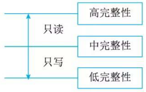

# 2安全模型

信息系统的安全目标是控制和管理主体(含用户和进程)对客体(含数据和程序)的访问。作为信息系统安全目标，就是要实现：
·保护信息系统的可用性；
·保护网络系统服务的连续性；
·防范资源的非法访问及非授权访问；
·防范入侵者的恶意攻击与破坏；
·保护信息通过网上传输过程中的机密性、完整性；
·防范病毒的侵害；
·实现安全管理。

安全模型是准确地描述安全的重要方面及其与系统行为的关系，安全策略是从安全角度为系统整体和构成它的组件提出基本的目标，它是一个系统的基础规范，使系统集成后评估它的基准。安全策略勾画出的安全目标，是宽泛、模糊而抽象的。而安全模型提供了实现目标应该做什么，不应该做什么，具有实践指导意义，它给出了策略的形式。安全模型有许多种，可针对不同的特性、场景以及控制关系使用不同的安全模型。如图 18-3 所示给出了安全模型的一种分类方法。

注：
•  HRU: 访问控制矩阵模型 (Harrison 、 Ruzzo 、 Ullman) ; 
•  MAC: 强制访问控制模型 (Mandatory Access  Control)  ; 
•  DAC: 自主访问控制模型 (Di scretionary Access  Control)  ; 
•  RBAC: 基千角色的访问控制模型 (Role-Based Access Control) 。

当前比较被公认的模型有：状态机模型( State Machine Model 汃 Bell-LaPadula (BLP) 模型、Bi ba 模型、 Clark-Wi lson (CWM) 模型、 ChineseWall 模型，以及信息流模型 (Information Flow Model) 、非干涉模型 (Noninterference Model) 、格子模型 (Lattice Model) 、 Brewer and Nash 模型和 Graham-Denning模型等。这里简要介绍典型的五种安全模型。

## 状态机橾型

状态机模型描述了一种无论处千何种状态都是安全的系统。它是用状态语言将安全系统描述成抽象的状态机，用状态变量表述系统的状态，用转换规则描述变量变化的过程。

状态机模型中一个状态( state) 是处千系统在特定时刻的一个快照。如果该状态所有方面满足安全策略的要求，则称此状态是安全的；如果所有行为都在系统中允许并且不危及系统使之处千不安全状态，则断言系统执行了一个安全状态模型 (Secure State Model) 。一个安全状态模型系统，总是从一个安全状态启动，并且在所有迁移中保待安全状态，只允许主体以和安全策略相一致的安全方式访问资源。

状态机模型工作原理如图 18-4 所示，具体步骤描述如下：

(1)状态变量的默认值必须安全；
(2) 用户试图使用变量的默认值；
(3) 系统检查主体的身份验证；
(4) 系统确保变更不会使系统置于不安全状态；
(5) 系统允许变量值变更，发生状态改变(STATE CHANGE); 
(6) 再重复执行 (1)~(5) 步，会导致另一次状态变化。

## Bell-LaPadula模型

Bell-LaPadula 模型是 Davi d Bell 和 Len LaPadula 于 1973 提出的第一个正式的安全模型。该模型属于强制访问控制模型，以敏感度来划分安全级别。将数据划分为多安全级别与敏感度的系统，即多级安全系统。本模型是为美国国防部多级安全策略形式化而开发，其机密性模型是第一个能够提供分级别数据机密性保障的安全策略模型(即多级安全)。

### 模型基本原理

Bell-LaPadula 模型使用主体、客体、访问操作(读、写、读／写)以及安全级别这些概念，当主体和客体位于不同的安全级别时，主体对客体就存在一定的访问限制。通过该模型可保证信息不被不安全主体访问。

这里：
(1)安全级别为“机密”的主体访问安全级别为“绝密”的客体时，主体对客体可写不可读 (No Read  Up); 
(2) 当安全级别为“机密”的主体访问安全级别为“机密”的客体时，主体对客体可写可读；
(3) 当安全级别为“机密”的主体访问安全级别为“秘密＂的客体时，主体对客体可读不可写 (No Write Down) 。

### 模型安全规则

Bell-LaPadula 模型的安全规则如下：
(1)简单安全规则( Simple Security Rule)  :安全级别低的主体不能读安全级别高的客体(No  Read Up); 
(2) 星属性安全规则( Star Security Property):安全级别高的主体不能往低级别的客体写(No  Write Down); 
(3) 强星属性安全规则( Strong Star Security Property):不允许对另一级别进行读写；
(4) 自主安全规则 (Di scretionary Security Property)  :使用访问控制矩阵来定义说明自由存取控制。其存取控制体现在内容相关和上下文相关。

## Biba模型

Biba 模型是在 Bell-LaPadula 模型之后开发的，它跟 Bell-LaPadula 模型很相似，被用于解决应用程序数据的完整性问题。 Bell-LaPadula 使用安全级别( Top secret、 Secret、 Sensitive 等)，这些安全级别用于保证敏感信息只被授权的个体所访问。

### 模型基本原理

Bi ba 模型不关心信息机密性的安全级别，因此它的访问控制不是建立在安全级别上，而是建立在完整性级别上。

完整性的三个目标：保护数据不被未授权用户更改；保护数据不被授权用户越权修改(未授权更改)；维持数据内部和外部的一致性。

Bi ba 模型的安全策略是基于层次化的完整性级别。它将完整性威胁分为来源于子系统内部和外部的威胁。如果子系统的一个组件是恶意或不正确，则产生内部威胁；如果一个子系统企图通过错误数据或不正确调用函数来修改另一个子系统，则产生外部威胁。内部威胁可以通过程序测试或检验来解决。所以本模型主要针对外部威胁，解决了完整性的第一目标：即防止非授权用户的篡改。图 18-6 对 Bell-LaPadula 模型基本原理进行描述。

这里：
(1) 当完整性级别为“中完整性”的主体访问完整性为“高完整性”的客体时，主体对客体可读不可写 (No Write Up),也不能调用主体的任何程序和服务；
(2) 当完整性级别为“中完整性”的主体访问完整性为“中完整性”的客体时，主体对客体可读读可写；
(3) 当完整性级别为“中完整性”的主体访问完整性为“低完整性”的客体时，主体对客体可写不可读； (No Read Down); 

### 模型安全规则

Biba 模型能够防止数据从低完整性级别流向高完整性级别，其安全规则如下：
(1) 星完整性规则(＊－integrity Axi om): 表示完整性级别低的主体不能对完整性级别高的客体写数据；
(2) 简单完整性规则( S imple Integrity Axi om): 表示完整性级别高的主体不能从完整性级别低的客体读取数据；
(3) 调用属性规则( Invocation Property)  :表示一个完整性级别低的主体不能从级别高的客体调用程序或服务。

## Clark-Wilson摸型

Clark-Wil son 模型是由 David Clark 和 Davi d Wi lson 于 1987 年提出的完整性模型，简称为CWM ，这个模型实现了成型的事务处理机制，常用于银行系统中以保证数据完整性。

### 模型基本原理

CWM 是一种将完整性目标、策略和机制融为一体的模型。为了体现用户完整性， CWM 提出了职责隔离( Separation of Duty)目标；为了保证数据完整性， CWM 提出了应用相关的完整性验证进程；为了建立过程完整性， CWM 定义了对于变换过程的应用相关验证。图 18-7 对CWM 模型的基本原理进行了描述。

这里：
(1) 需要进行完整性保护的客体称之为 CDI,不需要进行完整性保护的客体称之为 UDI;
(2) 完整性验证过程 (Integrity Verifi cation Procedure,  IVP)  :确认限制数据项处千一种有效状态，如果 IVP 检验 CDI 符合完整性约束，则系统处于一个有效状态；
(3) 转换过程 (Transformation Procedures,  TP)  :将数据项从一种有效状态改变至另一种有效状态；
(4) 为了确保对 CDI 的 TP 是有效的，则需要授权 User 做 TP 的认证；
(5) 为了防止合法用户对 CDI 做非法或错误操作，将 TP 过程分为多个子过程，将每个子过程授权给不同的 User;
(6) 但是如果 TP 的每个子过程被授权的 User 之间存在某种利益同盟，则可能存在欺骗。从而使得 CDI 的完整性得不到保护。

### 模型特征

CWM 的主要特征是：
(1)采用 Subj ect/Program /Obj ect三元素的组成方式。 Subj ect要访问 Obj ect只能通过Program 进行；
(2) 权限分离原则：将要害功能分为有 2 个或多个 Subj ect完成，防止已授权用户进行未授权的修改；
(3) 要求具有审计能力 (Auditing)。

## Chinese Wall模型

Chinese Wall 模型(又名 Brew and Nash 模型，最初是由 Brewer 和 Nash 提出)是应用在多边安全系统中的安全模型。也就是说，是指通过行政规定和划分、内部监控、 IT 系统等手段防止各部门之间出现有损客户利益的利益冲突事件。本模型最初为投资银行设计的，但也可应用在其他相似的场合。

### 模型基本原理

Chinese Wall 模型的安全策略的基础是客户访问的信息不会与当前他们可支配的信息产生冲突。在投资银行中，一个银行会同时拥有多个互为竞争者的客户，一个银行家可能为一个客户工作，但他可以访问所有客户的信息。因此，应当制止该银行家访问其他客户的数据。比如在某个领域有两个竞争对手同时选择了一个投资银行作为他们的服务机构，而这个银行出于对这两个客户的商业机密的保护就只能为其中一个客户提供服务。 Chinese Wall 模型同时包括 DAC和 MAC 的属性，是强制访问控制模型 (MAC) 的一种混合策略模型，比如银行家可以选择为谁工作 (DAC), 一旦选定，他就只能为该客户工作 (MAC) 。图 18-8 给出了 Chinese Wall 模型的基本原理。

### 模型的安全规则

Chinese Wall 模型的访问客体控制的安全规则如下：
(1) 与主体曾经访问过的信息属于同一公司数据集合的信息，即墙内信息可以访问；
(2) 属千一个完全不同的利益冲突组的可以访问；
(3) 主体能够对一个客体进行写的前提是主体未对任何属千其他公司数据集进行过访问。

定理 1: 一个主体一旦访问过一个客体，则该主体只能访问位千同一公司数据集的客体或在不同利益组的客体。
定理 2: 在一个利益冲突组中，一个主体最多只能访问一个公司数据集。

比如，假设 Chinese Wall 安全策略包括三个信息存储模块：某家企业的单位信息 (C) 、该家企业的所有信息集合 (Company Data,  CD) 和该家企业与互为竞争关系企业的全部信息集合(Co nfli ct of Interest,  COi)。那么， Chi nese Wall 模型规定：
(1)每个 C 只能唯一对应一个 CD;
(2) 每个 CD 只能唯一对应一个利益冲突类 COI;
(3) 一个 COI 类却可以同时包含多个 CD 。

### 模型举例

在一个企业投资顾问公司里，一个咨询师大部分是同时为若干个企业提供投资咨询服务的，该咨询师就掌握了他所服务的所有企业的全部信息，包括企业的内部机密信息。如果该咨询师所服务的若干企业中有两家企业是在同一行业内的竞争对手，那么我们可以联想到，该咨询师可能会在给一家企业提供咨询过程中，有意或者无意地透露一些自己知道的有关另一家竞争企业的内部信息，使得一方得到利益，另一方遭受损失，这就导致了利益冲突，这是 Chinese Wall 安全模型策略需要解决的首要问题。

