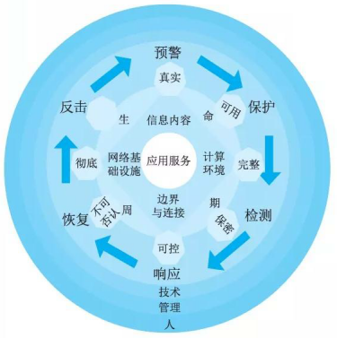

# 信息安全整体架构设计(WPDRRC模型)

## WPDRRC信息安全体系架构模型

WPDRRC  (Waring/Protect/Detect/React/Restore/Counterattack) 信息安全模型是我国“八六三”信息安全专家组提出的适合中国国情的信息系统安全保障体系建设模型。 WPDRRC 是在 PDRR(Protect/Detect/React/React/Restore) 信息安全体系模型的基础上前后增加了预警和反击功能。针对网络安全防护问题，美国曾提出了多个网络安全体系模型和架构，其中比较经典的包括PDRR 模型、 P2DR 模型。而 WPDRRC 模型由中国提出。

在 PDRR 模型中，安全的概念已经从信息安全扩展到了信息保障，信息保障内涵已超出传统的信息安全保密，它是保护 (Protect)、检测 (Det ect)、反应 (React)、恢复 (Rest ore) 的有机结合，称为 PDRR 模型。 PDRR 模型把信息的安全保护作为基础，将保护视为活动过程，要用检测手段来发现安全漏洞，及时更正；同时采用应急响应措施对付各种入侵；在系统被入侵后，要采取相应的措施将系统恢复到正常状态，这样才能使信息的安全得到全方位的保障。该模型强调的是自动故障恢复能力。

WPDRRC 模型有 6 个环节和 3 大要素。

6 个环节包括：预警、保护、检测、响应、恢复和反击，它们具有较强的时序性和动态性，能够较好地反映出信息系统安全保障体系的预警能力、保护能力、检测能力、响应能力、恢复能力和反击能力。

3 大要素包括：人员、策略和技术。人员是核心，策略是桥梁，技术是保证，落实在WPDRRC 的 6 个环节的各个方面，将安全策略变为安全现实。图 18-12 给出了 WPDRRC模型的 6 个环节和 3 大要素间的关系。

这里， 6 个环节说明如下：

1. w：预警主要是指利用远程安全评估系统提供的模拟攻击技术来检查系统存在的、可能被利用的薄弱环节，收集和测试网络与信息的安全风险所在，并以直观的方式进行报告，提供解决方案的建议，在经过分析后，分解网络的风险变化趋势和严重风险点，从而有效降低网络的总体风险，保护关键业务和数据。
2. P: 防护通常是通过采用成熟的信息安全技术及方法来实现网络与信息的安全。主要内容有加密机制，数字签名机制，访问控制机制，认证机制，信息隐藏和防火墙技术等。
3. D: 检测通过检测和监控网络以及系统，来发现新的威胁和弱点，强制执行安全策略。在这个过程中采用入侵检测、恶意代码过滤等技术，形成动态检测的制度，奖励报告协调机制，提高检测的实时性。主要内容有入侵检测，系统脆弱性检测，数据完整性检测和攻击性检测等。
4. R: 响应是指在检测到安全漏洞和安全事件之后必须及时做出正确的响应，从而把系统调整到安全状态。为此需要相应的报警、跟踪、处理系统，其中处理包括了封堵、隔离、报告等能力。主要内容有应急策略、应急机制、应急手段、入侵过程分析和安全状态评估等。
5. R: 恢复灾难恢复系统是当前网络、数据、服务受到黑客攻击并遭到破坏或影响后，通过必要技术手段，在尽可能短的时间内使系统恢复正常。主要内容有容错、冗余、备份、替换、修复和恢复等。
7. C: 反击是指采用一切可能的高新技术手段，侦察、提取计算机犯罪分子的作案线索与犯罪证据，形成强有力的取证能力和依法打击手段。

网络安全体系模型经过多年发展，形成了 PDP 、 PPDR、 PDRR、 MPDRR 和 WPDRRC 等模型，这些模型在信息安全防范方面功能更加完善，表 18-1 给出网络安全体系模型安全防范功能对照表。

|      | 预警 | 保护 | 检测 | 响应 | 恢复 | 反击 | 管理 |
| ---- | ---- | ---- | ---- | ---- | ---- | ---- | ---- |
| PDR  | 无   | 有   | 有   | 有   | 无   | 无   | 无   |
| PPDR | 无   | 有   | 有   | 有   | 无   | 无   | 无   |
| PDRR | 无   | 有   | 有   | 有   | 有   | 无   | 无   |
| MPDRR| 无   | 有   | 有   | 有   | 有   | 无   | 有   |
| WPDRRC| 有  | 有   | 有   | 有   | 有   | 有   | 有   |

## 信息安全体系架构设计

对信息系统的安全需求是任何单一安全技术都无法解决的，要设计一个信息安全体系架构，应当选择合适的安全体系结构模型。信息系统安全设计重点考虑两个方面；其一是系统安全保障体系；其二是信息安全体系架构。

### 系统安全保障体系

安全保障体系是由安全服务、协议层次和系统单元等三个层面组成，且每个层都涵盖了安全管理的内容。图 18-13 给出了安全保障体系结构技术模型示意图。

系统安全保障体系设计工作主要考虑以下几点：

(1)安全区域策略的确定：根据安全区域的划分，主管部门应制定针对性的安全策略。如定时审计评估、安装入侵检测系统、统一授权、认证等；
(2) 统一配置和管理防病毒系统：主管部门应当建立整体防御策略，以实现统一的配置和管理。网络防病毒的策略应满足全面性、易用性、实时性和可扩展性等方面要求；
(3) 网络安全管理：在网络安全中，除了采用一些技术措施之外，加强网络安全管理，制定有关规章制度。在安全管理中，任何的安全保障措施，最终要落实到具体的管理规章制度以及具体的管理人员职责上，并通过管理人员的工作得到实现。安全管理遵循国家标准 ISO17799, 它强调管理体系的有效性、经济性、全面性、普遍性和开放性，目的是为希望达到一定管理效果的组织提供一种高质量、高实用性的参照。

网络安全管理要做到总体策划，确保安全的总体目标和所遵循的原则；建立相关组织机构，要明确责任部门，落实具体实施部门；做好信息资产分类与控制，达到职工的安全、物理环境的安全和业务连续性管理等；使用技术方法解决通信与操作的安全、访问控制、系统开发与维护，以支撑安全目标、安全策略和安全内容的实施；实施检查安全措施与审计，主要用千检查安全措施的效果，评估安全措施执行的情况和实施效果。

网络安全管理至少要成立一个安全运行组织，制定一套安全管理制度和建立一个应急响应机制。安全运行组织应包括主管领导、信息中心和业务应用等相关部门，领导是核心，信息中心是实体，业务是使用者；安全管理制度要明确安全职责，制定安全管理细则，做到多人负责、任期有限、职责分离的原则；应急响应机制主要由管理人员和技术人员共同参与的内部机制，要提出应急响应的计划和程序，提供对安全事件的技术支持和指导，提供安全漏洞或隐患信息的通告、分析和安全事件处理等相关培训。

### 信息安全体系架构

通过对网络应用的全面了解，按照安全风险、需求分析结果、安全策略以及网络的安全目标等方面开展安全体系架构的设计工作。具体在安全控制系统，我们可以从物理安全、系统安全、网络安全、应用安全和管理安全等 5 个方面开展分析和设计工作。

l) 物理安全

保证计算机信息系统各种设备的物理安全是保障整个网络系统安全的前提。物理安全是保护计算机网络设备、设施以及其他媒体免受地震、水灾、火灾等环境事故以及人为操作失误或错误及各种计算机犯罪行为导致的破坏过程。它主要包括：环境安全、设备安全、媒体安全等。

2) 系统安全

系统安全主要是指对信息系统组成中各个部件的安全要求。系统安全是系统整体安全的基础。它主要包括：网络结构安全、操作系统安全和应用系统安全。网络结构安全是指网络拓扑结构是否合理、线路是否冗余、路由是否冗余和防止单点失败等；操作系统安全包含两个方面，其一是指操作系统的安全防范可以采取的措施，如：尽量采用安全性较高的网络操作系统并进行必要的安全配置、关闭一些不常用但存在安全隐患的应用、使用权限进行限制或加强口令的使用等；其二是通过配备操作系统安全扫描系统对操作系统进行安全性扫描，发现漏洞，及时升级等；应用系统安全是指应用服务器尽量不要开放一些不经常使用的协议及协议端口。如文件服务、电子邮件服务器等。可以关闭服务器上的如 HTTP 、 FTP 、 TELNET 等服务。可以加强登录身份认证，确保用户使用的合法性。

3) 网络安全
网络安全是整个安全解决方案的关键。它主要包括：访问控制、通信保密、入侵检测、网络安全扫描系统和防病毒等。隔离与访问控制首先要有严格的管制制度，可制定比如：《用户授权实施细则》《口令及账户管理规范》《权限管理制定》等一系列管理办法。其次配备防火墙，以实现网路安全中最基本、最经济、最有效的安全措施。防火墙通过制定严格的安全策略实现内外网络或内部网络不同信任域之间的隔离与访问控制，防火墙可以是实现单向或双向控制，对一些高层协议实现较细粒度的访问控制。入侵检测是根据已有的、最新的攻击手段的信息代码对进出网段的所有操作行为进行实时监控、记录，并按制定的策略实施响应(阻断、报警、发送 E-mai l) 。从而防止针对网络的攻击与犯罪行为。入侵检测系统一般包括控制台和探测器(网络引擎)，控制台用作制定及管理所有探测器(网络引擎)，网络引擎用作监听进出网络的访问行为，根据控制台的指令执行相应行为；病毒防护是网络安全的常用手段，由于在网络环境下，计算机病毒有不可估量的威胁性和破坏力。我们知道，网络系统中使用的操作系统一般为 Windows 系统，这个系统比较容易感染病毒，因此计算机病毒的防范也是网络安全建设中应该考虑的重要环节之一，反病毒技术包括预防病毒、检测病毒和杀毒三种。
4) 应用安全
应用安全主要是指多个用户使用网络系统时，对共享资源和信息存储操作所带来的安全问题。它主要包括资源共享和信息存储两个方面。

(1) 资源共享要严格控制内部员工对网络共享资源的使用，在内部子网中一般不要轻易开放共享目录，否则会因为疏忽而在员工间交换信息时泄露重要信息。对有经常交换信息需求的用户，在共享时也必须加上必要的口令认证机制，即只有通过口令的认证才能允许访问数据。

(2) 信息存储是指对有涉及秘密信息的用户主机，使用者在应用过程中应该做到尽量少开放一些不常用的网络服务。对数据服务器中的数据库做安全备份。通过网络备份系统可以对数据库进行远程备份存储。

5) 安全管理
安全管理主要体现在三个方面。其一是制定健全的安全管理体制。制定健全安全管理体制将是网络安全得以实现的重要保证，可以根据自身的实际情况制定如安全操作流程、安全事故的奖罚制度以及任命安全管理人员全权负责监督和指导；其二是构建安全管理平台。构建安全管理平台将会降低许多因为无意的人为因素而造成的风险。构建安全管理平台可从技术上进行防护，如：组成安全管理子网、安装集中统一的安全管理软件、网络设备管理系统以及网络安全设备统一管理软件等，通过安全管理平台实现全网的安全管理；其三是增强人员的安全防范意识。应该经常对单位员工进行网络安全防范意识的培训，全面提高员工的整体安全方法意识。

图 18-14 给出一种面向企业安全控制系统的安全架构。这里所谓的安全控制系统是指能提供一种高度可靠的安全保护手段的系统，可以最大限度地避免相关设备的不安全状态，防止恶性事故的发生或在事故发生后尽可能地减少损失，保护生产装置及最重要的人身安全。

从图 18-14 中可以看出，给架构采用了传统的层次化结构，分为数据层、功能层和展现层。数据层主要对企业数据进行统一管理，按数据的不同安全特性进行存储、隔离与保护等；功能层是系统安全防范的主要核心功能，包括可信性监控、服务支持和安全性监控。可信性监控主要实现网络安全、系统安全和应用安全中的监控能力；服务支持主要针对安全管理功能而设计的，实现安全管理平台的大多数功能；安全性监控主要针对系统中发现的任何不安全现象进行相关处理，涵盖了威胁追溯、安全域审计评估、授权、认证等，以及风险分析与评估等；展现层主要完成系统安全架构的使用、维护、决策等功能的实现。

