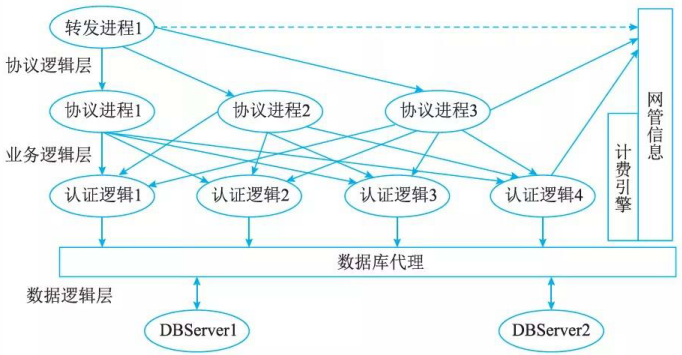

# 安全架构设计案例分析

## 电子商务系统的安全性设计

### 原理介绍

认证、授权和审计 (Authentication Authorization and Accoun ting,  AAA) 是运行于宽带网络接入服务器上的客户端程序。 AAA 提供了一个用来对认证、授权和审计三种安全功能进行配置的一致的框架，实际上是对网络安全的一种管理。这里的网络安全主要指访问控制，包括哪些用户可以访问网络服务器？如何对正在使用网络资源的用户进行记账？下面简单介绍验证、授权和记账的作用。
(1) 认证 (Authenticati on): 验证用户是否可以获得访问权，认证信息包括用户名、用户密码和认证结果等。
(2) 授权(Authorization) :授权用户可以使用哪些服务，授权包括服务类型及服务相关信息等。
(3) 审计 (Accounting):记录用户使用网络资源的情况，用户 IP 地址、 MAC 地址掩码等。

RADIUS 服务器负责接收用户的连接请求，完成验证并把用户所需的配置信息返回给 BAS建立连接，从而可以获得访问其他网络的权限时， BAS 就起到了认证用户的作用。 BAS 负责把用户之间的验证信息传递通过密钥的参与来完成。用户的密码加密以后才能在网上传递，以避免用户的密码在不安全的网络上被窃取。

例如，用户 A 请求得到某些服务(如 PPP、 Telnet和 Rlogin等)，但必须通过 BAS, 由 BAS依据某种顺序与所连接服务器通信从而进行验证。用户 A 通过拨号进入 BAS, 然后 BAS 按配置好的验证方式(如 PPP、 PAP 和 CHAP 等)要求用户 A 输入用户名和密码等信息。用户 A 终端出现提示，用户按提示输入。通过与 BAS 的连接， BAS 得到这些信息。而后 BAS 把这些信息传递给响应验证或记账的服务器，并根据服务器的响应来决定用户是否可以获得他所请求的服务。

一个网络允许外部用户通过宽带网对其进行访问，这样用户在地理上可以分散。大量分散用户可以通过 DSLModem 等从不同的地方对这个网络进行随机的访问，用户可以把自己的信息传递给这个网络，也可以从这个网络得到自己想要的信息。由千存在内外的双向数据流动，网络安全就成为很重要的问题，因此对信息进行有效管理是必要的。管理的内容包括用户是否可以获得访问权、用户可以允许使用哪些服务，以及如何对使用网络资源的用户进行计费。 AAA很好地完成了这 3 项任务。

### 软件架构设计

RADIUS 软件主要应用于宽带业务运营的支撑管理，是一个需要可靠运行且高安全级别的软件支撑系统。 RADIUS 软件的设计还需要考虑一个重要的问题，即系统高性能与可扩展性。

电信数据业务的开展随着我国宽带业务的开展，在宽带接入方式、宽带业务管理等诸多方面均会发生变化，以适应市场的发展。业务的发展对 RADIUS 软件架构的设计就是重中之重了，其设计将会直接影响系统可持续建设的质量与成本。通过深入分析，高性能的 RADIUS 软件架构核心如图 18-24 所示。

RADIUS 软件架构分为三个层面：协议逻辑层、业务逻辑层和数据逻辑层。

协议逻辑层主要实现 RFC 框架中的内容，处理网络通信协议的建立、通信和停止方面的工作。在软件功能上，这个部分主要相当于一个转发引擎，起到分发处理的内容分发到不同的协议处理过程中，这一层的功能起到了协议与业务处理的分层处理的作用。

业务逻辑层的设计是 RADIUS 软件架构设计的核心部分，架构设计的好坏将直接关系到应用过程中能否适应 RADIUS 协议扩展部分的实现，更重要的是会直接影响到用户单位的业务能否顺利开展。协议处理进程主要是对转发引擎发来的包进行初步分析，并根据包的内容进一步分发到不同的业务逻辑处理进程。协议处理进程可以根据项目的情况，配置不同的协议进程数，提高包转发与处理的速度。业务逻辑进程分为认证、计费和授权三种类型，不同的业务逻辑进程可以接收不同协议进程之间的信息并进行处理。转发进程与协议进程之间采用共享内存的方法，实现进程之间的通信。协议进程与业务逻辑处理进程之间采用进程加线程的实现方法，这样实现的好处在于不需要对业务处理线程进行应用软件层面的管理，而由 UNIX 系统进行管理，进一步提高应用系统处理的效率与质量。

数据逻辑层需要对来自业务逻辑处理线程统一管理与处理数据库代理池的数据，由数据库代理池统一连接数据库，以减少对数据库系统的压力。同时减小了系统对数据库的依赖性，增强了系统适应数据库系统的能力。

RADIUS 软件分层架构的实现，一是对软件风险进行了深入的分析，并且在软件实现的过程中得到更多的体现；二是可以构建一个或多个重用的构件单元，同时也可以继承原来的成果。BAS 和 RADIUS 之间验证信息的传递是通过密钥的参与来完成的。从原来的窄带拨号上网到现在的宽带接入、无线接入，在信息加密方面从传统的 MD5 、 PAP 和 CHAP 方式增加了 EAP-tls 、P-ttls 和 EAP-si m 等多种格式。基于分层架构的协议处理进程有自然的灵活性，可快速适应 RFC指南中增加的内容。

RADIUS 的功能，一是实际处理大量用户并发的能力，二是软件架构的可扩展性。负载均衡是提高 RADIUS 软件性能的有效方法，它主要完成以下任务。
(1) 解决网络拥塞问题，就近提供服务，实现地理位置无关性。
(2) 为用户提供更好的访问质量。
(3) 提高服务器响应速度。
(4) 提高服务器及其他资源的利用效率。
(5) 避免了网络关键部位出现单点失效。

当同时在线的宽带用户量巨大时， BAS 发送给后台 RADIUS 的用户数据更新包的数量会急剧增加， RADIUS 服务器的处理能力就成为性能瓶颈。当包的数量大千 RADIUS 服务器的处理能力时，就会出现丢包，造成用户数据的丢失或不完整。

通过代理转发的方式，把从 BAS 发送过来的数据包平均分发到其他 RADIUS 服务器中进行处理，实现 RADIUS 服务器之间的负载均衡。

RADIUS 高性能还体现在自我管理的功能，该功能包括 UNIX 守护管理监控和进程管理监控。在有故障时，服务进程能内部调度进程，以协调进程的工作情况。同时对 RADIUS 报文进行 SNMP 的代理管理，向综合网络管理乎台实时发送信息。

## 基千混合云的工业安全架构设计

跨区域的安全生产管理是大型集团企业面临的主要生产问题。大型企业希望可以通过云计算平台实现异地的设计、生产、制造、管理和数据处理等，并确保企业内部生产的安全、保密和数据的完整。

目前，混合云架构往往被大型企业所接受。混合云融合了公有云和私有云，是近年来云计算的主要模式和发展方向。我们知道私有云主要是面向企业用户，出于安全考虑，企业更愿意将数据存放在私有云中，但是同时又希望可以获得公有云的计算资源，在这种情况下混合云被越来越多地采用，它将公有云和私有云进行混合和匹配，以获得最佳的效果，这种个性化的解决方案，达到了既省钱又安全的目的。

从企业对混合云的需求来看，企业要想将内部服务器与一个或多个混合云架构融合在一起，从技术上讲是一种挑战，想简单地增加一段代码是无法将虚拟服务器与公有云对接起来的，这涉及潜在的数据迁移、安全问题，以及建立应用与混合云架构映射等问题。因此，要分析企业究竟想在混合云架构中放什么，哪些必须保留在混合云架构内部？哪些可以放到混合云中？实际上混合云架构大量数据都是开放的，所有 Web 页面以及公司公共站点上的大多数数据都可以放在公有混合云架构上，需求时能够进行扩展以应对日常的负载模式。

图 18-25 给出了大型企业采用混合云技术的安全生产管理系统的架构，企业由多个跨区域的智能工厂和公司总部组成，公司总部负责相关业务的管理、协调和统计分析，而每个智能工厂负责智能产品的设计与生产制造。智能工厂内部采用私有云实现产品设计、数据共享和生产集成等，公司总部与智能工厂间采用公有云实现智能工厂间、智能工厂与公司总部间的业务管理、协调和统计分析等。整个安全生产管理系统架构由三层组成，设备层、控制层、设计管理层和应用层。设备层主要是指用于智能工厂生产产品所需的相关设备，包括智能传感器、工业机器人和智能仪器；控制层主要是指智能工厂生产产品所需要建立的一套自动控制系统，控制智能设备完成生产工作，包括数据采集与监视控制系统 (SCADA) 、集散控制系统 (DCS) 、现场总线控制系统 (FCS) 、顺序控制系统 (PLC) 和人机接口 (HMI) 等；设计／管理层是指智能工厂各种开发、业务控制和数据管理功能的集合，实现数据集成与应用，包括：企业生产信息化管理系统 (MES) 、计算机辅助设计／工程／制造 C CAD/CAE/CAM 等， CAx) 、供应链管理 (SCM) 、企业资源计划管理 (ERP) 、客户关系管理 (CRM) 、商业智能分析 (BI) 和产品生命周期管理系统 (PLM); 应用层主要是指在云计算平台上进行信息处理，主要涵盖两个核心功能，一是“数据“，应用层需要完成数据的管理和数据的处理，二是“应用“，仅仅管理和处理数据还远远不够，必须将这些数据与行业应用相结合，本系统主要包括定制业务、协同业务和产品服务等。

在设计基于混合云的安全生产管理系统中，需要重点考虑 5 个方面的安全问题。设备安全、网络安全、控制安全、应用安全和数据安全。

(1)设备安全。设备安全是指企业(单位)在生产经营活动中，将危险、有害因素控制在安全范围内，以及减少、预防和消除危害所配置的装置(设备)和采用的设备。安全设备对于保护人类活动的安全尤为重要。设备安全的保障技术主要包括维护、保养和检测等。
(2) 网络安全。网络安全是指网络系统的硬件、软件及其系统中的数据受到保护，不因偶然的或者恶意的原因而遭受到破坏、更改、泄露，系统连续可靠正常的运行。网络安全的保障技术主要包括防火墙、入侵检测系统部署、漏洞扫描系统和网路板杀毒产品部署等。
(3) 控制安全。控制安全主要包括三种措施，其一是减少和消除生产过程中的事故，保证人员健康安全和财产免受顺势；其二是生产过程中涉及的计划、组织、监控、调节和改进等一系列致力千安全所进行的管理活动。包括安全法规、安全技术和工业卫生等；其三是减少甚至消除事故隐患，尽量把事故消失在萌芽状态。控制安全的保障技术主要包括冗余、容错、(降级)备份、容灾等。
(4) 应用安全。应用安全，顾名思义就是保障应用程序使用过程和结果的安全。简言之，就是针对应用程序或工具在使用过程中可能出现计算、传输数据的泄露和失窃，通过其他安全工具或策略来消除隐患。应用安全的保障技术主要包括服务器报警策略、用户密码策略、用户安全策略、访问控制策略和时间策略等。
(5) 数据安全。数据安全是指通过采取必要措施，确保数据处于有效保护和合法利用的状态，以及具备保障持续安全状态的能力。要保证数据处理的全过程的安全，就得保证数据的在收集、存储、使用、加工、传输、提供和公开等的每一个环节内的安全。数据安全的保障技术主要包括对立的两方面：一是数据本身的安全，主要是指采用现代密码算法对数据进行主动保护，如数据保密、数据完整性、双向强身份认证等；二是数据防护的安全，主要是采用现代信息存储手段对数据进行主动防护，如通过磁盘阵列、数据备份、异地容灾等手段保证数据的安全。本系统的数据安全主要分布千各层之间数据交换过程和共有云的数据存储安全。

