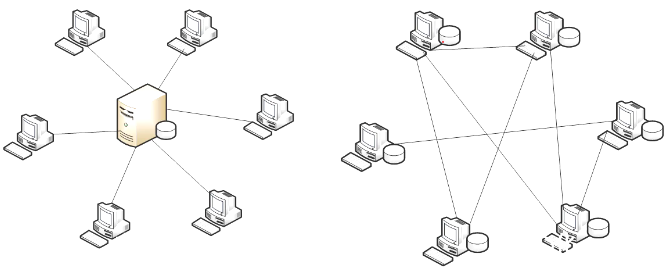
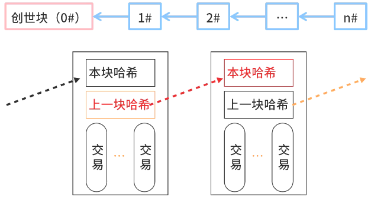
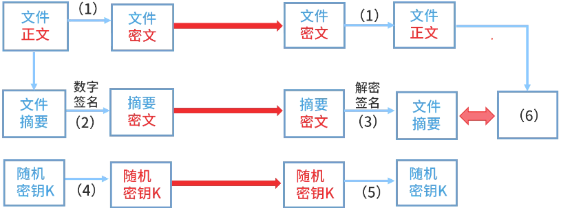

# 区块链

区块链的特点:

- 去中心化：由于使用分布式核算和存储，不存在中心化的硬件或管理机构，任意节点的权利和义务都是均等的，系统中的数据块由整个系统中具有维护功能的节点来共同维护。
- 开放性：系统是开放的，如：区块链上的【交易信息是公开的】，不过【账户身份信息是高度加密的】。
- 自治性：区块链采用基于协商一致的规范和协议(比如一套公开透明的算法)，使得整个系统中的所有节点能够在去信任的环境自由安全地交换数据，使得对“人”的信任改成了对机器的信任，任何人为的干预不起作用。
- 安全性(信息不可篡改)：数据在多个结点存储了多份，篡改数据得改掉51%结点的数据，这太难。同时，还有其它安全机制，如：比特币的每笔交易，都由付款人用私钥签名，证明确实是他同意向某人付款，其它人无法伪造。 
- 匿名性(去信任)：由于节点之间的交换遵循固定的算法，其数据交互是无需信任的(区块链中的程序规则会自行判断活动是否有效)，因此交易对手无须通过公开身份的方式让对方自己产生信任，对信用的累积非常有帮助。 

比特币底层采用了区块链技术。

1. 链表在多个结点存储，没有中心结点，数据不一致时，以“少数服从多数”原则执行。
2. 所以要篡改成功，除非篡改51%的结点。

哈希加密/防篡改

共识算法(博弈论)/全民记账

一般有：POW(工作量证明)、PoS(权益证明)、DPoS(股份授权证明机制)。
比特币采用了POW(工作量证明)：

- 争夺记账权 = 挖矿。
- 计算出来的账单结点哈希值前13个字符为0，则符合规则，得到记账权。有一个结点计算出结果，则广播消息告知其它结点，其它结点更新数据。
- 计算困难，但验证却很容易，例如：218903 = 哪两个质数的乘积？答案是457*479 。 

🔒题目

1. 以下关于区块链应用系统中“挖矿”行为的描述中，错误的是(  )。

    - A. 矿工“挖矿”取得区块链的记账权，同时获得代币奖励
    - B. “挖矿”本质上是在尝试计算一个Hash碰撞
    - C. “挖矿”是一种工作量证明机制
    - D. 可以防止比特币的双花攻击 

    答案: D

2. 随着科技进步、社会发展，尤其是以计算机为代表的信息技术飞速发展，各种信息呈爆炸式发展。计算机及信息技术的应用领域在不断扩展，计算机在政府、企业、民生等各个领域中都得到越来越广泛的应用，安全问题也日益突显。近来火热的区块链技术的核心便是一系列的信息安全技术。

    1. (5分)请从以下选项中选出与区块链相关的技术，最多选5个，多选不得分。BCDIK

        A. 对称加密  B. 非对称加密  C. 时间戳  D. 哈希函数  E. 数字信封  F. 数字证书  H. 二维表结构  I. 智能合约  J. CA认证  K. POS

    2. (8分)属于哈希算法，哈希算法作用包括 (2)CEGK 。

        A. 3DES  B. PGP  C. MD5  D. RSA(2048)  E. SHA  F. IDEA  G. 用于保障信息完整性 H. 用于保障信息可用性  I. 用于信息加密  J. 用于数字签名  K. 用于防篡改 

    3. (12分)某军区要架设一套内部文件安全传输系统，该文件以加密方式传输，支持最大2G的单个文件传输，为保障安全可靠性，发送者不可抵赖发送过的文件，若文件被第三方截获，第三方无法解密也无法篡改其内容。根据此需求，架构设计师王工设计了如下的安全架构： 

        

        请用以下选项补充图中缺失部分：
        (a) 发送方公钥Pa
        (b) 发送方私钥Sa
        (c) 接收方公钥Pb
        (d) 接收方私钥Sb
        (e) 随机密钥K
        (f) 文件密文
        (g) 文件摘要 

2. 阅读下列说明，回答问题1至问题3，将解答填入答题纸的对应栏内。

    【说明】访问控制是保障信息系统安全的主要策略之一，其主要任务是保证系统资源不被非法使用和非常规访问。访问控制规定了主体对客体访问的限制，并在身份认证的基础上，对用户提出的资源访问请求加以控制。

    1. (6分)针对信息系统的访问控制包含哪三个基本要素？

    2. (7分)BLP模型是一种强制访问控制模型，请问：
        1. BLP模型保证了信息的机密性还是完整性？
        2. BLP模型采用的访问控制策略是上读下写还是下读上写？ 

    3. (12分)ISO安全体系结构包含的安全服务有：①鉴别服务；②访问控制服务；③数据保密性服务；④数据完整性服务；⑤抗否认性服务。请问：

        1. 针对跨站伪造请求攻击可以采用哪种安全服务来解决或者缓解？
        2. 针对口令明文传输漏洞攻击可以采用哪种安全服务来解决或者缓解？
        3. 针对签名伪造攻击可以采用哪种安全服务来解决或者缓解？
        4. 如果下载的软件被植入木马，可以采用哪种安全服务来进行解决或者缓解？