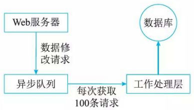
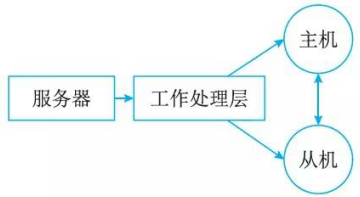

# 传统数据处理系统存在的问题

数据量从兆字节 (MB) 、吉字节 (GB) 的级别到现在的太字节 (TB) 、柏字节 (PB) 级别，数据量的变化促使数据管理系统 (DBMS) 和数据仓库 (Data Warehouse,  DW) 系统也在悄然地变化着。传统应用的数据系统架构设计时，应用直接访问数据库系统。当用户访问量增加时，数据库无法支撑日益增长的用户请求的负载，从而导致数据库服务器无法及时响应用户请求，出现超时的错误。

出现这种情况以后，在系统架构上就采用如图 19-1 的架构，在 Web 服务器和数据库中间加入一层异步处理的队列，缓解数据库的读写压力。

当 Web 服务器收到页面请求时，会将消息添加到队列中。在数据库端，创建一个工作处理层定期从队列中取出消息进行处理，例如每次读取 100 条消息。这相当于在两者之间建立了一个缓冲。

但是，这一方案并没有从本质上解决数据库过载(Overload) 的问题，且当工作处理层无法跟上业务对于数据修改的请求时，就需要增加多个工作处理层并发执行，数据库又将再次成为响应请求的瓶颈。一个解决办法是对数据库进行分区 (Hori zontal Partitioni ng)。分区的方式通常以 Hash 值作为 key。这样就需要应用程序端知道如何去寻找每个 key所在的分区。

但即便如此，问题仍然会随着用户请求的增加接踵而来。当之前的分区无法满足负载时，就需要增加更多分区，这时就需要对数据库进行 reshard 。 resharding的工作非常耗时而痛苦，因为需要协调很多工作，例如数据的迁移、更新客户端访问的分区地址，更新应用程序代码。如果系统本身还提供了在线访问服务，对运维的要求就更高。这种情况下，就可能导致数据写到错误的分区，因此必须要编写脚本来自动完成，且需要充分的测试。

由此可见，在数据层和应用中增加了缓冲隔离，数据量的日渐增多仍然迫使传统数据仓库的开发者一次又一次挖掘系统，试图在各个方面寻找一点可提升的性能。架构变得越来越复杂，增加了队列、分区、复制、重分区脚本 (Resharding Scripts) 。应用程序还需要了解数据库的schema, 并能访问到正确的分区。问题在千：数据库对千分区是不了解的，无法帮助你应对分区、复制与分布式查询。

最严重的问题是系统并没有对人为错误进行工程设计，仅靠备份是不能治本的。归根结底，系统还需要限制因为人为错误导致的破坏。然而，数据永不止步，传统架构的性能被压椋至极限，检索数据的延迟和频繁的硬件错误问题逐渐使用户不可接受，在传统架构上进行继续挖掘被证明是“挤牙膏＂。

越来越多的开发者参与到新技术与新架构的研究探讨中，结论与成果逐渐丰硕。人们发现，当系统的用户访问量持续增加时，就需要考虑读写分离技术 (Master-Slave)和分库分表技术。常见读写分离技术架构如图 19-2 所示。现在，数据处理系统的架构变得越来越复杂了，相比传统的数据库，一次数据处理的过程增加了队列、分区、复制等处理逻辑。应用程序不仅仅需要了解数据的存储位置，还需要了解数据库的存储格式、数据组织结构 (schema) 等信息，才能访问到正确的数据。

