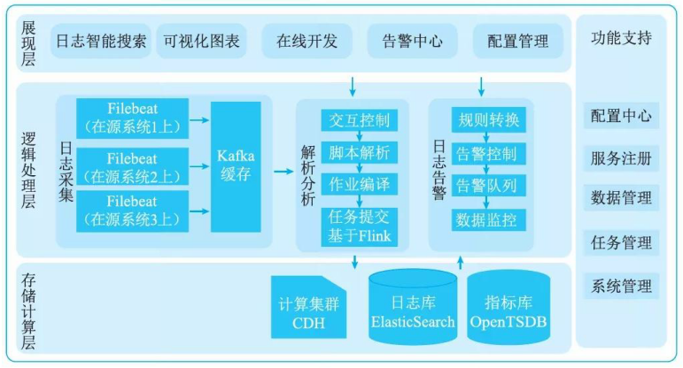

# 大数据架构设计案例分析

## Lambda架构在某网奥运中的大数据应用

### 系统建设背景

某网作为某电视台在互联网上的大型门户入口， 2016 年成为里约奥运会中国大陆地区的待权转播商，独家全程直播了里约奥运会全部的赛事，令某网各终端网络播放量屡创新高，同时积累了庞大稳定的用户群，这些用户在使用各类服务过程中产生了大量数据，对这些海量数据进行分析与挖掘，将会对节目的传播及商业模式变现起到重要的作用。

### 数据需求与场景

里约奥运期间需要对增量数据在当日概览和赛事回顾两个层面上进行分析。其中，当日概览模块需要秒级刷新直播在线人数、网站的综合浏览量、页面停留时间、视频的播放次数和平均播放时间等于万级数据量的实时信息，而传统的分布式架构采用重新计算的方式分析实时数据，在不扩充以往集群规模的情况下，无法在几秒内分析出需要的信息。 Lambda 架构实时处理层采用增量计算实时数据的方式，可以在集群规模不变的前提下，秒级分析出当日概览所需要的信息。赛事回顾模块需要展现自定义时间段内的历史最高在线人数、逐日播放走势、直播最高在线人数和点播视频排行等海量数据的统计信息，由于奥运期间产生的数据通常不需要被经常索引、更新，因此要求采用不可变方式存储所有的历史数据，以保证历史数据的准确性。Lambda 架构的批处理层采用不可变存储模型，不断地往主数据集后追加新的数据，恰好可以满足对奥运数据的大规模统计分析要求。

### 系统架构

某网采用以 Lambda 架构搭建的大数据平台处理里约奥运会大规模视频网络观看数据，具体平台架构设计如图 19-13 所示。

该平台基于 Lambda 架构，由数据集成层、数据存储层、数据计算层和数据应用层构成。数据集成层支持将 PC 端、 App端和 TV 端采集到的用户行为数据进行整理，数据集成层分为离线数据集成和实时数据集成两部分。实时数据集成集群采用 Nginx 和 Flume 服务器对实时流数据聚合并传输至 Kafka 队列中，由 Kafka 将实时流数据分发至实时流计算引擎中分析。离线数据集成集群使用开源组件 sqoop将数据不断追加存储到主数据集中，采用分布式列数据库 Hbase存储主数据集。两个集群之间通过 Kafka 的 Mirror 功能实现同步。

本平台利用云存储技术构建平台的存储系统，该存储系统不仅集成了分布式列数据 Hbase 、内存关系型数据库 MemSQL, 而且还增加了统一的监控管理功能和开放更多的访问接口。数据存储将结构化数据、半结构化数据以及非结构化数据储存于分布式文件系统中，且数据以三重副本的形式分布在文件系统，支持自动存储容错、系统错误监控、故障自动迁移等技术，确保数据的安全性和接近 100％的数据可用性。

数据计算层为了实现 I/0 的负载分离，通过对实际业务解析，将数据计算层分为离线计算、实时计算和合并计算三部分。

(1) 离线计算部分除了存储持续增长的批量离线数据外，还会定期使用 Spark 和 M-R 对离线数据进行简单的预运算，将大数据变小，从而降低资源损耗，提升实时查询的性能，并最终将预运算结果更新到 Batch Vi ew 。离线计算通过使用最新的 Hadoop节点驱动调度算法来保证数据量大的任务能得到较公平的获取计算资源，同时使用 Impala 或者Hive 建立数据仓库，将离线计算的结果写入 HDFS 中。

(2) 时效性是大型活动难以解决却不得不面对的问题，在大型活动中的很多场景，数据会不断实时生成并累计，需要系统实时查询处理，实时计算部分正是用来处理这类增量的实时数据。为保证时效性，实时计算采用 Spark Streaming仅处理最近的数据，并将处理后的数据更新到 real-time vi ew, 它做的是一种增量的计算，而非重新运算。

(3) 合并计算部分用于响应用户的查询请求，合并 Batch Vi ew 和 Real-time Vi ew 中的结果到最终的数据集。合并计算将内存关系型数据库 MemSQL 内的数据与离线预运算后的数据合并，写入分布式列数据库 Hbase 中，从而为最终的查询提供支撑。

### 应用效果

在数据展现层用户可以通过调用数据计算层的相应接口，简单快速进行算法编程，从而呈现出当日概览、赛事回顾等模块的信息。当日概览模块通过实时计算引擎中的 Spark Streaming, 计算直播实时在线人数、地域和频道分布等信息，并实时呈现到前端界面中。在合并计算中查询网站的综合浏览量、页面停留时间、视频的播放次数和平均播放时间等增量数据。而对赛事回顾模块需要呈现的自定义时间段内的历史最高在线人数、逐日播放走势、直播最高在线人数和点播视频排行等数据的统计信息，可以使用离线计算模块查询这种不断追加的离线数据。

## Lambda架构在某网广告平台的应用与演进

### 系统建设背景

某网广告乎台依托于某网微商城，帮助商家投放广告。通过某网广告平台，商家可以在腾讯广点通、云堆、小博无线等流量渠道投放广告。对于某网广告平台，除了提供基础的广告编辑、投放、素材管理等功能，最重要的就是广告的投放效果的展示、分析功能。某网广告平台的数据分析模块提供了不同的时间维度(天、小时)，不同的实体维度(广告计划、广告、性别、年龄、地域)下的不同类型指标(曝光、点击、花费、转化下单、增粉数)的分析。所有这些数据都是秒级到 lOmin 级别的准实时数据，为了做到将实时数据和离线数据方便的结合，引入了大数据系统的 Lambda 架构，并在这样的 Lambda 架构的基础下演进了几个版本。

### 数据需求与场景

大数据处理技术需要解决数据的可伸缩性与复杂性。首先要很好地处理分区与复制，不会导致错误分区引起查询失败。当需要扩展系统时，可以非常方便地增加节点，系统也能够针对新节点进行 rebalance 。其次是要让数据成为不可变的。原始数据永远都不能被修改，这样即使犯了错误，写了错误数据，原来好的数据并不会受到破坏。

某网广告平台展示的数据指标包含两类：曝光类(包括曝光数、点击数、点击单价、花费)，转化类(包括转化下单数、转化下单金额、转化付款数、转化付款金额)。前一类的数据主要由流量方以接口的方式提供(比如对接的腾讯广点通平台)，后一类则是某网特有的数据，通过买家的浏览、下单、付款日志算出来。

### 系统架构

#### 第一版架构

第一版采用了典型的 Lambda 架构形式，架构图如 19-14 所示。批处理层每天凌晨将 Kafka中的浏览、下单消息同步到 HDFS 中，再将 HDFS 中的日志数据解析成 Hive 表，用 Hive Sql/ Spark Sql 计算出分区的统计结果 Hive 表，最终将 Hive 表导出到 MySQL 中供服务层读取。另一方面，曝光、点击、花费等外部数据指标则是通过定时任务，调用第三方的 API ，每天定时写入另一张 MyS QL 表中。

实时处理层则是用 Spark S treaming程序监听 Kafka 中的下单、付款消息，计算出每个追踪链接维度的转化数据，存储在 redi s 中。

服务层则是一个Java 服务，向外提供 http接口。Java 服务读取两张 MySQL 表和一个 Redi s库的数据。

第一版的数据处理层比较简单，性能的瓶颈在Java 服务层。Java 服务层收到一条数据查询请求之后，需要查询两张 MySQL 表，按照聚合的维度把曝光类数据与转化类数据合并起来，得到全量离线数据。同时还需要查询业务 MyS QL, 找到一条广告对应的所有 redi s key,再将redi s 中这些 key的统计数据聚合，得到当日实时的数据。最后把离线数据和实时数据相加，返回给调用方。

这个复杂的业务逻辑导致了Java 服务层的代码很复杂，数据量大了之后性能也跟不上系统要求。

另一方面，实时数据只对接了内部的 Kafka 消息，没有实时的获取第三方的曝光、点击、浏览数据。因此，第一版虽然满足了历史广告效果分析的功能，却不能满足广告操盘手实时根据广告效果调整价格、定向的需求。

#### 第二版架构

针对第一版的两个问题，在第二版对数据流的结构做了一些修改。在实时处理层做了一个常驻后台的Python 脚本，不断调用第三方 API 的小时报表，更新当日的曝光数据表。这里有一个小技巧：由千第三方提供的 API 有每日调用次数上限的限制，将每天的时间段分为两档：1:00 —8:00 为不活跃时间段， 8:00 至第二天 1:00 为活跃时间段，不活跃时间段的同步频率为30min 一次，活跃时间段为 lOmin 一次。每次同步完数据之后会根据当天消耗的 API 调用次数和当天过去的时间来计算出在不超过当天调用次数前提下，下一次调用需要间隔的时间。同步脚本会在满足不超过当天限额的前提下尽可能多的调用同步 API 。从而避免了太快消耗掉当日的调用限额，出现在当天晚上由于达到调用限额而导致数据无法更新的情况。在批处理层，把转化数据表和曝光数据表导入到 Hive 中，用Hive Sql 做好join, 将两张表聚合而成的结果表导出到 MySQL, 提供给服务层

完成第二版改动之后，Java 服务的计算压力明显下降。性能的瓶颈变成了查询 redi s 数据这一块。由于 redi s 里面的实时数据是业务无关的，仅统计了追踪链接维度的聚合数据。每次查询当日的转化数据，需要现在 MySQL 中查询出广告和跟踪链接的关系，找出所有的跟踪链接，再查询出这些跟踪链接的统计数据做聚合。

另一方面，离线计算的过程中涉及多次 MySQL 和 Hive 之间的导表操作，离线任务依赖链比较长，一旦出错，恢复离线任务的时间会比较久。

#### 第三版架构

考虑到 MySQL 方便聚合、方便服务层读取的优点，在第三版中对 Lambda 架构做了一些改动，在数据层面只维护一张包含所有指标的 MyS QL 表。 MySQL 表的 stday(统计日期)字段作为索引， stday=当天的保存实时数据， st_day＜当天的保存离线数据。

第三版只维护一张 MyS QL 数据统计表，每天的离线任务会生成两张 hive 表，分别包含转化数据和曝光数据。这两张 Hive 表分别更新 MyS QL 表的 st_day。

在实时数据这块，常驻后台的 Python 脚本更新 stday＝当天的数据的曝光类字段。 sparkstreami ng程序在处理 kafka 中的实时下单消息时，不再统计数据到 redi s, 而是请求业务Java 服务暴露出来的更新数据接口。在更新数据的接口中，找到当前下单的追踪链接所属的广告，更新 MySQL 中 stday=当天的数据的转化类字段。这样就把查询阶段的关联操作分散在了每条订单下单的处理过程中，解决了实时数据查询的瓶颈。最终的Java 服务层也只需要读取一个MyS QL 表，非常简洁。

### 应用效果

某网广告平台经历了三版的数据架构演进，历时大半年，最终做到了结合内部、外部两个数据源，可以在多维度分析离线＋实时的数据。在数据架构的设计中，一开始完全遵照标准的 Lambda 架构设计，发现了当数据来源比较多的时候，标准 Lambda 架构会导致服务层的任务过重，成为性能的瓶颈。后续两版的改进都是不断地把本来服务层需要做的工作提前到数据收集、计算层处理。第二版将不同来源的指标合并到了同一个 MyS QL 表中。第三版则将 redis数据与业务数据关联的工作从统计阶段提前到了数据收集阶段，最终暴露给服务层的只有一张MyS QL 表。

## 某证券公司大数据系统

### 系统建设背景

某证券作为证券业金融科技领域的先行者和探索者，其系统每天都会产生大量的日志。目前某证券的信息系统运维模式正经历着由自动化运维到智能化运维的转变，因传统监控需要各应用系统独立实现监控并将异常信息发送给运维平台告警，导致运维人员接到告警通知后需分别排查与定位各系统问题，从而大幅增加了沟通工作量与运维复杂性。特别是对于反映系统运行状态的技术指标或业务指标而言，因其大多分散在各个系统当中，很难实现统一管理。为更好地管理和利用日志数据，某证券依托大数据平台强大的数据处理、分析能力，创新打造了基于 Kappa 架构的实时日志分析平台，平台集日志集中管理、安全审计、业务实时监控、故障快速定位与预警于一体，可支待自动化分析系统功能热点和性能容量情况，进而有效预防可能发生的风险。

### 数据需求与场景

实时日志分析平台针对日志数据分析需求重点集中千三大核心功能，即日志智能搜索，可视化分析，全息场景监控。

日志智能搜索主要用来满足平台用户快速、便捷地搜索日志的需要，通过采用类似搜索引擎的文本检索方式，可提供分词搜索、全文检索等丰富的搜索功能。同时，为满足用户对日志局部搜索的需求，平台还可对日志内容进行映射转换形成日志指标，并将日志内容搜索转换为日志指标查询。此外，除了基本的关键词搜索外，智能搜索方式也支持正则表达式以应对复杂的搜索场景，通过将日志内容提取转换形成日志变量，以及使用正则表达式筛选日志变量，能够呈现更为精准、专业的搜索结果。

日志可视化分析是平台发挥分析价值的利器，通过对各类交易耗时、数据库报错、 CPU 使用率、网络读写速率、调用错误码等各种交易健康度指标的可视化展示，可高效满足不同部门的日志数据展示需求，同时降低各部门获取信息的门槛，为智能监控、系统优化、业务连续性等提供有效的数据支撑，充分发挥日志数据的应用价值。此外，通过统计分析相应的日志数据，还可预判交易状态、制定应急预案，进一步提高系统的服务能力。

全息场景监控主要用于实现对业务处理状态、系统性能容量的实时智能监控和趋势预判，并辅以自动化处理工具，以提高故障的自愈能力。通过自动化监控，运维人员将可以快速进行故障排查和溯源，并针对每一次故障新增监控指标，从而提高监控预警覆盖度。同时，平台还支持基于单指标与多指标的多种异常检测算法，可智能地针对各指标实时变化趋势和抖动程度产生异常点预警，并自动推送到运维平台进行集中展现，从而减少人工干预，提高人机协同的工作效率。

### 系统架构

实时日志分析平台基千 Kapp a 架构，使用统一的数据处理引擎 Flink 可实时处理全部数据，并将其存储到 Elasti c-Search 与 Op enTSDB 中。实时处理过程如下：

(1)日志采集，即在各应用系统部署采集组件 Fi lebeat,实时采集日志数据并输出到 Kafka缓存。
(2) 日志清洗与解析，即基于大数据计算集群的 Flink 计算框架，实时读取 Kafka 中的日志数据进行清洗和解析，提取日志关键内容并转换成指标，以及对指标进行二次加工形成衍生指标。
(3) 日志存储，即将解析后的日志数据分类存储于 Elastic-Search 日志库中，各类基于日志的指标存储千 OpenTSDB 指标库中，供前端组件搜索与查询。
(4) 日志监控，即通过单独的告警消息队列来保待监控消息的有序管理与实时推送。
(5) 日志应用，即在充分考虑日志搜索专业需求的基础上，平台支持搜索栏常用语句保存，选择日志变量自动形成搜索表达式，以及快速按时间排序过滤、查看日志上下文等功能。同时，基千可视化分析和全息场景监控可实时展现各种指标和趋势，并在预警中心查看各类告警的优先级和详细信息，进而结合告警信息关联查询系统日志内容来分析解决问题。此外，开发配置中心还提供了自定义日志解析开发功能，并支持告警规则、告警渠道配置。实时日志分析平台技术架构如图 19-15 所示。

实时日志分析平台基千以 Fli nk 为主的大数据实时计算技术和以 Elasti c-Search 为主的检索技术，形成了集日志数据采集、解析、 ETL 处理、指标聚合、图表展现等于一体的全流程服务能力，并实现了高吞吐量、实时化处理，使得海量日志数据资源得到了充分利用。同时，针对Flink 官方原生 API 不支待配置化开发的情况，海通证券自主研发了可配置化通用计算框架，通过实现底层处理方法抽象化，仅需配置定义 Kafka 数据源、日志处理脚本及目标 Elastic Search 索引，即可快速上线实时日志数据处理任务，从而在降低编码门槛的同时使其易于分析调试。此外，对千解析后的日志指标，还可通过 Flink SQL 语法定义实时处理 SQL 完成指标的多级加工，而配置、定义处理逻辑则均由前端交互实现。

### 应用效果

该平台的数据处理功能均基于 Kappa 架构实时处理框架实现，数据源头是 Fi lebeat从各系统中分布式采集的日志，然后再通过 Kafka 由 F link 实时计算引擎统一处理并输出到ElasticSearch 与 OpenTSDB 中存储。 ElasticSearch 主要负责实时存储日志数据以及历史数据，以便千后续查询。此外，平台还可基于实时日志流形成实时指标，并按照时间维度得到每日、每周、每月的指标汇总值，或是在 OpenTSDB 时序数据库中查询指标的历史值。

在脚本实时计算中，对千日志的解析逻辑，可通过多层转换将前端的脚本逻辑转换为执行 Fli nk 实时计算任务。其中，解析逻辑主要采用易上手的 Ruby脚本语法结合 Log stash 语法实现，之后再由转换插件将脚本转换为 Fl i nk 可执行算子，并推送到 CDH 集群上，通过 Yarn分配资源执行计算。在此模式下，平台既保持了类 Logstash 脚本简易语法，又运用到了大数据集群的 Fl i nk 分布式计算能力，从而可在保待高性能的同时，大幅降低实时解析程序的开发难度。

对于时序化的日志指标数据通常是以时序的方式存储在时序数据库 OpenTSDB 中，以满足实时读写的需要，并支持按时间轴快速钻取数据。

## 某电商智能决策大数据系统

### 系统建设背景

作为行业领先的外卖平台，某电商在云计算、大数据以及算法平台做了许多创新性的工作。某电商外卖平台接入了众多商家，如何根据用户实时的点击、出价以及广告的曝光，商家实时的出价数据，计算出合适的报价数据和算法的决策参数，使得广告主的利益最大化，是一个关键的问题。某电商外卖依托大数据平台强大的数据处理、分析能力，创新打造了基千 Kappa 架构的智能决策大数据系统。平台集业务实时监控、实时计算，故障快速定位与预警千一体，可支持自动化分析当前实时流数据，实时计算并更新算法模型，并且支持多种算法框架和故障快速恢复等功能。

### 数据需求与场景

传统的参数和模型计算均是依赖于人工调参，模型计算也大多采用离线计算的模式。为了提升算法的迭代速度和模型的更新速度，某电商打造了基于 Kappa 架构的智能决策大数据系统。该系统集中于三大核心功能：实时数据的处理、参数计算和迭代、参数本地存储。

实时数据的处理主要用来处理用户对广告的点击、下单以及广告商的出价和广告的曝光等数据。根据业务的需求，大数据系统基于 Flink 计算集群，过滤需要用于计算的字段，并且根据指定的时间段，聚合指定时间窗口的数据，计算完成后，将结果数据存入到 Tai r 分布式缓存中，供决策服务使用。

参数计算和迭代，这个过程主要在决策服务的服务端中完成，决策服务引入了多种算法框架，可根据不同业务工程的需求，计算生成特定的决策参数和模型。主要过程如下，首先从Tair 读出之前的参数，以及上个阶段计算得到的数据，在之前参数的基础上进行计算得到最新的决策参数和模型，并且将新的参数存储到 Tair 中，记录日志到Hive 。

参数本地存储，该过程发生在决策服务的客户端，业务方系统需要引入决策服务的客户端工程，当决策服务计算出新的决策参数时，会通过 Zookeep er 通知客户端，客户端得到通知后，会从服务端拉取最新参数并进行本地存储，并且提供相应接口供业务方系统使用。

### 系统架构

实时智能决策大数据平台基于 Kappa 架构，使用统一的数据处理引擎 Flink 可实时处理流数据，并将其存储到 Hi ve 与 Tair 中，以供后续决策服务的使用。实时处理的过程如下：一是数据采集，即 B 端系统会实时收集用户的点击，下单以及广告的曝光和出价数据并输出到 Kafka 缓存。

二是数据的清洗与聚合，即基千大数据计算集群 Fli nk 计算框架，实时读取 Kafka 中的实时流数据，过滤出需要参与计算的字段，根据业务需求，聚合指定时间端的数据并转换成指标。

三是数据存储，即将 Fli nk 计算得到数据存储到 Hive 日志库中，需要参与模型计算计算的字段存储到 Tai r 分布式缓存中。当需要进行模型计算时，决策服务会从 Ta i r 中读取数据，进行模型的计算，得到新的决策参数和模型。决策服务基千微服务架构，客户端部署在业务方系统中，服务端主要用千计算决策参数和模型，当服务端计算得到新的参数，此时会通过Zookeep er 通知部署到业务方系统的客户端，客户端此时会拉取新的参数并存储到本地，并且客户端提供了获取参数的接口，业务方可以无感知调用。智能决策大数据平台技术架构如图 19-16 所示。

### 应用效果

一是计算结果的准确性方面，由于之前的数据集采用的离线词表的方式，当天计算参数所使用的数据集是前一天产生的数据集，因此数据只能用于 T+l 的参数计算中，当天产生的数据无法实时的参与计算，应用基于 Kappa 架构实时处理框架，能够将 B 端产生的实时流数据用于决策服务中，极大地提升了参数和模型计算的准确性。

二是业务方系统响应的及时性，由千参数计算在服务端完成，服务端计算完成后会通过Zoo keeper 通知客户端，客户端会拉取最新参数存储的到本地，业务方系统中会引入客户端，因此当业务方系统使用最新的参数，只需从本地获取即可，不会产生任何网络延迟，响应速度快。

