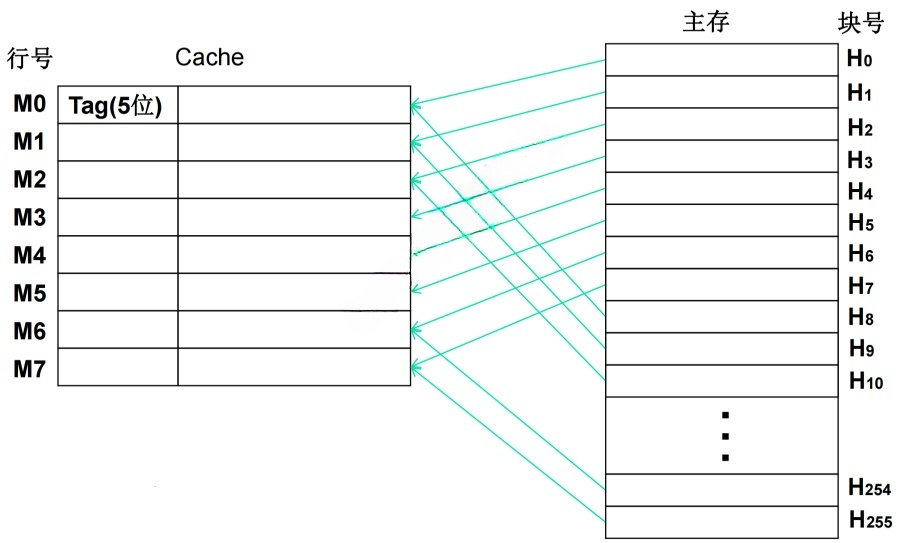
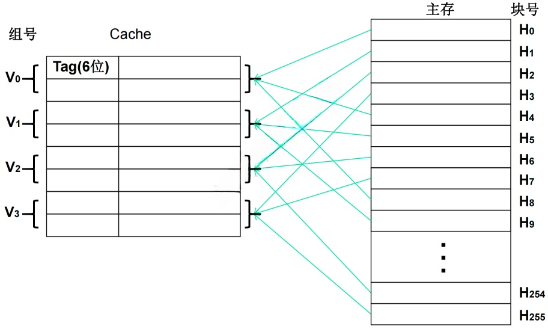

# 存储系统

## 最佳实践

### 考察问

1. 🟡🟩💚层次化存储结构
    1. `()`
    2. `()`
    3. `()`
    4. `()`
2. 🟡🟩💚Cache的性能指标
    1. $\text{命中率} = \frac{\text{cache完成存取次数}}{\text{cache完成存取次数}+\text{内存完成存取次数}}$
    2. $平均周期 = Cache的周期时间 * 命中率 + 主存的周期时间 * (1-命中率)$
3. 🟡🔴❤️主存编址
    1. 总片数 = `()` / `()`
    2. 内存总容量 = `()` * `()`
        1. 存储单元个数 = `()` - `()` + `()`
        2. 编址容量
            1. 按字(`()`bit)编址：存储体的存储单元是字存储单元，即最小寻址单位是一个字
            2. 按字节(`()`bit)编址：存储体的存储单元是字节存储单元，即最小寻址单位是一个字节
    3. 每个芯片容量 = `()` * `()`编址容量`
4. 🟡🟩💚二进制的K, M, G

    1. $1Kb = 2^10bit$
    2. $1Mb = 2^20bit$
    3. $1Gb = 2^30bit$

5. 🟡🟩💚$1B = 8bit$
6. 🟡🟩💚$1H = 16$

### 考察点

1. 层次化存储结构
    1. `CPU寄存器`
    2. `高速缓存`(Cache)
    3. `内存`
    4. `外存`
2. Cache的性能指标
    1. $\text{命中率} = \frac{\text{cache完成存取次数}}{\text{cache完成存取次数}+\text{内存完成存取次数}}$
    2. $平均周期 = Cache的周期时间 * 命中率 + 主存的周期时间 * (1-命中率)$
3. 主存编址
    1. 总片数 = `存储总容量` / `每个芯片容量`
    2. 内存总容量 = `存储单元个数` * `编址容量`
        1. 存储单元个数 = `最大地址` - `最小地址` + `1`
        2. 编址容量
            1. 按字(`1`bit)编址：存储体的存储单元是字存储单元，即最小寻址单位是一个字
            2. 按字节(`8`bit)编址：存储体的存储单元是字节存储单元，即最小寻址单位是一个字节
    3. 每个芯片容量 = `存储单元个数` * ``编址容量`
4. 二进制的K, M, G

    1. $1Kb = 2^10bit$
    2. $1Mb = 2^20bit$
    3. $1Gb = 2^30bit$

5. $1B = 8bit$
6. $1H = 16$

## 层次化存储结构

解决存储的容量、价格和速度之间的矛盾

|层级|名称|描述|
| ---- | ---- | ---- |
|1|CPU|寄存器(register)|
|2|Cache|静态随机存储器(static random-access memory, SRAM)|
|3|内存|动态随机存储器(dynamic random-access memory, DRAM)|
|4|外存|硬盘、光盘、U盘|

## Cache

高速缓存(Cache)位于CPU与主存之间，用于存储当前活跃的程序和数据。可以直接与CPU进行数据交互，容量小，速度为主存的5-10倍。其内容是主存的一个拷贝副本，对程序员来说是透明的，

使用 Cache 改善系统性能的依据是程序的局部性原理，包括时间局部性和空间局部性。

1. 时间局部性：最近被访问过的指令和数据很可能会被再次访问，比如循环操作。
2. 空间局部性：最近访问过的指令和数据往往集中在一小片存储区域中, 程序顺序执行。

### 主存与Cache的地址映射

在CPU工作时，输出的是主存单元的地址，然而数据的读写操作应在Cache存储器中进行。所以，必须将主存地址转换为Cache地址，这种转换过程被称为地址映像，且该映射由硬件自动完成。

- 全相联映像：主存中的任何一个数据块都能与Cache中的任意一行对应。

    - 映射方法：多对多
    - 优点：冲突概率小，Cache的利用率高
    - 缺点：硬件难实现，且需要一个访问速度很快、成本高的相联存储器
    - 适用场合：小容量Cache

    

- 直接映像：Cache中的一行固定对应主存中的若干行，例如通过主存块号对Cache总行数取模来确定对应关系。

    - 映射方法：一对多
    - 优点：硬件实现简单，成本低，地址变换速度快
    - 缺点：冲突概率高，且Cache空间利用率不高
    - 适用场合：大容量Cache

    

- 组相联映像：它结合了上述两种方式。先将Cache分组，组与组之间采用直接映射，而在组内采用全相联映射 。

    - 映射方法：一组对多
    - 优点：综合前两者的优点，又尽量避免其缺点，故被普遍采用

    

### Cache的替换策略

Cache替换算法的目标是使Cache获得尽可能高的命中率。

- 随机替换算法：从特定的行位置中随机地选取一行换出即可。特点： 硬件易实现，速度快；但命中率和工作效率在小容量Cache中不高。
- 先进先出算法（First In First Out，FIFO）：最先进入Cache的行被换出。
- LFU算法（Least Frequently Used，LFU）：被访问的行计数器增加1，值最小的行被换出。特点：不能反映近期cache的访问情况。
- LRU算法（Least Recently Used，LRU）：被访问的行计数器置0，其他的计数器增加1，换值最大的行。特点：符合cache的工作原理。

### Cache的性能指标

当CPU所访问的数据在Cache中时，直接从Cache中读取数据，即命中；否则，需要从主存中读取数据，即未命中。

命中率：在一个程序执行期间，设$N_{c}$表示cache完成存取的次数，$N_{m}$表示主存完成存取的总次数，$h$定义为命中率，则有

$h = \frac{N_{c}}{N_{c} + N_{m}}$ 

如果以$h$代表对Cache的访问命中率，$t_1$表示Cache的周期时间，$t_2$表示主存储器周期时间，以读操作为例，使用“Cache + 主存储器”的系统的平均周期为$t_3$，则：

$$t_3 = h\times t_1+(1 - h)\times t_2$$

其中，$(1 - h)$又称为失效率（未命中率）。

🔒💚假设cache的周期$t_1=1$, 主存储器周期$t_2=100$, 命中率$h=0.08$, 则平均周期$t_3 = 100 * 0.08 + 1 * 0.92= 1$. 比没有cache快了100倍.

## 主存编址

1. 总片数 = 存储总容量 / 每个芯片容量
2. 内存总容量 = 存储单元个数 * 编址内容
    1. 存储单元个数 = 最大地址 - 最小地址 + 1
    2. 编址内容
        1. 按字(1bit)编址：存储体的存储单元是字存储单元，即最小寻址单位是一个字
        2. 按字节(8bit)编址：存储体的存储单元是字节存储单元，即最小寻址单位是一个字节
3. 每个芯片容量 = 存储单元个数 * 编制内容

🔒❤️内存按字节编址，利用8K×4bit的存储器芯片构成84000H到8FFFFH的内存，共需（  ）片。

答案: 12片

1. 总容量 = 存储单元个数 x 编址容量. ✨这里编制内容是按字节, 所以为8bit

    1. = (8FFFFH - 84000H + 1) * 8bit ✨H是十六进制的标志, 而非具体数字
    2. = (8FFFFH + 1 - 84000H) * 8bit ✨个数要+1, 题目故意如此设计, 来简化计算, F是15, 然后加1, 正好进一位. 
    3. = (90000H - 84000H) * 8bit ✨0-4不够, 借一位, 尾巴是H十六进制, 既16-4=12, 记为C
    4. = C000H * 8bit
    5. = 12 x 16^3 x 8bit  ✨十六进制转十进制

2. 单位芯片容量

    8K x 4bit = 8 x 2^10 x 4bit  ✨K是2^10, 而不是1000

3. 单位芯片数 = 总容量/单位芯片容量

    12 x 16^3 x 8bit/8 x 2^10 x 4bit = 12

注意:

1. 计算机的千位进制

    $1kb = 2^10bit$
    $1Mb = 2^20bit$
    $1Gb = 2^30bit$

2. 字节和bit

    $1B = 8bit$

3. 十六进制

    $1H = 16$