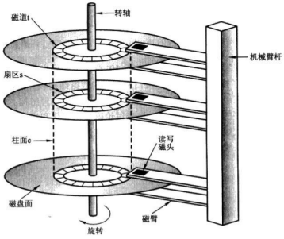
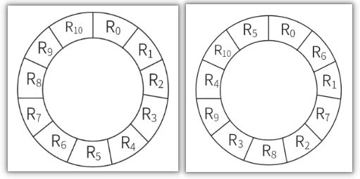
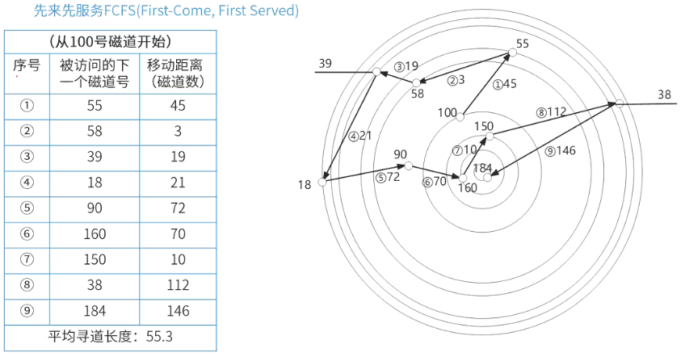

# 磁盘管理

## 最佳实践

### 考察问

1. 🟡🟩💚磁盘的组成:
    1. `()`
    2. `()`(柱面)
    3. `()`
2. 🟡🟩💚磁盘数据读取 = `()`时间 + `()`时间 + `()`时间
3. 🟡🟥❤️磁盘旋转优化
4. 🟡🟨💚磁盘移臂调度算法
    1. 先来先服务
    2. 扫描算法: `()`
    3. 循环扫描算法: `()` 
    4. 最短移臂算法:
        1. 先计算`()`号, 找差值最小的
        2. 如果差值相同, 再看`()`号, 找差值最小的

### 考察点

1. 磁盘的组成:
    1. `磁头`
    2. `磁道`(柱面)
    3. `扇区`
2. 磁盘数据读取 = `寻道`时间 + `旋转`时间 + `传输`时间
3. 磁盘旋转优化
4. 磁盘移臂调度算法
    1. 先来先服务
    2. 扫描算法: `起点终点终点起点...`
    3. 循环扫描算法: `起点终点起点终点...` ✨循环是重头再来
    4. 最短移臂算法:
        1. 先计算`柱面`号, 找差值最小的
        2. 如果差值相同, 再看`扇面`号, 找差值最小的

## 磁盘读取

磁盘的结构:

1. 磁头号: 磁盘一般有多张盘片，每张盘片上下两面都可存储数据，对应两个磁头，磁头号用于标识读写数据时使用的是哪个磁头，即对应盘片的哪一面 。比如一个有 2 张盘片的磁盘，就有 4 个磁头，编号从 0 开始 。

2. 柱面号(磁道号): 所有盘片上半径相同的磁道构成一个柱面。柱面号就是用来标识不同柱面的编号 。例如，最外侧的所有磁道构成 0 号柱面，向里依次递增 。

3. 扇区号: 盘片被划分为若干个扇形区域，每个区域就是一个扇区，扇区号用于标识具体的扇区 。通常一个磁道会被划分为多个扇区，如 8 个、16 个等 。

读取磁盘数据的时间应包括以下三个部分：

1. 寻道时间(找磁道)：半径方向移动, 将磁头定位至所要求的磁道上所需的时间
2. 旋转时间(找扇区)：圆周方向移动, 寻道完成后至磁道上需要访问的信息到达磁头下的时间，平均等待时间为磁盘旋转一周所需时间的一半
3. 传输时间：传输数据的时间

🔒💚某磁盘磁头从一个磁道移至另一个磁道需要10ms。文件在磁盘上非连续存放，逻辑上相邻数据块的平均移动距离为10个磁道，每块的旋转延迟时间及传输时间分别为100ms和2ms，则读取一个100块的文件需要（  ）ms时间。

1. ((磁道个数 x 磁道移动时间) + 旋转延迟时间 + 传输时间) x 文件个数
2. ((10 x 10) + 100 + 2) x 100

## 磁道旋转优化

🔒❤️假设某磁盘的每个磁道划分成11个物理块，每块存放1个逻辑记录。逻辑记录$R_0$，$R_1$，...，$R_9$，$R_{10}$存放在同一个磁道上，记录的存放顺序如下表所示：

|物理块|1|2|3|4|5|6|7|8|9|10|11|
| ---- | ---- | ---- | ---- | ---- | ---- | ---- | ---- | ---- | ---- | ---- | ---- |
|逻辑记录|$R_0$|$R_1$|$R_2$|$R_3$|$R_4$|$R_5$|$R_6$|$R_7$|$R_8$|$R_9$|$R_{10}$|

1. 如果磁盘的旋转周期为33ms，磁头当前处在$R_0$的开始处。若系统使用单缓冲区顺序处理这些记录，每个记录处理时间为3ms，则处理这11个记录的最长时间为（366ms）；若对信息存储进行优化分布后，处理11个记录的最少时间为（66ms）。

    1. 每个记录旋转时间=总旋转时间/物理块个数: 33/11=3ms
    2. $R_0$处理时间: 3(旋转) + 3(处理) = 6ms
    3. $R_1$处理时间:
        1. $R_0$处理完, 磁头已经旋转到$R_1$的末尾, 所以要再次旋转到$R_1$的开始, 共需3 * 10 = 30ms
        2. 3(旋转) + 3(处理) = 6ms
        3. 处理$R_1$的时间就等于等待磁盘再次旋转到$R_1$开始30ms + 旋转3ms + 处理3ms
    4. 依次类推
    5. 6 + 36 * 10 = 366ms

1. 上述情况, 时间主要浪费在每次读取依次扇区, 整个磁盘都要旋转一周才能到下一个需要读取的扇区, 所以可以更改扇区内物理块的排序来优化.

    1. $R_0$: 3ms + 3ms(旋转3ms + 处理3ms)
    2. $R_1$: 3ms + 3ms(旋转3ms + 处理3ms)

    

## 磁盘移臂调度算法

1. 先来先服务(FCFS): 下一个是按顺序排

    

2. 扫描算法(SCAN): 电梯算法, 从外磁道到内磁道, 再从内磁道到外磁道
3. 循环扫描算法(CSCAN): 从外磁道到内磁道, 然后回到外磁道, 再来一遍
4. 最短移臂调度算法(SSTF): 下一个是离本次最近的磁道

    

    解题方法：
    第一、优先看柱面（也就是磁道）；
    第二、看同一柱面（磁道）下，按照扇区号从小到大即可。

🔒题目:

1. 💚假设磁盘臂位于15号柱面上，进程的请求序列如下表表示，如果采用最短移臂调度算法，那么系统的响应序列应为（ 512436, 514236, 152436, 154236 ）。

    |请求序列|柱面号|磁头号|扇区号|
    | ---- | ---- | ---- | ---- |
    |1|12|8|9|
    |2|19|6|5|
    |3|23|9|6|
    |4|19|10|5|
    |5|12|8|4|
    |6|28|3|10|

2. 💚在磁盘调度管理中，应先进行移臂调度，再进行旋转调度。假设磁盘移动臂位于20号柱面上，进程的请求序列如下表所示。如果采用最短移臂调度算法，那么系统的响应序列应为4 6 9 5 7 1 2 8 3。

    |请求序列|柱面号|磁头号|扇区号|
    | ---- | ---- | ---- | ---- |
    |1|18|8|9|
    |2|16|6|3|
    |3|16|9|6|
    |4|21|10|5|
    |5|18|8|4|
    |6|21|3|10|
    |7|18|7|6|
    |8|16|10|4|
    |9|22|10|8|
