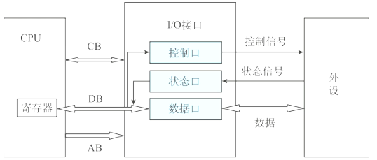

# 输入输出技术

## 最佳实践

### 考察问

1. 🟡🟩💚CPU与外围设备之间的信息交换方式
    1. 程序`()`方式
    2. 程序`()`方式
    3. 直接`()`存取（Direct Memory Access, DMA）: 不经过`()`

### 考察点

1. CPU与外围设备之间的信息交换方式
    1. 程序`查询`方式
    2. 程序`中断`方式
    3. 直接`内存`存取（Direct Memory Access, DMA）: 不经过`CPU`

## CPU与外围设备之间的信息交换方式

1. I/O接口与外设之间的信息交换
2. I/O接口与CPU之间的信息交换
    1. 程序查询方式
    2. 程序中断方式
    3. DMA方式
    4. 通道方式

其中:

1. CB（Control Bus）：控制总线。它用于传输控制信号，比如 CPU 对外设或 I/O 接口发出的读写命令
2. DB（Data Bus）：数据总线。用于在 CPU、I/O 接口和外设之间传输数据。比如 8 位数据总线一次能传输 8 位二进制数据
3. AB（Address Bus）：地址总线。用来传输地址信息，CPU 通过地址总线来选择要访问的 I/O 接口或内存单元的地址。

## 程序查询方式

CPU执行程序来轮询查询外设的状态，判断外设是否准备好接收数据或向CPU输入数据。特点:

- CPU与外设串行工作
- 硬件结构简单
- CPU大量时间都在查询和等待，资源浪费较多
- 需要CPU保存现场，由CPU将数据放入内存
- 一次读写单位为字

适用场合:

- 低速外设或CPU任务不繁忙的情况

## 程序中断方式

中断：CPU暂时中止现行程序，转去处理随机发生的紧急事件，处理完成后自动返回原程序的功能和技术。

中断方式：当I/O接口与外设交换数据过程中，CPU无须等待；当交换数据完成时，I/O接口产生中断，通知CPU处理数据。

- 特点
    - CPU与外设可并行工作
    - 但硬件结构相对复杂一些，服务开销时间大
    - 需要CPU保存现场，由CPU将数据放入内存
    - 一次读写单位为字
- 适用场合
    - 微型机中随机出现的服务
    - 对I/O处理的实时性要求很高的系统

🔒题目:

1. 💚嵌入式系统中采用中断方式实现输入输出的主要原因是（  ）。在中断时，CPU断点信息一般保存到（  ）中。

    - A. 速度最快
    - B. CPU不参与操作
    - C. 实现起来比较容易
    - D. 能对突发事件做出快速响应

    - A. 通用寄存器
    - B. 堆
    - C. 栈
    - D. I/O接口

    答案: DC

## DMA方式

直接内存存取（Direct Memory Access, DMA），DMA控制器接管总线的控制权，数据交换不经过CPU，直接在内存和I/O设备间进行成块传送。

- 特点
    - CPU与外设可并行工作
    - 仅在传送数据块的开始和结束时才需要CPU的干预
    - 不需要CPU保护现场
    - 由外设直接将数据放入内存（或相反）
    - 一次读写单位为块，传送一个数据占用一个存储周期
- 适用场合
    - 微型机中内存与高速外围设备进行大批量的数据交换

🔒题目:

1. 💚计算机系统中常用的输入/输出控制方式有无条件传送、中断、程序查询和DMA方式等。当采用( )方式时，不需要CPU执行程序指令来传送数据。

    - A. 中断
    - B. 程序查询
    - C. 无条件传送
    - D. DMA

    答案: D

## 通道方式(IOP)

由通道（输入输出处理机IOP）管理外围设备。

- 特点
    - 大大提高了CPU的效率
    - 但需要更多的硬件
- 适用场合
    - 处理外设较多，规模较大的情形（大型机）
