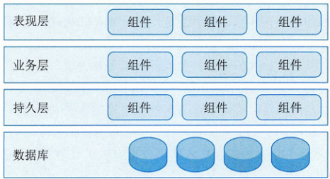
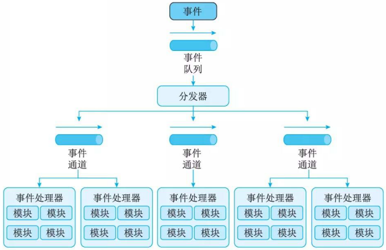
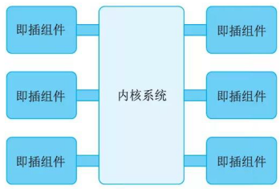
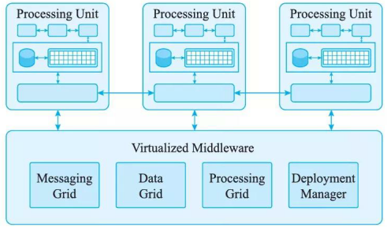

系统架构设计师(System Architecture Designer)

## 系统架构的定义及发展历程

1. 基础研究阶段(1968-1994)

    模块化开发方法是指把一个待开发的软件分解成若干个小的而且简单的部分，采用对复杂事物分而治之的经典原则。模块化开发方法涉及的主要问题是模块设计的规则，即系统如何分解成模块。而每一模块都可独立开发与测试，最后再组装成一个完整软件。对一个规约进行分解，以得到模块系统结构的方法有数据结构设计法、功能分解法、数据流设计和面向对象的设计等。将系统分解成模块时，应该遵循以下规则：

    (1)最高模块内聚。也就是在一个模块内部的元素最大限度地关联，只实现一种功能的模块是高内聚的，具有三种以上功能的模块则是低内聚的。

    (2)最低耦合。也就是不同模块之间的关系尽可能弱，以利于软件的升级和扩展。

    (3)模块大小适度。颗粒过大会造成模块内部维护困难，而颗粒过小又会导致模块间的耦合增加。

    (4)模块调用链的深度(嵌套层次)不可过多。

    (5)接口简单、精炼(扇入扇出数不宜太大)，具有信息隐蔽能力。

    (6)尽可能地复用已有模块。

2. 概念体系和核心技术形成阶段(1999—2000年)

    通常，组件具有可组装性和可插拔性。每个组件的运行仅依赖于平台或者容器，组件与组件之间不存在直接的耦合关系。同时，组件和组件之间又并非绝对独立。组件经过组装后可以与其他组件进行业务上的交互。组件化开发并不等同于模块化开发。模块化开发只是在逻辑上做了切分，物理上(代码)通常并没有真正意义上的隔离。组件化也不等同于应用集成，应用集成是将一些基于不同平台或不同方案的应用软件有机地集成到一个无缝的、并列的、易于访问的单一系统中，以建立一个统一的综合应用。组件化比模块化更独立，但比应用集成结合得更加紧密。

3. 理论体系完善与发展阶段(1996年至今)

    软件架构的饭就方向:

    1. 软件架构描述与表示。
    2. 软件架构分析、设计和测试。
        1. 架构分析
            1. 架构分析的内容可分为结构分析、功能分析和非功能分析。
            2. 架构分析常用的方法有：软件架构分析方法 SAAM、架构权衡分析法 ATAM、成本效益分析法 CBAM、基于场景的架构再工程 SBAR、架构层次的软件可维护性预测 ALPSM、软件架构评估模型 SAEM 等。
        2. 架构设计是指生成一个满足用户需求的软件架构过程。架构设计常用的方法有：
            1. 从工件描述中提取架构描述的工件驱动(artifact - driven)方法；
            2. 从用例导出架构抽象的用例驱动(use - case - driven)；
            3. 从模式导出架构抽象的模式驱动(pattern - driven)方法；
            4. 从领域模型导出架构抽象的域驱动(domain - driven)方法
            5. 从设计过程中获得架构质量属性需求的属性驱动设计(attribute - driven design)方法等。
        3. 架构测试架构测试着重于仿真系统模型、解决架构层的主要问题。
            1. 由于测试的抽象层次不同，架构测试策略分为单元、子系统、集成和验收测试等阶段的测试策略。
            2. 测试方法主要包括架构测试覆盖方法、组件设计正确性验证方法和基于 CHAM 的架构动态语义验证方法等。

    3. 软件架构发现、演化与重用。
        1. 软件架构发现解决如何从已经存在的系统中提取软件架构的问题，属于逆向工程。Waters 等人提出了一种迭代式架构发现过程。
        2. 软件架构演化即由于系统需求、技术、环境和分布等因素的变化而最终导致软件架构的变动。软件系统在运行时刻的架构变化称为架构动态性，而将架构的静态修改称为架构扩展。架构扩展和动态性都是架构适应性和演化的研究范畴。
        3. 软件架构复用属于设计重用，比代码重用更抽象。架构模式就是架构复用的一种成果。

    4. 基于软件架构的开发方法。

        软件开发模型是跨越整个软件生存周期的系统开发、运行和维护所实施的全部工作和任务的结构框架，给出了软件开发活动各个阶段之间的关系。通常软件开发模型可分为三种：
        1. 以软件需求完全确认为前提的瀑布模型；
        2. 在软件开发初期只能提供基本需求为前提的渐进式开发模型(如螺旋模型等)；
        3. 以形式化开发方法为基础的变换模型。

    5. 软件架构风格。

        架构风格(架构模式)是针对给定场景中经常出现的问题提供的一般性可重用方案。通常，将软件架构风格分成主要五类(David Garland 和 Mary Shaw 划分方式)：
        1. 数据流风格
        2. 调用 / 返回风格
        3. 独立组件风格
        4. 虚拟机风格
        5. 仓库风格

4. 普及应用阶段(2000年至今)

    软件架构是软件生命周期中的重要产物，它影响软件开发的各个阶段。

    - 需求阶段：把软件架构有的概念引入需求分析阶段，有助于保证需求规约和系统设计之间的可追踪性和一致性。
    - 设计阶段：设计阶段是软件架构研究关注最早、最多的阶段，这一阶段的软件架构主要包括软件架构的描述、软件架构模型的设计与分析以及对软件架构设计经验的总结与复用等。
    - 实现阶段：将设计阶段设计的算法及数据类型用程序设计语言进行表示，满足设计、架构和需求分析的要求，从而得到满足设计需求的目标系统。
    - 维护阶段：为了保证软件具有良好的维护性，在软件架构中针对维护性目标进行分析时，需要对一些有关维护性的属性(如可扩展性、可替换性)进行规定，当架构经过一定的开发过程实现和形成软件系统时，这些属性也相应地反映了软件的维护性。

## 软件架构的常用分类及建模方法

### 软件架构的常用分类
“架构”概念经过不断演化，目前已形成了满足不同用途的架构模式，比较典型的架构模型包括分层架构、事件驱动架构、微核架构、微服务架构和云架构等五类。当然，像C/S、B/S、管道 - 过滤器和PAC等架构也是被广泛使用的软件架构，本节简要说明典型架构内涵。

1. 分层架构
    分层架构(Layered Architecture)是最常见的软件架构，也是事实上的标准架构。这种架构将软件分成若干个水平层，每一层都有清晰的角色和分工，不需要知道其他层的细节。层与层之间通过接口进行通信。分层架构通常明确约定软件一定要分成多少层，但是，最常见的是四层结构。

    - 表现层(Presentation Layer)：用户界面，负责视觉和用户互动；
    - 业务层(Business Layer)：实现业务逻辑；  
    - 持久层(Persistence Layer)：提供数据，SQL语句就放在这一层；
    - 数据库(Database Layer)：保存数据。

    

2. 事件驱动架构

    事件 (Event)是状态发生变化时软件发出的通知。事件驱动架构 (Event-driven Architecture) 是通过事件进行通信的软件架构，它分成四个部分:

    

    1. 事件队列 (Event Queue)  :接收事件的入口；
    2. 分发器 (Event Mediator)  :将不同的事件分发到不同的业务逻辑单元；
    3. 事件通道 (Event Channel)  :分发器与处理器之间的联系渠道；
    4. 事件处理器 (Event Processor)  :实现业务逻辑，处理完成后会发出事件，触发下一步
    操作。

3. 微核架构

    微核架构 (Mi crokernel Architecture) 又称为插件架构 (Plug-in Architecture), 是指软件的内核相对较小，主要功能和业务逻辑都通过插件实现，内核(Core) 通常只包含系统运行的最小功能。插件则是互相独立的，插件之间的通信应该减少到最低，避免出现互相依赖的问题。

    

4. 微服务架构

    微服务架构 (Microservices Architecture) 是服务导向架构 (Service-Oriented Architecture,  SOA) 的升级。每一个服务就是一个独立的部署单元 (Separately Deployed Unit)。这些单元都是分布式的，互相解耦，通过远程通信协议(比如 REST 、 SOAP) 联系，

    

    微服务架构分成三种实现模式。
    1. RESTful API模式：服务通过API提供，云服务就属于这一类；
    2. RESTful 应用模式：服务通过传统的网络协议或者应用协议提供，背后通常是一个多功能的应用程序，常见于企业内部；
    3. 集中消息模式：采用消息代理 (Message Broker) 可以实现消息队列、负载均衡、统一日志和异常处理，缺点是会出现单点失败，消息代理可能要做成集群。

5. 云架构

    云架构 (Cloud Architecture) 主要解决扩展性和并发的问题，是最容易扩展的架构。它的高扩展性体现在将数据都复制到内存中，变成可复制的内存数据单元，然后将业务处理能力封装成一个个处理单元 (Processing Unit)。若访问量增加，就新建处理单元；若访问量减少，就关闭处理单元。由于没有中央数据库，所以扩展性的最大瓶颈消失了。由于每个处理单元的数据都在内存里，需要进行数据持久化。云架构主要分成两部分：处理单元 (Processing Unit)和虚拟中间件 (Virtualized Middleware), 

    

    1. 处理单元：实现业务逻辑。
    2. 虚拟中间件：负责通信、保持会话控制 (sessions) 、数据复制、分布式处理和处理单元的部署。
        1. 消息中间件 (Messaging Gri d) ：管理用户请求和会话控制( sessi ons), 当一个请求进来以后，它决定分配给哪一个处理单元。
        2. 数据中间件 (Data Grid)  :将数据复制到每一个处理单元，即数据同步。保证某个处理单元都得到同样的数据。
        3. 处理中间件 (Processing Grid)  :可选，如果一个请求涉及不同类型的处理单元，该中间件负责协调处理单元。
        4. 部署中间件 (Deployment Mana ger)  :负责处理单元的启动和关闭，监控负载和响应时间，当负载增加，就新启动处理单元，负载减少，就关闭处理单元。

### 系统架构的常用建模方法

根据建模的侧重点的不同，可以将软件架构的模型分成 4 种：结构模型、框架模型、动态模型和过程模型。

1. 结构模型：以架构的构件、连接件和其他概念来刻画结构。并力图通过结构来反映系统的重要语义内容，包括系统的配置、约束、隐含的假设条件、风格和性质。
2. 框架模型：框架模型与结构模型类似，但它不太侧重描述结构的细节，而更侧重整体的结构。框架模型主要以一些特殊的问题为目标建立只针对和适应问题的结构。
3. 动态模型：动态模型是对结构或框架模型的补充，主要研究系统的“大颗粒“行为的性质。例如，描述系统的重新配置或演化。
4. 过程模型：过程模型是研究构造系统的步骤和过程，其结构是遵循某些过程脚本的结果。

”4+1" 模型从 5个不同的视角包括逻辑 (Logical) 视角、过程 (Process) 视角、物理 (Physi cal) 视角、开发(Development)视角和场景( Scenari os) 视角来描述软件架构。每一个视角只关心系统的一个侧面， 5 个视角结合在一起才能够反映系统的软件架构的全部内容。

## 软件架构的应用场景

1. 管道－过滤器风格适用于将系统分成若干独立的步骤
2. 主程序／子系统和面向对象的架构风格可用于对组件内部进行设计
3. 虚拟机风格经常用于构造解释器或专家系统
4. C/S 和 BIS 风格适合于数据和处理分布在一定范围，通过网络连接构成系统
5. 平台／插件风格适用于具有插件扩展功能的应用程序
6. MVC 风格被广泛地应用于用户交互程序的设计
7. SOA 风格应用在企业集成等方面
8. C2 风格适用千 GUI 软件开发，用以构建灵活和可扩展的应用系统等

现代大型软件，很少使用单一的架构风格进行设计与开发，而是混合多种风格

